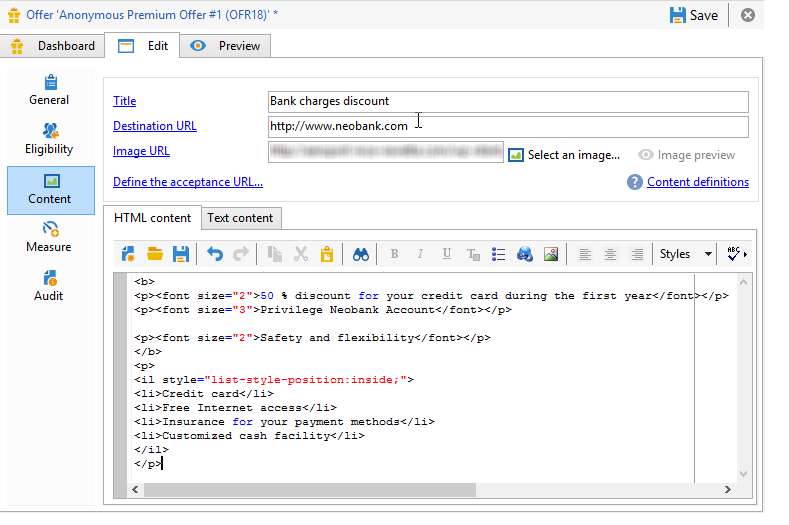
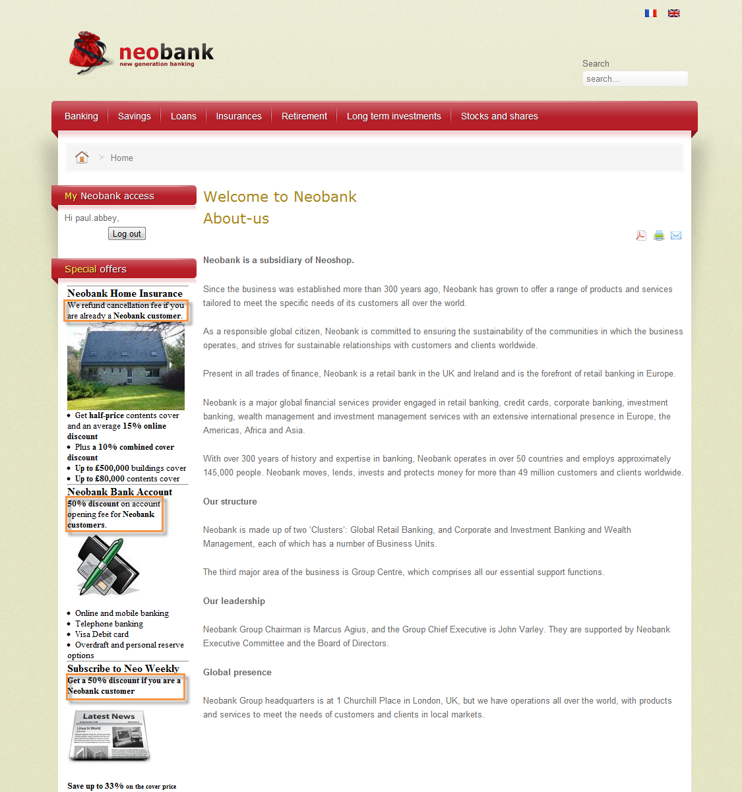
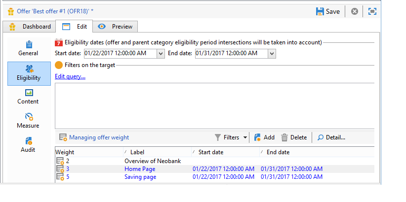
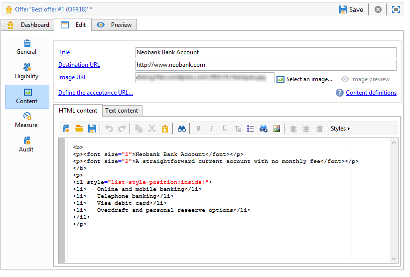
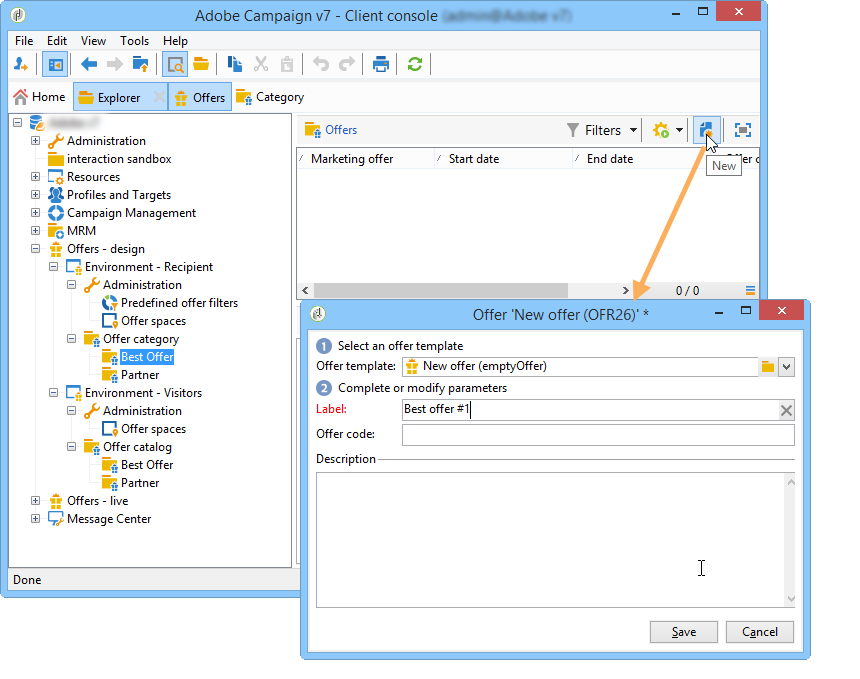
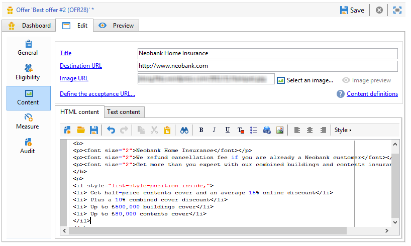
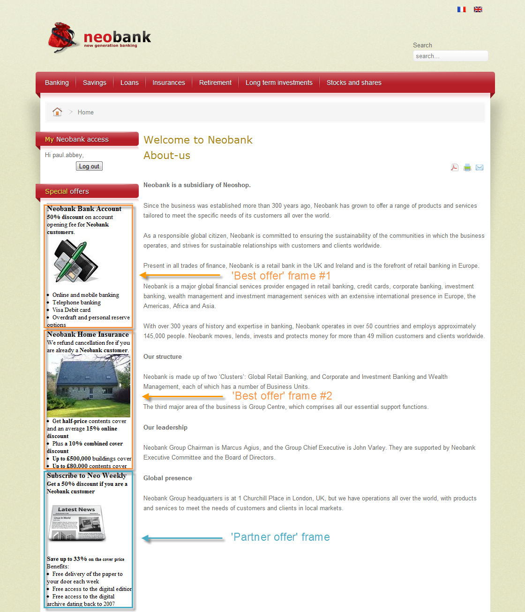

# 傳入頻道上的優惠{#offers-on-an-inbound-channel}


## 向匿名訪客展示優惠方案 {#presenting-an-offer-to-an-anonymous-visitor}

Neobank網站想要在其網站上針對瀏覽頁面的未識別訪客顯示選件。

若要設定此互動，我們將：

1. [建立匿名環境](#creating-an-anonymous-environment)
1. [建立匿名優惠方案空間](#creating-anonymous-offer-spaces)
1. [建立優惠方案類別和主題](#creating-an-offer-category-and-a-theme)
1. [建立匿名優惠方案。](#creating-anonymous-offers)
1. [在網站上設定網站優惠方案空間](#configure-the-web-offer-space-on-the-website)

### 建立匿名環境 {#creating-an-anonymous-environment}

請遵循中詳述的程式 [建立優惠方案環境](../../interaction/using/live-design-environments.md#creating-an-offer-environment) ，以根據 **訪客**&#39;維度。

您會獲得包含新環境的樹狀結構：


### 建立匿名優惠方案空間 {#creating-anonymous-offer-spaces}

1. 在您的匿名環境中(**訪客**)前往 **[!UICONTROL Administration]** > **[!UICONTROL Spaces]** 節點。
1. 按一下 **[!UICONTROL New]** 以建立呼叫通道。

   

   >[!NOTE]
   >
   >空間會自動連結至匿名環境。

1. 變更標籤並選取 **[!UICONTROL Inbound Web]** 頻道。 您也必須檢查 **[!UICONTROL Enable unitary mode]** 方塊。

   

1. 選取用於空間的選件內容欄位，並核取相關方塊，視需要指定這些欄位。

   如此一來，遺失下列其中一項元素的任何優惠方案都將不符合此空間的資格：

   * 標題
   * HTML 內容
   * 影像 URL
   * 目的地 URL

   

1. 編輯HTML演算函式，例如：

   ```
   function (imageUrl, targetUrl, shortContent, htmlSource){
         var html = "<p><b>" + shortContent + "</b></p>";
         html += "<p>" + htmlSource + "</p>";
         html += "<a _urlType='11' href='" + targetUrl + "'></a>";
         return html;
       }   
   ```

   >[!IMPORTANT]
   >
   >轉譯函式必須依先前選取的順序命名用於空間的欄位，以便正確顯示選件。

   

1. 儲存優惠方案空間。

### 建立優惠方案類別和主題 {#creating-an-offer-category-and-a-theme}

1. 前往 **[!UICONTROL Offer catalog]** 節點（在您剛剛建立的環境中）。
1. 用滑鼠右鍵按一下 **[!UICONTROL Offer catalog]** 節點並選取 **[!UICONTROL Create a new 'Offer category' folder]**.

   命名新類別， **金融產品** 例如。

1. 前往類別的 **[!UICONTROL Eligibility]** tab鍵並輸入 **融資** 作為主題，然後儲存變更。

   

### 建立匿名優惠方案 {#creating-anonymous-offers}

1. 前往您剛才建立的類別。
1. 按一下&#x200B;**[!UICONTROL New]**。

   

1. 選取現成可用的匿名優惠方案範本或先前建立的範本。

   

1. 變更標籤並儲存您的選件。

   

1. 前往 **[!UICONTROL Eligibility]** 標籤，並根據其應用程式內容指定優惠方案的權重。

   在此範例中，選件會設定為優先顯示在網站首頁上，直到年底為止。

   

1. 前往 **[!UICONTROL Content]** 標籤並定義選件的內容。

   >[!NOTE]
   >
   >您可以選取 **[!UICONTROL Content definitions]** 以顯示Web空間所需的元素清單。

   

1. 建立第二個選件。

   

1. 前往 **[!UICONTROL Eligibility]** 並套用與第一個選件相同的權重。
1. 執行每個優惠方案的核准週期，以便線上上環境中提供這些優惠方案及其已核准的優惠方案空間。

### 設定網站上的Web優惠方案空間 {#configure-the-web-offer-space-on-the-website}

若要將您剛設定的選件顯示在網站上，請將JavaScript程式碼插入網站的HTML頁面，以呼叫互動引擎(如需詳細資訊，請參閱 [關於傳入頻道](../../interaction/using/about-inbound-channels.md))。

1. 前往HTML頁面，插入值與先前建立之匿名優惠方案空間的內部名稱相符的@id屬性(請參閱 [建立匿名優惠方案空間](#creating-anonymous-offer-spaces))，前面為 **i_**.

   

1. 插入呼叫URL

   

   上方的藍色URL方塊對應於例項名稱，即環境的內部名稱(請參閱 [建立匿名環境](#creating-an-anonymous-environment))和連結至類別([建立優惠方案類別和主題](#creating-an-offer-category-and-a-theme))。 後者是選擇性的。

當訪客存取網站的首頁時，選件具有 **融資** 主題會顯示在HTML頁面上設定的樣子。


多次造訪頁面的使用者會在類別中看到一個或其他選件，因為它們都被指派了相同的權重。

## 切換到匿名環境，以防未識別的連絡人 {#switching-to-an-anonymous-environment-in-case-of-unidentified-contacts}

Neobank公司想要針對兩個不同的目標建立行銷優惠方案。 想要為其匿名網站瀏覽器顯示一般優惠方案。 如果其中一位使用者是具有Neobank所提供識別碼的客戶，公司希望他們登入後能立即收到個人化優惠方案。

此案例研究是根據下列情境：

1. 訪客無需登入即可瀏覽Neobank網站。

   

   頁面上會顯示三個匿名優惠方案：兩個 **最佳選件** Neobank產品的優惠方案，以及Neobank合作夥伴的一個優惠方案。

   

1. 該使用者（Neobank客戶）會使用其憑證登入。

   

   接著會顯示三個個人化優惠方案。

   

若要實作此案例研究，您需要有兩個優惠方案環境：一個用於匿名互動，另一個具有專為已識別聯絡人設定的優惠方案。 如果連絡人未登入，系統就會將已識別的優惠方案環境設定為自動切換至匿名優惠方案環境，因此也無法識別。

應用以下步驟：

* 使用下列步驟，建立匿名傳入互動專屬的優惠方案目錄：

   1. [建立匿名連絡人的環境](#creating-an-environment-for-anonymous-contacts)
   1. [為匿名環境設定優惠方案空間](#configuring-offer-spaces-for-the-anonymous-environment)
   1. [在匿名環境中建立優惠方案類別](#creating-offer-categories-in-an-anonymous-environment)
   1. [建立匿名訪客的優惠](#creating-offers-for-anonymous-visitors)

* 使用下列步驟，建立已識別之入站互動專屬的優惠方案目錄：

   1. [在已識別的環境中設定優惠方案空間](#configure-the-offer-spaces-in-the-identified-environment)
   1. [在已識別的環境中建立優惠方案類別](#creating-offer-categories-in-an-identified-environment)
   1. [建立個人化優惠方案](#creating-personalized-offers)

* 設定對優惠方案引擎的呼叫：

   1. [在網頁上設定優惠方案空間](#configuring-offer-spaces-on-the-web-page)
   1. [指定已識別優惠方案空間的進階設定](#specifying-the-advanced-settings-of-the-identified-offer-spaces)

### 建立匿名連絡人的環境 {#creating-an-environment-for-anonymous-contacts}

1. 透過傳遞對應精靈(**訪客** 對應)。 有關詳細資訊，請參閱 [建立優惠方案環境](../../interaction/using/live-design-environments.md#creating-an-offer-environment).

   

### 為匿名環境設定優惠方案空間 {#configuring-offer-spaces-for-the-anonymous-environment}

必須顯示在網站上的優惠方案屬於兩個不同的類別： **最佳選件** 和 **合作夥伴**. 在此範例中，我們將為每個類別建立特定的優惠方案空間。

若要建立優惠方案空間以符合 **最佳選件** 類別，套用下列程式：

1. 在Adobe Campaign樹中，前往您剛才建立的匿名環境，並新增優惠方案空間。

   

1. 建立新的 **[!UICONTROL Inbound web]** 輸入空格。

   

1. 輸入標籤： **Web最佳匿名優惠** 例如。
1. 新增用於此選件空間的選件內容欄位，並設定轉譯函式。

   

   >[!IMPORTANT]
   >
   >轉譯函式必須依先前選取的順序命名用於空間的欄位，以便正確顯示選件。

1. 使用相同程式建立傳入的Web Channel優惠方案空間，以比對 **合作夥伴** 類別。

   

### 在匿名環境中建立優惠方案類別 {#creating-offer-categories-in-an-anonymous-environment}

首先，請建立兩個優惠方案類別： **最佳選件** 類別與 **合作夥伴** 類別。 每個類別都會包含匿名聯絡人的兩個優惠方案。

1. 前往 **[!UICONTROL Offer catalog]** 在您剛剛建立的匿名環境中。
1. 新增 **[!UICONTROL Offer category]** 資料夾 **最佳選件** 作為標籤。

   

1. 建立第二個類別，使用 **合作夥伴** 作為標籤。

   

### 建立匿名訪客的優惠 {#creating-offers-for-anonymous-visitors}

現在，我們將在上述建立的每個類別中建立兩個優惠方案。

1. 前往 **最佳選件** 類別並建立匿名優惠方案。

   

1. 前往 **[!UICONTROL Eligibility]** 標籤，並根據其應用程式內容指定優惠方案的權重。

   

1. 前往 **[!UICONTROL Content]** 標籤並定義選件的內容。

   

1. 在中建立第二個選件 **最佳選件** 類別。

   

1. 前往 **合作夥伴** 類別並建立匿名優惠方案。
1. 前往 **[!UICONTROL Content]** 標籤並定義選件的內容。

   

1. 前往 **[!UICONTROL Eligibility]** 標籤，並根據其應用程式內容指定優惠方案的權重。

   

1. 為建立第二個選件 **合作夥伴** 類別。

   

1. 前往 **[!UICONTROL Eligibility]** 標籤並套用您套用到此類別中第一個優惠方案的相同權重，好讓優惠方案可依序顯示在網站上。

   

1. 對每個優惠方案執行核准週期，以開始讓優惠方案上線。 核准內容時，請啟用 **合作夥伴** 或 **最佳選件** 根據優惠方案，提供優惠方案空間。

### 在已識別的環境中設定優惠方案空間 {#configure-the-offer-spaces-in-the-identified-environment}

您即將出現在網站上的優惠方案來自兩個不同的類別： **最佳選件** 和 **合作夥伴**. 在此範例中，我們要為每個類別建立特定空間。

若要建立兩個優惠方案空間，請套用與匿名優惠方案空間相同的程式。 請參閱 [為匿名環境設定優惠方案空間](#configuring-offer-spaces-for-the-anonymous-environment).

1. 在Adobe Campaign樹中，前往您剛建立的環境並新增 **最佳選件** 和 **合作夥伴** 優惠方案空間。
1. 套用處理序，詳見 [為匿名環境設定優惠方案空間](#configuring-offer-spaces-for-the-anonymous-environment).

   

1. 選取 **[!UICONTROL Fall back on an anonymous environment if no individuals were identified]** 選項。

   

1. 使用下拉式清單，選取先前建立的匿名Web優惠方案空間(請參閱 [為匿名環境設定優惠方案空間](#configuring-offer-spaces-for-the-anonymous-environment))。

   

### 指定已識別優惠方案空間的進階設定 {#specifying-the-advanced-settings-of-the-identified-offer-spaces}

在此範例中，聯絡人識別是因為Adobe Campaign資料庫中的電子郵件地址。 若要將收件者電子郵件新增至空間，請套用下列程式：

1. 在已識別的環境中，前往優惠方案空間資料夾。
1. 選取 **最佳選件** 優惠方案空間，然後按一下 **[!UICONTROL Advanced parameters]**.

   

1. 在 **[!UICONTROL Target identification]** 索引標籤中，按一下 **[!UICONTROL Add]**。

   

1. 按一下 **[!UICONTROL Edit expression]**，前往收件者表格並選取 **[!UICONTROL Email]** 欄位。

   

1. 按一下 **[!UICONTROL OK]** 以關閉 **[!UICONTROL Advanced parameters]** 並完成設定 **最佳選件** 優惠方案空間。
1. 將相同的處理套用至 **合作夥伴** 優惠方案空間。

   

### 在已識別的環境中建立優惠方案類別 {#creating-offer-categories-in-an-identified-environment}

我們將建立兩個不同的類別： **最佳選件** 類別與 **合作夥伴** 類別，每個都有兩個個人化優惠方案。

1. 前往 **[!UICONTROL Offer catalogs]** 已識別環境中的節點。
1. 如同匿名環境，新增兩個 **[!UICONTROL Offer category]** 資料夾 **最佳選件** 和 **合作夥伴** 作為標籤。

   

### 建立個人化優惠方案 {#creating-personalized-offers}

我們希望為每個類別建立兩個個人化優惠方案，即四個優惠方案。

1. 前往 **最佳選件** 類別並建立第一個個人化優惠方案。

   

1. 前往 **[!UICONTROL Eligibility]** 標籤，並根據其應用程式內容指定優惠方案的權重。

   

1. 前往 **[!UICONTROL Content]** 標籤並定義選件的內容。

   

1. 在中建立第二個選件 **最佳選件** 類別。

   

1. 前往 **合作夥伴** 類別並建立個人化優惠方案。

   

1. 前往 **[!UICONTROL Eligibility]** 標籤，並根據其應用程式內容指定優惠方案的權重。

   

1. 為建立第二個選件 **合作夥伴** 類別。

   

1. 前往 **[!UICONTROL Eligibility]** 標籤並套用您套用到此類別中第一個優惠方案的相同權重，好讓優惠方案可依序顯示在網站上。
1. 執行每個優惠方案的核准週期，以開始更新它們。 在內容核准期間，啟用 **合作夥伴** 或 **最佳選件** 優惠方案空間。

### 在網頁上設定優惠方案空間 {#configuring-offer-spaces-on-the-web-page}

Neobank公司的網站有三個優惠方案空間：兩個適用於來自以下網站的銀行相關優惠方案： **最佳選件** 類別，以及來自的優惠方案 **合作夥伴** 類別。



若要在網站的HTML頁面上設定這些優惠方案空間，請套用下列程式：

1. 在HTML頁面的內容中，插入三個

   具有@id屬性的元素，其值可讓我們在網站的各種優惠方案空間中呼叫優惠方案。

   

1. 然後插入用於定義屬性值的指令碼。

   

   在此範例中， **ContBO1** 和 **ContBO2** 接收值 **OsWebBestOfferIdentified**，即的內部名稱 **最佳選件** 先前在已識別環境中建立的選件空間。 此 **CatBestOffer** 和 **CatBestOfferAnonym** 值與的內部名稱相符 **最佳選件** 匿名與已識別環境的類別。

   

   同樣地， **連續點** 接收 **OSWebPartnerIndified** 值，此值與的內部名稱 **合作夥伴** 在已識別的環境中建立的選件空間。 **CatPartner** 和 **CatPartnerAnonym** 符合的內部名稱 **合作夥伴** 匿名與已識別環境的類別。

   

1. 將可讓您識別登入Neobank網站之人員的資訊指派給 **interactionTarget** 變數中。

   

   個人的身分識別可以根據瀏覽器Cookie、URL中的閱讀引數、電子郵件或個人的識別碼。 如果使用主索引鍵以外的收件者表格欄位，則必須在空間的進階引數中定義該欄位(請參閱 [指定已識別優惠方案空間的進階設定](#specifying-the-advanced-settings-of-the-identified-offer-spaces))。

1. 插入呼叫URL

   

   URL包含 **EnvNeobankRecip**，已識別環境的內部名稱。

當您開啟網頁時，指令碼可讓您呼叫互動引擎，以在網頁的相關空間中顯示選件的內容。 在對Adobe Campaign伺服器的單一呼叫中，引擎會決定環境、選件空間和要選取的類別。

在此範例中，引擎會辨識已識別的環境(**EnvNeobankIdnRecip**)。 它會識別優惠方案空間(**OSWebBestOfferIndified**)和 **最佳選件** 類別(**CatBestOffer**)適用於網頁上的第一個和第二個優惠方案空間，以及(**OSWebPartnerIndified**)優惠方案空間和 **合作夥伴** 類別(**CatPartner**)以取得網站上的第三個優惠方案空間。

如果引擎無法識別收件者，則會切換到已識別優惠方案空間中所參照的匿名優惠方案空間，並轉向匿名類別(**CatPartner** 和 **CatPartnerAnonym**)中。
