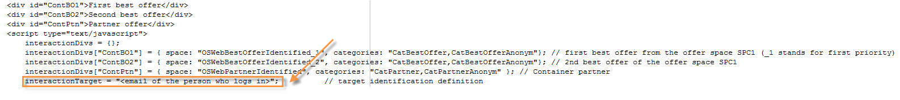

# 傳入渠道上的選件{#offers-on-an-inbound-channel}

## 向匿名訪客呈現選件 {#presenting-an-offer-to-an-anonymous-visitor}

Neobank網站想在其網站上顯示選件，以針對瀏覽該頁面的未識別訪客。

若要設定此互動，我們將：

1. [建立匿名環境](#creating-an-anonymous-environment)
1. [建立匿名選件空間](#creating-anonymous-offer-spaces)
1. [建立選件類別和主題](#creating-an-offer-category-and-a-theme)
1. [建立匿名選件。](#creating-anonymous-offers)
1. [在網站上設定Web選件空間](#configure-the-web-offer-space-on-the-website)

### 建立匿名環境 {#creating-an-anonymous-environment}

請依照建立選件環 [境中詳述的程式](../../interaction/using/live-design-environments.md#creating-an-offer-environment) ，根據訪客的維度建立您的 **匿名環境**。

您將得到包含新環境的樹結構：


### 建立匿名選件空間 {#creating-anonymous-offer-spaces}

1. 在您的匿名環境(**訪客**)中，前往 **[!UICONTROL Administration]** >節 **[!UICONTROL Spaces]** 點。
1. 按一 **[!UICONTROL New]** 下以建立呼叫渠道。

   

   >[!NOTE]
   >
   >空間會自動連結到匿名環境。

1. 變更標籤並選取 **[!UICONTROL Inbound Web]** 頻道。 您也必須勾選方 **[!UICONTROL Enable unitary mode]** 塊。

   

1. 選取空間使用的選件內容欄位，並勾選相關方塊以視需要指定這些欄位。

   如此一來，任何遺失下列元素之一的選件都不符合此空間的資格：

   * 標題
   * HTML內容
   * 影像URL
   * 目標URL
   

1. 編輯HTML轉換函式，例如：

   ```
   function (imageUrl, targetUrl, shortContent, htmlSource){
         var html = "<p><b>" + shortContent + "</b></p>";
         html += "<p>" + htmlSource + "</p>";
         html += "<a _urlType='11' href='" + targetUrl + "'></a>";
         return html;
       }   
   ```

   >[!CAUTION]
   >
   >轉換函式必須依照先前選取的順序為空間所用的欄位命名，如此選件才能正確顯示。

   

1. 儲存選件空間。

### 建立選件類別和主題 {#creating-an-offer-category-and-a-theme}

1. 轉到剛 **[!UICONTROL Offer catalog]** 建立的環境中的節點。
1. 按一下右鍵該節 **[!UICONTROL Offer catalog]** 點並選擇 **[!UICONTROL Create a new 'Offer category' folder]**。

   例如，為新類別 **命名** Financial產品。

1. 前往類別的標籤， **[!UICONTROL Eligibility]** 並輸入 **financing** 作為主題，然後儲存變更。

   

### 建立匿名選件 {#creating-anonymous-offers}

1. 前往您剛建立的類別。
1. 按一下 **[!UICONTROL New]**.

   

1. 選取現成可用的匿名選件範本或先前建立的範本。

   

1. 變更標籤並儲存選件。

   

1. 前往標籤 **[!UICONTROL Eligibility]** 並根據選件的應用程式內容指定選件的權重。

   在此範例中，選件設定為以優先順序顯示在網站的首頁上，直到年底為止。

   

1. 前往標籤 **[!UICONTROL Content]** 並定義選件的內容。

   >[!NOTE]
   >
   >您可以選 **[!UICONTROL Content definitions]** 擇顯示Web空間所需的元素清單。

   

1. 建立第二個選件。

   

1. 前往標籤 **[!UICONTROL Eligibility]** 並套用與第一個選件相同的權重。
1. 執行每個選件的審批週期，以便線上上環境中提供它們及其批准的選件空間。

### 在網站上設定Web選件空間 {#configure-the-web-offer-space-on-the-website}

若要讓您剛設定的選件在網站上可見，請將JavaScript程式碼插入網站的HTML頁面，以呼叫互動引擎(如需詳細資訊，請參閱關於 [傳入頻道](../../interaction/using/about-inbound-channels.md))。

1. 前往HTML頁面並插入@id屬性，其值與先前建立之匿名選件空間的內部名稱相符(請參閱「建立匿名選件空間 [」](#creating-anonymous-offer-spaces)，前面是 **i_**。

   

1. 插入呼叫URL。

   

   上方的藍色URL方塊會對應例項名稱、環境的內部名稱(請參閱「建立匿名環境 [」)，以及連結至類別的主題(](#creating-an-anonymous-environment)Creating an offer category and a theme[](#creating-an-offer-category-and-a-theme))。 後者是可選的。

當訪客存取網站首頁時，具有融資主題的選 **件** ，會顯示為HTML頁面上的設定。


多次瀏覽頁面的使用者將會看到類別中的其中一個或其他選件，因為這兩個選件都已指派相同的權重。

## 在匿名聯繫人不明的情況下切換到匿名環境 {#switching-to-an-anonymous-environment-in-case-of-unidentified-contacts}

Neobank公司想要為兩個不同的目標建立行銷選件。 它想要針對其匿名網站瀏覽器顯示一般選件。 如果這些用戶中的一位是Neobank提供的識別碼的客戶，公司希望他們在登錄後立即收到個人化優惠。

此案例研究基於以下情形：

1. 訪客瀏覽Neobank網站時未登入。

   

   頁面上會顯示三個匿名選件：Neobank的 **兩項最佳優惠方案** ，以及Neobank合作夥伴的一項優惠方案。

   

1. Neobank客戶用戶使用他的憑據登錄。

   

   展示3個個人化優惠。

   

若要實作此案例研究，您必須有兩個選件環境：一個用於匿名互動，另一個用於特別針對識別的聯絡人設定選件。 已識別的選件環境將配置為在聯繫人未登錄且因此未識別時自動切換到匿名的選件環境。

應用以下步驟：

* 使用下列步驟建立匿名傳入互動專屬的選件目錄：

   1. [為匿名聯繫人建立環境](#creating-an-environment-for-anonymous-contacts)
   1. [為匿名環境配置選件空間](#configuring-offer-spaces-for-the-anonymous-environment)
   1. [在匿名環境中建立選件類別](#creating-offer-categories-in-an-anonymous-environment)
   1. [建立匿名訪客的選件](#creating-offers-for-anonymous-visitors)

* 使用下列步驟建立特定於已識別傳入互動的選件目錄：

   1. [在識別的環境中設定選件空間](#configure-the-offer-spaces-in-the-identified-environment)
   1. [在已識別的環境中建立選件類別](#creating-offer-categories-in-an-identified-environment)
   1. [建立個人化優惠](#creating-personalized-offers)

* 設定對選件引擎的呼叫：

   1. [在網頁上設定選件空間](#configuring-offer-spaces-on-the-web-page)
   1. [指定已識別選件空間的進階設定](#specifying-the-advanced-settings-of-the-identified-offer-spaces)

### 為匿名聯繫人建立環境 {#creating-an-environment-for-anonymous-contacts}

1. 透過傳送對應精靈（訪客對應），為匿名傳入互動建立&#x200B;**選件環** 境。 如需詳細資訊，請參閱「 [建立選件環境」](../../interaction/using/live-design-environments.md#creating-an-offer-environment)。

   

### 為匿名環境配置選件空間 {#configuring-offer-spaces-for-the-anonymous-environment}

必須在網站上顯示的選件屬於兩個不同類別：最佳 **優惠** ，合作 **夥伴**。 在此範例中，我們將為每個類別建立特定的選件空間。

若要建立符合「最佳選件」類別的選 **件空間** ，請套用下列程式：

1. 在Adobe Campaign樹狀結構中，前往您剛建立的匿名環境，並新增選件空間。

   

1. 建立新文 **[!UICONTROL Inbound web]** 字空間。

   

1. 輸入標籤：例如 **Web最佳匿名優惠** 。
1. 新增用於此選件空間的選件內容欄位，並設定轉換功能。

   

   >[!CAUTION]
   >
   >轉換函式必須依照先前選取的順序為空間所用的欄位命名，如此選件才能正確顯示。

1. 使用相同的程式建立入站Web渠道選件空間，以匹配 **Partner** 類別。

   

### 在匿名環境中建立選件類別 {#creating-offer-categories-in-an-anonymous-environment}

首先，請建立兩個選件類別：「最 **佳選件** 」類別和「合 **作夥伴** 」類別。 每個類別都會包含兩個匿名聯絡人的選件。

1. 前往您剛 **[!UICONTROL Offer catalog]** 建立的匿名環境。
1. 新增包含 **[!UICONTROL Offer category]** 「最佳選 **件」的資料夾** ，做為標籤。

   

1. 以合作夥伴為標籤 **建立第** 二個類別。

   

### 建立匿名訪客的選件 {#creating-offers-for-anonymous-visitors}

現在，我們將在上述每個類別中建立兩個選件。

1. 前往「最佳選 **件」類別** ，並建立匿名選件。

   

1. 前往標籤 **[!UICONTROL Eligibility]** 並根據選件的應用程式內容指定選件的權重。

   

1. 前往標籤 **[!UICONTROL Content]** 並定義選件的內容。

   

1. 在「最佳選件」類別中建 **立第二個選件** 。

   

1. 前往「合 **作夥伴** 」類別並建立匿名選件。
1. 前往標籤 **[!UICONTROL Content]** 並定義選件的內容。

   

1. 前往標籤 **[!UICONTROL Eligibility]** 並根據選件的應用程式內容指定選件的權重。

   

1. 為「合作夥伴」類別建立第 **二個選** 件。

   

1. 移至標 **[!UICONTROL Eligibility]** 簽，並套用您套用至此類別第一個選件的相同權重，讓選件連續顯示在網站上。

   

1. 執行每個選件的核准週期，以開始上線。 在核准內容時，請根 **據選件** ，啟 **動「合作夥伴** 」或「最佳選件」選件空間。

### 在識別的環境中設定選件空間 {#configure-the-offer-spaces-in-the-identified-environment}

您要在網站上展示的選件來自兩個不同的類別：最佳 **優惠** ，合作 **夥伴**。 在此範例中，我們想為每個類別建立特定的空間。

若要建立兩個選件空間，請套用與匿名選件空間相同的程式。 請參閱 [為匿名環境配置選件空間](#configuring-offer-spaces-for-the-anonymous-environment)。

1. 在Adobe Campaign樹狀結構中，移至您剛建立的環境，並新增「最佳選件」和「合 **作夥伴** 」 **** 選件空間。
1. 套用設定匿名環 [境選件空間中詳述的程式](#configuring-offer-spaces-for-the-anonymous-environment)。

   

1. 選擇選 **[!UICONTROL Fall back on an anonymous environment if no individuals were identified]** 項。

   

1. 使用下拉式清單，選取先前建立的匿名Web選件空間(請參閱為匿名環 [境設定選件空間](#configuring-offer-spaces-for-the-anonymous-environment))。

   

### 指定已識別選件空間的進階設定 {#specifying-the-advanced-settings-of-the-identified-offer-spaces}

在此範例中，由於Adobe Campaign資料庫中的電子郵件地址，所以會發生連絡人識別。 若要將收件者電子郵件新增至空間，請套用下列程式：

1. 在已識別的環境中，移至選件空間檔案夾。
1. 選取「最 **佳選件** 」選件空間，然後按一 **[!UICONTROL Advanced parameters]**&#x200B;下。

   

1. 在標籤 **[!UICONTROL Target identification]** 中，按一下 **[!UICONTROL Add]**。

   

1. 按一 **[!UICONTROL Edit expression]**&#x200B;下，前往收件者表格並選取欄 **[!UICONTROL Email]** 位。

   

1. 按一 **[!UICONTROL OK]** 下以關閉視 **[!UICONTROL Advanced parameters]** 窗並完成設定「最佳選 **件** 」選件空間。
1. 對合作夥伴提供空間應 **用相同** 的流程。

   

### 在已識別的環境中建立選件類別 {#creating-offer-categories-in-an-identified-environment}

我們將建立兩個不同的類別：「最 **佳選件** 」類別和「合作夥伴 **** 」類別，每個類別都包含兩個個人化選件。

1. 轉到所標識 **[!UICONTROL Offer catalogs]** 環境中的節點。
1. 在匿名環境中，新增兩個 **[!UICONTROL Offer category]** 標籤為「 **最佳選件** 」 **和「合作夥伴** 」的資料夾。

   

### 建立個人化優惠 {#creating-personalized-offers}

我們想要為每個類別建立兩個個人化優惠，即四個優惠。

1. 前往「最佳 **優惠」類別** ，並建立第一個個人化優惠。

   

1. 前往標籤 **[!UICONTROL Eligibility]** 並根據選件的應用程式內容指定選件的權重。

   

1. 前往標籤 **[!UICONTROL Content]** 並定義選件的內容。

   

1. 在「最佳選件」類別中建 **立第二個選件** 。

   

1. 前往「合 **作夥伴** 」類別並建立個人化優惠。

   

1. 前往標籤 **[!UICONTROL Eligibility]** 並根據選件的應用程式內容指定選件的權重。

   

1. 為「合作夥伴」類別建立第 **二個選** 件。

   

1. 移至標 **[!UICONTROL Eligibility]** 簽，並套用您套用至此類別第一個選件的相同權重，讓選件連續顯示在網站上。
1. 執行每個選件的核准週期，以開始更新選件。 在內容核准期間，啟 **用「合作夥伴** 」或「 **最佳優惠** 」選件空間。

### 在網頁上設定選件空間 {#configuring-offer-spaces-on-the-web-page}

Neobank公司的網站有3個選件空間：兩個用於「最佳選件」類別的銀 **行相關選件** ，一個用於「合作夥伴」類別 **的選件** 。


若要在網站的HTML頁面上設定這些選件空格，請套用下列程式：

1. 在HTML頁面的內容中，插入三個

   具有@id屬性的元素，其值可讓我們在網站的各種選件空間中呼叫選件。

   

1. 然後插入用於定義屬性值的指令碼。

   

   在此示例中， **ContBO1** 和 **ContBO2** 接收 **OsWebBestOfferIdentified的值，即先前在標識的環境中建立的****** OsEfferOfferOfferOfferOffer空間的內部名稱。 CatBestOffer **** 和 **CatBestOfferAnonym** 值會比對匿名和已識別環境的 **** BestOffer類別的內部名稱。

   

   同樣地， **ContPtn** 會收到 **OSWebPartnerInsified** ，該值與在已識別環境中建立的 **Partner** Offer Space的內部名稱相匹配。 **CatPartner** 和 **CatPartnerAnonym** 會為匿名和已識別的環境匹配 **Partner** 類別的內部名稱。

   

1. 指派可讓您識別登入Neobank網站的人員的資訊至 **interactionTarget** 變數。

   

   該人員的識別碼可以是以瀏覽器Cookie、URL中的讀取參數、電子郵件或該人員的識別碼為基礎。 如果使用主鍵以外的收件者表格欄位，則必須在空間的進階參數中定義(請參閱「指定所識別選件空間的進階設定」 [](#specifying-the-advanced-settings-of-the-identified-offer-spaces))。

1. 插入呼叫URL。

   

   URL包含 **EnvNeobankRecip**，即所識別環境的內部名稱。

當您開啟網頁時；此指令碼可讓您呼叫互動引擎，以在網頁的相關空間中顯示選件的內容。 在對Adobe Campaign伺服器的單一呼叫中，引擎會決定環境、選件空間和要選取的類別。

在此示例中，引擎識別所識別的環&#x200B;**境(EnvNeobankIdnRecip**)。 它識別了用於網頁上第一和第二選件空間(**OSWebBestOfferIdentified**)和 **Best Offer** (**CatBestOffer**)的選件空間，以及(**OSWebPartnerIdentified)的選件空間和Partner類別(********** CatoryPartner)(CatPartner)為第三個提供場地。

如果引擎無法識別收件者，則會切換至已識別選件空間中參照的匿名選件空間，並切換至指令碼中指定的匿名類別(**CatPartner****和CatPartnerAnonym**)。
