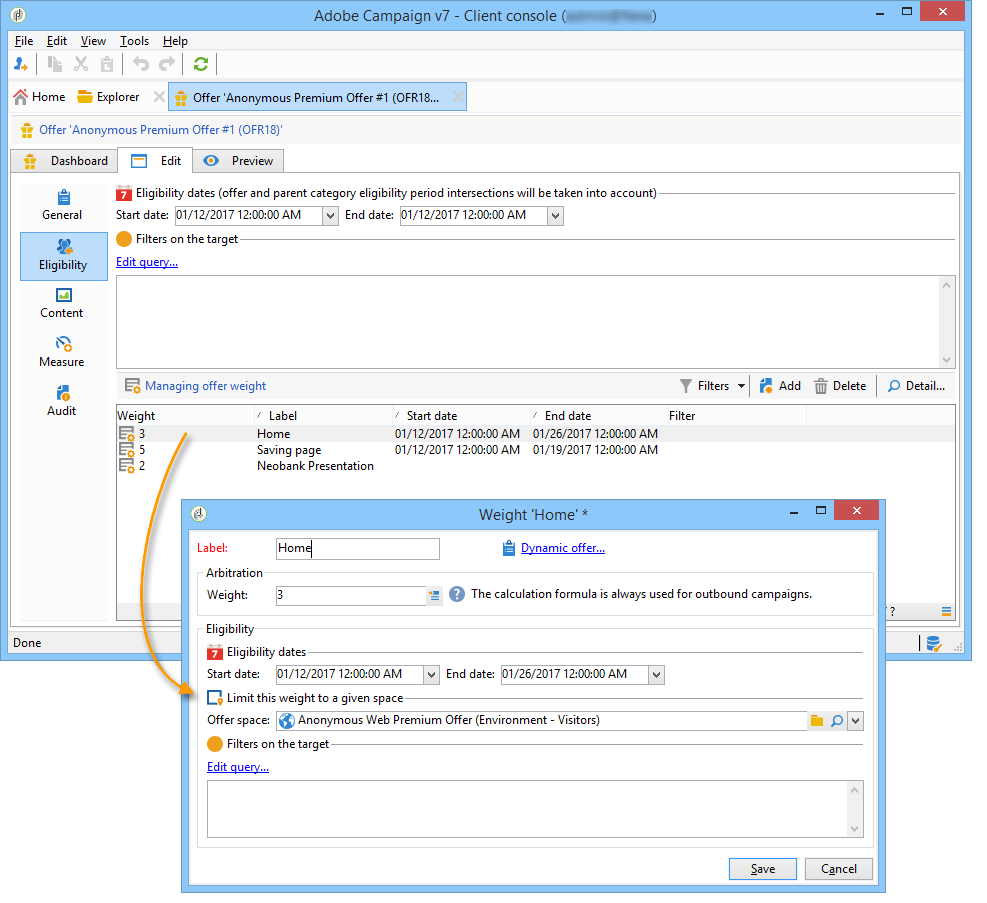

# 傳入頻道上的優惠{#offers-on-an-inbound-channel}


## 向匿名訪客呈現優惠方案 {#presenting-an-offer-to-an-anonymous-visitor}

Neobank網站想在其網站上顯示優惠方案，目標為瀏覽頁面的未識別訪客。

若要設定此互動，我們將：

1. [建立匿名環境](#creating-an-anonymous-environment)
1. [建立匿名優惠方案空間](#creating-anonymous-offer-spaces)
1. [建立優惠方案類別和主題](#creating-an-offer-category-and-a-theme)
1. [建立匿名選件。](#creating-anonymous-offers)
1. [在網站上設定Web優惠方案空間](#configure-the-web-offer-space-on-the-website)

### 建立匿名環境 {#creating-an-anonymous-environment}

依照 [建立優惠方案環境](../../interaction/using/live-design-environments.md#creating-an-offer-environment) 建立匿名環境 **訪客**「維。

您會得到包含新環境的樹結構：


### 建立匿名優惠方案空間 {#creating-anonymous-offer-spaces}

1. 在您的匿名環境中(**訪客**)前往 **[!UICONTROL Administration]** > **[!UICONTROL Spaces]** 節點。
1. 按一下 **[!UICONTROL New]** 來建立呼叫通道。

   

   >[!NOTE]
   >
   >空間會自動連結到匿名環境。

1. 變更標籤並選取 **[!UICONTROL Inbound Web]** 頻道。 您也必須檢查 **[!UICONTROL Enable unitary mode]** 框。

   

1. 選取空間使用的優惠方案內容欄位，並核取相關方塊以視需要指定。

   如此一來，任何遺失下列其中一個元素的選件將不符合此空間的資格：

   * 標題
   * HTML內容
   * 影像URL
   * 目標URL

   

1. 編輯HTML呈現函式，例如：

   ```
   function (imageUrl, targetUrl, shortContent, htmlSource){
         var html = "<p><b>" + shortContent + "</b></p>";
         html += "<p>" + htmlSource + "</p>";
         html += "<a _urlType='11' href='" + targetUrl + "'></a>";
         return html;
       }   
   ```

   >[!IMPORTANT]
   >
   >轉譯函式必須依照先前選取的順序為空格使用的欄位命名，才能正確顯示選件。

   

1. 儲存優惠方案空間。

### 建立優惠方案類別和主題 {#creating-an-offer-category-and-a-theme}

1. 前往 **[!UICONTROL Offer catalog]** 節點。
1. 以滑鼠右鍵按一下 **[!UICONTROL Offer catalog]** 節點和選取 **[!UICONTROL Create a new 'Offer category' folder]**.

   為新類別命名， **金融產品** 例如，

1. 前往類別的 **[!UICONTROL Eligibility]** 標籤和輸入 **融資** ，然後儲存變更。

   

### 建立匿名優惠方案 {#creating-anonymous-offers}

1. 前往您剛建立的類別。
1. 按一下&#x200B;**[!UICONTROL New]**。

   

1. 選取現成可用的匿名選件範本或先前建立的範本。

   

1. 變更標籤並儲存優惠方案。

   

1. 前往 **[!UICONTROL Eligibility]** 標籤，並根據選件的應用程式內容指定選件的權重。

   在此範例中，選件經設定後會以優先順序顯示在網站的首頁上，直到年底為止。

   

1. 前往 **[!UICONTROL Content]** 標籤，並定義選件的內容。

   >[!NOTE]
   >
   >您可以選取 **[!UICONTROL Content definitions]** 顯示web空間所需的元素清單。

   

1. 建立第二個選件。

   

1. 前往 **[!UICONTROL Eligibility]** 標籤，並套用與第一個選件相同的加權。
1. 執行每個優惠方案的核准週期，以便線上上環境中提供這些優惠方案，及其核准的優惠方案空間。

### 在網站上設定Web優惠方案空間 {#configure-the-web-offer-space-on-the-website}

若要讓您剛設定的優惠方案顯示在網站上，請將JavaScript程式碼插入網站的HTML頁面中，以呼叫互動引擎(如需詳細資訊，請參閱 [關於傳入頻道](../../interaction/using/about-inbound-channels.md))。

1. 前往HTML頁面，插入@id屬性，其值與先前建立之匿名選件空間的內部名稱相符(請參閱 [建立匿名優惠方案空間](#creating-anonymous-offer-spaces))，前面有 **i_**.

   

1. 插入呼叫URL。

   

   上方的藍色URL方塊對應至執行個體名稱、環境的內部名稱(請參閱 [建立匿名環境](#creating-an-anonymous-environment))和連結至類別的主題([建立優惠方案類別和主題](#creating-an-offer-category-and-a-theme))。 後者為選用。

當訪客存取網站的首頁時，將會提供 **融資** 主題會依「HTML」頁面上的設定顯示。


若使用者瀏覽頁面多次，將會看見類別中的一個或另一個選件，因為這兩個選件都獲派相同的權重。

## 在未標識的聯繫人情況下切換到匿名環境 {#switching-to-an-anonymous-environment-in-case-of-unidentified-contacts}

Neobank公司想要為兩個不同的目標建立行銷選件。 它想要顯示其匿名網站瀏覽器的一般優惠方案。 如果其中一位使用者是Neobank提供識別碼的客戶，公司會希望他們在登入後立即收到個人化優惠方案。

此案例研究基於以下情形：

1. 訪客未登入即瀏覽Neobank網站。

   

   頁面上會顯示三個匿名選件：two **最佳優惠方案** Neobank產品優惠，Neobank合作夥伴優惠。

   

1. 使用者（Neobank客戶）以其認證登入。

   

   會顯示三個個人化優惠方案。

   

若要實作此案例研究，您必須有兩個選件環境：一個用於匿名互動，一個用於為已識別的聯繫人配置的選件。 已識別的優惠方案環境將設定為在未登入連絡人，因此未識別該連絡人時，自動切換至匿名優惠方案環境。

應用以下步驟：

* 使用下列步驟，建立匿名入站互動專屬的優惠方案目錄：

   1. [為匿名聯繫人建立環境](#creating-an-environment-for-anonymous-contacts)
   1. [為匿名環境配置選件空間](#configuring-offer-spaces-for-the-anonymous-environment)
   1. [在匿名環境中建立優惠方案類別](#creating-offer-categories-in-an-anonymous-environment)
   1. [為匿名訪客建立優惠方案](#creating-offers-for-anonymous-visitors)

* 使用下列步驟，建立指定入站互動的特定優惠方案目錄：

   1. [在已識別的環境中設定優惠方案空間](#configure-the-offer-spaces-in-the-identified-environment)
   1. [在已識別的環境中建立優惠方案類別](#creating-offer-categories-in-an-identified-environment)
   1. [建立個人化優惠方案](#creating-personalized-offers)

* 設定對優惠方案引擎的呼叫：

   1. [在網頁上設定優惠方案空間](#configuring-offer-spaces-on-the-web-page)
   1. [指定所識別優惠方案空間的進階設定](#specifying-the-advanced-settings-of-the-identified-offer-spaces)

### 為匿名聯繫人建立環境 {#creating-an-environment-for-anonymous-contacts}

1. 透過傳遞對應精靈為匿名入站互動建立優惠方案環境(**訪客** 對應)。 有關詳細資訊，請參閱 [建立優惠方案環境](../../interaction/using/live-design-environments.md#creating-an-offer-environment).

   

### 為匿名環境配置選件空間 {#configuring-offer-spaces-for-the-anonymous-environment}

必須在網站上呈現的選件分為兩個不同類別： **最佳優惠方案** 和 **合作夥伴**. 在此範例中，我們將為每個類別建立特定的優惠方案空間。

若要建立符合以下條件的優惠方案空間： **最佳優惠方案** 類別，請應用以下流程：

1. 在Adobe Campaign樹狀結構中，前往您剛建立的匿名環境，並新增優惠方案空間。

   

1. 建立新 **[!UICONTROL Inbound web]** 鍵入空格。

   

1. 輸入標籤： **Web最佳匿名選件** 例如。
1. 新增用於此優惠方案空間的優惠方案內容欄位，並設定轉譯函式。

   

   >[!IMPORTANT]
   >
   >轉譯函式必須依照先前選取的順序為空格使用的欄位命名，才能正確顯示選件。

1. 使用相同的程式來建立入站Web頻道選件空間，以符合 **合作夥伴** 類別。

   

### 在匿名環境中建立優惠方案類別 {#creating-offer-categories-in-an-anonymous-environment}

首先，請建立兩個優惠方案類別：the **最佳優惠方案** 類別和 **合作夥伴** 類別。 每個類別都包含兩個匿名聯繫人的選件。

1. 前往 **[!UICONTROL Offer catalog]** 在您剛建立的匿名環境中。
1. 新增 **[!UICONTROL Offer category]** 資料夾 **最佳優惠方案** 作為標籤。

   

1. 建立第二個類別，其中 **合作夥伴** 作為標籤。

   

### 為匿名訪客建立優惠方案 {#creating-offers-for-anonymous-visitors}

我們現在將在上述建立的每個類別中建立兩個選件。

1. 前往 **最佳優惠方案** 類別，並建立匿名選件。

   

1. 前往 **[!UICONTROL Eligibility]** 標籤，並根據選件的應用程式內容指定選件的權重。

   

1. 前往 **[!UICONTROL Content]** 標籤，並定義選件的內容。

   

1. 在 **最佳優惠方案** 類別。

   

1. 前往 **合作夥伴** 類別，並建立匿名選件。
1. 前往 **[!UICONTROL Content]** 標籤，並定義選件的內容。

   

1. 前往 **[!UICONTROL Eligibility]** 標籤，並根據選件的應用程式內容指定選件的權重。

   

1. 為 **合作夥伴** 類別。

   

1. 前往 **[!UICONTROL Eligibility]** 標籤，並套用您套用至此類別中第一個選件的相同權重，讓選件連續顯示在網站上。

   

1. 執行每個優惠方案的核准週期，以開始啟用。 核准內容時，請啟動 **合作夥伴** 或 **最佳優惠方案** 優惠方案，根據優惠方案。

### 在已識別的環境中設定優惠方案空間 {#configure-the-offer-spaces-in-the-identified-environment}

您要呈現在網站上的優惠方案會來自兩個不同的類別： **最佳優惠方案** 和 **合作夥伴**. 在此範例中，我們想要為每個類別建立特定空間。

若要建立兩個選件空間，請套用與匿名選件空間相同的程式。 請參閱 [為匿名環境配置選件空間](#configuring-offer-spaces-for-the-anonymous-environment).

1. 在Adobe Campaign樹中，前往您剛建立的環境並新增 **最佳優惠方案** 和 **合作夥伴** 選件空間。
1. 套用程式，詳細於 [為匿名環境配置選件空間](#configuring-offer-spaces-for-the-anonymous-environment).

   

1. 選取 **[!UICONTROL Fall back on an anonymous environment if no individuals were identified]** 選項。

   

1. 使用下拉式清單，選取先前建立的匿名Web選件空間(請參閱 [為匿名環境配置選件空間](#configuring-offer-spaces-for-the-anonymous-environment))。

   

### 指定所識別優惠方案空間的進階設定 {#specifying-the-advanced-settings-of-the-identified-offer-spaces}

在此範例中，由於Adobe Campaign資料庫中的電子郵件地址，會發生連絡人身分識別。 要將收件人電子郵件添加到空間，請應用以下過程：

1. 在已識別的環境中，前往選件空間資料夾。
1. 選取 **最佳優惠方案** 選件空間，按一下 **[!UICONTROL Advanced parameters]**.

   

1. 在 **[!UICONTROL Target identification]** 索引標籤中，按一下 **[!UICONTROL Add]**。

   

1. 按一下 **[!UICONTROL Edit expression]**，前往收件者表格並選取 **[!UICONTROL Email]** 欄位。

   

1. 按一下 **[!UICONTROL OK]** 關閉 **[!UICONTROL Advanced parameters]** 窗口並完成配置 **最佳優惠方案** 選件空間。
1. 將相同的程式套用至 **合作夥伴** 選件空間。

   

### 在已識別的環境中建立優惠方案類別 {#creating-offer-categories-in-an-identified-environment}

我們將建立兩個不同的類別：the **最佳優惠方案** 類別和 **合作夥伴** 類別中，每個都有兩個個人化優惠方案。

1. 前往 **[!UICONTROL Offer catalogs]** 節點。
1. 如同在匿名環境中，新增兩個 **[!UICONTROL Offer category]** 資料夾 **最佳優惠方案** 和 **合作夥伴** 作為標籤。

   

### 建立個人化優惠方案 {#creating-personalized-offers}

我們想要為每個類別建立兩個個人化優惠方案，即四個優惠方案。

1. 前往 **最佳優惠方案** 類別和建立第一個個人化優惠方案。

   

1. 前往 **[!UICONTROL Eligibility]** 標籤，並根據選件的應用程式內容指定選件的權重。

   

1. 前往 **[!UICONTROL Content]** 標籤，並定義選件的內容。

   

1. 在 **最佳優惠方案** 類別。

   

1. 前往 **合作夥伴** 類別和建立個人化優惠方案。

   

1. 前往 **[!UICONTROL Eligibility]** 標籤，並根據選件的應用程式內容指定選件的權重。

   

1. 為 **合作夥伴** 類別。

   

1. 前往 **[!UICONTROL Eligibility]** 標籤，並套用您套用至此類別中第一個選件的相同權重，讓選件連續顯示在網站上。
1. 執行每個優惠方案的核准週期以開始更新。 在內容核准期間，啟動 **合作夥伴** 或 **最佳優惠方案** 選件空間。

### 在網頁上設定優惠方案空間 {#configuring-offer-spaces-on-the-web-page}

Neobank公司的網站有三個優惠方案空間：兩個用於銀行相關報價 **最佳優惠方案** 類別中，而來自選件的則為一個 **合作夥伴** 類別。


若要在網站的HTML頁面上設定這些優惠方案空間，請套用下列程式：

1. 在HTML頁面的內容中，插入三

   具有@id屬性的元素，其值可讓我們在網站的各種優惠方案空間中呼叫優惠方案。

   

1. 然後插入用於定義屬性值的指令碼。

   

   在此範例中， **CONTBO1** 和 **CONTBO2** 接收值 **OsWebBestOfferIndified**，即 **最佳優惠方案** 先前在已識別環境中建立的優惠方案空間。 此 **CatBestOffer** 和 **CatBestOfferAnonym** 值與 **最佳優惠方案** 匿名和已識別環境的類別。

   

   同樣， **ContPtn** 接收 **OSWebPartnerIndified** 值，會比對 **合作夥伴** 在已識別的環境中建立的選件空間。 **CatPartner** 和 **CatPartnerAnonym** 符合的內部名稱 **合作夥伴** 匿名和已識別環境的類別。

   

1. 指派資訊，讓您識別登入Neobank網站的人員，並將 **interactionTarget** 變數。

   

   人員的身分識別可以根據瀏覽器Cookie、URL中的讀取參數、電子郵件或人員的識別碼。 如果使用了主鍵以外的收件人表欄位，則需要在空間的高級參數中定義該欄位(請參閱 [指定所識別優惠方案空間的進階設定](#specifying-the-advanced-settings-of-the-identified-offer-spaces))。

1. 插入呼叫URL。

   

   URL包含 **EnvNeobankRecip**，即所識別環境的內部名稱。

開啟網頁時；指令碼可讓您呼叫互動引擎，以顯示網頁相關空間中選件的內容。 在對Adobe Campaign伺服器的單一呼叫中，引擎會決定要選取的環境、選件空間和類別。

在此範例中，引擎會辨識已識別的環境(**EnvNeobankIdnRecip**)。 它可識別優惠方案空間(**OSWebBestOfferIndified**)和 **最佳優惠方案** 類別(**CatBestOffer**)，以取得網頁上的第一個和第二個選件空格，以及(**OSWebPartnerIndified**)選件空間和 **合作夥伴** 類別(**CatPartner**)，以取得網站上的第三個優惠方案空間。

如果引擎無法識別收件者，則會切換至已識別選件空間中參考的匿名選件空間，並切換至匿名類別(**CatPartner** 和 **CatPartnerAnonym**)，如指令碼中所指定。
