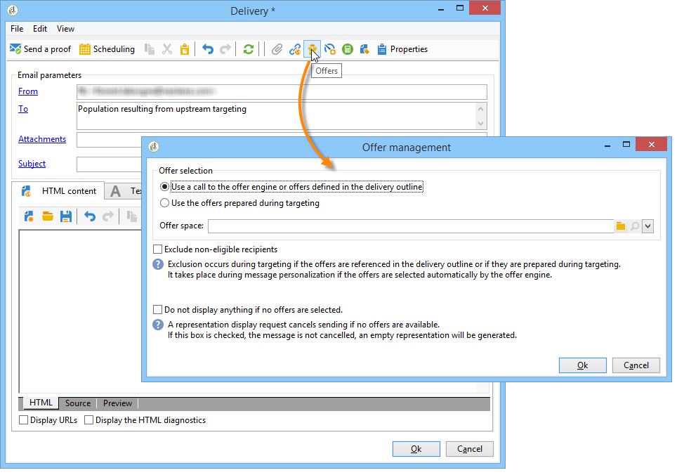
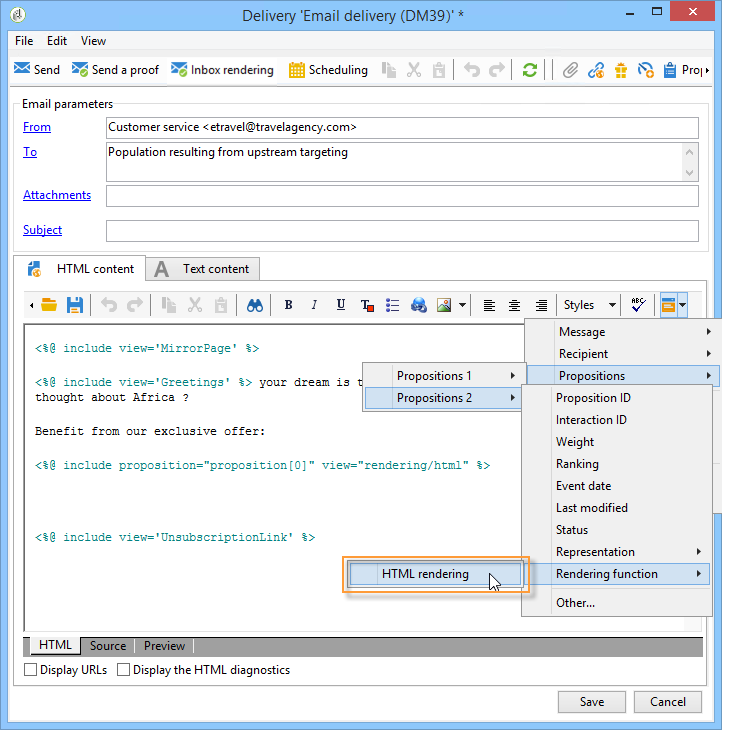
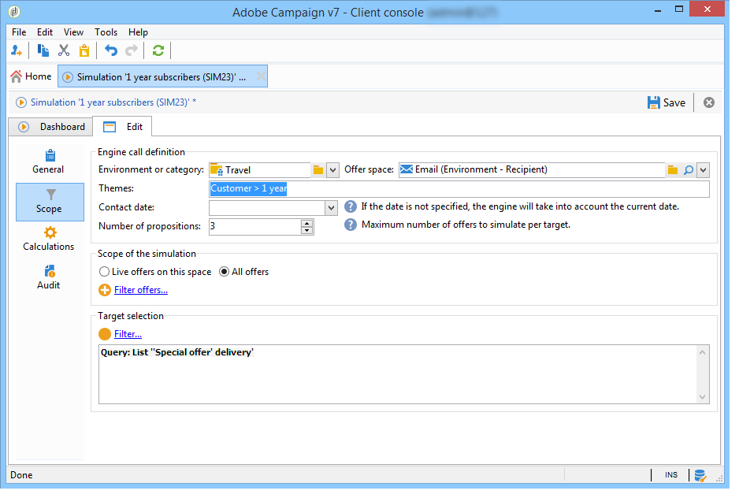

# 傳出頻道上的優惠{#offers-on-an-outbound-channel}

## 電子郵件選件傳送 {#email-offer-delivery}

在我們的資料庫中，有一類前往非洲的旅行優惠。 已設定每個優惠方案的資格、內容和表示法。 我們現在想要建立行銷活動，透過電子郵件呈現優惠方案。

1. 建立行銷活動和目標工作流程。

   

1. 編輯電子郵件傳送，然後按一下 **[!UICONTROL Offers]** 表徵圖。

   

1. 為符合假日的優惠方案環境選擇電子郵件空間。

   

1. 選擇包含非洲旅行優惠的類別。

   

1. 將傳送中的選件數設為兩個。

   

1. 關閉優惠方案管理視窗，並建立傳送內容。

   

1. 使用功能表來插入第一個選件主張，並選擇HTML轉譯函式。

   

1. 插入第二個優惠方案主張。

   

1. 按一下 **[!UICONTROL Preview]** 若要在傳送中預覽優惠方案，請選取收件者，以在收到優惠方案時加以預覽。

   

1. 儲存您的傳送並啟動目標工作流程。
1. 開啟您的傳送，然後按一下 **[!UICONTROL Audit]** 的頁簽：您可以看到優惠方案引擎已從目錄中的各種優惠方案中選取要提出的建議。

   

## 執行優惠方案模擬 {#perform-an-offer-simulation}

1. 在 **[!UICONTROL Profiles and Targets]** ，按一下 **[!UICONTROL Simulations]** 連結，然後按一下 **[!UICONTROL Create]** 按鈕。

   

1. 選擇標籤，並視需要指定執行設定。

   

1. 保存模擬。 接著會在新索引標籤中開啟。

   

1. 按一下 **[!UICONTROL Edit]** ，然後 **[!UICONTROL Scope]**.

   

1. 選擇要模擬選件的類別。

   

1. 選擇要用於模擬的選件空間。

   

1. 輸入有效日期。 您至少必須輸入開始日期。 這可讓優惠方案引擎篩選優惠方案，並選擇在指定日期有效的優惠方案。
1. 如有必要，請指定一或多個主題，以限制設定中包含此關鍵字的選件數目。

   在我們的範例中， **旅行** 類別包含兩個分類，兩個主題不同。 我們想使用 **客戶> 1年** 主題。

   

1. 選擇要定位的收件者。

   

1. 設定要傳送給每個收件者的優惠方案數量。

   在我們的範例中，優惠方案引擎會為每個收件者選擇3個具有最高權重的優惠方案。

   

1. 儲存您的設定，然後按一下 **[!UICONTROL Start]** 在 **[!UICONTROL Dashboard]** 頁簽以運行模擬。

   

1. 模擬完成後，請查閱 **[!UICONTROL Results]** 以詳細了解每個優惠方案的建議。

   在我們的範例中，優惠方案引擎已根據3個主張來劃分優惠方案。

   

1. 顯示 **[!UICONTROL Breakdown of offers by rank]** 檢視優惠方案引擎所選優惠方案清單。

   

1. 如有必要，您可以更改範圍設定，並通過按一下 **[!UICONTROL Start simulation]**.

   

1. 若要儲存模擬資料，請使用報表中可用的歷史記錄或匯出函式。

   
