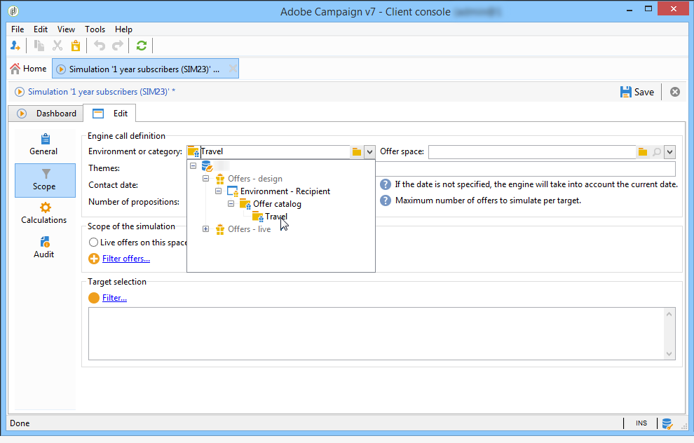

# 對外渠道的選件{#offers-on-an-outbound-channel}

## 電子郵件選件傳送 {#email-offer-delivery}

在我們的資料庫中，有一類旅行優惠是去非洲。 已設定每個選件的資格、上下文和表示法。 我們現在想要建立促銷活動，透過電子郵件呈現我們的選件。

1. 建立行銷促銷活動和定位工作流程。

   

1. 編輯電子郵件傳送，然後按一下 **[!UICONTROL Offers]** 圖示。

   

1. 選擇符合節假日的選件環境電子郵件空間。

   

1. 選擇包含非洲旅遊優惠的類別。

   

1. 將傳送中的選件數設為2。

   

1. 關閉選件管理視窗，並建立傳送的內容。

   

1. 使用功能表插入第一個選件提案並選擇HTML轉換功能。

   

1. 插入第二個選件提案。

   

1. 按一 **[!UICONTROL Preview]** 下以在傳送中預覽選件，然後選取收件者以在收到選件時預覽選件。

   

1. 儲存您的傳送並啟動定位工作流程。
1. 開啟您的傳送，然後按一下 **[!UICONTROL Audit]** 傳送的標籤：您可以看到選件引擎已從目錄中的各種選件中選取要提出的建議。

   

## 執行選件模擬 {#perform-an-offer-simulation}

1. 在宇宙 **[!UICONTROL Profiles and Targets]** 中，按一下連 **[!UICONTROL Simulations]** 結，然後按一下 **[!UICONTROL Create]** 按鈕。

   

1. 選擇標籤並指定執行設定（如有需要）。

   

1. 儲存模擬。 然後，在新標籤中開啟。

   

1. 按一下 **[!UICONTROL Edit]** 標籤，然後 **[!UICONTROL Scope]**。

   

1. 選擇您要模擬選件的類別。

   

1. 選擇要用於模擬的選件空間。

   

1. 輸入有效日期。 您必須至少輸入開始日期。 這可讓選件引擎篩選選件，並選擇在指定日期有效的選件。
1. 如有必要，請指定一或多個主題，將選件數限制為設定中包含此關鍵字的選件數。

   在我們的範例中， **Travel** 類別包含兩個子類別，其中有兩個不同的主題。 我們想要運用「客戶>1年」主題來 **模擬優惠** 。

   

1. 選擇要定位的收件者。

   

1. 設定要傳送給每個收件者的選件數。

   在我們的範例中，選件引擎會為每個收件者選擇3個具有最大權重的選件。

   

1. 儲存您的設定，然後按一 **[!UICONTROL Start]** 下標籤中 **[!UICONTROL Dashboard]** 的以執行模擬。

   

1. 在模擬完成後，請參閱，以取得 **[!UICONTROL Results]** 每個選件的主張詳細劃分資訊。

   在我們的範例中，選件引擎以3個選件劃分為基礎。

   

1. 顯示選 **[!UICONTROL Breakdown of offers by rank]** 件引擎所選取的選件清單。

   

1. 如有必要，您可以變更範圍設定，並按一下以再次執行模擬 **[!UICONTROL Start simulation]**。

   

1. 若要儲存模擬資料，請使用報表中可用的步驟記錄或匯出功能。

   

