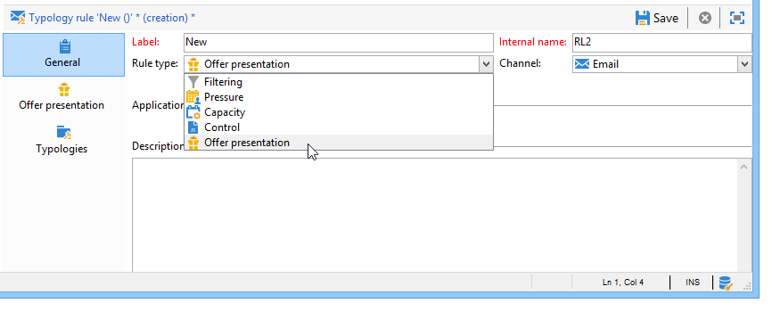
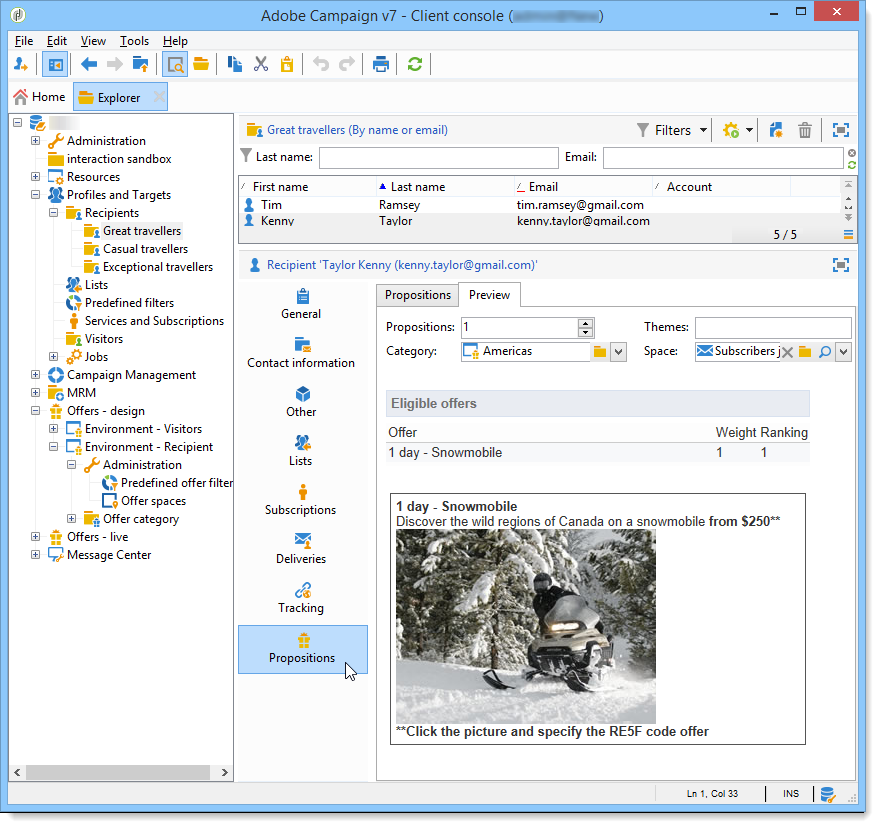

# 簡報規則{#presentation-rules}

## 建立簡報規則 {#creating-a-presentation-rule}

在我們的資料庫中，有幾個旅行優惠，分別是歐洲、非洲、美國和加拿大。 我們想要傳送前往加拿大的優惠方案，但如果收件者拒絕此類優惠方案，我們就不想再傳送給他們

我們將設定規則，讓每個收件者只能提供一次加拿大之旅，如果拒絕，將不再提供。

1. 在Adobe Campaign樹中，前往 **[!UICONTROL Administration]** > **[!UICONTROL Campaign management]** > **[!UICONTROL Typology management]** > **[!UICONTROL Typology rules]** 節點。
1. 建立新 **[!UICONTROL Offer presentation]** 類型規則。

   

1. 視需要變更其標籤和說明。

   

1. 選擇 **[!UICONTROL All channels]** 選項，將規則擴充至所有管道。

   

1. 按一下 **[!UICONTROL Edit expression]** 連結，然後選擇 **[!UICONTROL Category]** 節點作為運算式。

   

1. 選擇與您前往加拿大的旅行優惠相符的類別，然後按一下 **[!UICONTROL OK]** 來關閉查詢窗口。

   

1. 在 **[!UICONTROL Offer presentation]** 標籤中，選擇與環境中配置的維相同的維。

   

1. 指定將套用規則的期間。

   

1. 將主張限制為一個，讓已拒絕前往加拿大的收件者不會收到其他類似優惠。

   

1. 選取 **[!UICONTROL Offers for the same category]** 篩選以從 **加拿大** 類別。

   

1. 選取 **[!UICONTROL Rejected propositions]** 篩選器，僅考慮收件者拒絕的主張。

   

1. 選擇要套用此規則的收件者。

   在我們的範例中，我們將選取 **常客** 收件者。

   

1. 參考選件類型中的規則。

   

1. 前往選件環境，(**環境 — 收件者** 在此情況下)，並參考剛使用 **[!UICONTROL Eligibility]** 標籤。

   

## 應用演示規則 {#applying-the-presentation-rule}

以下是先前建立的類型規則的應用程式範例。

我們想傳送屬於加拿大類別的第一個優惠方案主張。 如果任何收件者拒絕一次選件，就不會再向他們提供選件。

1. 在 **常客** 收件者資料夾中，選擇其中一個設定檔以檢查其符合資格的選件：按一下 **[!UICONTROL Propositions]** ，然後 **[!UICONTROL Preview]** 標籤。

   在我們的例子中， **蒂姆·拉姆齊** 符合資格取得屬於 **美洲** 類別。

   

1. 首先，建立以您的 **常客** 具有優惠方案的收件者。
1. 選取優惠方案引擎呼叫參數。

   在我們的範例中， **美國旅行** 類別，其中包含 **加拿大** 和 **美國** 子類別。

   

1. 在訊息內文中插入您的優惠方案並傳送傳遞。 有關詳細資訊，請參閱 [關於傳出頻道](../../interaction/using/about-outbound-channels.md).

   收件者收到符合資格的優惠方案。

1. 收件者拒絕加拿大優惠方案，如主張歷程記錄所示。

   

1. 檢查目前符合資格的優惠方案。

   我們可以看到，沒有選擇給加拿大的優惠。

   
