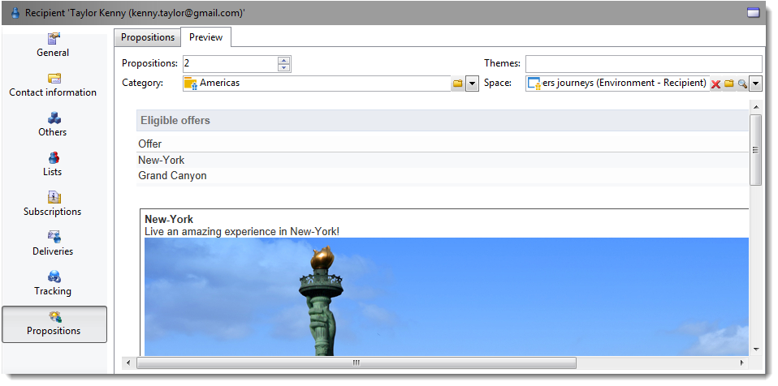

# 簡報規則{#presentation-rules}

## 建立簡報規則 {#creating-a-presentation-rule}

在我們的資料庫中，有幾份旅行優惠，適用於歐洲、非洲、美國和加拿大。 我們想要寄送優惠到加拿大，但如果收件者拒絕此類優惠，我們不想再寄給他們

我們將設定規則，讓每位收件者僅能提供一次加拿大之行，若拒絕，則不再提供。

1. 在Adobe Campaign樹狀結構中，前往 **[!UICONTROL Administration]** > **[!UICONTROL Campaign management]** > **[!UICONTROL Typology management]** >節 **[!UICONTROL Typology rules]** 點。
1. 建立新的 **[!UICONTROL Offer presentation]** 類型規則。

   

1. 如有必要，請變更其標籤和說明。

   

1. 選擇 **[!UICONTROL All channels]** 將規則延伸至所有渠道的選項。

   

1. 按一下該 **[!UICONTROL Edit expression]** 連結並選擇節 **[!UICONTROL Category]** 點作為表達式。

   

1. 選擇與您的加拿大旅行優惠相符的類別，然後按一 **[!UICONTROL OK]** 下以關閉查詢視窗。

   

1. 在標籤 **[!UICONTROL Offer presentation]** 中，選擇與環境中配置的維相同的維。

   

1. 指定套用規則的期間。

   

1. 將提案限制在一個，讓已拒絕加拿大之行的收件者不會再收到類似的提案。

   

1. 選取篩 **[!UICONTROL Offers for the same category]** 選條件，從「加拿大」類別排除 **所有選** 件。

   

1. 選擇篩 **[!UICONTROL Rejected propositions]** 選器，只考慮收件人拒絕的主張。

   

1. 選擇將套用此規則的收件者。

   在我們的例子中，我們將選擇「常 **旅客** 」收件者。

   

1. 在選件類型學中參考規則。

   

1. 前往選件環境(本例中為「**Environment - Recipient** 」)，並參考使用標籤中下拉式清單所建立的新類型 **[!UICONTROL Eligibility]** 學。

   

## 套用簡報規則 {#applying-the-presentation-rule}

以下是先前建立的排版規則的應用程式範例。

我們想傳送屬於加拿大類別的第一個選件提案。 如果選件遭任何收件者拒絕一次，就不會再次提供給他們。

1. 在「常 **旅客** 」收件者資料夾中，選擇其中一個描述檔，以檢查符合資格的選件：按一下 **[!UICONTROL Propositions]** 標籤，然後按一 **[!UICONTROL Preview]** 下標籤。

   在我們的範例中， **Tim Ramsey** 符合「美洲」類別的 **選件** 。

   

1. 首先，建立電子郵件傳送，以您的常旅客收件 **者為目標** ，提供優惠。
1. 選取選件引擎呼叫參數。

   在我們的例子中，選 **擇了Travel in America** （美國旅行）類別，其中 **包含Canada****** 和United sub-categories。

   

1. 將選件插入訊息內文並傳送傳送。 有關詳情，請參閱關於 [出站渠道](../../interaction/using/about-outbound-channels.md)。

   收件者收到符合資格的選件。

1. 如提案歷史所示，收件者拒絕了加拿大提案。

   

1. 檢查目前符合資格的選件。

   我們可以看到加拿大沒有選擇任何優惠。

   

**相關主題**

* [跨通道管理選件和控制冗餘](https://helpx.adobe.com/campaign/kb/simplifying-campaign-management-acc.html#Manageoffersandcontrolredundancyacrosschannels)