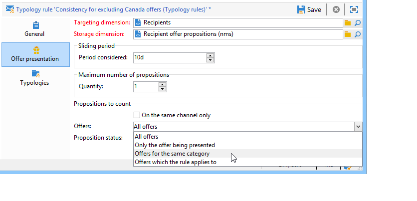

# 簡報規則{#presentation-rules}

## 建立演示規則 {#creating-a-presentation-rule}

在我們的資料庫中，有幾個旅行優惠，面向歐洲、非洲、美國和加拿大。 我們希望發送邀請前往加拿大，但如果接受者拒絕此類邀請，我們不希望再將其發送給他們

我們將配置規則，這樣每次訪問加拿大時，每個收件人只提供一次，如果被拒絕，則不再提供。

1. 在Adobe Campaign樹上， **[!UICONTROL Administration]** > **[!UICONTROL Campaign management]** > **[!UICONTROL Typology management]** > **[!UICONTROL Typology rules]** 的下界。
1. 新建 **[!UICONTROL Offer presentation]** 類型規則。

   

1. 如有必要，請更改其標籤及其說明。

   

1. 選擇 **[!UICONTROL All channels]** 選項將規則擴展到所有通道。

   

1. 按一下 **[!UICONTROL Edit expression]** 連結並選擇 **[!UICONTROL Category]** 節點作為表達式。

   

1. 選擇與您為加拿大提供的旅行優惠相匹配的類別，然後按一下 **[!UICONTROL OK]** 按鈕。

   

1. 在 **[!UICONTROL Offer presentation]** 頁籤，選擇與環境中配置的維相同的維。

   

1. 指定規則將應用的期間。

   

1. 將提案限制為一個，這樣，已經拒絕前往加拿大的受助者將不會再收到類似的提議。

   

1. 選擇 **[!UICONTROL Offers for the same category]** 篩選以從中排除所有優惠 **加拿大** 的子菜單。

   

1. 選擇 **[!UICONTROL Rejected propositions]** 篩選，以僅考慮收件人拒絕的主張。

   

1. 選擇此規則將適用的收件人。

   在我們的示例中，我們將選擇 **常客** 收件人。

   

1. 在優惠類型中引用規則。

   

1. 轉到服務環境(**環境 — 收件人** 在本例中)，並引用剛剛使用 **[!UICONTROL Eligibility]** 頁籤。

   

## 應用演示規則 {#applying-the-presentation-rule}

下面是先前建立的類型規則的應用示例。

我們想發送屬於加拿大類別的第一份報價建議。 如果任何收件人拒絕一次，則不會再次向他們提供此優惠。

1. 在 **常客** 收件人資料夾，選擇其中一個配置檔案以檢查符合條件的聘用：按一下 **[!UICONTROL Propositions]** ，則 **[!UICONTROL Preview]** 頁籤。

   以我們為例， **蒂姆·拉姆齊** 有資格獲得屬於該要約一部分的要約 **美洲** 的子菜單。

   

1. 首先建立以您的 **常客** 提供優惠的收件人。
1. 選擇供應引擎調用參數。

   在我們的例子中， **美國旅行** 選擇類別，其中包含 **加拿大** 和 **美國** 子類別。

   

1. 在郵件正文中插入您的優惠併發送遞送。 有關此內容的詳細資訊，請參閱 [關於出站通道](../../interaction/using/about-outbound-channels.md)。

   收件人收到了他們有資格的要約。

1. 如提案歷史所示，接受者拒絕了加拿大的提議。

   

1. 檢查他們現在有資格的優惠。

   我們可以看出，加拿大沒有選擇任何優惠。

   
