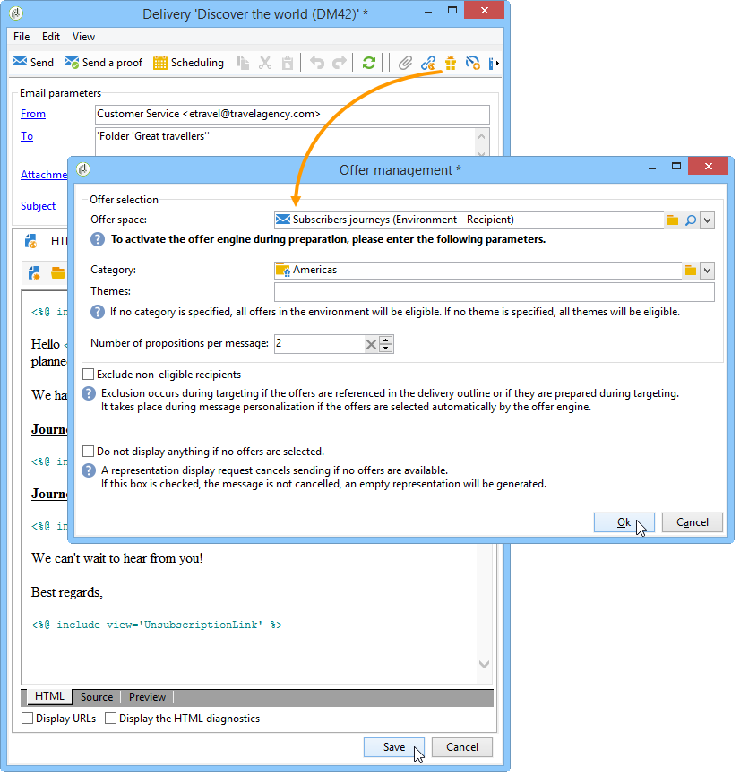

# 簡報規則{#presentation-rules}

## 建立簡報規則 {#creating-a-presentation-rule}

在我們的資料庫中，有數種歐洲、非洲、美國和加拿大的旅行優惠方案。 我們想要傳送前往加拿大之旅的優惠方案，但如果收件者拒絕此型別的優惠方案，我們便不想再次傳送給他們

我們將設定規則，每個收件者僅會提供一次加拿大行程，如果遭拒絕，則不會再次提供。

1. 在Adobe Campaign樹狀結構中，前往&#x200B;**[!UICONTROL Administration]** > **[!UICONTROL Campaign management]** > **[!UICONTROL Typology management]** > **[!UICONTROL Typology rules]**&#x200B;節點。
1. 建立新的&#x200B;**[!UICONTROL Offer presentation]**&#x200B;型別規則。

   

1. 視需要變更其標籤和說明。

   

1. 選擇&#x200B;**[!UICONTROL All channels]**&#x200B;選項，將規則擴充至所有管道。

   

1. 按一下&#x200B;**[!UICONTROL Edit expression]**&#x200B;連結，並選擇&#x200B;**[!UICONTROL Category]**&#x200B;節點作為運算式。

   

1. 選擇符合您加拿大旅行優惠方案的類別，然後按一下&#x200B;**[!UICONTROL OK]**&#x200B;以關閉查詢視窗。

   

1. 在&#x200B;**[!UICONTROL Offer presentation]**&#x200B;索引標籤中，選擇與環境中設定的維度相同的維度。

   

1. 指定套用規則的期間。

   

1. 將主張限製為一個，以便已拒絕加拿大之旅的收件者不會收到另一個類似優惠。

   

1. 選取&#x200B;**[!UICONTROL Offers for the same category]**&#x200B;篩選器，以從&#x200B;**加拿大**&#x200B;類別中排除所有優惠方案。

   

1. 選取&#x200B;**[!UICONTROL Rejected propositions]**&#x200B;篩選器，僅考慮收件者拒絕的主張。

   

1. 選擇要套用此規則的收件者。

   在我們的範例中，我們將選擇&#x200B;**頻繁旅行者**&#x200B;位收件者。

   

1. 參考優惠方案型別中的規則。

   

1. 前往優惠方案環境（**環境 — 此案例中的收件者**），並參考使用&#x200B;**[!UICONTROL Eligibility]**&#x200B;索引標籤中的下拉式清單剛建立的新型別。

   

## 套用簡報規則 {#applying-the-presentation-rule}

以下是先前建立之型別規則的應用程式範例。

我們想要傳送屬於加拿大類別的第一個優惠方案主張。 如果任何收件者拒絕過一次優惠，將無法再次向他們提供。

1. 在&#x200B;**常旅客名單**&#x200B;收件者資料夾中，選擇其中一個設定檔以檢查其符合資格的優惠方案：按一下「**[!UICONTROL Propositions]**」標籤，然後按「**[!UICONTROL Preview]**」標籤。

   在我們的範例中，**Tim Ramsey**&#x200B;符合優惠方案資格，該優惠方案屬於&#x200B;**Americas**&#x200B;類別。

   

1. 首先，建立電子郵件傳遞，以您的&#x200B;**經常旅行者**&#x200B;位收件者為目標，並提供優惠。
1. 選取優惠方案引擎呼叫引數。

   在我們的範例中，已選取&#x200B;**Travel in America**&#x200B;類別，其中包含&#x200B;**Canada**&#x200B;和&#x200B;**United States**&#x200B;子類別。

   

1. 在訊息內文中插入您的優惠方案並傳送傳遞。 如需詳細資訊，請參閱[關於傳出頻道](../../interaction/using/about-outbound-channels.md)。

   收件者已收到其符合資格的優惠。

1. 收件者已拒絕加拿大優惠，如主張歷程記錄所示。

   

1. 檢查他們現在符合資格的優惠方案。

   我們發現沒有選擇加拿大的優惠方案。

   
