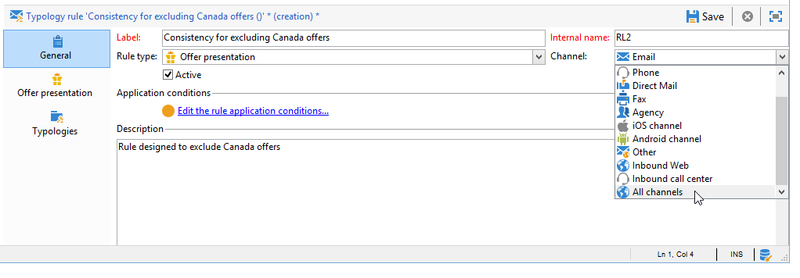

# 簡報規則{#presentation-rules}

## 建立簡報規則 {#creating-a-presentation-rule}

在我們的資料庫中，有數種歐洲、非洲、美國和加拿大的旅行優惠方案。 我們想要傳送前往加拿大之旅的優惠方案，但如果收件者拒絕此型別的優惠方案，我們便不想再次傳送給他們

我們將設定規則，每個收件者僅會提供一次加拿大行程，如果遭拒絕，則不會再次提供。

1. 在Adobe Campaign樹中，前往 **[!UICONTROL Administration]** > **[!UICONTROL Campaign management]** > **[!UICONTROL Typology management]** > **[!UICONTROL Typology rules]** 節點。
1. 建立新的 **[!UICONTROL Offer presentation]** 輸入規則。

   

1. 視需要變更其標籤和說明。

   

1. 選擇 **[!UICONTROL All channels]** 將規則擴充至所有管道的選項。

   

1. 按一下 **[!UICONTROL Edit expression]** 連結並選擇 **[!UICONTROL Category]** 節點做為運算式。

   

1. 選擇與您加拿大旅行優惠方案相符的類別，然後按一下 **[!UICONTROL OK]** 以關閉查詢視窗。

   

1. 在 **[!UICONTROL Offer presentation]** 索引標籤中，選擇與環境中設定的維度相同的維度。

   

1. 指定套用規則的期間。

   

1. 將主張限製為一個，以便已拒絕加拿大之旅的收件者不會收到另一個類似優惠。

   

1. 選取 **[!UICONTROL Offers for the same category]** 篩選以排除所有選件(從 **加拿大** 類別。

   

1. 選取 **[!UICONTROL Rejected propositions]** 篩選以僅考慮收件者拒絕的主張。

   

1. 選擇要套用此規則的收件者。

   在我們的範例中，我們將選擇 **經常出差者** 收件者。

   

1. 參考優惠方案型別中的規則。

   

1. 前往優惠方案環境(**環境 — 收件者** 在此情況下)，並參考使用下列專案中的下拉式清單建立的新型別： **[!UICONTROL Eligibility]** 標籤。

   

## 套用簡報規則 {#applying-the-presentation-rule}

以下是先前建立之型別規則的應用程式範例。

我們想要傳送屬於加拿大類別的第一個優惠方案主張。 如果任何收件者拒絕過一次優惠，將無法再次向他們提供。

1. 在 **經常出差者** 收件者資料夾，選擇其中一個設定檔以檢查其符合資格的優惠：按一下 **[!UICONTROL Propositions]** 標籤，然後 **[!UICONTROL Preview]** 標籤。

   在我們的範例中， **蒂姆·拉姆齊** 符合優惠方案的資格，該優惠方案屬於 **美洲** 類別。

   

1. 首先，建立電子郵件傳送，將目標定位為 **經常出差者** 具有優惠的收件者。
1. 選取優惠方案引擎呼叫引數。

   在我們的範例中， **美國旅遊** 已選擇類別，其中包含 **加拿大** 和 **美國** 子類別。

   

1. 在訊息內文中插入您的優惠方案並傳送傳遞。 有關詳細資訊，請參閱 [關於傳出頻道](../../interaction/using/about-outbound-channels.md).

   收件者已收到其符合資格的優惠。

1. 收件者已拒絕加拿大優惠，如主張歷程記錄所示。

   

1. 檢查他們現在符合資格的優惠方案。

   我們發現沒有選擇加拿大的優惠方案。

   
