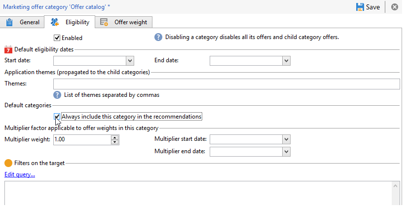

# 推薦類別{#recommending-a-category}

可能是收件者不符合所有優惠方案的資格。 為確保所有收件者都收到優惠方案主張，您可以在建議中系統地新增一或多個優惠方案類別。 與主要選件不同，這些「備用」選件必須具有低重量（但非零），因此只有在沒有高重量選件符合條件時，才會考慮這些選件。 此外，這些選件不得套用簡報規則，以確保建議一律包含這些選件。 這表示在主張期間，如果沒有高權重優惠方案可用，收件者將至少接收來自此類別的優惠方案。

若要一律在建議中納入類別，請套用下列步驟：

1. 開啟瀏覽器，然後從樹狀結構按一下優惠方案目錄。
1. 按一下&#x200B;**[!UICONTROL Eligibility]**&#x200B;標籤，並勾選&#x200B;**[!UICONTROL Always include this category in the recommendations]**&#x200B;方塊。
1. 按一下&#x200B;**[!UICONTROL Save]**&#x200B;完成並核准。

   
