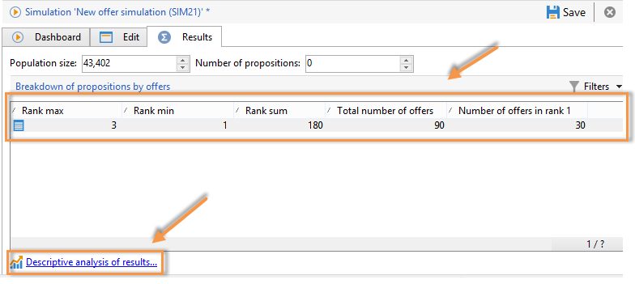

# 模擬追蹤{#simulation-tracking}

模擬完成後，您可以通過&#x200B;**[!UICONTROL Results]**&#x200B;頁簽分析其結果，該頁簽添加到模擬窗口中，並通過模擬儀表板中的&#x200B;**[!UICONTROL Breakdown of offers by rank]**&#x200B;報告進行分析。

模擬結果包含每個級別和每個接收方的命題的細分。 報表軸也會納入考量，並顯示在此標籤中。

您可以儲存這些結果，並視需要匯出，方法是建立結果的描述性分析。 要執行此操作，請在結果窗口中按一下相應的連結。

有關描述性分析嚮導的詳細資訊，請參閱[此部分](../../reporting/using/about-descriptive-analysis.md)。

樞紐表格提供每個排名之選件劃分的快速檢視。 和Adobe Campaign中的所有報表一樣，您也可以匯出、列印、封存或在網頁瀏覽器中顯示。

如需詳細資訊，請參閱[本章節](../../reporting/using/actions-on-reports.md)。

