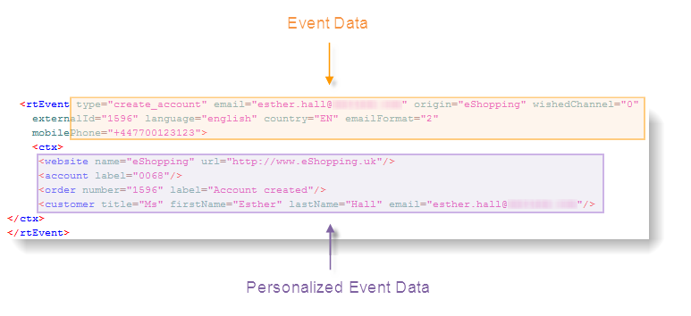

# 關於事件處理{#about-event-processing}

在交易傳訊中，事件由外部資訊系統產生，並透過和方法傳送至Adobe Campaign(請參 **[!UICONTROL PushEvent]** 閱 **[!UICONTROL PushEvents]** 事件 [說明](../../message-center/using/event-description.md))。 它包含連結至事件的資料，例如其類型（例如，在網站上訂購確認或建立帳戶）、電子郵件地址或行動電話號碼，以及可讓您在傳送前豐富並個人化交易訊息的其他資訊。 這可以是客戶聯絡資訊、訊息的語言或電子郵件格式。

事件資料範例：

要處理事務性消息傳遞事件，必須應用以下步驟：

1. 事件收集、
1. 事件傳輸到消息模板，
1. 利用個人化資料豐富事件，
1. 傳送執行、
1. 回收連結傳送失敗的事件（此步驟可透過Adobe Campaign工作流程執行）。

## 事件狀態 {#event-statuses}

「事 **件歷史記錄**」(Event history) **[!UICONTROL Message Center]** 下方的> **[!UICONTROL Event history]** ，會將所有處理過的事件分組為單一檢視。 它們可依事件類型或狀態 **分類**。 這些狀態包括：

* **待定**:這表示事件可能是：

   * 剛剛收集但尚未處理的事件。 列 **[!UICONTROL Number of errors]** 顯示值0。 電子郵件範本尚未連結。
   * 已處理但確認錯誤的事件。 該 **[!UICONTROL Number of errors]** 列顯示非0的值。 若要知道何時將再次處理此事件，請參閱 **[!UICONTROL Process requested on]** 欄。

* **待定傳送**:已處理事件，並連結傳送範本。 電子郵件正在等待傳送，且會套用傳統的傳送程式。 如需詳細資訊，您可以開啟傳送。 請參閱 [傳送](../../delivery/using/about-message-tracking.md)。
* **傳送**、忽 **略** 和傳 **送錯誤**:這些傳送狀態會透過 **updateEventsStatus工作流程來復原** 。 如需詳細資訊，您可以開啟相關的傳送。
* **未涵蓋的事件**:消息中心路由階段失敗。 例如，Adobe Campaign找不到可當成事件範本的電子郵件。
* **事件已過期**:已達到傳送嘗試次數上限。 該事件被視為null。
