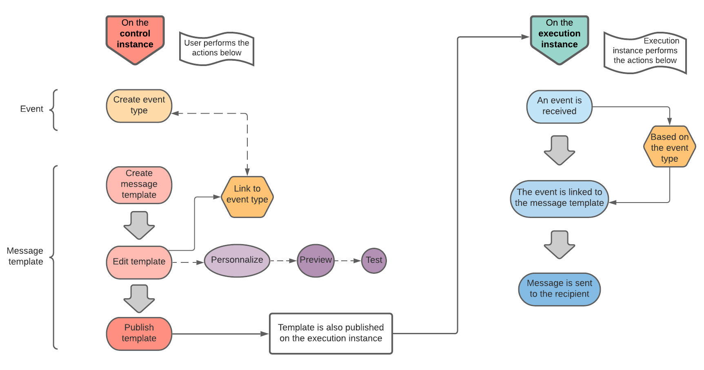

# 開始使用異動訊息 {#about-transactional-messaging}

## 概覽 {#overview}

**交易式訊息** （訊息中心）是Campaign模組，專門用於管理從外部資訊系統傳送的事件產生的自訂觸發通知。

交易式訊息是由諸如網站的提供者即時傳送的個別和唯一通訊。 此變數尤其值得期待，因為其中包含收件者要檢查或確認的重要資訊。

交易式傳訊功能旨在支援可擴充性並提供24/7服務。

* **什麼時候到？** 因為此訊息包含重要資訊，使用者預期會即時傳送。因此，觸發的事件與到達的訊息之間的延遲必須非常短。

* **為什麼這很重要？** 一般而言，交易式訊息的開放率很高。因此，應謹慎設計，因為它定義客戶關係時，可能對客戶的行為產生重大影響。

* **例如？** 這可能是建立帳戶後的歡迎訊息、訂單已出貨的確認、發票、確認密碼變更的訊息、客戶瀏覽您網站後的通知、產品無法使用通訊、帳戶對帳單等。

>[!IMPORTANT]
>
>交易式訊息需要特定授權。 請檢查您的許可協定。

<!--Before starting with transactional messaging, make sure you read the corresponding [best practices and limitations]().-->

## 交易式訊息傳遞操作原則 {#transactional-messaging-operating-principle}

Adobe Campaign交易式訊息模組整合至資訊系統，該資訊系統會傳回要變更為個人化交易式訊息的事件。 這些訊息可以個別傳送，或透過電子郵件、簡訊或推播通知分批傳送。

此功能依賴於特定架構，其中&#x200B;**執行實例**&#x200B;與&#x200B;**控制實例**&#x200B;分開。 此分發可確保更高的可用性和更好的負載管理。 有關詳細資訊，請參閱[交易式傳訊架構](../../message-center/using/transactional-messaging-architecture.md)。

>[!NOTE]
>
>若要為托管於Adobe雲端的訊息中心執行例項建立新使用者，您需要聯絡[Adobe客戶服務](https://helpx.adobe.com/tw/enterprise/admin-guide.html/enterprise/using/support-for-experience-cloud.ug.html)。 消息中心用戶是需要專用權限才能訪問&#x200B;**[!UICONTROL Real time events (nmsRtEvent)]**&#x200B;資料夾的特定操作員。

交易式訊息整體程式可說明如下：

例如，假設您是一家有網站的公司，客戶可在此購買產品。

Adobe Campaign可讓您傳送通知電子郵件給已將產品新增至購物車的客戶。 當其中一個使用者離開您的網站而未進行購買時（觸發促銷活動事件的外部事件），購物車放棄率電子郵件會自動傳送給他們（交易式訊息傳送）。

在[本節](#key-steps)中詳細說明了實施此操作的主要步驟。

>[!NOTE]
>
>Adobe Campaign會優先處理交易式訊息，而非其他傳送。

## 主要步驟 {#key-steps}

在Adobe Campaign中建立和管理個人化交易式訊息的主要步驟概述如下。

### 在控制執行個體上執行的步驟

在&#x200B;**控制實例**&#x200B;上，必須執行以下操作：

1. [建立事件類型](../../message-center/using/creating-event-types.md)。
1. [建立和設計訊息範本](../../message-center/using/creating-the-message-template.md)。在此步驟中，您必須將事件連結至訊息。
1. [測試訊息](../../message-center/using/testing-message-templates.md)。
1. [發佈訊息範本](../../message-center/using/publishing-message-templates.md)。

>[!NOTE]
>
>上述所有步驟都在&#x200B;**控制實例**&#x200B;上執行。 在控制實例上發佈模板也將在所有&#x200B;**執行實例**&#x200B;上發佈。 如需交易式訊息例項的詳細資訊，請參閱[交易式訊息架構](../../message-center/using/transactional-messaging-architecture.md)。

### 執行例項上的事件處理

在您設計並發佈交易式訊息範本後，如果觸發對應的事件，則以下主要步驟會在&#x200B;**執行例項**&#x200B;上執行：

1. 當事件由外部資訊系統產生時，相關資料會透過&#x200B;**PushEvent**&#x200B;和&#x200B;**PushEvents**&#x200B;方法傳送至Campaign。 請參閱[事件集合](../../message-center/using/about-event-processing.md#event-collection)。
1. 事件會連結至適當的訊息範本。 請參閱[路由至範本](../../message-center/using/about-event-processing.md#routing-towards-a-template)。
1. 擴充階段完成後，會傳送傳送。 請參閱[傳送執行](../../message-center/using/delivery-execution.md)。 每個目標收件者都會收到個人化訊息。

## 相關主題 {#related-topics}

* [開始使用通訊頻道](../../delivery/using/communication-channels.md)
* [傳遞建立關鍵步驟](../../delivery/using/steps-about-delivery-creation-steps.md)
* [異動訊息傳送架構](../../message-center/using/transactional-messaging-architecture.md)
* [關於異動訊息傳送報告](../../message-center/using/about-transactional-messaging-reports.md)
