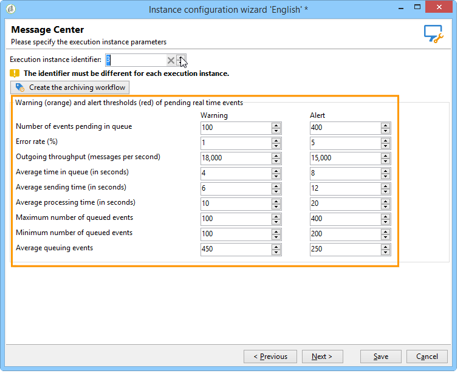

# 其他設定 {#mc-additional-configurations}


## 監視臨界值 {#monitoring-thresholds}

您可以設定在「 」中顯示的警告臨界值（橘色）和警示臨界值（紅色）。 **訊息中心服務層級** 和 **訊息中心處理時間** 報表(請參閱 [存取異動訊息傳送報告](../../message-center/using/about-transactional-messaging-reports.md))。

要執行此操作，請遵循下列步驟：

1. 在上開啟部署精靈 **執行例項**.

1. 前往 **[!UICONTROL Message Center]** 頁面。

1. 使用箭頭來變更臨界值。

   

>[!NOTE]
>
>佇列中擱置的事件數目會顯示在 [系統指標](../../production/using/monitoring-processes.md#system-indicators) Adobe Campaign程式監視頁面的區段。 有關部署精靈的詳細資訊，請參閱 [本節](../../installation/using/deploying-an-instance.md#deployment-wizard).

## 清除事件 {#purging-events}

您可以使用 [部署精靈](../../production/using/database-cleanup-workflow.md#deployment-wizard) 設定資料在資料庫中儲存的時間長度。

事件清除會由自動執行。 [資料庫清理工作流程](../../production/using/database-cleanup-workflow.md). 此工作流程會清除在執行例項上接收並儲存的事件，以及在控制例項上封存的事件。

視需要使用箭頭來變更清除設定。

控制例項上的事件清除設定：


執行例項上的事件清除設定：


如需資料庫清理工作流程的詳細資訊，請參閱 [本節](../../production/using/database-cleanup-workflow.md).


## 技術工作流程 {#technical-workflows}

在部署任何異動訊息範本之前，您必須確保控制例項上的技術工作流程以及不同的執行例項確實已建立且已啟動。

與異動訊息（訊息中心）相關的各種技術工作流程會在控制執行個體和執行執行個體之間劃分。

### 控制例項工作流程 {#control-instance-workflows}

在控制執行個體上，無論您是否註冊了一或多個執行個體，都必須為每個執行個體建立一個封存工作流程 **[!UICONTROL Message Center execution instance]** 外部帳戶。 按一下 **[!UICONTROL Create the archiving workflow]** 按鈕以建立和啟動工作流程。


接著，您就可以從以下位置存取這些工作流程： **管理>生產>訊息中心** 資料夾。 建立後，封存工作流程會自動啟動。

<!--**Minimal architecture**

Once the control and execution modules are installed on the same instance, you must create the archiving workflow using the deployment wizard. Click the **[!UICONTROL Create the archiving workflow]** button to create and start the workflow.

-->

### 執行例項工作流程 {#execution-instance-workflows}

在執行例項上，可以從存取異動訊息的技術工作流程 **管理>生產>訊息中心** 資料夾。 您只需啟動這些對話方塊。 清單中的工作流程包括：

* **[!UICONTROL Processing batch events]** (內部名稱： **[!UICONTROL batchEventsProcessing]** )：此工作流程可讓您在佇列中劃分批次事件，然後再連結至訊息範本。
* **[!UICONTROL Processing real time events]** (內部名稱： **[!UICONTROL rtEventsProcessing]** )：此工作流程可讓您在佇列中的即時事件連結至訊息範本之前，劃分這些事件。
* **[!UICONTROL Update event status]** (內部名稱： **[!UICONTROL updateEventStatus]** )：此工作流程可讓您將狀態歸因於事件。

  可使用下列事件狀態：

   * **[!UICONTROL Pending]** ：事件在佇列中。 尚未為其指派訊息範本。
   * **[!UICONTROL Pending delivery]** ：事件在佇列中，已指派訊息範本給該事件，並由傳送處理。
   * **[!UICONTROL Sent]** ：此狀態是從傳送記錄檔複製而來。 這表示傳送已進行。
   * **[!UICONTROL Ignored by the delivery]** ：此狀態是從傳送記錄檔複製而來。 這表示會由傳送忽略。
   * **[!UICONTROL Delivery failed]** ：此狀態是從傳送記錄檔複製而來。 這表示傳送失敗。
   * **[!UICONTROL Event not taken into account]** ：無法將事件連結至訊息範本。 將不會處理事件。

## 設定多品牌 {#configuring-multibranding}

本節說明如何針對Adobe Campaign中的異動訊息，為每個品牌設定追蹤和映象頁面URL的解決方案。

### 必要條件 {#prerequisites}

* 所有主機都必須新增至執行個體的設定檔(`config-<instance>.xml`)。
* 每個品牌都必須指派子網域。
* 如果在HTTPS頁面上完成網頁追蹤，則必須擁有適用於所有品牌的HTTPS憑證。

若要設定多品牌，您需要同時設定執行例項和控制例項。

### 執行實例 {#execution-instance}

在執行例項上，請遵循以下步驟：

1. 為每個品牌建立一個外部帳戶。

   >[!NOTE]
   >
   >瞭解如何在中建立執行例項型別外部帳戶 [本節](../../message-center/using/configuring-instances.md#control-instance).

1. 擴充nms：extAccount結構描述以新增追蹤URL：

   ```
   <attribute advanced="true" desc="URL of the tracking servers" label="Tracking server URL"
   length="100" name="trackingURL" type="string"/>
   ```

   >[!NOTE]
   >
   >瞭解如何在中擴充現有綱要 [擴充綱要](../../configuration/using/extending-a-schema.md) 區段。

1. 修改nms：extAccount表單：

   ```
   <container label="Message domain branding" type="frame">
        <static type="help"> These parameters are used to override the DNS alias and addresses used during message delivery. When not populated, the values of the 'NmsServer_MirrorPageUrl' and 'NmsEmail_DefaultErrorAddr' options are used.</static>
        <input xpath="@mirrorURL"/>
        <input xpath="@trackingURL"/>
        <input img="nms:sendemail.png" menuId="deliveryMenuBuilder" type="scriptEdit">
               xpath="errorAddress"/>
      </container>
   ```

1. 修改NmsTracking_OpenFormula和NmsTracking_ClickFormula選項以使用外部帳戶，而非全域選項。

   要執行此操作，請取代：

   ```
   <%@ include option='NmsTracking_ServerUrl' %>
   ```

   替換為：

   ```
   <%@ value object="provider" xpath="@trackingURL" %>
   ```

   >[!IMPORTANT]
   >
   >升級時，這些變更可能會導致衝突。 您可能需要手動將這些公式與其新版本合併。

### 控制例項 {#control-instance}

在控制執行個體上，您需要連結傳遞範本和外部帳戶。

要執行此操作，請遵循下列步驟：

1. 為每個品牌建立一個外部帳戶，其內部名稱與 [執行例項](#execution-instance) （步驟1）。

1. 為每個品牌建立一個預設傳遞範本。

   >[!NOTE]
   >
   >    瞭解如何在中建立傳遞範本 [本節](../../delivery/using/creating-a-delivery-template.md#creating-a-new-template).

1. 在傳遞範本的 **[!UICONTROL Properties]**，將路由設定至品牌的外部帳戶。
