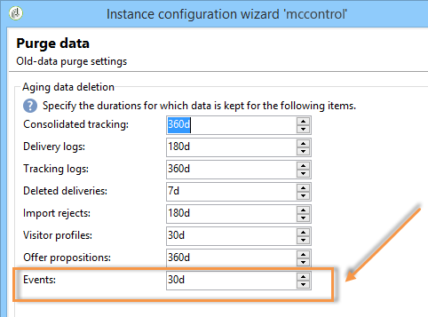

# 其他配置 {#mc-additional-configurations}

## 監視臨界值 {#monitoring-thresholds}

您可以配置&#x200B;**Message Center服務級別**&#x200B;和&#x200B;**Message Center處理時間**&#x200B;報告（請參閱[關於交易式訊息報告](../../message-center/using/about-transactional-messaging-reports.md)）中顯示的指標的警告閾值（橙色）和警告閾值（紅色）。

要執行此操作，請遵循下列步驟：

1. 在&#x200B;**執行實例**&#x200B;上開啟部署嚮導。

1. 前往&#x200B;**[!UICONTROL Message Center]**&#x200B;頁面。

1. 使用箭頭更改閾值。

   

>[!NOTE]
>
>佇列中待處理的事件數會顯示在Adobe Campaign程式監控頁面的[系統指標](../../production/using/monitoring-processes.md#system-indicators)區段中。 有關部署嚮導的詳細資訊，請參閱[此部分](../../installation/using/deploying-an-instance.md#deployment-wizard)。

## 清除事件 {#purging-events}

您可以使用[部署嚮導](../../production/using/database-cleanup-workflow.md#deployment-wizard)配置資料儲存在資料庫中的時間。

事件清除由[資料庫清除工作流](../../production/using/database-cleanup-workflow.md)自動執行。 此工作流程會清除在執行執行個體上收到和儲存的事件，以及封存在控制執行個體上的事件。

視需要使用箭頭來更改清除設定。

控制實例上的事件清除設定：


執行實例上的事件清除設定：



有關資料庫清理工作流的詳細資訊，請參閱[此部分](../../production/using/database-cleanup-workflow.md)。


## 技術工作流程 {#technical-workflows}

部署任何交易式訊息範本之前，您必須確定已建立並啟動控制執行個體和不同執行例項的技術工作流程。

與交易式訊息傳送（訊息中心）相關的各種技術工作流程會在控制執行個體和執行執行個體之間劃分。

### 控制實例工作流{#control-instance-workflows}

在控制實例上，無論您註冊了一個或多個執行實例，都必須為每個&#x200B;**[!UICONTROL Message Center execution instance]**&#x200B;外部帳戶建立一個存檔工作流。 按一下&#x200B;**[!UICONTROL Create the archiving workflow]**&#x200B;按鈕以建立並啟動工作流。


然後，您可從&#x200B;**管理>生產>訊息中心**&#x200B;資料夾存取這些工作流程。 建立後，會自動啟動封存工作流程。

<!--**Minimal architecture**

Once the control and execution modules are installed on the same instance, you must create the archiving workflow using the deployment wizard. Click the **[!UICONTROL Create the archiving workflow]** button to create and start the workflow.

-->

### 執行實例工作流{#execution-instance-workflows}

在執行實例上，可從&#x200B;**管理>生產>消息中心**&#x200B;資料夾訪問交易式消息的技術工作流。 你只需要開始。 清單中的工作流程為：

* **[!UICONTROL Processing batch events]** (內部名稱： **[!UICONTROL batchEventsProcessing]** ):此工作流程可讓您在將批次事件連結至訊息範本之前，先劃分佇列中的批次事件。
* **[!UICONTROL Processing real time events]** (內部名稱： **[!UICONTROL rtEventsProcessing]** ):此工作流程可讓您在將佇列中的即時事件連結至訊息範本之前，先加以劃分。
* **[!UICONTROL Update event status]** (內部名稱： **[!UICONTROL updateEventStatus]** ):此工作流程可讓您將狀態歸因於事件。

   可使用下列事件狀態：

   * **[!UICONTROL Pending]** :事件在佇列中。尚未為其指派訊息範本。
   * **[!UICONTROL Pending delivery]** :事件在佇列中，已指派訊息範本給該事件，並由傳送處理。
   * **[!UICONTROL Sent]** :此狀態是從傳送記錄檔複製而來。這表示已傳送傳遞。
   * **[!UICONTROL Ignored by the delivery]** :此狀態是從傳送記錄檔複製而來。這表示會由傳送忽略。
   * **[!UICONTROL Delivery failed]** :此狀態是從傳送記錄檔複製而來。這表示傳送失敗。
   * **[!UICONTROL Event not taken into account]** :無法將事件連結到消息模板。將不會處理事件。

## 設定多品牌 {#configuring-multibranding}

本節說明一個解決方案，可針對Adobe Campaign中的交易式訊息，依品牌設定追蹤和鏡像頁面URL。

### 先決條件 {#prerequisites}

* 必須將所有主機添加到實例的配置檔案(`config-<instance>.xml`)。
* 必須為每個品牌指派子網域。
* 如果已在HTTPS頁面上完成網頁追蹤，則所有品牌都必須具備HTTPS憑證。

若要設定多品牌，您需要同時設定執行例項和控制例項。

### 執行實例{#execution-instance}

在執行例項上，請遵循下列步驟：

1. 為每個品牌建立一個外部帳戶。

   >[!NOTE]
   >
   >了解如何在[Control instance](../../message-center/using/configuring-instances.md#control-instance)區段中建立執行執行個體類型外部帳戶。

1. 擴充nms:extAccount架構以新增追蹤URL:

   ```
   <attribute advanced="true" desc="URL of the tracking servers" label="Tracking server URL"
   length="100" name="trackingURL" type="string"/>
   ```

   >[!NOTE]
   >
   >在[Extending a schema](../../configuration/using/extending-a-schema.md)區段中，了解如何擴充現有架構。

1. 修改nms:extAccount表單：

   ```
   <container label="Message domain branding" type="frame">
        <static type="help"> These parameters are used to override the DNS alias and addresses used during message delivery. When not populated, the values of the 'NmsServer_MirrorPageUrl' and 'NmsEmail_DefaultErrorAddr' options are used.</static>
        <input xpath="@mirrorURL"/>
        <input xpath="@trackingURL"/>
        <input img="nms:sendemail.png" menuId="deliveryMenuBuilder" type="scriptEdit">
               xpath="errorAddress"/>
      </container>
   ```

1. 修改NmsTracking_OpenFormul和NmsTracking_ClickFormula選項以使用外部帳戶而非全域選項。

   若要這麼做，請取代：

   ```
   <%@ include option='NmsTracking_ServerUrl' %>
   ```

   包含：

   ```
   <%@ value object="provider" xpath="@trackingURL" %>
   ```

   >[!IMPORTANT]
   >
   >這些變更在升級時可能會導致衝突。 您可能需要手動將這些公式與其新版本合併。

### 控制實例{#control-instance}

在控制執行個體上，您需要連結傳遞範本和外部帳戶。

要執行此操作，請遵循下列步驟：

1. 以與[執行例項](#execution-instance)中定義的相同內部名稱，為每個品牌建立一個外部帳戶（步驟1）。

1. 為每個品牌建立一個預設傳送範本。

   >[!NOTE]
   >
   >    了解如何在[本區段](../../delivery/using/creating-a-delivery-template.md#creating-a-new-template)中建立傳遞範本。

1. 在傳遞範本的&#x200B;**[!UICONTROL Properties]**&#x200B;中，設定品牌外部帳戶的路由。
