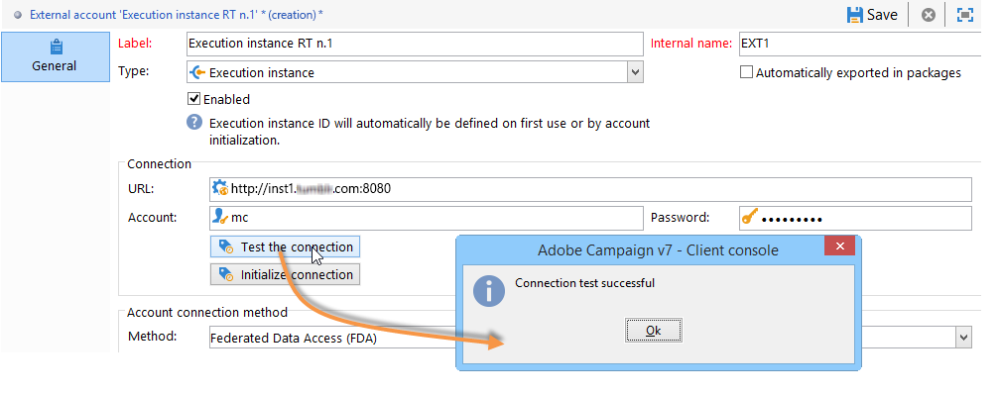
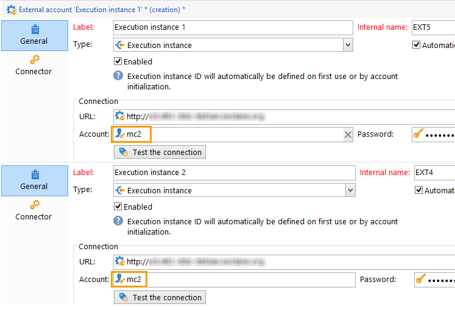
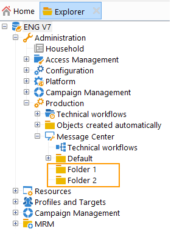

# 設定執行個體 {#creating-a-shared-connection}

若要使用異動訊息傳送功能，您需要設定控制和執行例項。 您可以使用下列其中一項：
* [一個控制例項](#control-instance) 與一或多個執行例項相關聯
* [數個控制例項](#using-several-control-instances) 與多個執行例項相關聯

>[!IMPORTANT]
>
>結構描述擴充功能影響了使用的資源 [訊息中心技術工作流程](../../message-center/using/additional-configurations.md#technical-workflows) 控制或執行例項上的執行個體需要複製在異動訊息模組使用的其他例項上。

您也需要指定執行例項並將其連線到控制例項。

本節將說明設定及連線控制項及執行例項所需的所有步驟。

>[!IMPORTANT]
>
>控制執行個體和執行執行個體必須安裝在不同的電腦上。 他們無法共用相同的Campaign執行個體。

## 設定控制例項 {#control-instance}

若要連線控制例項和執行例項，您首先需要建立和設定 **[!UICONTROL Execution instance]** 輸入外部帳戶 **在控制例項上**. 因此，一次 [已發佈](../../message-center/using/publishing-message-templates.md#template-publication)，異動訊息範本可部署至執行例項。

如果您使用數個執行例項，則必須建立與執行例項數量相同的外部帳戶。

>[!NOTE]
>
>當多個控制例項使用執行例項時，資料可以依資料夾和運運算元分割。 如需詳細資訊，請參閱 [使用數個控制例項](#using-several-control-instances).

### 建立外部帳戶

>[!NOTE]
>
>必須執行下列步驟 **在控制例項上**.

若要建立 **[!UICONTROL Execution instance]** 輸入外部帳戶，套用下列內容：

1. 前往 **[!UICONTROL Administration > Platform > External accounts]** 資料夾。
1. 選取其中一個隨Adobe Campaign提供的現成執行例項型別外部帳戶，按一下滑鼠右鍵並選擇 **[!UICONTROL Duplicate]** .

   

1. 根據您的需求變更標籤。

   

1. 選取 **[!UICONTROL Enabled]** 讓外部帳戶運作的選項。

   

1. 指定安裝執行例項的伺服器位址。

   

1. 帳戶必須符合Message Center Agent （如operator資料夾中所定義）。 依預設，Adobe Campaign提供的現成可用帳戶為 **[!UICONTROL mc]** .

   

1. 輸入運運算元資料夾中定義的帳戶密碼。

   >[!NOTE]
   >
   >若要避免每次登入執行個體時都輸入密碼，您可以在執行個體中指定控制執行個體的IP位址。 如需詳細資訊，請參閱 [設定執行例項](#execution-instance).

1. 指定執行例項要使用的復原方法。 要復原的資料會由執行例項轉送至控制例項，以新增至交易式訊息和事件封存。

   

   資料收集會透過使用HTTP/HTTPS存取的Web服務或同盟資料存取(FDA)模組進行。

   >[!NOTE]
   >
   >請注意，使用FDA over HTTP時，僅支援使用PostgreSQL資料庫的執行例項。 不支援MSSQL或Oracle資料庫。

   如果控制執行個體可直接存取執行個體的資料庫，則建議使用第二個方法(FDA)。 如果沒有，請選擇Web服務存取。 要指定的FDA帳戶與控制執行個體上建立之各種執行執行個體的資料庫連線一致。

   

   如需同盟資料存取(FDA)的詳細資訊，請參閱 [本節](../../installation/using/about-fda.md).

1. 按一下 **[!UICONTROL Test the connection]** 以確保控制例項和執行例項已連結。

   

使用多個執行例項時，重複這些步驟可建立與執行例項數量相同的外部帳戶。

### 識別執行個體 {#identifying-execution-instances}

每個執行例項都必須與唯一識別碼相關聯，以區分在控制例項上檢視每個執行例項時的歷史記錄。

此識別碼可歸因於每個執行例項 **手動**. 在此情況下，必須執行此步驟 **在每個執行例項上**. 要執行此操作，請使用部署精靈，如下所述：

1. 在執行例項上開啟部署精靈。
1. 前往 **[!UICONTROL Message Center]** 視窗。
1. 將您選擇的識別碼指派給執行個體。

   

1. 對每個執行例項重複上述步驟。

識別碼也可以 **自動** 已歸因。 若要這麼做，請前往 **控制例項**，然後按一下 **[!UICONTROL Initialize connection]** 按鈕。

## 設定執行例項 {#execution-instance}

>[!NOTE]
>
>必須執行下列步驟 **在執行例項上**.

若要將執行例項連線到控制例項，請遵循以下步驟。

若要讓控制執行個體能夠連線到執行個體而不需要提供密碼，只需在中輸入控制執行個體的IP位址 **訊息中心** 存取許可權區段。 不過，預設會禁止使用空白密碼。

若要使用空白密碼，請前往執行例項並定義一個安全區域，該安全區域僅限於傳送事件的資訊系統的IP位址。 此安全區域必須允許空白密碼並接受 `<identifier> / <password>` 輸入連線。 如需詳細資訊，請參閱[本章節](../../installation/using/security-zones.md)。

>[!NOTE]
>
>當多個控制例項使用執行例項時，資料可以依資料夾和運運算元分割。 如需詳細資訊，請參閱 [使用數個控制例項](#using-several-control-instances).

1. 在執行例項上，前往運運算元資料夾( **[!UICONTROL Administration > Access management > Operators]** )。
1. 選取 **訊息中心** 代理程式。

   

1. 選取 **[!UICONTROL Edit]** 標籤，按一下 **[!UICONTROL Access rights]** ，然後按一下 **[!UICONTROL Edit the access parameters...]** 連結。

   

1. 在 **[!UICONTROL Access settings]** 視窗，按一下 **[!UICONTROL Add a trusted IP mask]** 連結並新增控制例項的IP位址。

   

使用數個執行例項時，請對每個執行例項重複這些步驟。

## 使用數個控制例項 {#using-several-control-instances}

您可以與各種控制執行個體共用執行叢集。 此型別的架構需要下列設定。

例如，假設您的公司管理兩個品牌，每個品牌都有自己的控制例項： **控制項1** 和 **控制項2**. 也會使用兩個執行例項。 您必須為每個控制執行處理輸入不同的「訊息中心」運運算元： **mc1** 的運運算元 **控制項1** 執行個體和 **mc2** 的運運算元 **控制項2** 執行個體。

在所有執行例項的樹狀結構中，為每個運運算元建立一個資料夾(**資料夾1** 和 **資料夾2**)，並限制每個操作員的資料存取權至其資料夾。

### 設定控制例項 {#configuring-control-instances}

>[!NOTE]
>
>必須執行下列步驟 **在控制項執行個體上**.

1. 於 **控制項1** 控制執行個體、為每個執行執行個體建立一個外部帳戶，然後輸入 **mc1** 運運算元。 此 **mc1** 之後，將在所有執行例項上建立運運算元(請參閱 [設定執行例項](#configuring-execution-instances))。

   

1. 於 **控制項2** 控制執行個體、為每個執行執行個體建立一個外部帳戶，然後輸入 **mc2** 運運算元。 此 **mc2** 之後，將在所有執行例項上建立運運算元(請參閱 [設定執行例項](#configuring-execution-instances))。

   

   >[!NOTE]
   >
   >如需設定控制例項的詳細資訊，請參閱 [本節](#control-instance).

### 設定執行例項 {#configuring-execution-instances}

>[!NOTE]
>
>必須執行下列步驟 **在執行例項上**.

若要使用數個控制例項，必須在所有執行例項上執行此設定。

1. 在中為每個運運算元建立一個資料夾 **[!UICONTROL Administration > Production > Message Center]** 節點： **資料夾1** 和 **資料夾2**. 有關建立資料夾和檢視的詳細資訊，請參閱 [此頁面](../../platform/using/access-management-folders.md).

   

1. 建立 **mc1** 和 **mc2** 運運算元，方法是複製預設提供的「訊息中心」運運算元(**mc**)。 有關建立運運算元的詳細資訊，請參閱 [本節](../../platform/using/access-management-operators.md).

   

   >[!NOTE]
   >
   >**mc1** 和 **mc2** 運運算元必須具有 **[!UICONTROL Message Center execution]** 許可權，且無法存取Adobe Campaign使用者端主控台。 運運算元必須一律連結至安全性區域。 如需詳細資訊，請參閱[本章節](../../installation/using/security-zones.md)。

1. 對於每個運運算元，核取 **[!UICONTROL Restrict to information found in sub-folders of]** 方塊中，並選取相關的資料夾(**資料夾1** 的 **mc1** 運運算元和 **資料夾2** 的 **mc2** 運運算元)。

   

1. 授予每個操作員對其資料夾的讀取和寫入許可權。 要執行此操作，請以滑鼠右鍵按一下資料夾並選取 **[!UICONTROL Properties]** . 然後選取 **[!UICONTROL Security]** 標籤並新增相關運運算元(**mc1** 的 **資料夾1** 和 **mc2** 的 **資料夾2**)。 請確定 **[!UICONTROL Read/Write data]** 核取方塊。

   
