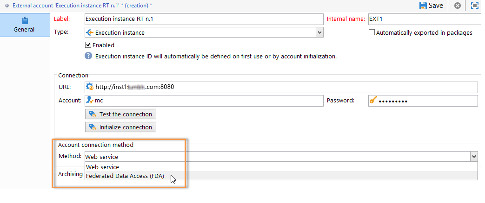

# 建立共用連接{#creating-a-shared-connection}

>[!CAUTION]
>
>* 在 [Message Center技術工作流程中](../../message-center/using/technical-workflows.md) ，在控制或執行例項上對架構所做的架構擴充，必須複製到Adobe Campaign事務性訊息模組所使用的其他例項上。
>* 控制實例和執行實例必須安裝在不同的電腦上。 他們無法共用相同的促銷活動例項。
>

## 控制例項 {#control-instance}

如果您有劃分的架構，則需要指定連結至控制例項的執行例項，並加以連接。 事務性消息模板被部署到執行實例。 通過配置類型外部帳戶，可建立控制實例與執行實例 **[!UICONTROL Execution instance]** 之間的連接。 您需要建立與執行例項數量相同的外部帳戶。

>[!NOTE]
>
>當多個控制例項使用執行例項時，資料可依資料夾和運算子來劃分。 有關詳細資訊，請參閱使 [用多個控制實例](#using-several-control-instances)。

要建立執行實例類型外部帳戶，請應用以下步驟：

1. 前往資料 **[!UICONTROL Administration > Platform > External accounts]** 夾。
1. 選取Adobe Campaign隨附的執行例項類型之一的預設外部帳戶，按一下滑鼠右鍵並選擇 **[!UICONTROL Duplicate]** 。

   

1. 根據您的需求變更標籤。

   

1. 選擇使 **[!UICONTROL Enabled]** 外部帳戶運行的選項。

   

1. 指定安裝執行實例的伺服器的地址。

   

1. 帳戶必須與「消息中心代理」匹配，如操作員資料夾中所定義。 依預設，Adobe Campaign提供的現成可用帳戶是 **[!UICONTROL mc]** 。

   

1. 輸入在操作員資料夾中定義的帳戶密碼。

   >[!NOTE]
   >
   >為避免在每次登錄實例時輸入口令，您可以指定執行實例中控制實例的IP地址。 For more on this, refer to [Execution instance](#execution-instance).

1. 指定執行實例要使用的恢複方法。

   要恢復的資料由執行實例轉發到控制實例，以添加到事務消息和事件存檔。

   

   資料收集是透過使用HTTP/HTTPS存取的Web服務，或透過Federated Data Access(FDA)模組進行。

   >[!NOTE]
   >
   >請注意，在使用FDA over HTTP時，僅支援使用Postgres資料庫的執行例項。 不支援MSSQL或Oracle資料庫。

   如果控制實例可以直接訪問執行實例的資料庫，則建議使用第二種方法。 否則，請選擇Web服務訪問。 要指定的FDA帳戶與與在控制實例上建立的各種執行實例的資料庫的連接一致。

   

   有關Federated Data Access(FDA)的詳細資訊，請參閱 [訪問外部資料庫](../../platform/using/about-fda.md)。

1. 單 **[!UICONTROL Test the connection]** 擊以確保控制實例和執行實例已連結。

   

1. 每個執行例項都必須與識別碼相關聯。 此標識符可以手動分配給每個執行實例，方法是使用部署嚮導(請參閱 [Identifing execution instances](../../message-center/using/identifying-execution-instances.md))，也可以通過按一下控制實例中的 **Initialize connection** （初始化連接）按鈕自動分配。

   

## 執行例項 {#execution-instance}

為了使控制實例能夠連接到執行實例而不需要提供口令，只需在消息中心訪問權限部分中輸入控制實例的 **** IP地址即可。 但是，空密碼預設為禁止。

要使用空口令，請轉至執行實例並定義一個安全區，該安全區限制為發送事件的資訊系統的IP地址。 此安全區必須允許空密碼並接受類 `<identifier> / <password>` 型連接。 如需詳細資訊，請參閱[本小節](../../installation/using/configuring-campaign-server.md#defining-security-zones)。

>[!NOTE]
>
>當多個控制例項使用執行例項時，資料可依資料夾和運算子來劃分。 有關詳細資訊，請參閱使 [用多個控制實例](#using-several-control-instances)。

1. 轉至執行實例( **[!UICONTROL Administration > Access management > Operators]** )中的運算子資料夾。
1. 選擇「 **消息中心** 」代理。

   

1. 選取標 **[!UICONTROL Edit]** 簽，按一 **[!UICONTROL Access rights]** 下，然後按一下連 **[!UICONTROL Edit the access parameters...]** 結。

   

1. 在窗口 **[!UICONTROL Access settings]** 中，按一下鏈 **[!UICONTROL Add a trusted IP mask]** 接並添加控制實例的IP地址。

   

## 使用數個控制例項 {#using-several-control-instances}

您可以與各種控制實例共用執行群集。 此類型的體系結構需要以下配置。

例如，如果您的公司管理兩個品牌，每個品牌都有其自己的控制例項：控 **制1** 和 **控制2**。 還使用兩個執行例項。 您需要為每個控制實例輸入不同的消息中心運算子：Control **1實例的** mc運算子和Control 2實例的 **mc2** 運 ******** 算子。

在所有執行例項的樹狀結構中，為每個運算元建立一個資料夾(**資料夾1** 和 **資料夾2**)，並限制每個運算元對資料夾的資料存取。

### 配置控制實例 {#configuring-control-instances}

1. 在 **Control 1** 控制實例中，為每個執行實例建立一個外部帳戶，並在每個外部帳戶中輸入 **mc1** 運算子。 之後 **將在所有執行例項上建立** mc1運算子(請參 [閱配置執行例項](#configuring-execution-instances))。

   

1. 在 **Control 2控制實例** ，為每個執行實例建立一個外部帳戶，並在每個外部帳戶中輸入 **mc2** 運算子。 之後 **將在所有執行例項上建立** mc2運算子(請參 [閱配置執行例項](#configuring-execution-instances))。

   

   >[!NOTE]
   >
   >有關配置控制實例的詳細資訊，請參閱 [Control實例](#control-instance)。

### 配置執行實例 {#configuring-execution-instances}

要使用多個控制實例，必須對ALL執行實例執行此配置。

1. 在節點中為每個運算子建立一個 **[!UICONTROL Administration > Production > Message Center]** 資料夾：文 **件夾1** 和 **資料夾2**。 有關建立資料夾和視圖的詳細資訊，請參閱 [平台](../../platform/using/access-management.md#folders-and-views)。

   

1. 複製預 **設(** mc **)提供的Message Center運算子，以建立** mc1和&#x200B;**** mc2運算子。 For more on creating operators, refer to [this section](../../platform/using/access-management.md#operators).

   

   >[!NOTE]
   >
   >**mc1** 和 **mc2** 運算子必須擁有 **[!UICONTROL Message Center execution]** 權限，且無法存取Adobe Campaign用戶端主控台。 操作員必須始終與安全區域連結。 如需詳細資訊，請參閱[本小節](../../installation/using/configuring-campaign-server.md#defining-security-zones)。

1. 對於每個運算子，請 **[!UICONTROL Restrict to information found in sub-folders of]** 選中該框，並選擇相關資料夾(**mc1** 運算子的資料夾1 **和Mc2運算子的** Folder 2 ******** )。

   

1. 為每個操作員授予其資料夾的讀寫權限。 若要這麼做，請在資料夾上按一下滑鼠右鍵，然後選取 **[!UICONTROL Properties]** 。 然後，選擇並添加相 **[!UICONTROL Security]** 關運算子(**mc1** for **Folder 1** 和mc2 **for****** Alder 2)。 請確定已勾 **[!UICONTROL Read/Write data]** 選方塊。

   

