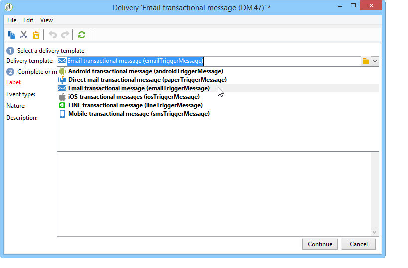

# 設計事務性消息模板 {#creating-the-message-template}

要確保每個事件都可以更改為個性化郵件，您需要建立一個郵件模板以匹配每個事件類型。

>[!IMPORTANT]
>
>事件類型需要預先建立。 有關此內容的詳細資訊，請參閱 [建立事件類型](../../message-center/using/creating-event-types.md)。

事務性消息模板包含用於個性化事務性消息的必要資訊。 您還可以使用模板test消息預覽，並在傳送到最終目標之前使用種子地址發送校樣。 有關此的詳細資訊，請參閱 [Test事務性消息模板](../../message-center/using/testing-message-templates.md)。

## 建立訊息範本 {#creating-message-template}

1. 轉到 **[!UICONTROL Message Center >Transactional message templates]** 資料夾。

1. 在事務性消息模板清單中，按一下右鍵並選擇 **[!UICONTROL New]** 或按一下 **[!UICONTROL New]** 按鈕。

   

1. 在交貨窗口中，選擇適合要使用的渠道的交貨模板。

   

1. 如有必要，請更改其標籤。

1. 選擇與您要發送的消息匹配的事件類型。

   

   事件類型需要事先在控制台中建立。 有關此內容的詳細資訊，請參閱 [建立事件類型](../../message-center/using/creating-event-types.md)。

   >[!IMPORTANT]
   >
   >事件類型不能連結到多個模板。

1. 輸入屬性和說明，然後按一下 **[!UICONTROL Continue]** 建立消息正文(請參閱 [建立郵件內容](#creating-message-content))。

   

## 建立郵件內容 {#creating-message-content}

事務性消息內容的定義與Adobe Campaign定期遞送的定義相同。 例如，對於電子郵件傳遞，您可以以HTML或文本格式建立內容、添加附件或個性化傳遞對象。 有關詳細資訊，請參閱 [電子郵件傳遞](../../delivery/using/about-email-channel.md) 一章。

>[!IMPORTANT]
>
>郵件中包含的影像必須可以公開訪問。 Adobe Campaign沒有為事務性消息提供任何映像上載機制。\
>與JSSP或WebApp不同， `<%=` 沒有任何預設轉義符。
>
>在這種情況下，您必須正確地從事件中轉出每個資料。 此轉義取決於此欄位的使用方式。 例如，在URL中，請使用encodeURIComponent。 要在HTML中顯示，可以使用escapeXMLString。

定義消息內容後，可以將事件資訊整合到消息正文中並對其進行個性化設定。 由於個性化標籤，事件資訊被插入文本正文中。

* 所有個性化欄位都來自負載。
* 在事務性消息中可以引用一個或多個個性化塊。 塊內容將在發佈到執行實例期間添加到傳遞內容。

要將個性化標籤插入電子郵件的正文中，請應用以下步驟：

1. 在消息模板中，按一下與電子郵件格式(HTML或文本)匹配的頁籤。

1. 輸入消息的正文。

1. 在文本正文中，使用 **[!UICONTROL Real time events > Event XML]** 的子菜單。

   

1. 使用以下語法填充標籤： **元素名稱**。@**屬性名稱** 如下所示。

   

1. 保存您的內容。

您的郵件現在已準備好 [測試](../../message-center/using/testing-message-templates.md)。
