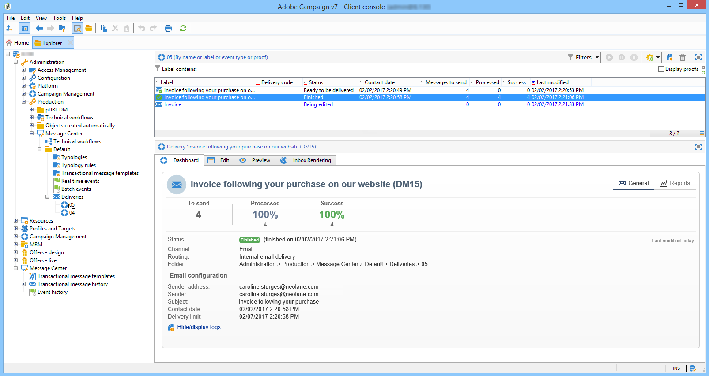

# 傳遞執行 {#delivery-execution}

## 交易式訊息傳送 {#transactional-message-send}

在執行例項上，一旦擴充階段完成且傳送範本已連結至事件，便會傳送傳送。

>[!NOTE]
>
>MTA會優先處理交易式訊息，而非其他傳送。

所有傳送都會分組在&#x200B;**[!UICONTROL Administration > Production > Message Center > Default > Deliveries]**&#x200B;資料夾中。

依預設，會依傳送月份排序為子資料夾。 在訊息範本屬性中可以變更此排序，如下所示。

>[!NOTE]
>
>對於托管或混合安裝，如果您已升級至[Enhanced MTA](../../delivery/using/sending-with-enhanced-mta.md)，則所有交易式訊息也可以與Adobe Campaign Enhanced MTA一併傳送，以改善傳遞能力、吞吐量和退信處理。 所有影響與標準行銷訊息的影響相同。

## 交易式訊息監控 {#transactional-message-monitoring}

若要監控交易式訊息，請檢查[傳送記錄](../../delivery/using/delivery-dashboard.md#delivery-logs-and-history)。

從執行執行個體傳送的交易式傳送會透過每小時執行的技術工作流程(**[!UICONTROL Message Center execution instance]**)同步回控制執行個體。

>[!NOTE]
>
>每週傳送會根據最新事件更新累積事件，而非根據事件建立日期。 因此，從控制例項擷取交易式訊息傳送記錄時，與每個傳送記錄ID相關聯的傳送ID可能會隨著記錄更新而隨時間變更（例如，當收到事件的入站退信時）。

<!--The transactional deliveries sent from the execution instance are synchronized back to the control instance as follows.

Let's take a [delivery template](../../message-center/using/introduction.md) labelled *Template_1*.

1. An event corresponding to *Template_1* is received on the execution instance.
1. The **Processing real time events** (rtEventsProcessing) workflow processes the event and searches for an existing delivery for the current month.

    >[!NOTE]
    >
    >If not found, a new delivery is created and the event is assigned to the new delivery.

1. The transactional email is sent and the delivery status changes to **[!UICONTROL Sent]**.
1. The **Message Center execution instance** (mcSync_mcExec) workflow retrieves the delivery logs from the execution instance and updates the delivery logs on the control instance.
1. The control instance searches for an existing delivery for week 40 (2020-09-28_Template_1).

    >[!NOTE]
    >
    >If not found, a new delivery is created.

1. The week after, an inbound bounce is received for the event.
1. The status of the event changes to **[!UICONTROL Delivery failed]**.
1. The **Message Center execution instance** (mcSync_mcExec) workflow retrieves the delivery logs from the execution instance and searches for a delivery for week 41 (2020-10-05_Template_1) to update the delivery logs. The delivery logs are then linked to a new delivery for the current week.

To summarize, the deliveries weekly accumulate the events based on the latest event update, and not on the event creation date.

Therefore, when extracting transactional messaging delivery logs from the control instance, the delivery ID associated with each delivery log ID changes every week.-->

若要監控執行例項的活動和執行，請參閱[交易式訊息報表](../../message-center/using/about-transactional-messaging-reports.md)。
