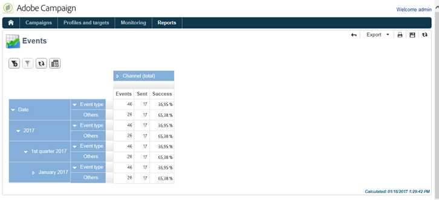

# 訊息中心事件歷史記錄{#history-of-message-center-events}

**[!UICONTROL History of Message Center events]**&#x200B;報表提供訊息中心活動的概覽，也就是以交易式訊息處理及傳遞的事件數。

開啟報告時，預設顯示的資訊與成功傳送異動訊息的速率一致。 若要檢視更多層級，您可以開啟各種節點，並將游標放在適當的層級上加以選取。

您可以檢視每個時段每個事件型別的特定資料。 **[!UICONTROL Events]**&#x200B;欄對應於每個控制項執行個體收到的事件數。 轉換至個人化交易式訊息的事件數目會在&#x200B;**[!UICONTROL Sent]**&#x200B;欄中詳細說明。

**[!UICONTROL History of Message Center events]**&#x200B;報表是樞紐分析表型別報表。 如需詳細資訊，請參閱[分析母體](../../reporting/using/about-descriptive-analysis.md)區段。
