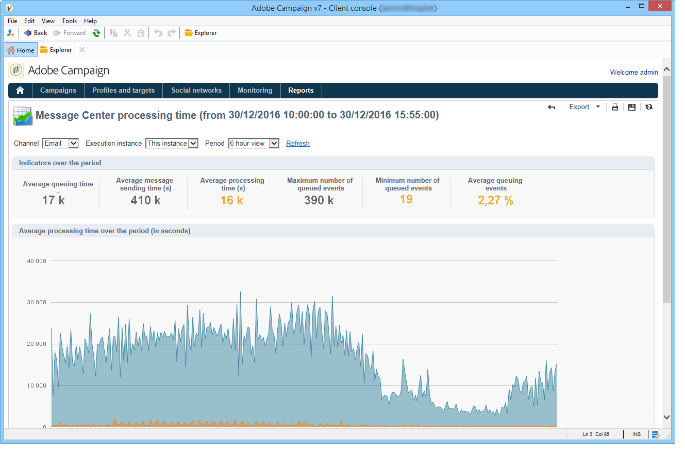

# 消息中心處理時間{#message-center-processing-time}

此報告會顯示與即時佇列相關的主要指標。 此報告針對技術管理員，也可透過控制例項中 **[!UICONTROL Monitoring]** 的宇宙存取。

與報表一樣，您 **[!UICONTROL Message Center service level]** 可以選擇顯示整體統計資料或與特定執行例項相關的統計資料。 您也可以依頻道及特定時段來篩選資料。 區段中顯示的指 **[!UICONTROL Indicators over the period]** 標會在選取的期間內計算：

* **[!UICONTROL Average queuing time]** :成功處理事件在「訊息中心」中逗留的平均時間。 只考慮處理時間。
* **[!UICONTROL Average message sending time (s)]** :成功處理事件在「訊息中心」中逗留的平均時間。 只會考量到mta傳送時間。
* **[!UICONTROL Average processing time (s)]** :成功處理事件在「訊息中心」中逗留的平均時間。 計算會考慮處理時間和mta傳送時間。
* **[!UICONTROL Maximum number of queued events]** :消息中心隊列中任意給定時刻存在的最大事件數。
* **[!UICONTROL Minimum number of queued events]** :消息中心隊列中任意給定時刻存在的最小事件數。
* **[!UICONTROL Average number of queued events]** :消息中心隊列中任意給定時刻的事件平均數。

>[!NOTE]
>
>警告（橘色）和警告（紅色）指標臨界值可在Adobe Campaign部署精靈中設定。 請參閱監 [控閾值](../../message-center/using/monitoring-thresholds.md)。

