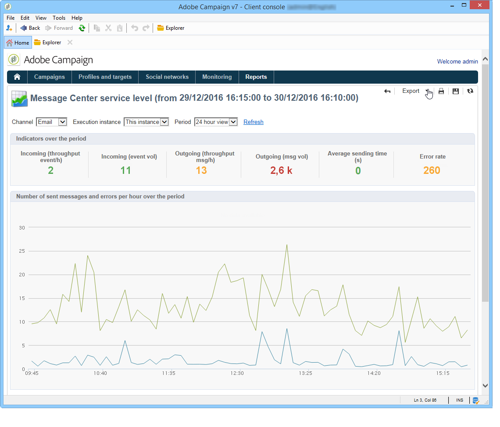

# 訊息中心服務層級 {#message-center-service-level}

此報表顯示與交易式訊息相關的傳送統計資料以及錯誤劃分。 您可以按一下錯誤類型以顯示其詳細資訊。

此報告針對技術管理員，也可透過控制執行個體的&#x200B;**[!UICONTROL Monitoring]**&#x200B;標籤來存取。

在此報告中，您可以選擇顯示整體統計資料或與特定執行例項相關的統計資料。 您也可以依管道和特定期間來篩選資料。

**[!UICONTROL Indicators over the period]**&#x200B;區段中顯示的指標會在選取的期間內計算：

* **[!UICONTROL Incoming (throughput event/h)]** :在「訊息中心」佇列中輸入的每小時事件平均數。
* **[!UICONTROL Incoming (event vol)]** :在「消息中心」隊列中輸入的事件數。
* **[!UICONTROL Outgoing (throughput msg/h)]** :成功傳出訊息中心事件（由傳送傳送）的平均每小時數。
* **[!UICONTROL Outgoing (msg vol)]** :成功傳出訊息中心事件的數量（由傳送傳送）。
* **[!UICONTROL Average sending time (seconds)]** :訊息中心中成功處理事件的平均逗留時間。計算會考量處理時間和mta傳送時間。
* **[!UICONTROL Error rate]** :與已進入「消息中心」隊列的事件數相比，存在錯誤的事件數。會考量下列錯誤：路由錯誤、過期事件（佇列中的事件過長）、傳送錯誤，由傳送忽略（隔離等）。

>[!NOTE]
>
>可在部署嚮導中配置警告（橙色）和警報（紅色）指示器閾值。 請參閱[監視閾值](../../message-center/using/additional-configurations.md#monitoring-thresholds)。
