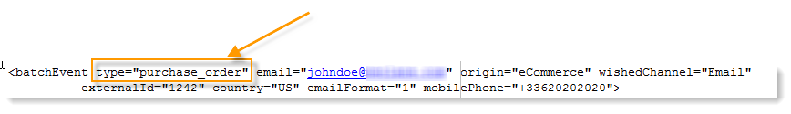

# 路由至模板{#routing-towards-a-template}

一旦消息模板發佈到執行實例上，將自動生成兩個要連結到即時或批處理事件的模板。 路由選擇步驟包括將事件連結到相應的消息模板。 連結是根據事件本身屬性和範本屬性中指定的事件類型。

事件屬性中事件類型的定義：

消息模板屬性中事件類型的定義：

預設情況下，工藝路線基於以下資訊：

* 事件類型
* 要使用的渠道(預設為：電子郵件)
* 最近的傳送範本，根據發佈日期
