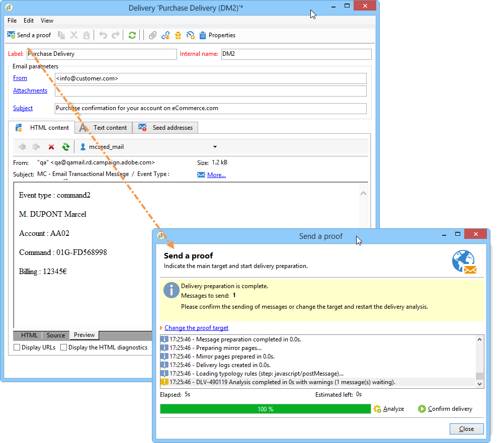
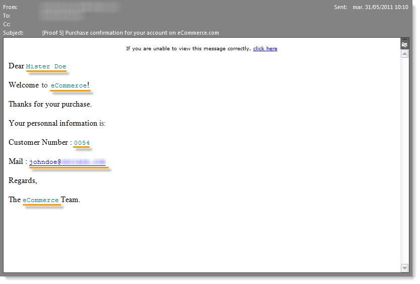

# 測試交易式訊息範本 {#testing-message-templates}

在[訊息範本](../../message-center/using/creating-the-message-template.md)準備就緒後，請依照下列步驟預覽並測試。

## 管理異動訊息中的種子地址 {#managing-seed-addresses-in-transactional-messages}

種子地址可讓您在電子郵件或簡訊傳送前顯示訊息的預覽、傳送校樣，以及測試訊息個人化。 種子地址連結至傳送，無法用於其他傳送。

若要在交易式訊息中建立種子地址，請遵循下列步驟：

1. 在交易式訊息範本中，按一下&#x200B;**[!UICONTROL Seed addresses]**&#x200B;標籤。

   

1. 為其指派標籤，以便日後輕鬆選取。

   

1. 輸入種子地址（根據通信通道，可以是電子郵件地址或行動電話地址）。

   

1. 輸入外部標識符：此選用欄位可讓您輸入商業金鑰（唯一ID、名稱+電子郵件等） 網站上所有應用程式都通用的識別碼，用於識別您的設定檔。 如果此欄位也存在於Adobe Campaign行銷資料庫中，您就可以使用資料庫中的設定檔調解事件。

   

1. 插入測試資料（請參閱[個人化資料](#personalization-data)）。

   

   <!--## Creating several seed addresses {#creating-several-seed-addresses}-->
1. 按一下&#x200B;**[!UICONTROL Add other seed addresses]**&#x200B;連結，然後按一下&#x200B;**[!UICONTROL Add]**&#x200B;按鈕。

   

   <!--1. Follow the configuration steps for a seed address detailed in the [Creating a seed address](#creating-a-seed-address) section.-->
1. 重複此過程以建立所需的地址數。

   

建立地址後，您就可以顯示其預覽和個人化。 請參閱[交易式訊息預覽](#transactional-message-preview)。

## 個人化資料 {#personalization-data}

您可以在訊息範本中使用資料來測試交易式訊息個人化。 此功能可用來產生預覽或傳送校樣。 您也可以顯示各種網際網路存取提供者所呈現的訊息。 有關詳細資訊，請參閱[收件箱呈現](../../delivery/using/inbox-rendering.md)。

此資料的用途是在訊息最終傳送前先測試訊息。 這些訊息與要處理的實際資料不符。 但是，XML結構必須與儲存在執行實例中的事件結構相同，如下所示：

此資訊可讓您使用個人化標籤來個人化訊息內容（如需詳細資訊，請參閱[建立訊息內容](../../message-center/using/creating-the-message-template.md#creating-message-content)）。

1. 選取交易式訊息範本。

1. 在範本中，按一下&#x200B;**[!UICONTROL Seed addresses]**&#x200B;標籤。

1. 在事件內容中，以XML格式輸入測試資訊。

   

1. 按一下&#x200B;**[!UICONTROL Save]**。

## 異動訊息預覽 {#transactional-message-preview}

建立一或多個種子地址和訊息內文後，您可以預覽訊息並檢查其個人化。

1. 在訊息範本中，按一下&#x200B;**[!UICONTROL Preview]**&#x200B;標籤。

   

1. 在下拉式清單中選取&#x200B;**[!UICONTROL A seed address]**。

   

1. 選取先前建立的種子地址以顯示個人化訊息。

   

使用種子地址，您還可以顯示各種Internet訪問提供程式的消息呈現。 有關詳細資訊，請參閱[收件箱呈現](../../delivery/using/inbox-rendering.md)。

## 傳送證明 {#sending-a-proof}

您可以傳送校樣至先前建立的種子地址，以測試訊息傳送。

傳送校樣與[一般傳送](../../delivery/using/steps-validating-the-delivery.md#sending-a-proof)的程式相同。 但是，使用交易式訊息時，您需要預先執行下列操作：

* 使用[個人化資料](#personalization-data)建立一或多個[種子地址](#managing-seed-addresses-in-transactional-messages)。
* [建立訊息內容](../../message-center/using/creating-the-message-template.md#creating-message-content)。

若要傳送校樣：

1. 按一下傳送視窗中的&#x200B;**[!UICONTROL Send a proof]**&#x200B;按鈕。
1. 分析傳送。
1. 更正任何錯誤並確認傳送。

   

1. 檢查訊息是否已傳送至種子地址，且其內容是否符合您的設定。

   

可透過&#x200B;**[!UICONTROL Audit]**&#x200B;標籤存取每個範本中的校樣。 如需詳細資訊，請參閱[傳送校樣](../../delivery/using/steps-validating-the-delivery.md#sending-a-proof)。

您的訊息範本現在已準備好成為[已發佈](../../message-center/using/publishing-message-templates.md)。