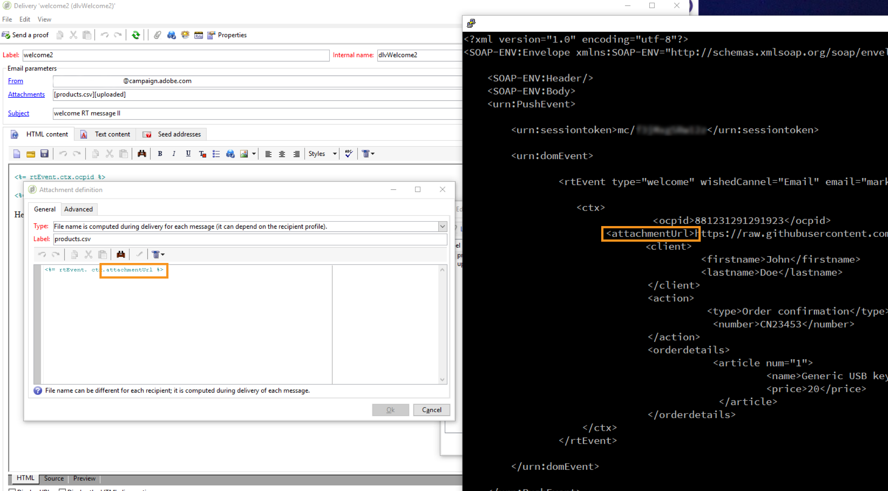

# 用例：發送帶有附件的事務性電子郵件 {#transactional-email-with-attachments}


此使用案例的目的是將電子郵件附件即時添加到出站派單。

## 主要步驟 {#key-steps}

在此方案中，您將學習如何發送帶有單個和/或個性化附件的事務性電子郵件。 不會在事務性消息伺服器上預上載附件：而是在飛行中產生。

在捕獲客戶交互或詳細資訊時，您可能需要在流程結束時將此資訊發回給客戶，例如在附加到電子郵件的PDF檔案中。

以下是此方案的主要步驟：

1. 客戶進入網站，查找他們要購買的產品。
1. 客戶選擇產品並定制一些選項。
1. 客戶完成交易。
1. 向客戶發送確認該交易的電子郵件。 由於不建議在電子郵件中發送PII（個人身份資訊），因此將生成安全PDF並附加到電子郵件中。
1. 客戶接收包含相關資料的電子郵件及其附件。

在此方案中，附件不是預先建立的，而是即時添加到出站電子郵件中，這提供了以下好處：

* 這允許您個性化附件的內容。
* 如果附件與事務關聯（如上面所述示例方案中所述），則附件可能包含在客戶流程期間生成的動態資料。
* 附加PDF檔案可優化安全性，因為您可以加密這些檔案並通過HTTPS發送。

>[!NOTE]
>
>為避免效能問題，如果您將從個性化URL動態下載的影像作為附件，則預設情況下每個影像大小不應超過100,000位元組。 此建議的閾值可從 [Campaign Classic選項清單](../../installation/using/configuring-campaign-options.md#delivery)。

## 建議 {#important-notes}

在實施此方案之前，請仔細閱讀以下准則：

* 事務性消息傳遞實例不應用於儲存、導出或上載檔案或資料。 它們只能用於事件資料和相關資訊。 不應將它們視為檔案儲存系統。
* 由於沒有直接訪問事務性消息實例或Adobe外的伺服器，因此沒有將這些檔案推送到這些伺服器的標準方法（沒有FTP訪問）。
* 使用事務性消息傳遞實例上的磁碟空間儲存任何類型的檔案（甚至是附件）在合同中是不正確的。
* 您需要使用其他聯機磁碟系統來承載這些檔案。 您需要對此系統進行FTP訪問，並且必須能夠寫入和刪除檔案。

>[!NOTE]
>
>為避免效能問題，建議每封電子郵件不要包含多個附件。 建議的閾值可從 [Campaign Classic選項清單](../../installation/using/configuring-campaign-options.md#delivery)。

## 實施 {#implementation}

下圖顯示了實施此方案時的不同步驟：


要即時將電子郵件附件添加到事務性消息，請執行以下步驟：

1. 首先設計附件。 如需詳細資訊，請參閱[本節](../../delivery/using/attaching-files.md#attach-a-personalized-file)。

   這允許您將檔案附加到電子郵件中，即使這些檔案不在執行實例上托管。

1. 您可以通過SOAP消息觸發器發送電子郵件。 在SOAP調用中，存在URL參數(attachmentURL)。

   有關SOAP請求的詳細資訊，請參見 [事件描述](../../message-center/using/event-description.md)。

1. 設計電子郵件時，按一下 **[!UICONTROL Attachment]**。

1. 在 **[!UICONTROL Attachment definition]** 螢幕中，輸入SOAP附件參數：

   ```
   <%= rtEvent.ctx.attachmentUrl %>
   ```

1. 處理消息後，系統將從遠程位置（第三方伺服器）獲取該檔案並將其附加到單個消息。

   由於此參數可以是變數，因此它應接受通過SOAP調用發送的檔案的完全格式的遠程URL變數。

   
