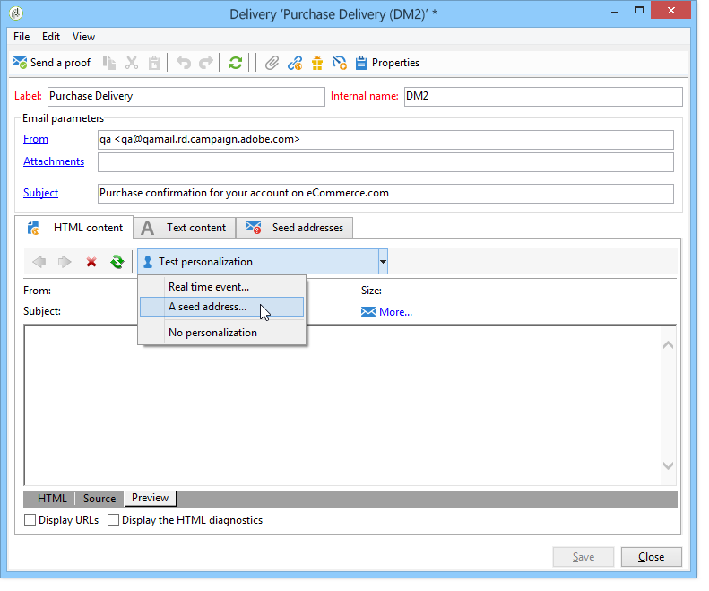

# 交易式訊息預覽{#transactional-message-preview}

在您建立一或多個種子位址和訊息內文後，您就可以預覽訊息並檢查其個人化。

1. 在訊息範本中，按一下標 **[!UICONTROL Preview]** 簽。

   

1. Select **[!UICONTROL A seed address]** in the drop-down list.

   

1. 選擇先前建立的種子地址以顯示個人化訊息。

   
