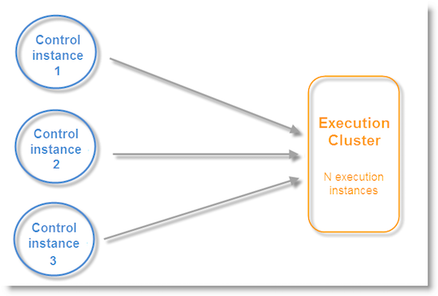

# 異動傳訊架構 {#transactional-messaging-architecture}

交易式訊息需仰賴由數個執行個體組成的特定架構：

* 建立消息模板的&#x200B;**控制實例**。

* 一個或多個&#x200B;**執行實例**，用於接收事件並傳送消息。


| 控制實例 | 執行實例 |
|--- |--- |
| Adobe Campaign使用者登入控制例項以： <ul><li>建立交易式訊息範本</li><li>使用種子清單生成消息預覽</li><li>顯示報表</li><li>監視執行實例</li></ul> | 執行例項的功能如下： <ul><li>接收事件</li><li>將它們連結至交易式訊息範本</li><li>傳送個人化訊息給每個收件者</li></ul> |

## 安裝實例{#installing-instances}

安裝交易式訊息套件時，需採取數項預防措施。 Adobe建議您先在測試環境中工作，再投入生產。 您也需要有相容的Adobe Campaign授權。 如需詳細資訊，請連絡您的Adobe帳戶主管。

>[!IMPORTANT]
>
>控制實例和執行實例必須安裝在不同的電腦上。 他們無法共用相同的Campaign執行個體。

如果您需要使用多個通道，則必須先安裝並配置相關包，然後才能安裝交易式消息包。 如需詳細資訊，請參閱[新增傳送通道](#adding-a-delivery-channel)。

## 控制實例{#control-instance}

要在電腦上安裝控制實例，請通過&#x200B;**[!UICONTROL Tools]** > **[!UICONTROL Advanced]** > **[!UICONTROL Import package]**&#x200B;菜單選擇&#x200B;**[!UICONTROL Transactional message control]**&#x200B;包。 有關詳細資訊，請參閱[安裝Campaign Classic標準包](../../installation/using/installing-campaign-standard-packages.md)。


配置控制實例的詳細步驟在[本節](../../message-center/using/configuring-instances.md#control-instance)中介紹。

### 支援多個控制實例{#supporting-several-control-instances}

>[!IMPORTANT]
>
>只有內部部署環境才支援與數個控制執行個體共用執行叢集。

可以在多個控制實例之間共用執行群集。 例如，如果您管理多個專門商店，則可以為每個品牌配置一個控制實例並將它們全部連結到相同的執行群集。



>[!NOTE]
>
>有關必要配置的詳細資訊，請參閱[使用多個控制實例](../../message-center/using/configuring-instances.md#using-several-control-instances)。

## 執行實例{#execution-instance}

要在電腦上安裝執行實例，請通過&#x200B;**[!UICONTROL Tools]** > **[!UICONTROL Advanced]** > **[!UICONTROL Import package]**&#x200B;菜單選擇&#x200B;**[!UICONTROL Transactional message execution]**&#x200B;包。 有關詳細資訊，請參閱[安裝Campaign Classic標準包](../../installation/using/installing-campaign-standard-packages.md)。


配置執行實例的詳細步驟在[本節](../../message-center/using/configuring-instances.md#execution-instance)中介紹。

## 可用的傳送通道

電子郵件通道預設可用。 若要在多個通道上傳送交易式訊息，您可以新增其他通道（行動通道、行動應用程式通道等）。

>[!IMPORTANT]
>
>新增傳送通道（行動裝置通道、行動應用程式通道等） 必須先執行，才能安裝交易式訊息套件。

### 新增傳送通道{#adding-a-delivery-channel}

Adobe建議您在安裝交易式訊息套件&#x200B;**之前，一律新增傳送通道套件。**

不過，如果您已在電子郵件通道上啟動交易式訊息專案，然後在專案期間決定要新增通道，您可以遵循下列步驟。

>[!NOTE]
>
>此過程僅適用於使用安裝在與其工作在同一台電腦上的Windows NLServer的客戶。

1. 使用套件匯入精靈(**[!UICONTROL Tools > Advanced > Import package... > Adobe Campaign Package]**)安裝您需要的通道，例如&#x200B;**行動通道**。
1. 執行檔案導入(**[!UICONTROL Tools > Advanced > Import package... > File]**)，並選擇&#x200B;**datakitnms **`[Your language]`**packagemessageCenter.xml**&#x200B;檔案。
1. 在&#x200B;**[!UICONTROL XML content of the data to import]**&#x200B;中，僅保留與新增通道對應的傳送範本。 例如，如果您已新增&#x200B;**行動頻道**，請僅保留與&#x200B;**[!UICONTROL Mobile transactional message]**(smsTriggerMessage)相對應的&#x200B;**實體**&#x200B;元素。 如果您已新增&#x200B;**行動應用程式頻道**，請僅保留&#x200B;**iOS交易式訊息**(iosTriggerMessage)和&#x200B;**Android交易式訊息**(androidTriggerMessage)。

   

<!--## Transactional messages and inbound Interaction {#transactional-messages-and-inbound-interaction}

When combined with the Inbound Interaction module, transactional messaging enables you to insert a marketing offer dedicated to the recipient into the message.

>[!NOTE]
>
>The Interaction module is detailed in [Interaction](../../interaction/using/interaction-and-offer-management.md).

To use transactional messaging with Interaction, you need to apply the following configurations:

* Install the **Interaction** package onto the control instance and configure your offer catalog.

  >[!IMPORTANT]
  >
  >Do not replicate the offers onto the execution instances.

* The event must include an identifier linked to the recipients, for personalizing offers. The **@externalId** attribute must contain the value of this identifier. **Interaction** is configured by default to identify the recipient of the primary key:

  ```
  <rtEvent type="order_confirmation" email="john.doe@adobe.com" externalId="1242"> 
  ```

  You can configure **Interaction** so that identification takes place in the field of your choice, for example on the email address:

  ```
  <rtEvent type="order_confirmation" email="john.doe@adobe.com" externalId="john.doe@yahoo.com"> 
  ```

Create your delivery templates the way you would for an email campaign:

* Add the offer to your transactional message template.
* Check the preview, send a proof and publish the template.

You also have to enable the unitary mode on your offer spaces. For more on this, refer to [this section](../../interaction/using/creating-offer-spaces.md).-->

### 異動推播通知 {#transactional-messaging-and-push-notifications}

與行動應用程式通道模組結合時，交易式訊息可讓您透過行動裝置上的通知推送交易式訊息。

>[!NOTE]
>
>行動應用程式通道在[此區段](../../delivery/using/about-mobile-app-channel.md)中有詳細說明。

若要搭配行動應用程式頻道使用交易式訊息模組，您必須套用下列設定：

1. 將&#x200B;**行動應用程式頻道**&#x200B;套件安裝至控制項和執行個體。
1. 復寫&#x200B;**行動應用程式**&#x200B;類型Adobe Campaign服務，以及其在執行執行個體上包含的行動應用程式。

事件必須包含下列元素：

* 行動裝置ID（Android適用的&#x200B;**registrationId**,iOS適用的&#x200B;**deviceToken**）。 此ID代表通知將傳送至的「位址」。
* 行動應用程式的連結或整合索引鍵(**uuid**)，可讓您復原應用程式的特定連線資訊。
* 將向其發送通知的通道(**wishedChannel**):iOS為41個，Android為42個
* 所有對個人化有用的資料

以下是包含此資訊的事件範例：

```
<SOAP-ENV:Envelope xmlns:xsd="http://www.w3.org/2001/XMLSchema" xmlns:xsi="http://www.w3.org/2001/XMLSchema-instance" xmlns:SOAP-ENV="http://schemas.xmlsoap.org/soap/envelope/">
   <SOAP-ENV:Body>
     <urn:PushEvent>
         <urn:sessiontoken>mc/</urn:sessiontoken>
         <urn:domEvent>

              <rtEvent wishedChannel="41" type="DELIVERY" registrationToken="2cefnefzef758398493srefzefkzq483974">
                <mobileApp _operation=”none” uuid="com.adobe.NeoMiles"/>
                <ctx>
                    <deliveryTime>1:30 PM</deliveryTime>
                    <url>http://www.adobe.com</url>
                </ctx>
              </rtEvent>

         </urn:domEvent>
     </urn:PushEvent>           
   </SOAP-ENV:Body>
</SOAP-ENV:Envelope>
```

>[!NOTE]
>
>訊息範本的建立仍維持不變。

### 交易式訊息和LINE {#transactional-messaging-and-line}

交易式訊息與LINE頻道結合，可讓您在安裝在消費者行動裝置中的LINE應用程式上傳送即時訊息。 這可用來在LINE使用者新增品牌頁面時傳送歡迎訊息。

若要搭配LINE使用交易式訊息模組，您的&#x200B;**marketing**&#x200B;例項和&#x200B;**execution**&#x200B;例項上的設定需要下列元素：

* 在兩個執行個體上安裝&#x200B;**[!UICONTROL LINE Connect]**&#x200B;套件。
* 在您的行銷執行個體上安裝&#x200B;**[!UICONTROL Transactional message control]**&#x200B;套件，並在執行執行個體上安裝&#x200B;**[!UICONTROL Transactional message execution]**&#x200B;套件。
* 在兩個執行個體上建立LINE **外部帳戶**&#x200B;和&#x200B;**服務**，且命名相同，以便同步這些執行個體。 有關如何建立LINE外部帳戶和服務的詳細資訊，請參閱此[page](../../delivery/using/line-channel.md#creating-a-line-account-and-an-external-account-)。

然後，從&#x200B;**[!UICONTROL Explorer]** ，在&#x200B;**[!UICONTROL Platform]** > **[!UICONTROL External account]**&#x200B;中，您需要在這兩個執行個體上設定不同的外部帳戶：

1. 使用以下配置在您的&#x200B;**execution**&#x200B;實例中建立&#x200B;**[!UICONTROL External database]**&#x200B;外部帳戶：

   

   * **[!UICONTROL Label]** 和 **[!UICONTROL Internal name]** :視需要為外部帳戶命名。
   * **[!UICONTROL Type]** :選取「  **[!UICONTROL External database]** 」 。
   * **[!UICONTROL Enabled]** 框。

   從&#x200B;**[!UICONTROL Connection]**&#x200B;類別：

   * **[!UICONTROL Type]** :選擇資料庫伺服器，例如PostgresSQL。
   * **[!UICONTROL Server]** :輸入資料庫伺服器URL。
   * **[!UICONTROL Account]** :輸入資料庫帳戶。

      >[!NOTE]
      >
      >資料庫使用者必須具備下清單格的讀取權限，才能進行FDA連線：XtkOption、NmsVisitor、NmsVisitorSub、NmsService、NmsBroadLogRtEvent、NmsBroadLogBatchEvent、NmsTrackingLogRtEvent、NmsTrackingLogBatchEvent、NmsRtEvent、NmsBatchEvent、NmsBroadLogNmsTracking、MsgWebDelivery檔案夾。

   * **[!UICONTROL Password]** :輸入資料庫帳戶的密碼。
   * **[!UICONTROL Database]** :輸入執行實例的資料庫名稱。
   * **[!UICONTROL Target of an HTTP relay to remote database's account]** 框。


1. 使用下列設定，在您的&#x200B;**marketing**&#x200B;例項中建立&#x200B;**[!UICONTROL External Database]**&#x200B;帳戶。

   

   * **[!UICONTROL Label]** 和 **[!UICONTROL Internal name]** :視需要為外部帳戶命名。
   * **[!UICONTROL Type]** :選取「  **[!UICONTROL External database]** 」 。
   * 必須勾選「啟用」方塊。

   從&#x200B;**[!UICONTROL Connection]**&#x200B;類別：

   * **[!UICONTROL Type]** :選取「  **[!UICONTROL HTTP relay to remote Database]** 」 。
   * **[!UICONTROL Server]** :輸入執行例項的促銷活動伺服器URL。
   * **[!UICONTROL Account]** :輸入用於訪問執行實例的帳戶。
   * **[!UICONTROL Password]** :輸入用於訪問執行實例的帳戶的密碼。
   * **[!UICONTROL Data Source]** :輸入下列語 **[!UICONTROL nms:extAccount:ID of your external database account in the execution instance]** 法。


1. 使用下列設定，在您的&#x200B;**marketing**&#x200B;例項中建立&#x200B;**[!UICONTROL Execution instance]**&#x200B;外部帳戶，以建立資料同步工作流程：

   

   * **[!UICONTROL Label]** 和 **[!UICONTROL Internal name]** :視需要為外部帳戶命名。
   * **[!UICONTROL Type]** :選取「  **[!UICONTROL Execution instance]** 」 。
   * 必須勾選「啟用」方塊。

   從&#x200B;**[!UICONTROL Connection]**&#x200B;類別：

   * **[!UICONTROL URL]** :輸入執行實例的URL。
   * **[!UICONTROL Account]** :輸入用於訪問執行實例的帳戶。
   * **[!UICONTROL Password]** :輸入用於訪問執行實例的帳戶的密碼。

   從&#x200B;**[!UICONTROL Account connection method]**&#x200B;類別：

   * **[!UICONTROL Method]** :選取「  **[!UICONTROL Federated Data Access (FDA)]** 」 。
   * **[!UICONTROL FDA account]** :從下拉式清單中選取您的FDA帳戶。
   * 按一下 **[!UICONTROL Create the archiving workflow]** 按鈕。
   * 按一下&#x200B;**[!UICONTROL Create data synchronization workflow]**&#x200B;按鈕以建立LINE資料同步工作流。


1. 您現在可以開始建立交易式訊息。 如需關於此項目的詳細資訊，請參閱此[頁面](../../message-center/using/creating-the-message-template.md)。
