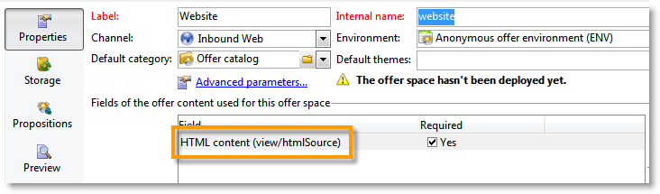

# 一般設定{#general-configurations}


本節詳細說明從v5.11或v6.02遷移時，在Adobe Campaign v7中執行的設定。

此外：

* 如果您從v5.11移轉，您也必須完成[本節](../../migration/using/configuring-your-platform.md#specific-configurations-in-v5-11)中詳述的組態。
* 如果您從v6.02移轉，您也必須完成[本節](../../migration/using/configuring-your-platform.md#specific-configurations-in-v6-02)中詳述的組態。

## 時區 {#time-zones}

### 多時區模式 {#multi-time-zone-mode}

在v6.02中，「多時區」模式僅適用於PostgreSQL資料庫引擎。 現在不論使用何種資料庫引擎，都提供此功能。 我們強烈建議您轉換基準為「多時區」基準。

若要使用TIMESTAMP WITH TIMEZONE模式，您還需要將&#x200B;**-userTimestamptz：1**&#x200B;選項新增到升級後命令列。

>[!IMPORTANT]
>
>如果&#x200B;**-usetimestamptz：1**&#x200B;引數搭配不相容的資料庫引擎使用，您的資料庫將會損毀，您必須還原資料庫的備份，然後重新執行上述命令。

>[!NOTE]
>
>可透過主控台（**[!UICONTROL Administration > Platform > Options > WdbcTimeZone]**&#x200B;節點）在移轉後變更時區。
>
>如需時區管理的詳細資訊，請參閱[本節](../../installation/using/time-zone-management.md)。

### Oracle {#oracle}

如果在升級後發生&#x200B;**ORA 01805**&#x200B;錯誤，表示應用程式伺服器和資料庫伺服器之間的Oracle時區檔案不同步。 若要重新同步這些檔案，請套用下列步驟：

1. 若要識別使用的時區檔案，請執行以下命令：

   ```
   select * from v$timezone_file
   ```

   時區檔案通常可在&#x200B;**ORACLE_HOME/oracore/zoneinfo/**&#x200B;資料夾中找到。

1. 確定兩個伺服器上的時區檔案相同。

如需詳細資訊，請造訪： [https://docs.oracle.com/cd/E11882_01/server.112/e10729/ch4datetime.htm#NLSPG004](https://docs.oracle.com/cd/E11882_01/server.112/e10729/ch4datetime.htm#NLSPG004)。

使用者端與伺服器之間的時區不符也可能會造成一些延遲。 這就是為什麼我們建議在使用者端和伺服器端使用相同版本的Oracle庫，兩個時區必須相同。

若要檢查兩側是否位於相同的時區：

1. 執行下列命令，檢查使用者端的時區檔案版本：

   ```
   genezi -v
   ```

   genezi是在&#x200B;**$ORACLE_HOME/bin**&#x200B;存放庫中找到的二進位檔案。

1. 執行下列命令，檢查伺服器端的時區檔案版本：

   ```
   select * from v$timezone_file
   ```

1. 若要變更使用者端的時區檔案，請使用&#x200B;**ORA_TZFILE**&#x200B;環境變數。

## 安全性 {#security}

### 安全性區域 {#security-zones}

>[!IMPORTANT]
>
>基於安全性理由，Adobe Campaign平台在預設情況下無法再存取：您必須設定安全性區域，因此請收集操作員IP位址。

Adobe Campaign v7涉及&#x200B;**安全性區域**&#x200B;的概念。 每個使用者都必須與區域相關聯，才能登入執行個體，而且使用者的IP位址必須包含在安全性區域中定義的位址或位址範圍內。 您可以在Adobe Campaign伺服器設定檔案中設定安全性區域。 必須在主控台(**[!UICONTROL Administration > Access management > Operators]**)中定義使用者關聯的安全性區域。

**在移轉之前**，請要求您的網路系統管理員協助您定義要在移轉之後啟用的安全性區域。

**在升級後** （在伺服器重新啟動之前），您必須設定安全性區域。

在[此區段](../../installation/using/security-zones.md)中找到安全性區域組態。

### 使用者密碼 {#user-passwords}

在v7中，**內部**&#x200B;和&#x200B;**管理員**&#x200B;操作員連線必須以密碼保護。 強烈建議在移轉前&#x200B;**指派密碼給這些帳戶及所有操作員帳戶**。 如果您尚未指定&#x200B;**內部**&#x200B;的密碼，將無法連線。 若要指派密碼給&#x200B;**內部**，請輸入下列命令：

```
nlserver config -internalpassword
```

>[!IMPORTANT]
>
>所有追蹤伺服器的&#x200B;**內部**&#x200B;密碼必須相同。 如需詳細資訊，請參閱[本節](../../installation/using/configuring-campaign-server.md#internal-identifier)和[本節](../../platform/using/access-management.md)。

### v7中的新功能 {#new-features-in-v7}

* 沒有許可權的使用者無法再連線至Adobe Campaign。 必須手動新增其許可權，例如，建立名為&#x200B;**connect**&#x200B;的許可權。

  在升級後期間，會識別並列出受此修改影響的使用者。

* 如果密碼為空，追蹤就不再有效。 如果是這種情況，錯誤訊息會通知您並要求您重新配置。
* 使用者密碼不再儲存在&#x200B;**xtk：sessionInfo**&#x200B;結構描述中。
* 使用&#x200B;**`xtk:builder:EvaluateJavaScript`**&#x200B;和&#x200B;**`xtk:builder:EvaluateJavaScriptTemplate`**&#x200B;函式現在需要管理許可權。

某些現成可用的結構描述已修改，且現在預設僅可透過具有&#x200B;**管理員**&#x200B;許可權之操作員的寫入存取權來存取：

* ncm：publishing
* nl：monitoring
* nms：calendar
* xtk：builder
* xtk：連線
* xtk：dbInit
* xtk：entityBackupNew
* xtk：entityBackupOriginal
* xtk：entityOriginal
* xtk：form
* xtk：funcList
* xtk：fusion
* xtk：image
* xtk：javascript
* xtk：jssp
* xtk：jst
* xtk：navtree
* xtk：operatorGroup
* xtk：package
* xtk：queryDef
* xtk：resourceMenu
* xtk：rights
* xtk：schema
* xtk：scriptContext
* xtk：specFile
* xtk：sql
* xtk：sqlSchema
* xtk：srcSchema
* xtk：strings
* xtk：xslt

### Sessiontoken引數 {#sessiontoken-parameter}

在v5中，**sessiontoken**&#x200B;引數可在兩個使用者端（概觀型別熒幕、連結編輯器等清單）上運作 和伺服器端（網頁應用程式、報表、jsp、jssp等）。 在v7中，它僅適用於伺服器端。 如果要恢復到v5上的完整功能，您必須使用此引數修改連結，並透過連線頁面傳遞：

連結範例：

```
/view/recipientOverview?__sessiontoken=<trusted login>
```

使用連線頁面的新連結：

```
/nl/jsp/logon.jsp?login=<trusted login>&action=submit&target=/view/recipientOverview
```

>[!IMPORTANT]
>
>如果您使用連結至信任IP遮罩的運運算元，請檢查它是否具有最低許可權，以及它是否在&#x200B;**sessionTokenOnly**&#x200B;模式的安全區域中。

### SQL函式 {#sql-functions}

不明的SQL函式呼叫不再自然傳送到伺服器。 目前，所有SQL函式都必須新增至&#x200B;**xtk：funcList**&#x200B;結構描述（如需詳細資訊，請參閱[本節](../../configuration/using/adding-additional-sql-functions.md)）。 移轉時，會在升級後期間新增一個選項，可讓您維持與舊未宣告SQL函式的相容性。 如果要繼續使用這些函式，請檢查是否確實在&#x200B;**[!UICONTROL Administration > Platform > Options]**&#x200B;節點層級定義了&#x200B;**XtkPassUnknownSQLFunctionsToRDBMS**&#x200B;選項。

>[!IMPORTANT]
>
>由於此選項會帶來安全性風險，因此強烈建議不要使用此選項。

### JSSP {#jssp}

如果您想要透過HTTP通訊協定（而非HTTPS）授權存取某些頁面，例如在您的Web應用程式中，無論在安全性區域中執行的設定為何，您都必須在對應的轉送規則中指定&#x200B;**httpAllowed=&quot;true&quot;**&#x200B;引數。

如果您使用匿名JSSP，則必須在JSSP （**[!UICONTROL serverConf.xml]**&#x200B;檔案）的轉送規則中新增&#x200B;**httpAllowed=&quot;true&quot;**&#x200B;引數：

例如：

```
<url IPMask="" deny="" hostMask="" httpAllowed="true" relayHost="true" relayPath="true"
           status="blacklist" targetUrl="https://localhost:8080" timeout="" urlPath="*/cus/myPublicPage.jssp"/>
```

## 語法 {#syntax}

### JavaScript {#javascript}

Adobe Campaign v7整合了更新的JavaScript解譯器。 不過，此更新可能會導致某些指令碼無法正常運作。 由於之前的引擎比較寬鬆，某些語法將不再適用於新版本的引擎。

**[!UICONTROL myObject.@attribute]**&#x200B;語法現在只對XML物件有效。 此語法可用於個人化傳送和內容管理。 如果您在非XML物件上使用此型別的語法，個人化功能將無法再運作。

對於所有其他物件型別，語法現在是&#x200B;**[!UICONTROL myObject`[`&quot;attribute&quot;`]`]**。 例如，使用下列語法的非XML物件： **[!UICONTROL employee.@sn]**，現在必須使用下列語法： **[!UICONTROL employee`[`&quot;sn&quot;`]`]**。

* 先前的語法：

  ```
  employee.@sn
  ```

* 新語法：

  ```
  employee["sn"]
  ```

若要變更XML物件中的值，您現在需要在新增XML節點之前先更新值：

* 舊的JavaScript程式碼：

  ```
  var cellStyle = node.style.copy();
  this.styles.appendChild(cellStyle);
  cellStyle.@width = column.@width;
  ```

* 新的JavaScript程式碼：

  ```
  var cellStyle = node.style.copy();
  cellStyle.@width = column.@width;
  this.styles.appendChild(cellStyle);
  ```

您無法再使用XML屬性做為資料表索引鍵。

* 先前的語法：

  ```
  if(serverForm.activities[ctx.activityHistory.activity[0].@name].type !="end")
  ```

* 新語法：

  ```
  if(serverForm.activities[String(ctx.activityHistory.activity[0].@name)].type !="end"
  ```

### SQLData {#sqldata}

為了增強執行個體安全性，Adobe Campaign v7中引入了新語法，以取代基於SQLData的語法。 如果您將這些程式碼元素與此語法搭配使用，則必須加以修改。 相關的主要元素包括：

* 依子查詢篩選：新語法是以定義子查詢的`<subQuery>`元素為基礎
* 彙總：新語法為「彙總函式（集合）」
* 依加入篩選：新語法為`[schemaName:alias:xPath]`

queryDef (xtk：queryDef)結構描述已修改：

* 有新的`<subQuery>`元素可用來取代SQLData中包含的SELECT
* @setOperator屬性引進了兩個新值「IN」和「NOT IN」
* 新的`<where>`元素，它是`<node>`元素的子項：這可讓您在SELECT中進行「子選取」

使用「@expr」屬性時，可能會出現SQLData。 可以搜尋下列詞語：「SQLData」、「aliasSqlTable」、「sql」。

Adobe Campaign v7例項預設為安全狀態。 安全性是根據&#x200B;**[!UICONTROL serverConf.xml]**&#x200B;檔案中安全性區域的定義所提供： **allowSQLInjection**&#x200B;屬性管理SQL語法安全性。

如果升級後執行期間發生SQLData錯誤，您必須修改此屬性以暫時允許使用以SQLData為基礎的語法，讓您重新寫入程式碼。 若要這麼做，必須在&#x200B;**serverConf.xml**&#x200B;檔案中變更下列選項：

```
allowSQLInjection="true"
```

因此，請使用以下命令重新啟動升級後：

```
nlserver config -postupgrade -instance:<instance_name> -force
```

您必須設定安全性區域（請參閱[安全性](#security)），然後變更選項以重新啟動安全性：

```
allowSQLInjection="false"
```

下方提供新舊語法的比較範例。

**依子查詢篩選**

* 先前的語法：

  ```
  <condition expr="@id NOT IN ([SQLDATA[SELECT iOperatorId FROM XtkOperatorGroup WHERE iGroupId = $(../@owner-id)]])" enabledIf="$(/ignored/@ownerType)=1"/>
  ```

* 新語法：

  ```
  <condition setOperator="NOT IN" expr="@id" enabledIf="$(/ignored/@ownerType)=1">
    <subQuery schema="xtk:operatorGroup">
       <select>
         <node expr="[@operator-id]" />
       </select>
       <where>
         <condition expr="[@group-id]=$long(../@owner-id)"/>
       </where>
     </subQuery>
  </condition>
  ```

* 先前的語法：

  ```
  <queryFilter name="dupEmail" label="Emails duplicated in the folder" schema="nms:recipient">
      <where>
        <condition sql="sEmail in (select sEmail from nmsRecipient where iFolderId=$(folderId) group by sEmail having count(sEmail)>1)" internalId="1"/>
      </where>
      <folder _operation="none" name="nmsSegment"/>
    </queryFilter>
  ```

* 新語法：

  ```
  <queryFilter name="dupEmail" label=" Emails duplicated in the folder " schema="nms:recipient">
      <where>
        <condition expr="@email" setOperator="IN" internalId="1">
          <subQuery schema="nms:recipient">
            <select><node expr="@email"/></select>
            <where><condition expr="[@folder-id]=$(folderId)"/></where>
            <groupBy><node expr="@email"/></groupBy>
            <having><condition expr="count(@email)>1"/></having>
          </subQuery>
        </condition>
      </where>
      <folder _operation="none" name="nmsSegment"/>
    </queryFilter>
  ```

**彙總**

彙總函式（集合）

* 先前的語法：

  ```
  <node sql="(select count(*) from NmsNewsgroup WHERE O0.iOperationId=iOperationId)" alias="@nbMessages"/>
  ```

* 新語法：

  ```
  <node expr="count([newsgroup/@id])" alias="../@nbMessages"/>
  ```

  >[!NOTE]
  >
  >系統會自動執行集合函式的接點。 不再需要指定條件WHERE O0.iOperationId=iOperationId。
  >
  >不能再使用&quot;count(&#42;)&quot;函式。 您必須使用「countall()」。

* 先前的語法：

  ```
  <node sql="(select Sum(iToDeliver) from NmsDelivery WHERE O0.iOperationId=iOperationId AND iSandboxMode=0 AND iState>=45)" alias="@nbMessages"/>
  ```

* 新語法：

  ```
  <node expr="Sum([delivery-linkedDelivery/properties/@toDeliver])" alias= "../@sumToDeliver">
                    <where><condition expr="[validation/@sandboxMode]=0 AND @state>=45" /></where></node>
  ```

**依加入篩選**

`[schemaName:alias:xPath]`

別名是選用的

* 先前的語法：

  ```
  <condition expr={"[" + joinPart.destination.nodePath + "] = [SQLDATA[W." + joinPart.source.SQLName + "]]"}
                                           aliasSqlTable={nodeSchemaRoot.SQLTable + " W"}/>
  ```

* 新語法：

  ```
  <condition expr={"[" + joinPart.destination.nodePath + "] = [" + nodeSchema.id + ":" + joinPart.source.nodePath + "]]"}/>
  ```

**提示與秘訣**

在`<subQuery>`元素中，參照主要`<queryDef>`的「欄位」欄位   元素，請使用下列語法： `[../@field]`

例如：

```
<queryDef operation="select" schema="xtk:jobLog" startPath="/" xtkschema="xtk:queryDef">
  <select>
    <node expr="[job/@pid]" alias="@pid"/>
    <node expr="@id" ordered="true"/>
    <node expr="@logType"/>
  </select>
  <where>
    <condition expr="[@job-id]=99"/>
    <condition expr="@logType" setOperator="IN">
      <subQuery schema="xtk:jobLog">
        <select><node expr="@logType"/></select>
        <where><condition expr="[@job-id]=[../job/@id]"/></where>
        <groupBy><node expr="@logType"/></groupBy>
        <having><condition expr="count(@logType)>1"/></having>
      </subQuery>
    </condition>
  </where>
</queryDef>
```

## 衝突 {#conflicts}

移轉會透過升級後執行，且衝突可能會出現在報表、表單或網頁應用程式中。 這些衝突可以從主控台解決。

資源同步化之後，**postupgrade**&#x200B;命令可讓您偵測同步化是否產生錯誤或警告。

### 檢視同步化結果 {#view-the-synchronization-result}

可以用兩種方式檢視同步化結果：

* 在命令列介面中，錯誤會以三個V形&#x200B;**>>**&#x200B;具體化，並且同步會自動停止。 警告以雙V形&#x200B;**>**&#x200B;具體化，同步處理完成後必須加以解析。 升級後結束時，命令提示字元中會顯示摘要。 例如：

  ```
  2013-04-09 07:48:39.749Z        00002E7A          1     info    log     =========Summary of the update==========
  2013-04-09 07:48:39.749Z        00002E7A          1     info    log     test instance, 6 warning(s) and 0 error(s) during the update.
  2013-04-09 07:48:39.749Z        00002E7A          1     warning log     The document with identifier 'mobileAppDeliveryFeedback' and type 'xtk:report' is in conflict with the new version.
  2013-04-09 07:48:39.749Z        00002E7A          1     warning log     The document with identifier 'opensByUserAgent' and type 'xtk:report' is in conflict with the new version.
  2013-04-09 07:48:39.750Z        00002E7A          1     warning log     The document with identifier 'deliveryValidation' and type 'nms:webApp' is in conflict with the new version.
  2013-04-09 07:48:39.750Z        00002E7A          1     warning log     Document of identifier 'nms:includeView' and type 'xtk:srcSchema' updated in the database and found in the file system. You will have to merge the two versions manually.
  ```

  如果警告與資源衝突有關，操作員必須注意解決衝突。

* Postupgrade`>`.log **檔案的** postupgrade_`<server version number>`_time包含同步處理結果。 預設可在下列目錄中取得： **安裝目錄/var/`<instance>`升級後**。 **錯誤**&#x200B;和&#x200B;**警告**&#x200B;屬性表示錯誤和警告。

### 解決衝突 {#resolve-a-conflict}

解決衝突必須僅由進階運運算元及已授予「管理員」許可權的操作者執行。

若要解決衝突，請套用下列程式：

1. 在Adobe Campaign樹狀結構中，將游標置於&#x200B;**[!UICONTROL Administration > Configuration > Package management > Edit conflicts]**&#x200B;上。
1. 在清單中選取要解決的衝突。

解決衝突有三種可能方式：

* **[!UICONTROL Declared as resolved]**：需要操作員事先介入。
* **[!UICONTROL Accept the new version]**：如果使用者未變更隨Adobe Campaign提供的資源，則建議使用。
* **[!UICONTROL Keep the current version]**：表示更新被拒絕。

  >[!IMPORTANT]
  >
  如果您選取此解決模式，新版本中的修補程式可能會遺失。 因此，強烈建議不要使用此選項，或僅保留給專家運運算元。

如果您選擇手動解決衝突，請按照以下步驟進行：

1. 在視窗的下半部分，搜尋&#x200B;**`_conflict_ string`**&#x200B;以找出有衝突的實體。 與新版本一起安裝的實體包含&#x200B;**new**&#x200B;引數，而符合先前版本的實體包含&#x200B;**cus**&#x200B;引數。

   

1. 刪除您不想要保留的版本。 刪除您要保留的實體&#x200B;**`_conflict_argument_ string`**。

   

1. 移至您原本要解決的衝突。 按一下&#x200B;**[!UICONTROL Actions]**&#x200B;圖示並選取&#x200B;**[!UICONTROL Declare as resolved]**。
1. 儲存變更：衝突現已解決。

<!--
## Tomcat {#tomcat}

The integrated Tomcat server in Adobe Campaign v7 has changed version. Its installation folder (tomcat-6) has therefore also changed (tomcat 7). After the postupgrade, make sure to check that the paths do link to the updated folder (in the **[!UICONTROL serverConf.xml]** file):

```
$(XTK_INSTALL_DIR)/tomcat-X/bin/bootstrap.jar 
$(XTK_INSTALL_DIR)/tomcat-X/bin/tomcat-juli.jar
$(XTK_INSTALL_DIR)/tomcat-X/lib/tomcat-util.jar
$(XTK_INSTALL_DIR)/tomcat-X/lib/tomcat-api.jar
$(XTK_INSTALL_DIR)/tomcat-X/lib/servlet-api.jar
$(XTK_INSTALL_DIR)/tomcat-X/lib/jsp-api.jar
$(XTK_INSTALL_DIR)/tomcat-X/lib/el-api.jar
```
-->

## 互動 {#interaction}

### 先決條件 {#prerequisites}

**在升級後**&#x200B;之前，您必須刪除6.02中不再存在於v7中的所有結構描述參考。

* nms：emailOfferView
* nms：webOfferView
* nms：callCenterOfferView
* nms：mobileOfferView
* nms：paperOfferView

### 選件內容 {#offer-content}

在v7中，已移動選件內容。 在v6.02中，內容位於每個呈現結構描述(**nms：emailOfferView**)中。 在v7中，內容現在位於選件結構描述中。 因此，升級後內容將不會顯示在介面中。 升級後，您必須重新建立優惠方案內容，或開發指令碼，自動將內容從代表結構描述移至優惠方案結構描述。

>[!IMPORTANT]
>
如果某些使用已設定選件的傳送會在移轉後傳送，您必須在v7中刪除並重新建立所有這些傳送。 如果您無法這麼做，系統會提供「相容性模式」。 不建議使用此模式，因為您將無法受益於Interaction v7中的所有新功能。 這是一種轉換模式，可讓您在實際6.1移轉之前完成進行中的行銷活動。 如需有關此模式的詳細資訊，請連絡我們。

在Adobe Campaign v7資料夾的&#x200B;**Migration**&#x200B;資料夾中，提供移動指令碼(**interactionTo610_full_XX.js**)的範例。 此檔案顯示使用者端使用每個選件單一電子郵件表示的指令碼範例（**[!UICONTROL htmlSource]**&#x200B;和&#x200B;**[!UICONTROL textSource]**&#x200B;欄位）。 **NmsEmailOfferView**&#x200B;資料表中的內容已移至選件資料表。

>[!NOTE]
>
使用此指令碼無法讓您受益於「內容管理」和「演算函式」選項。 若要受益於這些功能，您必須重新思考目錄選件，尤其是選件內容和設定空間。

```
loadLibrary("/nl/core/shared/nl.js");

NL.require("/nl/core/shared/xtk.js");

// 1. Restore old emailOfferView schema
logInfo("Restoring old emailOfferView schema");
var oldOfferViewSchemas = <entities schema="xtk:srcSchema"/>;

oldOfferViewSchemas.appendChild(
  <srcSchema img="nms:offerView.png"
             label="Email offer representations"
             labelSingular="Email offer representation"
             name="emailOfferView" namespace="nlmig"
             genAccessors="false" implements="xtk:persist">
    <element name="emailOfferView" template="nms:offerView" sqltable="NmsEmailOfferView">
      <element name="offer" revLabel="Email representation" revIntegrity="owncopy"/>
      <element   name="htmlSource"      type="html" label="HTML content"  xml="true"/>
      <element   name="textSource"      type="CDATA" label="Text content" xml="true"/>
      <element   name="htmlSource_jst"  type="CDATA" label="HTML script"  desc="HTML content calculation script."  xml="true" advanced="true"/>
      <element   name="textSource_jst"  type="CDATA" label="Text script" desc="Text content calculation script." xml="true" advanced="true"/>
    </element>
  </srcSchema>);

var oldOfferViewsPkg = <builder><package buildNumber="*">{oldOfferViewSchemas}</package></builder>;
xtk.builder.InstallPackage(oldOfferViewsPkg);

// 2. Migrate data from old emailOfferView table to nms:offer
logInfo("Moving data from old EmailOfferView table to NmsOffer");
var OFFER_STATUS_VALIDATED = 3;

var queryDef = xtk.queryDef.create(
  <queryDef operation="select" schema="nlmig:emailOfferView">
    <select>
      <node expr="[@offer-id]"/>
      <node expr="[@space-id]"/>
      <node expr="htmlSource_jst"/>
      <node expr="textSource_jst"/>
    </select>
  </queryDef>);
var res = queryDef.ExecuteQuery();

var processedOffers = {};
for each( var emailOfferView in res.emailOfferView )
{
  if( processedOffers[String(emailOfferView.@["offer-id"])] != undefined )
  {
    logWarning("Found 2 or more eff fffffmail representations for offer " + String(emailOfferView.@["offer-id"]) + ". Only keep the first one here.");
    continue;
  }
  xtk.session.Write(
    <offer id={emailOfferView.@["offer-id"]} status={OFFER_STATUS_VALIDATED} xtkschema="nms:offer">
      <view>
        {emailOfferView.mdSource_jst}
        {emailOfferView.textSource_jst}
      </view>
    </offer>
  );
  processedOffers[String(emailOfferView.@["offer-id"])] = 1;
}

// 3. Get rid of emailOfferView schema now that data has been moved.
logInfo("Deleting EmailOfferView schema");
xtk.session.Write(<srcSchema xtkschema="xtk:srcSchema" name="emailOfferView" namespace="nlmig" _operation="delete"/>);

logInfo("Done");
```

### 測試和設定 {#tests-and-configuration}

如果您只有一個環境，以下是移動優惠方案內容後要遵循的程式。 在此案例中，讓我們以「環境」為例。

1. 在所有「環境」環境選件空間中，更新使用的欄位清單。 例如，對於只使用&#x200B;**[!UICONTROL htmlSource]**&#x200B;的優惠方案空間，您必須新增&#x200B;**[!UICONTROL view/htmlSource]**。

   

1. 在&#x200B;**[!UICONTROL General]**&#x200B;索引標籤內的&#x200B;**[!UICONTROL Type of Environment]**&#x200B;欄位中，選取&#x200B;**[!UICONTROL Live]**。

   

1. 建立設計環境（例如「ENV_DESIGN」）並將其連線到環境線上環境。

   

1. 部署所有「環境」環境選件空間（按一下滑鼠右鍵> **[!UICONTROL Actions > Deploy]**）並選取「環境_設計」環境。

   

1. 對所有「環境」環境選件執行相同操作。
1. 在相關管道上啟用所有環境選件「ENV_DESIGN」。
1. 測試讓選件上線。 如果您沒有遇到任何問題，請在最新的工作流程任務&#x200B;**[!UICONTROL Offer notification]** (offerMgt)上執行擱置任務，讓所有優惠方案上線。

   

1. 執行完整的測試。

   >[!NOTE]
   >
   線上類別和優惠方案的名稱會在上線後修改。 在傳入頻道上，更新優惠和類別的所有參考。

## 報告 {#reports}

### 標準報表 {#standard-reports}

目前所有標準報表都使用轉譯引擎v6.x。如果您已將JavaScript新增至這些報表，則某些元素可能無法再運作。 事實上，舊版JavaScript與v6.x轉譯引擎不相容。 因此，您必須檢查JavaScript程式碼，並在稍後加以調整。 您應該測試每個報表，特別是匯出函式。

### 個人化報表 {#personalized-reports}

<!--If you want to have the blue banner from v7 (allowing you access to the tabs), you must republish reports. If you encounter problems, you can force the v6.0 rendering engine. To do this, go to **[!UICONTROL Properties]** within the report, click **[!UICONTROL Rendering]** and choose the **[!UICONTROL Version 6.0 (Flash & OpenOffice)]** rendering engine.


-->
如果您希望從新的報告功能中獲益，則必須重新發佈報告。 在此情況下，請檢查所有指令碼，並視需要加以變更。 關於PDF匯出，如果您已為Open Office新增特定指令碼，這將無法再與新的PDF匯出引擎(PhantomJS)搭配使用。

## 網頁應用程式 {#web-applications}

網頁應用程式系列有兩種：

* 已識別的網頁應用程式（一起檢視、核准表單、外部網路內部開發）、
* 匿名網路應用程式（網路或調查表）。

### 已識別的網頁應用程式 {#identified-web-applications}

就像報告（[深入瞭解](#reports)）一樣，如果您已新增JavaScript，則必須視需要檢查並調整。 如果您希望受益於v7藍色橫幅（包含藍色標籤），您必須重新發佈網頁應用程式。

v7中的Web應用程式連線方法已變更。 如果您在識別的Web應用程式中遇到任何連線問題，您必須暫時啟用&#x200B;**serverConf.xml**&#x200B;檔案中的&#x200B;**allowUserPassword**&#x200B;和&#x200B;**sessionTokenOnly**&#x200B;選項。 升級後，請修改以下選項值：

```
allowUserPassword="true"
```

```
sessionTokenOnly="true"
```

因此，請使用以下命令重新啟動升級後：

```
nlserver config -postupgrade -instance:<instance_name> -force
```

請先在v6.x轉譯引擎中測試您的Web應用程式，然後再發佈。 然後停用這兩個選項。

```
allowUserPassword="false"
```

```
sessionTokenOnly="false"
```

### 匿名網路應用程式 {#anonymous-web-applications}

如果您遇到任何問題，請重新發佈網頁應用程式。
