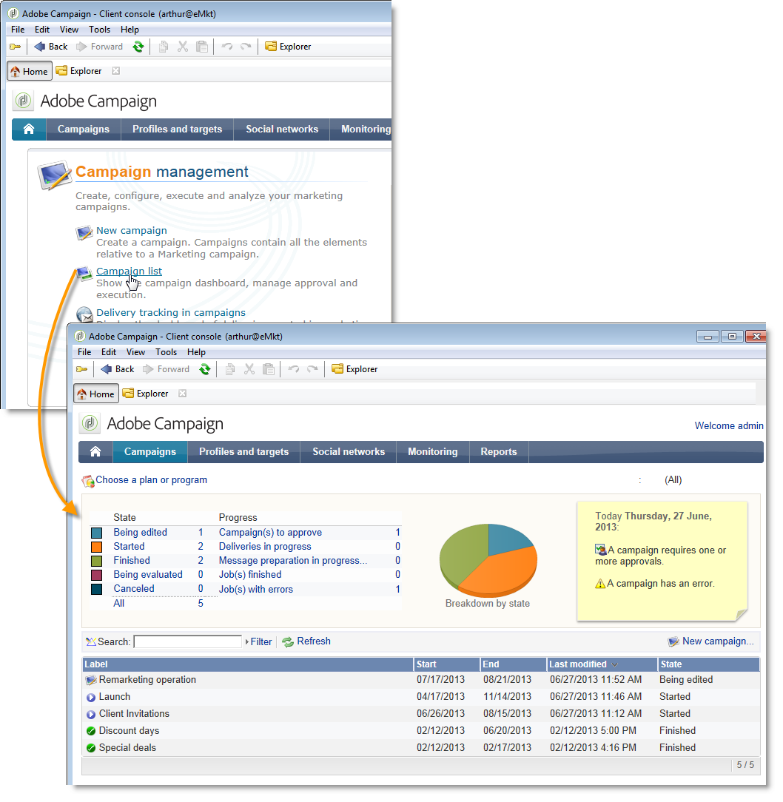

# v6.02 中的特定設定{#specific-configurations-in-v6-02}

下節詳細說明從v6.02遷移時需要的其他配置。您還應配置[常規配置](../../migration/using/general-configurations.md)部分中詳述的設定。

## 網站應用程式{#web-applications}

如果您要從v6.02移轉，可能會出現關於概述類型Web應用程式的錯誤記錄。 錯誤訊息範例：

```
[PU-0006] Entity of type : 'xtk:entityBackupNew' and Id 'nms:webApp|taskOverview', expression '[SQLDATA[' was found : '...)) or (@id IN ([SQLDATA[select 
[PU-0006] Entity of type : 'xtk:formDictionary' and Id 'nms:webApp|lastTasks', expression '[SQLDATA[' was found : '...)) or (@id IN ([SQLDATA[select 
[PU-0006] Entity of type : 'nms:webApp' and Id 'taskOverview', expression '[SQLDATA[' was found : '...@owner-id] IN ([SQLDATA[select iGroupid...'. (iRc=-1)
```

這些Web應用程式使用SQLData，並且由於安全性增強而與v7不相容。 這些錯誤將導致遷移失敗。

如果您未使用這些Web應用程式，請執行下列清除指令碼並重新執行升級後的程式：

```
Nlserver javascript -instance:[instance_name] -file [installation_path]/datakit/xtk/fra/js/removeOldWebApp.js
```

如果您修改了這些Web應用程式，並希望在v7中繼續使用它們，則必須在不同的安全區域中激活&#x200B;**allowSQLInjection**&#x200B;選項，然後重新啟動升級後。 有關詳細資訊，請參閱[SQLData](../../migration/using/general-configurations.md#sqldata)部分。

## 用戶友好性：首頁和導航{#user-friendliness--home-page-and-navigation}

>[!IMPORTANT]
>
>如果要繼續使用v6.02 overview-type Web應用程式，必須在升級後之前，在不同的安全區域中激活&#x200B;**allowSQLInjeption**&#x200B;選項。 請參閱[Web應用程式](#web-applications)。

從6.02版移轉後，Adobe Campaign v6.02首頁不再顯示，但仍可存取，且與Adobe Campaign v7相容。

若要繼續使用v6.02首頁，您必須在移轉後安裝「相容性」套件。

要執行此操作，請導入相容性包：

按一下&#x200B;**[!UICONTROL Tools > Advanced > Import package]**&#x200B;並選擇&#x200B;**`\nl\datakit\nms\[Your language]\package\optional`**&#x200B;中的&#x200B;**campaignMigration.xml**&#x200B;套件。

若要允許存取v6.02 Web應用程式類型介面，**sessionTokenOnly**&#x200B;伺服器配置選項必須在&#x200B;**serverConf.xml**&#x200B;檔案中啟動：

```
sessionTokenOnly="true"
```

此選項會更改安全級別以確保介面相容性。

安裝套件後，Adobe Campaign v7首頁會取代為您舊的v6.02首頁，並包含v7的一般設定（藍色首頁橫幅）。


此首頁上的所有連結都連結到v7螢幕，但清單（**[!UICONTROL operation list]**、**[!UICONTROL delivery tracking in operations]**&#x200B;等）除外 連結至v6.02概述（web應用程式）。



如果您想要新增另一個v6.02中設定的概述，您需要從控制面板將其新增至首頁。(**[!UICONTROL Administration > Access management > Dashboard]**)。

>[!NOTE]
>
>請記得中斷連線，然後重新連線主控台以註冊修改。

## 消息中心{#message-center}

在Message Center控制實例遷移後，必須重新發佈交易式消息模板，以便它們正常工作。

在v7中，執行例項上的交易式訊息範本的名稱已變更。 它們當前由與其建立所在的控制實例對應的運算子名稱前置詞，例如&#x200B;**control1_template1_rt**（其中&#x200B;**control1**&#x200B;是運算子的名稱）。 如果您有大量範本，建議您在控制執行個體上刪除舊範本。
