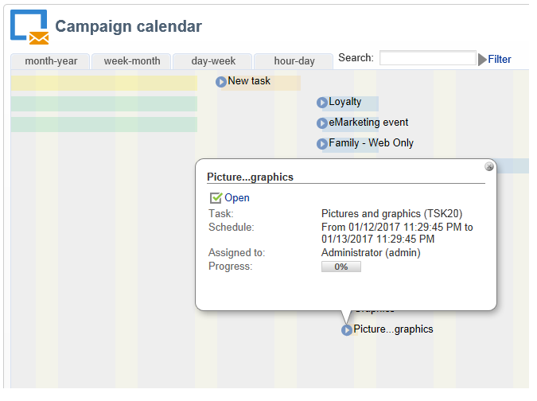
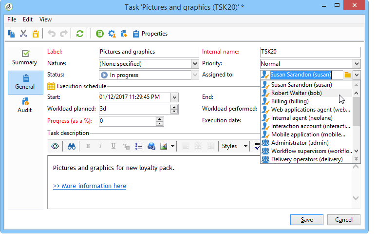
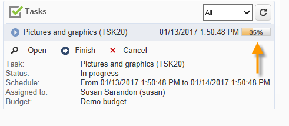
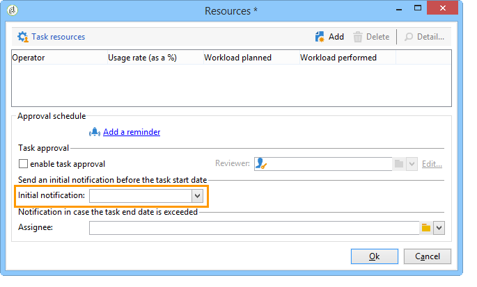
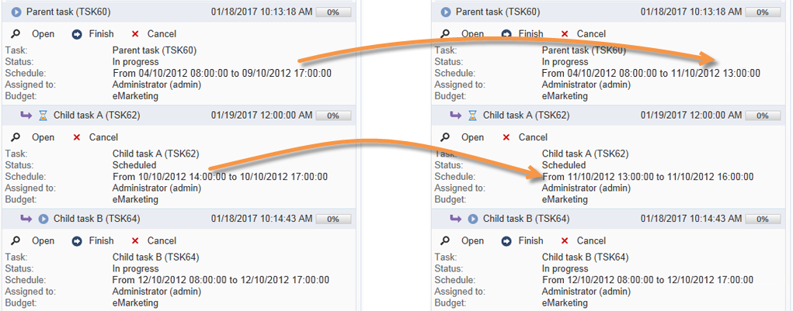

# 建立及管理設定檔{#creating-and-managing-tasks}

Adobe Campaign可讓您直接在應用程式中建立工作並管理其完整生命週期。 方案和行銷活動實作可劃分為指派給Adobe Campaign運算子或外部服務提供者的工作。 此操作模式允許您建立一個包括所有方案參與者和外部參與者的開放協作環境。

您可以從任務清單或行銷活動控制面板建立、檢視及監控任務。 您也可以在行銷計畫、方案和行銷活動的排程中檢視及追蹤這些項目。

任務會附加至campaign，且可具有相依性，即相關的任務。 每個任務都有狀態、優先順序、估計負載和相關成本。

所有任務都會分組在可透過 **行銷活動** 標籤。 有關詳細資訊，請參閱 [存取任務](#accessing-tasks).

它們可顯示在其所屬程式的排程中。

## 存取任務 {#accessing-tasks}

### 顯示任務 {#displaying-tasks}

任務將顯示在任務清單中，可通過 **[!UICONTROL Campaigns]** 標籤。

您可以在那裡查看連接操作員的所有任務。

有關詳細資訊，請參閱 [任務的執行狀態](#execution-status-of-a-task) 和 [任務的進度狀態](#progress-status-of-a-task).

### 篩選任務 {#filtering-tasks}

當您顯示此檢視時，會自動篩選該檢視，以僅顯示 **[!UICONTROL operator tasks]**. 您也可以使用視窗上方區段的欄位來篩選工作。

### 編輯任務 {#editing-tasks}

按一下要編輯的任務。

## 建立新任務 {#creating-a-new-task}

要建立任務，請按一下 **[!UICONTROL Tasks]** 連結 **[!UICONTROL Campaigns]** 索引標籤和選取 **[!UICONTROL Create]**.

請至少輸入任務的名稱，並選擇連結到的促銷活動。 您也必須指定開始和結束日期。 這三條資訊是強制性的。

按一下 **[!UICONTROL Save]** 來建立任務。

您也可以透過促銷活動的控制面板建立任務：在此情況下，會自動連結至從中建立的促銷活動。

建立任務後，會將其新增至促銷活動排程和任務清單。 要編輯任務，請從調度中選擇任務，或在任務概述中按一下其名稱，然後按一下 **[!UICONTROL Open]** 連結。

若要設定，您必須指出：

* 經理和參與者：請參閱 [經理和參與者](#manager-and-participants).
* 建立排程：請參閱 [執行排程](#execution-schedule).
* 承付成本：請參閱 [支出和收入](#expenses-and-revenues).

廣告審核者也可以參閱 [審核者](#reviewers))和參考的檔案(請參閱 [引用的文檔](#documents-referenced))。

任務生命週期在 [生命週期](#life-cycle).

### 經理和參與者 {#manager-and-participants}

只有負責任務的操作員才有權關閉該任務。

依預設，當Adobe Campaign運算子建立任務時，會自動將其指派給這些工作。 若要選取不同的運算子，請使用 **[!UICONTROL Assigned to]** 欄位。

>[!NOTE]
>
>營運商管理於 [本節](../../platform/using/access-management.md).

您可以指定執行任務時涉及的操作員。 這些操作員無權關閉該任務。 他們只能批准指派給他們的任務。

會使用 **[!UICONTROL Resources]** 表徵圖。 按一下 **[!UICONTROL Add]** 並選擇相關操作者。

按一下 **[!UICONTROL Ok]** 然後輸入使用率：這表示在任務執行期間分配給運算子的負載。 此比率僅為指示，以百分比表示。

例如，對於執行時間表設定為10天的任務，其使用率為50%的操作員將在該任務上調動其10天半的工作時間。

對於每個運算子，您可以輸入計畫工作量和實際工作量。 這些持續時間也僅供參考。

可以配置提醒，該提醒將在任務結束日期之前自動發送給任務中涉及的所有操作員。

您可以透過 **[!UICONTROL Edit link]** 表徵圖。

操作員儀表板允許您檢查其工作負載（正在執行的其他任務）。

### 審核者 {#reviewers}

除了參與者之外，您還可以定義操作員，操作員將在任務被負責人關閉後複查任務。 若要這麼做，請按一下 **[!UICONTROL Enable task approval]** 選項 **[!UICONTROL Resources]** 窗口。 這可以是個別運算子、運算子群組或運算子清單。

若要指定運算子清單，請按一下 **[!UICONTROL Edit...]** 連結至第一個審核者的右側，並視需要新增多個運算子，如下所示：

您可以在審核者配置窗口的下部定義任務的審批計畫。 依預設，審核者自提交日期起有三天時間批准任務。 可以配置提醒，提醒將在批准截止日期之前自動發送給相關操作員。

負責該任務的人員可以為自己分配批准該任務的任務，即使已分配了其他操作員來執行此操作。 如果未定義審核者，則通知將發送給負責任務的人員。 所有其他Adobe Campaign運算子(含 **[!UICONTROL Administrator]** 權限也可以核准任務。 不過，他們不會收到通知。

### 引用的文檔 {#documents-referenced}

您可以將檔案和行銷資源新增至任務(如需詳細資訊，請參閱 [管理行銷資源](../../mrm/using/managing-marketing-resources.md))。 要執行此操作，請開啟任務並按一下 **[!UICONTROL Documents]** 表徵圖。

按一下 **[!UICONTROL Add]** 並選擇要添加到任務的文檔。 對行銷資源套用相同的程式。

被引用的文檔將出現在發送給任務中涉及的操作員的通知中，以及任務控制面板中。

### 執行排程 {#execution-schedule}

任務的有效期在 **[!UICONTROL Start]** 和 **[!UICONTROL End]** 欄位。 調度的負載表示在該期間要執行的工作負載。 以天或小時表示。

>[!NOTE]
>
>任務的生命週期如 [生命週期](#life-cycle).

此 **[!UICONTROL Workload performed]** 欄位也以天和小時表示，可讓您手動更新與計畫工作量相關的任務進度。

此 **[!UICONTROL Progress status]** 任務（以百分比表示）的內容會根據相關操作員執行的任務自動更新。 可以手動輸入。

此資訊可在任務控制面板中查看。

它也會顯示在促銷活動標籤中。

如果任務執行計畫結束日期已到，但任務尚未完成，則任務將為 **[!UICONTROL Late]**. 警告訊息也會顯示給警報運算子。

有關詳細資訊，請參閱 [任務的進度狀態](#progress-status-of-a-task).

### 支出和收入 {#expenses-and-revenues}

您可以為每個任務定義相關費用和預測收入。 系統會計算這些量度，然後針對任務所附加的促銷活動進行整合。

若要指定此資訊，請按一下 **[!UICONTROL Expenses and revenue]** 表徵圖。

預設情況下，支出的預算是附加任務的促銷活動的預算。 它顯示在任務詳細資訊中。

>[!NOTE]
>
>有關費用和預算的詳細資訊，請參閱 [成本承諾、計算及收費](../../mrm/using/controlling-costs.md#cost-commitment--calculation-and-charging).

在此窗口中，您還可以定義要達到的目標。 目標以任務的預測收入表示。

### 服務提供商 {#service-providers}

外部服務提供商可以參與任務的管理。

要執行此操作，請編輯任務屬性並選擇相關的服務提供商。 與服務提供商關聯的成本類別會自動列在窗口的中央部分。

有關詳細資訊，請參閱 [建立服務提供商及其成本類別](../../campaign/using/providers--stocks-and-budgets.md#creating-a-service-provider-and-its-cost-categories).

選擇與任務執行相關的成本類別。 要執行此操作，請選擇成本類型，並在必要時向附加費添加金額。

>[!NOTE]
>
>管理預算及成本之方法於 [控製成本](../../mrm/using/controlling-costs.md).

選擇服務提供程式後，它將顯示在任務儀表板中：

### 延遲任務 {#late-tasks}

如果任務已到達其結束日期，但其狀態未變更為 **[!UICONTROL Finished]**. 預設情況下，任務延遲時不會警告任何運算子。 您可以設定通知電子郵件的傳送：即使所有操作員不參與任務，也可以通知他們。

前往 **[!UICONTROL Resources]** 框中，並將運算子添加到 **[!UICONTROL Assignation]** 欄位。 要通知多個人，請選擇一組操作員。

### 初始通知 {#initial-notifications}

當您將來建立或修改具有開始日期的任務時，Adobe Campaign會提供電子郵件給負責該任務的人員，讓他們知道該任務何時開始。

但是，如果要建立的任務距離很遠，則最好在任務開始前排程要發送的通知。 例如，如果任務在一個月內開始，您可以在任務開始前一週通知負責該任務的人員。

若要排程通知，請前往 **[!UICONTROL Resources]** 框，然後使用 **[!UICONTROL Initial notification]** 欄位。

* 對於促銷活動內的任務，請選取特定的日期和時間。
* 對於行銷活動範本中的工作，通知時間會以工作開始前的剩餘時間來表示(例如，如果您在 **[!UICONTROL Initial notification]** 欄位，則會在任務開始日期前2天傳送電子郵件)。

如果您已排程通知，當您儲存工作時，Adobe Campaign會暫停選件以立即傳送通知。 您可以決定傳送，這樣不會取代排程的通知。

### 連結到程式的任務 {#task-linked-to-a-program}

您可以直接在方案中建立任務，以管理與其整體組織相關、而非與特定促銷活動相關的動作（例如，討論方案內即將進行之促銷活動主題的會議）。 任務將出現在程式計畫中。

要建立直接連結到程式的任務，請執行以下操作：

1. 開啟程式計畫：在首頁上，轉到 **[!UICONTROL Campaigns > Browse > Other choices > Programs]**. 整個程式計畫將在窗口的右側部分開啟。
1. 在排程中，按一下所需的方案：一扇窗子裡就有了這個節目。
1. 在此視窗中，按一下 **[!UICONTROL Open]**. 程式計劃開啟。
1. 按一下 **[!UICONTROL Add]** 按鈕（位於右側），然後按一下 **[!UICONTROL Add a task]**.

### 運算子可用性 {#operator-availability}

在任務控制面板中，操作員名稱旁的表徵圖表示他們已在任務涵蓋的期間內處理另一個任務或事件。 操作員負責或涉及的任務顯示在 **[!UICONTROL Assigned to]** 欄位或任務 **[!UICONTROL Resources]** 框。

### 工作流程中的任務 {#task-in-a-workflow}

使用 **[!UICONTROL Task]** 行銷活動工作流程中的元素可讓您根據任務是否核准來定義兩個案例。

在行銷活動工作流程中， **[!UICONTROL Task]** 在中找到活動 **[!UICONTROL Flow control]** 標籤。

## 任務類型 {#types-of-task}

當您透過促銷活動建立任務時，可以建立特定任務。 任務類型在選定模板中定義。

可排程下列工作：

* [控制任務](#control-tasks),
* [分組任務](#grouping-task),
* [分組任務](#grouping-task),
* [通知任務](#notification-task).

>[!NOTE]
>
>**[!UICONTROL Control task]** 和 **[!UICONTROL Grouping]** 可以建立任務 **僅限** 透過促銷活動控制面板。\
>它們顯示在為其分配的運算子的任務映射中。 請參閱 [存取任務](#accessing-tasks).

### 控制任務 {#control-tasks}

A **[!UICONTROL Control task]** 連結至傳遞核准：核准目標、內容、擷取檔案、預算或校樣。

建立任務後，該任務即會新增至促銷活動控制面板。

然後，您可以編輯它並指定其參數。

### 行銷資源建立任務 {#marketing-resource-creation-task}

行銷資源建立任務可用於管理行銷資源的建立和發佈。 如果您是透過任務管理資源，而非透過資源本身，您可以：

* 透過促銷活動控制資源建立程式。
* 在調度中查看資源建立過程。
* 管理資源建立過程（提醒、通知）。
* 計算和控制與資源建立連結的成本。
* 透過任務核准和發佈資源（如果已啟用相關選項）。

#### 任務與其連結資源之間的交互 {#interaction-between-the-task-and-its-linked-resource}

行銷資源建立任務會與連結到它的資源互動。 這表示：

* 資源建立時間表和與其連結的成本通過任務進行管理。
* 運算子可以使用正常資源（下載或上傳、鎖定和解鎖）:這不會影響任務。
* 資源審批和發佈可通過任務執行：若 **[!UICONTROL Publish the marketing resource]** 選項，則資源會在任務完成後自動獲得批准並發佈。 如果未啟用選項，則任務和資源不會交互：對一個不會影響另一個。

   您可以使用一系列連結的任務來定義完整的核准週期。 檢查 **[!UICONTROL Publish the marketing resource]** 選項（僅用於最後一個任務）:必須完成所有任務，才能發佈資源。 此外，當您建立子行銷資源任務時，將在子任務中自動選擇該資源。

   * **透過資源**:如果您提交資源以進行核准或核准，這些動作將不會影響任務。
   * **透過任務**:若 **[!UICONTROL Publish the marketing resource]** 在任務中核取選項，則資源會在任務完成後自動獲得批准並發佈（請參閱上文）。 如果未核取選項，則任務和資源不會互動：對一個不會影響另一個。

#### 設定行銷資源建立任務 {#configuring-a-marketing-resource-creation-task}

審閱任務的人員不需要審閱資源中定義的內容的相同人員。 但若 **[!UICONTROL Publish the marketing resource]** 選項被選中（請參閱下面），任務審核者在完成任務時被授權批准資源內容（或者，如果未定義審核者，則任務管理員）。

在 **[!UICONTROL Marketing resource]** 欄位，定義要透過此任務管理的資源。 您可以：

* 選擇現有資源：下拉式清單會提供狀態為的所有資源 **[!UICONTROL Being edited]**.
* 建立資源：按一下 **[!UICONTROL Select the link]** 圖示，然後按一下 **[!UICONTROL Create]** 表徵圖。

此 **[!UICONTROL Publish the marketing resource]** 選項可讓您自動進行資源發佈：一旦任務完成 **[!UICONTROL Finished]**，資源的狀態會自動切換為 **[!UICONTROL Published]**，即使未提交以進行核准或核准，包括完成任務的審核者不是資源中定義的內容審核者。

此 **[!UICONTROL Publish the resource]** 按鈕可供使用，而資源發佈審核者會收到通知電子郵件，通知他已準備好發佈。 在 **[!UICONTROL Edit > Tracking]** 頁簽，任務審核者的審核和發佈將變為可見。 如果已定義資源後處理工作流程，則會立即執行。

### 組任務 {#grouping-task}

此 **[!UICONTROL Grouping task]** 「類型任務」(type task)允許您對多個任務進行分組，並同步管理其進度和審批。

分組任務沒有連結的費用或資源。

所有分組到分組任務的任務都可以在其自己的儀表板上查看。 這可讓您篩選任務清單，只顯示您感興趣的任務。

分組任務有一個連結，可讓您輕鬆建立分組任務。

要根據分組任務建立分組任務，請轉到促銷活動控制面板，按一下分組任務的名稱以顯示其說明，然後按一下 **[!UICONTROL Add a task]**.

但是，如果已建立要連結到分組任務的任務，則可以通過 **[!UICONTROL Linked to]** 欄位 **[!UICONTROL Properties]** 框。

### 通知任務 {#notification-task}

通知任務可讓您排程電子郵件傳送（傳送給運算子、一組運算子、服務提供者等）。 這可讓您排程提醒，例如通知某人促銷活動即將完成，或在促銷活動開始前傳送檔案，讓運算子可以準備。 這表示您可以在行銷活動或方案中持續追蹤您的通訊，並更密切地注視執行的動作。

#### 生命週期 {#life-cycle}

通知任務不需要批准。 這表示其生命週期比標準任務更簡單：

通知任務可以具有以下狀態：

* **[!UICONTROL Scheduled]** 直到傳送電子郵件為止
* **[!UICONTROL In progress]** 一旦傳送電子郵件，直到到達結束日期
* **[!UICONTROL Finished]** 到達結束日期後。

#### 設定 {#configuration}

在建立期間，必須在任務中輸入以下元素：

* **[!UICONTROL Assigned to]** :將接收電子郵件的運算子或運算子群組。 如果在發送電子郵件後重新分配任務，則不會將電子郵件發送到新的運算子（要執行此操作，您需要重新初始化任務並更改其開始日期）。
* **任務開始日期**:通知電子郵件的傳送日期。 該日期必須在記錄任務時在將來發生。
* **任務結束日期**:任務狀態更改為的日期 **[!UICONTROL Finished]**. 預設情況下，結束日期與開始日期相同。 不過，為任務分配持續時間可讓您表示操作員在調度中必須執行操作的時間長度（如果需要）。
* **[!UICONTROL Description]** :此處輸入的文字會顯示在通知電子郵件的正文中。

   

您可以將附件新增至任務和通知電子郵件。 若要這麼做，請按一下 **[!UICONTROL Documents]** 圖示。

## 生命週期 {#life-cycle-1}

### 任務之間的連結 {#links-between-tasks}

此 **[!UICONTROL Properties]** 按鈕，您可以定義行銷活動中各工作之間的連結。 您可以使用分組任務將任務拆分為子任務(請參閱 [連結的任務](#linked-tasks))，或定義任務之間的相依性(請參閱 [分組任務](#grouping-tasks))。

#### 連結的任務 {#linked-tasks}

使用 **[!UICONTROL Linked task]** 欄位，將任務與分組任務關聯。 請參閱 [任務類型](#types-of-task).

在下列範例中，目標的核准會劃分為四個子任務。

每個子任務都是連結到主任務的標準任務。

#### 分組任務 {#grouping-tasks}

使用 **[!UICONTROL Grouped to]** 欄位，使任務的執行取決於另一個任務的執行。

任務之間的相依性在促銷活動控制面板中以箭頭表示。

對於分組任務，Adobe Campaign會自動將父任務的結束日期作為開始日期分配給子任務。 例如，若 **建立邀請** 任務於10月15日下午3點30分結束， **傳送邀請電子郵件** 子任務將於10月15日下午3點30分開始。

此外，如果延遲父任務的結束，則其某些子任務可能會受到影響：這些是狀態為 **[!UICONTROL Scheduled]** 且其開始日期早於父任務的新結束日期。 任務的持續時間保持不變。 如果子任務的開始日期晚於父任務的新結束日期，則子任務不受影響。

**範例**

預定在10月9日下午5點結束的父任務有兩個子任務，任務A和任務B。任務A預定在10月10日下午2點開始，任務B預定在10月12日上午8點開始。

我們延後上層任務：現在於10月11日下午1點結束。 只有任務A被推遲，將從10月11日下午1點開始。

### 任務的執行狀態 {#execution-status-of-a-task}

可以在任務圖中查看任務狀態。 根據操作員操作自動更新任務的執行狀態。

任務可以是： **[!UICONTROL Scheduled]**, **[!UICONTROL In progress]**, **[!UICONTROL Finished]**, **[!UICONTROL Canceled]**, **[!UICONTROL Pending approval]** 或 **[!UICONTROL Rejected]**.

* 建立任務時，它是 **[!UICONTROL Scheduled]** 如果其開始日期為未來。 它會保留此狀態，直到達到其開始日期為止。
* 啟動後，任務為 **[!UICONTROL In progress]**. 當負責任務的人員關閉任務時，它將更改為 **[!UICONTROL Finished]**.
* 如果已定義審核者，則任務將 **[!UICONTROL Pending approval]** 主管人員關閉後，直到審核者批准。 如果審核者拒絕，則任務為 **[!UICONTROL Rejected]**.
* 任務可由負責該任務的人員透過控制面板或 **[!UICONTROL Task map]** 按一下 **[!UICONTROL Cancel]** 按鈕。
* 要計畫任務，請輸入將來的開始日期。 然後，您可以傳送第一個通知給執行工作中涉及的Adobe Campaign運算子。 請參閱 [完成任務生命週期](#complete-task-life-cycle).

>[!NOTE]
>
>* 任務狀態將自動更新。
>* 即使有效期已結束，未關閉的任務仍顯示在正在進行的任務清單中。 警告會通知運算子任務延遲。

>

### 任務的進度狀態 {#progress-status-of-a-task}

除了執行狀態外，任務還可以與進度狀態關聯： **[!UICONTROL Late]**, **[!UICONTROL To approve]**, **[!UICONTROL To do today]** 或 **[!UICONTROL To do this week]**. 根據任務計畫自動輸入此資訊。

您可以按進程或進度狀態篩選任務清單。

有關詳細資訊，請參閱 [存取任務](#accessing-tasks).

### 完成任務生命週期 {#complete-task-life-cycle}

以下是整個任務生命週期的各個階段，負責人為其定義了參與者和審閱者。

1. 負責人建立任務並輸入各個欄位。 有關詳細資訊，請參閱 [建立新任務](#creating-a-new-task).

   建立和編輯任務時 **未來排程** （只要未達到任務開始日期），就可以向參與者和經理發送通知，讓他們知道已計畫新任務。

   

   若要傳送此第一個通知，請按一下 **[!UICONTROL Yes]**. 此通知會告訴他們下一個任務，並包含內容的詳細資訊以及截止日期前的剩餘天數。

   建立任務並計畫以後的任務時，其狀態為 **[!UICONTROL Scheduled]**.

1. 在任務開始日期，負責人和參與者將收到通知，通知他們任務已開始。 其狀態變更為 **[!UICONTROL In progress]**.
1. 完成分配給它們的部分後，參與者可以批准該任務，其中一種：

   * 透過通知電子郵件。
   * 通過控制台或web介面，在任務控制面板中。

      

1. 每次參與者批准作業時，任務的進度狀態都會更新。

   

1. 審核者會收到通知電子郵件，告知他運算子已完成指派給他們的區段。

   他們可以跟蹤任務控制面板上的進度。

   

1. 負責任務的人員決定任務完成後，他們可以使用任務啟動時發送的通知電子郵件中的連結、控制台或介面來關閉該任務。

   

   >[!NOTE]
   >
   >負責任務的人員可隨時關閉該任務，即使缺少批准。 進度狀態會自動變更為100%。

1. 任務狀態將更改為 **[!UICONTROL To approve]**，並傳送通知給審核者。

   他們透過通知電子郵件、主控台或網頁介面核准工作。

   他們可以透過促銷活動控制面板執行動作：

   

   他們也可以使用任務批准按鈕：

   

   >[!NOTE]
   >
   >任務狀態將只更改為 **[!UICONTROL To approve]** 如果您已啟用 **[!UICONTROL Enable task validation]** 選項 **[!UICONTROL Resources]** 窗口。\
   >如果審核者拒絕該任務，則其狀態將更改為 **[!UICONTROL Rejected]**，則任務生命週期將自動重新開始。

1. 任務狀態將更改為 **[!UICONTROL Finished]**. 系統會傳送通知給所有相關人員。

   >[!NOTE]
   >
   >任務完成後，其生命週期可由負責人重新初始化。 要執行此操作，請開啟任務並按一下 **[!UICONTROL Reset task to execute it again...]** 連結。
