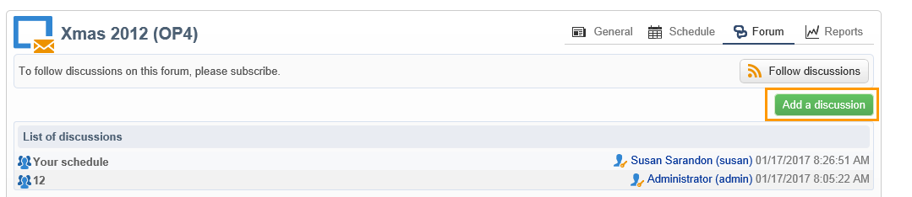

# 論壇{#discussion-forums}

Adobe Campaign操作人員可使用討論區來共用資訊。 下列各元素有各自的論壇：計畫、方案、行銷活動、資源、模擬、庫存。 每個操作員也有一個個人論壇。 所有討論都是公開的，甚至在個人論壇中也是如此。

操作員可以訂閱論壇，以便在每次張貼訊息時收到通知電子郵件。

## 存取論壇 {#accessing-a-forum}

若要造訪行銷活動的論壇、運運算元等，請移至其控制面板，然後按一下 **[!UICONTROL Forum]** 右上角的連結。 此連結也會提供論壇中的訊息總數。

## 使用論壇 {#using-a-forum}

訊息及其回應會依時間順序顯示（從最新到最舊）。

若要顯示訊息的內容，請按一下其標頭。

**開始新的討論**

若要開始新的討論，請按一下 **[!UICONTROL Add a discussion]** 按鈕。 此 **[!UICONTROL Discussion forum]** 方塊隨即出現（請參閱下文）。

**將訊息張貼至現有的討論區**

若要將訊息張貼至現有的討論區，請開啟要回覆的訊息，然後按一下 **[!UICONTROL Reply]** 左上角的連結。 此 **[!UICONTROL Discussion forum]** 方塊隨即出現（請參閱下文）。

當您回複訊息時，張貼原始訊息的人將會收到通知。

**撰寫訊息**

在 **[!UICONTROL Discussion forum]** 方塊：

1. 在「 」中輸入文字 **[!UICONTROL Message]** 中的欄位和討論標題 **[!UICONTROL Subject]** 欄位。

   

1. 如有必要：

   * 如果您希望某個未訂閱論壇的人參與討論，請使用 **[!UICONTROL Operator to notify]** 欄位。 操作員將收到此特定訊息的通知電子郵件（他們將不會訂閱論壇）。 若要通知數個運運算元，請選取一組運運算元。
   * 若要新增附件至郵件，請按一下 **[!UICONTROL Browse]**. 附件也會包含在通知電子郵件中。 附件只能個別傳送：若要傳送多個檔案，您必須壓縮檔案。

1. 按一下 **[!UICONTROL Create the message]** 以張貼至論壇。

>[!NOTE]
>
>訊息一旦張貼至論壇，就無法再變更或刪除。

## 張貼至操作員的個人論壇 {#posting-to-the-personal-forum-of-an-operator}

例如，如果您的訊息與特定行銷活動無關，但您仍想要在Adobe Campaign中追蹤對話，則您可以將訊息張貼至運運算元的論壇。 個人論壇是公開的，所有操作者都會看到您的訊息。 操作員在每次有人發表個人論壇時都會收到訊息。

若要存取運運算元的論壇：

* 如果您有必要的許可權可存取 **[!UICONTROL Administration > Access management > Operators]** 在瀏覽器節點中，開啟所需運運算元的控制面板，然後按一下 **[!UICONTROL Forum]** 右上角的連結。
* 如果沒有，請在Adobe Campaign中尋找運運算元的名稱（透過此運運算元張貼至論壇的訊息、指派給他們的任務），然後按一下以存取其控制面板。 您也可以要求您的管理員建立operator資料夾的檢視。

## 訂閱論壇 {#subscribing-to-a-forum}

訂閱論壇可讓您關注討論。 每次在論壇中張貼訊息時，您都會收到電子郵件通知。 此電子郵件將包含郵件內文及任何附件。 若要回複訊息，請按一下電子郵件內文，然後登入Adobe Campaign網路介面。 當您訂閱論壇時，所有人都會看到此資訊。

* 若要訂閱論壇，請按一下 **[!UICONTROL Follow discussions]** 按鈕來顯示訊息清單上方的訊息。

  

  區段變為藍色，並顯示您已訂閱論壇。

* 若要取消訂閱論壇，請按一下 **[!UICONTROL Unsubscribe]** 按鈕。

  

* 您的個人儀表板會列出您訂閱的論壇。 按一下 **[!UICONTROL Subscription to discussion forums]** 連結以顯示清單，然後按一下您感興趣的專案以存取其論壇。

  

  如需個人儀表板的詳細資訊，請參閱 [本節](../../platform/using/access-management-operators.md).

* 若要檢視論壇訂閱者，請按一下 **[!UICONTROL List of subscribers to this discussion forum]** 訊息清單上方的連結。

  

## 檢查通知傳送 {#checking-notification-delivery}

如果訂閱論壇的運運算元沒有如預期收到通知：

* 檢查是否在操作員的設定檔中輸入電子郵件地址。
* 前往 **[!UICONTROL Administration > Production > Technical workflows > Campaign processes]** 節點，並檢查 **[!UICONTROL Jobs in discussion forums]** 工作流程已啟動且沒有錯誤。
* 檢視傳送記錄檔：

   * 在Adobe Campaign首頁，前往 **[!UICONTROL Campaigns > Navigation > Deliveries]**，然後開啟 **[!UICONTROL Discussion forum notification]** 傳遞。
   * 在總管中，前往 **[!UICONTROL Administration > Production > Objects created automatically > Technical deliveries > Workflow notifications]**，然後按一下 **[!UICONTROL Discussion forum notifications]**.

  在 **[!UICONTROL Discussion forum notifications]** 方塊中，傳送記錄位於 **[!UICONTROL Edit > Delivery]** 標籤。 您也可以檢視 **[!UICONTROL Tracking > Log]** 和 **[!UICONTROL Exclusion causes]** 索引標籤。
