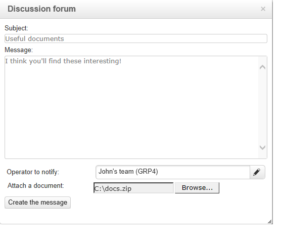

# 論壇{#discussion-forums}

Adobe Campaign操作人員可使用討論區來共用資訊。 下列各元素有各自的論壇：計畫、方案、行銷活動、資源、模擬、庫存。 每個操作員也有一個個人論壇。 所有討論都是公開的，甚至在個人論壇中也是如此。

操作員可以訂閱論壇，以便在每次張貼訊息時收到通知電子郵件。

## 存取論壇 {#accessing-a-forum}

若要造訪促銷活動、運運算元等的論壇，請前往其控制面板，然後按一下右上角的&#x200B;**[!UICONTROL Forum]**&#x200B;連結。 此連結也會提供論壇中的訊息總數。

## 使用論壇 {#using-a-forum}

訊息及其回應會依時間順序顯示（從最新到最舊）。

若要顯示訊息的內容，請按一下其標頭。

**開始新的討論**

若要開始新的討論，請按一下右上角的&#x200B;**[!UICONTROL Add a discussion]**&#x200B;按鈕。 會出現&#x200B;**[!UICONTROL Discussion forum]**&#x200B;方塊（請參閱下文）。

**將郵件張貼到現有的討論區**

若要將訊息張貼至現有的討論區，請開啟您要回覆的訊息，然後按一下左上角的&#x200B;**[!UICONTROL Reply]**&#x200B;連結。 會出現&#x200B;**[!UICONTROL Discussion forum]**&#x200B;方塊（請參閱下文）。

當您回複訊息時，張貼原始訊息的人將會收到通知。

**撰寫訊息**

在&#x200B;**[!UICONTROL Discussion forum]**&#x200B;方塊中：

1. 在&#x200B;**[!UICONTROL Message]**&#x200B;欄位中輸入您的文字，並在&#x200B;**[!UICONTROL Subject]**&#x200B;欄位中輸入討論標題。

   

1. 如有必要：

   * 如果您希望某位未訂閱論壇的人員參與討論，請使用&#x200B;**[!UICONTROL Operator to notify]**&#x200B;欄位。 操作員將收到此特定訊息的通知電子郵件（他們將不會訂閱論壇）。 若要通知數個運運算元，請選取一組運運算元。
   * 若要新增附件至郵件，請按一下&#x200B;**[!UICONTROL Browse]**。 附件也會包含在通知電子郵件中。 附件只能個別傳送：若要傳送多個檔案，您必須壓縮檔案。

1. 按一下「**[!UICONTROL Create the message]**」以將其張貼至論壇。

>[!NOTE]
>
>訊息一旦張貼至論壇，就無法再變更或刪除。

## 張貼至操作員的個人論壇 {#posting-to-the-personal-forum-of-an-operator}

例如，如果您的訊息與特定行銷活動無關，但您仍想要在Adobe Campaign中追蹤對話，則您可以將訊息張貼至運運算元的論壇。 個人論壇是公開的，所有操作者都會看到您的訊息。 操作員在每次有人發表個人論壇時都會收到訊息。

若要存取運運算元的論壇：

* 如果您有存取總管&#x200B;**[!UICONTROL Administration > Access management > Operators]**&#x200B;節點的必要許可權，請開啟所需運運算元的儀表板，然後按一下右上角的&#x200B;**[!UICONTROL Forum]**&#x200B;連結。
* 如果沒有，請在Adobe Campaign中尋找運運算元的名稱（透過此運運算元張貼至論壇的訊息、指派給他們的任務），然後按一下以存取其控制面板。 您也可以要求您的管理員建立operator資料夾的檢視。

## 訂閱論壇 {#subscribing-to-a-forum}

訂閱論壇可讓您關注討論。 每次在論壇中張貼訊息時，您都會收到電子郵件通知。 此電子郵件將包含郵件內文及任何附件。 若要回複訊息，請按一下電子郵件內文，然後登入Adobe Campaign網路介面。 當您訂閱論壇時，所有人都會看到此資訊。

* 若要訂閱論壇，請按一下訊息清單上方右上角的&#x200B;**[!UICONTROL Follow discussions]**&#x200B;按鈕。

  

  區段變為藍色，並顯示您已訂閱論壇。

* 若要取消訂閱論壇，請按一下&#x200B;**[!UICONTROL Unsubscribe]**&#x200B;按鈕。

  

* 您的個人儀表板會列出您訂閱的論壇。 按一下&#x200B;**[!UICONTROL Subscription to discussion forums]**&#x200B;連結以顯示清單，然後按一下您感興趣的專案以存取其論壇。

  

  如需個人儀表板的詳細資訊，請參閱[本節](../../platform/using/access-management-operators.md)。

* 若要檢視哪些人訂閱了論壇，請按一下訊息清單上方的&#x200B;**[!UICONTROL List of subscribers to this discussion forum]**&#x200B;連結。

  

## 檢查通知傳送 {#checking-notification-delivery}

如果訂閱論壇的運運算元沒有如預期收到通知：

* 檢查是否在操作員的設定檔中輸入電子郵件地址。
* 移至&#x200B;**[!UICONTROL Administration > Production > Technical workflows > Campaign processes]**&#x200B;節點，並檢查&#x200B;**[!UICONTROL Jobs in discussion forums]**&#x200B;工作流程是否已啟動且沒有錯誤。
* 檢視傳送記錄檔：

   * 在Adobe Campaign首頁上，前往&#x200B;**[!UICONTROL Campaigns > Navigation > Deliveries]**，然後開啟&#x200B;**[!UICONTROL Discussion forum notification]**&#x200B;傳遞。
   * 在總管中，移至&#x200B;**[!UICONTROL Administration > Production > Objects created automatically > Technical deliveries > Workflow notifications]**，然後按一下&#x200B;**[!UICONTROL Discussion forum notifications]**。

  在&#x200B;**[!UICONTROL Discussion forum notifications]**&#x200B;方塊中，在&#x200B;**[!UICONTROL Edit > Delivery]**&#x200B;索引標籤中找到傳遞記錄。 您也可以檢視&#x200B;**[!UICONTROL Tracking > Log]**&#x200B;和&#x200B;**[!UICONTROL Exclusion causes]**&#x200B;標籤。
