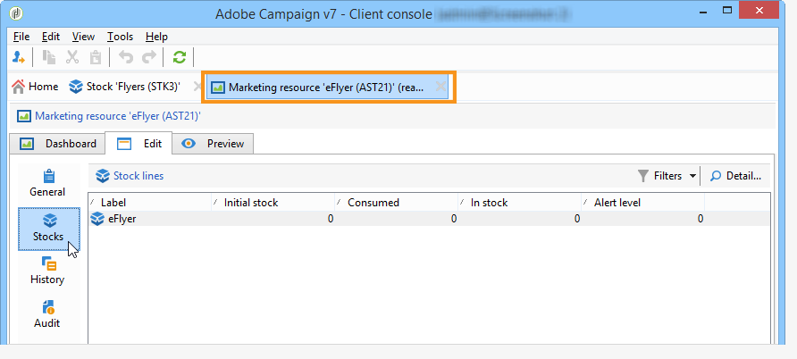

# 管理行銷資源{#managing-marketing-resources}

Adobe Campaign可讓您管理及追蹤行銷活動生命週期中涉及的行銷資源。 這些行銷資源可以是手冊、視覺化輔助工具或涉及數位操作員的任何其他通訊媒體。

對於透過Adobe Campaign管理的每個行銷資源，您可以隨時追蹤其狀態和歷史記錄，並檢視目前版本。

## 新增行銷資源 {#adding-a-marketing-resource}

行銷資源可透過以下方式存取： **[!UICONTROL Campaigns]** 標籤。

若要新增資源，請按一下 **[!UICONTROL Create]** 按鈕。

若要讓資源可在Adobe Campaign伺服器上使用，您必須將所需資源拖放至編輯器中間區域以新增該資源。 您也可以按一下 **[!UICONTROL Upload file to server...]** 連結。

確認訊息可讓您啟動上傳。

上傳完成時，資源會新增至可用資源清單中。 Adobe Campaign運運算元可存取。 他們可以檢視(透過 **[!UICONTROL Preview]** 標籤)、製作副本以修改它，或更新伺服器上的檔案(使用 **[!UICONTROL Edit]** 標籤)。

按一下 **[!UICONTROL General]** 索引標籤以選取負責監視、追蹤及核准此資源的操作員或操作員群組。 選取稽核者會透過以下方式完成 **[!UICONTROL Advanced parameters]** 連結。

* 資源被指派給的運運算元負責追蹤該資源。
* 核准操作員負責核准行銷資源。 啟動資源驗證程式時，他們將會收到通知。

   如果未選取稽核者，則資源 **[!UICONTROL cannot be]** 需核准。

* 如有必要，您也可以指定校訂器。

您可以指定資源的（指示性）可用日期。 在此日期之後，它會顯示為 **[!UICONTROL Late]** 狀態。

## 資源上的合作工作 {#collaborative-work-on-resources}

您可以修改和更新行銷資源，並在必要時通知其他Adobe Campaign操作員此事。 您可以：

* 在本機下載資源以進行修改。
* 更新伺服器上的檔案，並讓其他操作員可以存取。
* 鎖定資源以禁止其他操作者修改資源。

>[!NOTE]
>
>此 **[!UICONTROL History]** 索引標籤包含資源的下載和更新記錄。 此 **[!UICONTROL Details]** 按鈕可讓您檢視選取的版本。

### 鎖定/解除鎖定資源 {#locking-unlocking-a-resource}

建立後，行銷資源儀表板中就會顯示資源，操作員可以編輯和修改資源。

當運運算元想要處理資源時，最好在開始工作前鎖定該資源，以防止其他運運算元同時修改該資源。 接著會保留資源；它仍可存取，但無法由其他運運算元在伺服器上發佈或更新。

特殊訊息會通知嘗試存取該訊息的任何操作員：

此 **[!UICONTROL Tracking]** 索引標籤會指出鎖定資源的操作員名稱以及計畫的更新日期。

若要鎖定資源，您必須按一下資源，然後按一下 **[!UICONTROL Lock]** 按鈕。

您可在 **[!UICONTROL Tracking]** 資源的索引標籤。

此資訊可讓您通知其他Adobe Campaign運運算元資源將解除鎖定的日期。

更新資源後，該資源會自動解除鎖定，並再次開放所有運運算元使用。

如有需要，您也可以從控制面板手動解除鎖定。

>[!NOTE]
>
>只有鎖定資源的操作員與具有管理員許可權的操作員才有權解鎖資源。

### 論壇 {#discussion-forums}

對於每個資源， **[!UICONTROL Forum]** 索引標籤可讓參與者交換資訊。

[論壇](../../mrm/using/discussion-forums.md) 說明討論區在Adobe Campaign中的運作方式。

## 行銷資源的生命週期 {#life-cycle-of-a-marketing-resource}

建立資源時，會指定Adobe Campaign運運算元來設計、校訂、核准和發佈資源。 可決定這些行銷活動的持續時間。

此 **[!UICONTROL Tracking]** 索引標籤可讓您監視對資源執行的任何動作：核准、拒絕核准、相關評論或出版物。

此 **[!UICONTROL History]** 索引標籤會顯示為此資源執行的檔案傳輸。

### 核准流程 {#approval-process}

資源詳細資料中會顯示預期的可用日期(若已在 **[!UICONTROL Tracking]** 標籤。 一旦達到此日期，您就可以使用 **[!UICONTROL Submit for approval]** 按鈕。 然後，資源狀態會變更為 **[!UICONTROL Approval in progress]**.

資源可透過 **[!UICONTROL Approve resource]** 按鈕。

然後，授權的操作員可以接受或拒絕核准。 此動作是可能的：透過傳送的電子郵件訊息（按一下通知訊息中的連結）或透過主控台(按一下 **[!UICONTROL Approve]** )按鈕。

核准視窗可讓您輸入註解。

此 **[!UICONTROL Tracking]** 索引標籤可讓所有操作員追蹤核准流程的各個階段。

>[!NOTE]
>
>除了為每個行銷資源指定的稽核者之外，擁有管理員許可權的操作者和資源管理員也有權核准行銷資源。

### 發佈資源 {#publishing-a-resource}

核准後，必須發佈行銷資源。 發佈程式必須依公司要求進行特定實施。 這表示資源可發佈至外部網路或任何其他伺服器，特定資訊可傳送至外部服務提供者等。

若要發佈資源，請按一下 **[!UICONTROL Publish]** 按鈕（在行銷資源控制面板的編輯區域中）。

您也可以透過工作流程自動發佈資源。

發佈資源即表示該資源可供使用（例如供其他任務使用）。 視您資源的性質而定，發佈內容會有所不同：對於傳單，發佈可能代表將檔案傳送至印表機；對於網站代理商，發佈可能代表將檔案發佈至網站等。

為了讓Adobe Campaign能夠發佈，您需要建立適當的工作流程，並將其連結至資源。 若要這麼做，請開啟 **[!UICONTROL Advanced settings]** 方塊，然後在中選擇所需的工作流程 **[!UICONTROL Post-processing]** 欄位。

工作流程將會執行：

* 當稽核者按一下 **[!UICONTROL Publish resource]** 連結（如果未定義稽核者，則為負責資源的人員）。
* 如果資源是透過行銷資源建立任務進行管理，則會在任務設定為時執行 **[!UICONTROL Finished]**，只要 **[!UICONTROL Publish the marketing resource]** 核取方塊(請參閱 [行銷資源建立任務](../../mrm/using/creating-and-managing-tasks.md#marketing-resource-creation-task))

如果未立即啟動工作流程（例如工作流程已停止），資源的狀態會變更為 **[!UICONTROL Pending publication]**. 工作流程啟動後，資源的狀態會變更為 **[!UICONTROL Published]**. 此狀態未考慮發佈程式中可能出現的錯誤。 檢查工作流程的狀態以確保其已正確執行。

## 將資源連結至行銷活動 {#linking-a-resource-to-a-campaign}

### 參考行銷資源 {#referencing-a-marketing-resource}

假設在行銷活動範本中選取了此功能，則行銷資源可與行銷活動相關聯。

>[!NOTE]
>
>有關如何建立及設定行銷活動範本的詳細資訊，請參閱 [行銷活動範本](../../campaign/using/marketing-campaign-templates.md#campaign-templates).

按一下 **[!UICONTROL Documents > Resources]** 標籤，然後按一下 **[!UICONTROL Add]** 以選取相關資源。

您可以依狀態、性質或型別篩選資源，或套用個人化篩選。

按一下 **[!UICONTROL OK]** 將資源新增至此行銷活動參考的行銷資源清單。

此 **[!UICONTROL Details]** 按鈕可讓您編輯和檢視。

新增的資源會顯示在控制面板中。 您也可以在其中編輯它們。

### 新增行銷資源至傳遞大網 {#adding-a-marketing-resource-to-a-delivery-outline}

行銷資源可以透過傳遞大網與傳遞建立關聯。

>[!NOTE]
>
>如需傳遞概要的詳細資訊，請參閱 [關聯並建構透過傳遞大網連結的資源](../../campaign/using/marketing-campaign-deliveries.md#associating-and-structuring-resources-linked-via-a-delivery-outline).

## 庫存管理 {#stock-management}

您可以將行銷資源與一或多個庫存建立關聯，以便管理您的供給，並在庫存不足時在控制面板上顯示警告。

>[!NOTE]
>
>如需Adobe Campaign中庫存管理的詳細資訊，請參閱 [庫存管理](../../campaign/using/providers--stocks-and-budgets.md#stock-management).

若要將行銷資源與庫存相關聯，請編輯庫存地圖並編輯或建立庫存。 新增庫存行並選取對應的行銷資源。

如有必要，您可以透過以下方式編輯所選資源： **[!UICONTROL Edit the link]** 圖示（放大鏡）。

指定初始庫存和警示庫存，然後儲存。

資源詳細資訊中會指出庫存。

當庫存不足時，系統會傳送警告給相關運運算元。

## 進階函式 {#advanced-functions}

行銷資源儀表板可讓您執行常見的操作型別：新增、編輯、鎖定/解鎖、核准、發佈。 您可以建立其他型別的行銷資源，並透過Adobe Campaign樹狀結構存取進階功能。 若要這麼做，請按一下 **[!UICONTROL Explorer]** (位於Adobe Campaign首頁)。

根據預設，行銷資源會儲存在 **[!UICONTROL MRM > Marketing resources]** 樹狀結構的節點。

您可以從此檢視新增下列資源：

* 檔案
* HTML
* 文字
* URL
