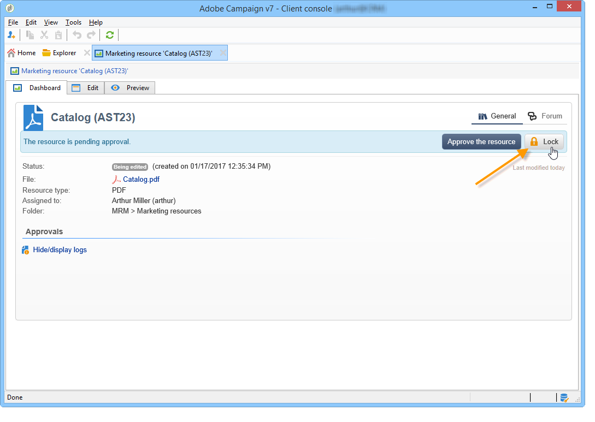

# 管理行銷資源{#managing-marketing-resources}

Adobe Campaign可讓您管理及追蹤促銷活動生命週期中涉及的行銷資源。 這些行銷資源可以是手冊、視覺輔助工具或涉及數個營運商的任何其他通訊媒體。

對於透過Adobe Campaign管理的每個行銷資源，您可以隨時追蹤其狀態和歷史記錄，並檢視目前版本。

## 新增行銷資源 {#adding-a-marketing-resource}

行銷資源可透過&#x200B;**[!UICONTROL Campaigns]**&#x200B;標籤存取。

若要新增資源，請按一下&#x200B;**[!UICONTROL Create]**&#x200B;按鈕。

若要讓資源在Adobe Campaign伺服器上可用，您必須將所需資源拖曳至編輯器的中間區域，以新增該資源。 您也可以按一下&#x200B;**[!UICONTROL Upload file to server...]**&#x200B;連結。

確認訊息可讓您啟動上傳。

上傳完成時，資源會新增至可用資源清單。 Adobe Campaign運算子可存取。 他們可以查看它（通過&#x200B;**[!UICONTROL Preview]**&#x200B;頁簽）、製作副本以修改它，或在伺服器上更新檔案（使用&#x200B;**[!UICONTROL Edit]**&#x200B;頁簽）。

按一下&#x200B;**[!UICONTROL General]**&#x200B;標籤以選取負責監控、追蹤及核准此資源的運算子或運算子群組。 選取審核者會透過&#x200B;**[!UICONTROL Advanced parameters]**&#x200B;連結完成。

* 為其分配資源的運算子負責跟蹤該資源。
* 核准營運商負責核准行銷資源。 資源驗證程式啟動時，系統會通知他們。

   如果未選擇審核者，則資源&#x200B;**[!UICONTROL cannot be]**&#x200B;需經批准。

* 如有必要，您也可以指定校對程式。

您可以為資源指定（指示性）可用日期。 在此日期之後，它將以&#x200B;**[!UICONTROL Late]**&#x200B;狀態顯示。

## 資源協作工作 {#collaborative-work-on-resources}

您可以修改和更新行銷資源，並視需要通知其他Adobe Campaign運算子。 您可以：

* 將資源下載到本機以修改它。
* 更新伺服器上的檔案，讓其他運算子可存取該檔案。
* 鎖定資源，以禁止其他運算子修改資源。

>[!NOTE]
>
>**[!UICONTROL History]**&#x200B;標籤包含資源的下載和更新日誌。 **[!UICONTROL Details]**&#x200B;按鈕可讓您檢視所選版本：

### 鎖定/解鎖資源 {#locking-unlocking-a-resource}

建立後，資源便可在行銷資源控制面板中使用，而運算子可以編輯和修改資源。

當操作員希望處理資源時，最好在開始工作之前鎖定資源，防止其他操作員同時修改資源。 然後會保留資源；它仍可存取，但無法由其他運算子在伺服器上發佈或更新。

特殊訊息會通知嘗試存取該訊息的任何運算子：

**[!UICONTROL Tracking]**&#x200B;標籤指示鎖定資源的運算子的名稱和計畫的更新日期。

要鎖定資源，必須按一下資源，後跟資源控制面板中的&#x200B;**[!UICONTROL Lock]**&#x200B;按鈕。

您可以在資源的&#x200B;**[!UICONTROL Tracking]**&#x200B;標籤中指明計畫退貨日期。

此資訊可讓您通知其他Adobe Campaign運算子資源將解除鎖定的日期。

更新資源後，該資源會自動解除鎖定，並可再次供所有運算子使用。

如有必要，您也可以從控制面板手動解除鎖定。

>[!NOTE]
>
>只有鎖定資源的運算子和具有管理員權限的運算子才有權解鎖資源。

### 論壇 {#discussion-forums}

對於每個資源， **[!UICONTROL Forum]**&#x200B;頁簽允許參與者交換資訊。

[討論](../../mrm/using/discussion-forums.md) 論壇闡述論壇在Adobe Campaign的運作方式。

## 行銷資源的生命週期 {#life-cycle-of-a-marketing-resource}

建立資源時，會指派Adobe Campaign運算子來設計、校對、核准和發佈資源。 可決定這些促銷活動的持續時間。

**[!UICONTROL Tracking]**&#x200B;標籤可讓您監視對資源執行的任何動作：批准、批准拒絕、相關評論或出版物。

**[!UICONTROL History]**&#x200B;標籤顯示為此資源執行的檔案傳輸。

### 核准程式 {#approval-process}

如果預期可用日期在&#x200B;**[!UICONTROL Tracking]**&#x200B;頁簽中指定，則預期可用日期將顯示在資源詳細資訊中。 到達此日期後，您可以使用資源控制面板中的&#x200B;**[!UICONTROL Submit for approval]**&#x200B;按鈕執行批准過程。 然後資源狀態將更改為&#x200B;**[!UICONTROL Approval in progress]**。

資源可透過其控制面板上的&#x200B;**[!UICONTROL Approve resource]**&#x200B;按鈕進行核准。

然後，授權操作員可以接受或拒絕批准。 此動作可能：透過所傳送的電子郵件訊息（透過按一下通知訊息中的連結）或透過主控台（透過按一下&#x200B;**[!UICONTROL Approve]**）按鈕。

批准窗口可讓您輸入注釋。

**[!UICONTROL Tracking]**&#x200B;索引標籤可讓所有運算子追蹤核准程式的各個階段。

>[!NOTE]
>
>除了為每個行銷資源指定的審核者之外，具有管理員權限的運算子和資源管理器也被授權批准行銷資源。

### 發佈資源 {#publishing-a-resource}

核准後，必須發佈行銷資源。 發佈程式必鬚根據公司要求進行具體實施。 這表示資源可以發佈在外聯網或任何其他伺服器上，特定資訊可以發送到外部服務提供商等。

若要發佈資源，請按一下行銷資源控制面板編輯區域中的&#x200B;**[!UICONTROL Publish]**&#x200B;按鈕。

您也可以透過工作流程自動發佈資源。

發佈資源表示資源可供使用（例如由其他任務使用）。 依資源性質而異，發佈方式也會有所不同：對於傳單，發佈可能是指將檔案傳送至印表機、對於網路代理商，發佈可能指發佈至網站等。

若要讓Adobe Campaign發佈，您需要建立適當的工作流程並將其連結至資源。 要執行此操作，請開啟資源的&#x200B;**[!UICONTROL Advanced settings]**&#x200B;方塊，然後在&#x200B;**[!UICONTROL Post-processing]**&#x200B;欄位中選取所需的工作流程。

工作流程將執行：

* 當審核者點按&#x200B;**[!UICONTROL Publish resource]**&#x200B;連結時（或者，如果未定義審核者，則為資源負責人）。
* 如果資源是通過市場營銷資源建立任務管理的，則只要任務中的&#x200B;**[!UICONTROL Publish the marketing resource]**&#x200B;框被選中，該資源將在任務設定為&#x200B;**[!UICONTROL Finished]**&#x200B;時執行（請參閱[市場營銷資源建立任務](../../mrm/using/creating-and-managing-tasks.md#marketing-resource-creation-task)）

如果未立即啟動工作流（如果例項停止了工作流），則資源的狀態將更改為&#x200B;**[!UICONTROL Pending publication]**。 工作流程啟動後，資源的狀態會變更為&#x200B;**[!UICONTROL Published]**。 此狀態不會考慮發佈程式中可能發生的錯誤。 檢查工作流程的狀態，以確定其已正確執行。

## 將資源連結至促銷活動 {#linking-a-resource-to-a-campaign}

### 參考行銷資源 {#referencing-a-marketing-resource}

若已在促銷活動範本中選取此功能，則行銷資源可與促銷活動相關聯。

>[!NOTE]
>
>如需如何建立和設定促銷活動範本的詳細資訊，請參閱[促銷活動範本](../../campaign/using/marketing-campaign-templates.md#campaign-templates)。

按一下促銷活動控制面板中的&#x200B;**[!UICONTROL Documents > Resources]**&#x200B;標籤，然後按一下&#x200B;**[!UICONTROL Add]**&#x200B;以選取相關資源。

您可以依狀態、性質或類型來篩選資源，或套用個人化篩選。

按一下&#x200B;**[!UICONTROL OK]**&#x200B;將資源新增至此促銷活動參考的行銷資源清單。

**[!UICONTROL Details]**&#x200B;按鈕可讓您編輯和檢視它。

新增的資源會顯示在控制面板中。 您也可以在那裡編輯這些內容。

### 新增行銷資源至傳送大綱 {#adding-a-marketing-resource-to-a-delivery-outline}

行銷資源可透過傳送大綱與傳送相關聯。

>[!NOTE]
>
>有關傳送大綱的詳細資訊，請參閱[關聯並建構透過傳送大綱連結的資源](../../campaign/using/marketing-campaign-deliveries.md#associating-and-structuring-resources-linked-via-a-delivery-outline)。

## 股票管理 {#stock-management}

您可以將行銷資源與一個或多個庫存關聯，以便管理供應，並在庫存不足時在控制面板上顯示警告。

>[!NOTE]
>
>有關Adobe Campaign庫存管理的詳細資訊，請參閱[庫存管理](../../campaign/using/providers--stocks-and-budgets.md#stock-management)。

要將市場營銷資源與庫存關聯，請編輯庫存圖並編輯或建立庫存。 新增庫存行並選取對應的行銷資源。

如有必要，您可以在選取資源後，透過位於資源右側的&#x200B;**[!UICONTROL Edit the link]**&#x200B;圖示（放大鏡）編輯選取的資源。

指定初始庫存和警報庫存，然後儲存。

庫存在於資源詳細資訊中。

當庫存不足時，向相關操作者發出警告。

## 進階函式 {#advanced-functions}

行銷資源控制面板可讓您執行一般的作業類型：新增、編輯、鎖定/解除鎖定、核准、發佈。 您可以建立其他類型的行銷資源，並透過Adobe Campaign樹狀結構存取進階功能。 要執行此操作，請按一下Adobe Campaign首頁中的&#x200B;**[!UICONTROL Explorer]**。

依預設，行銷資源會儲存在樹狀結構的&#x200B;**[!UICONTROL MRM > Marketing resources]**&#x200B;節點中。

您可以從此檢視新增下列資源：

* 檔案
* HTML
* 文字
* URL
