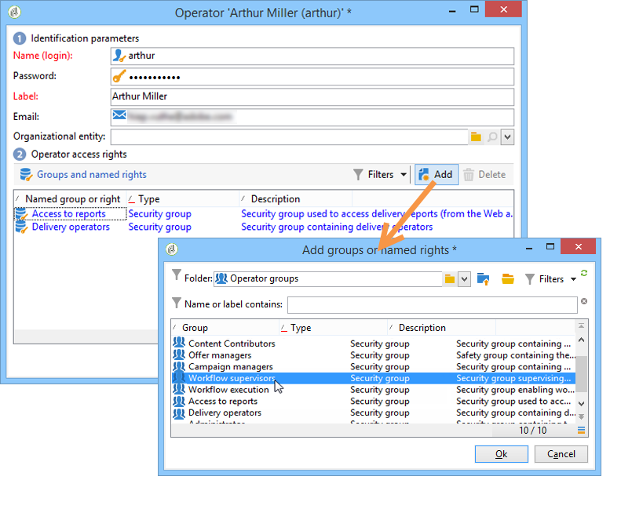
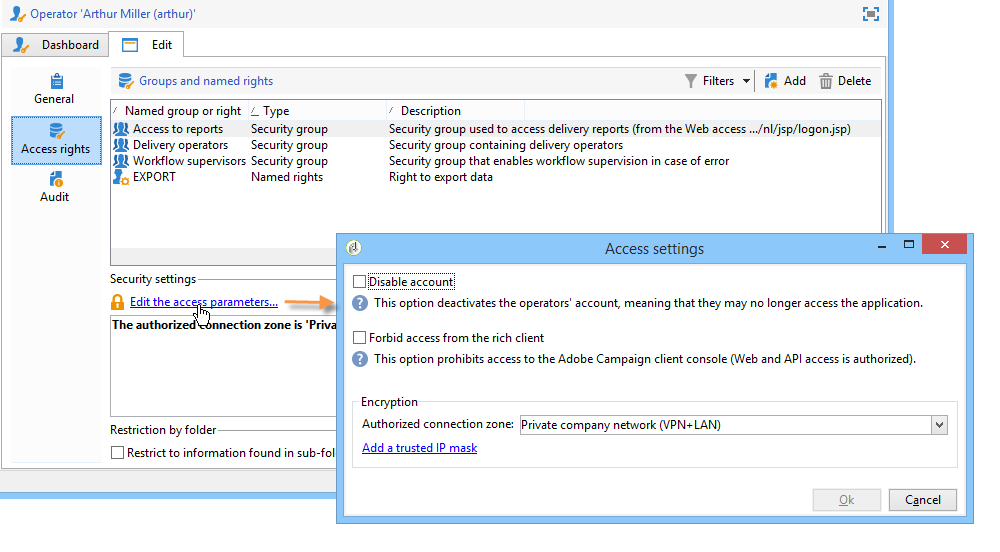
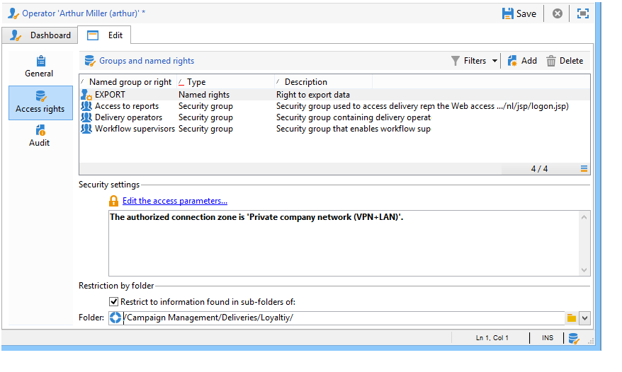

# 建立和管理運算子{#operators}

## 開始使用促銷活動運算子{#about-operators}

運算子是具有登入及執行動作權限的Adobe Campaign使用者。

預設情況下，運算子儲存在&#x200B;**[!UICONTROL Administration > Access management > Operators]**&#x200B;節點中。

可以手動建立運算子，也可以在現有LDAP目錄上映射運算子。

有關建立運算子的完整過程，請參閱[本頁](#creating-an-operator)。

有關Adobe Campaign和LDAP整合的詳細資訊，請參閱[本頁](../../installation/using/connecting-through-ldap.md)。

>[!IMPORTANT]
>
>操作員必須連結至安全區才能登入例項。 有關Adobe Campaign安全區的詳細資訊，請參閱[本頁](../../installation/using/security-zones.md)。

使用者也可以使用其Adobe ID直接連線至Adobe Campaign。 如需關於此項目的詳細資訊，請參閱此[頁面](../../integrations/using/about-adobe-id.md)。

## 建立運算子{#creating-an-operator}

若要建立新的運算元並授與權限，請遵循下列步驟：

1. 按一下運算子清單上方的&#x200B;**[!UICONTROL New]**&#x200B;按鈕，然後輸入新運算子的詳細資訊。

   

1. 指定使用者的&#x200B;**[!UICONTROL Identification parameters]**:其登錄名、密碼和名稱。 操作員將使用登錄和密碼登錄到Adobe Campaign。 用戶登錄後，他們可以通過&#x200B;**[!UICONTROL Tools > Change password]**&#x200B;菜單更改其密碼。 營運商的電子郵件至關重要，因為它可讓營運商接收通知，例如在處理核準時。

   此部分也可讓您將運算子連結至組織實體。 有關詳細資訊，請參閱[此頁](../../campaign/using/about-distributed-marketing.md)。

1. 在&#x200B;**[!UICONTROL Operator access rights]**&#x200B;區段中選擇授予操作員的權限。

   若要指派運算元的權限，請按一下權限清單上方的&#x200B;**[!UICONTROL Add]**&#x200B;按鈕，然後從可用群組清單中選取一組運算元：

   

   您也可以選取一或多個命名權限（請參閱[命名權限](#named-rights)）。 若要這麼做，請按一下&#x200B;**[!UICONTROL Folder]**&#x200B;欄位右側的箭頭，然後選取&#x200B;**[!UICONTROL Named rights]**:

   

   選擇要分配的組和／或命名權限，然後按一下&#x200B;**[!UICONTROL OK]**&#x200B;進行驗證。

1. 按一下&#x200B;**[!UICONTROL Ok]**&#x200B;以建立運算子：此描述檔會新增至現有運算子的清單。

   

>[!NOTE]
>
>您可以建立新的運算元資料夾，以根據您的需求來組織運算元。 若要這麼做，請在運算子資料夾上按一下滑鼠右鍵，然後選取&#x200B;**[!UICONTROL Add an 'Operators' folder]**。

在建立運算子的描述檔後，您就可以新增或更新其資訊。 要執行此操作，請按一下&#x200B;**[!UICONTROL Edit]**&#x200B;頁籤。

>[!NOTE]
>
>**[!UICONTROL Session timeout]**&#x200B;欄位可讓您調整FDA作業逾時前的延遲。 有關詳細資訊，請參閱[關於同盟資料存取](../../installation/using/about-fda.md)。

## 定義運算子的時區{#time-zone-of-the-operator}

在&#x200B;**[!UICONTROL General]**&#x200B;標籤中，可以選擇運算子的時區。 依預設，運算子在伺服器時區中運作。 不過，您也可以使用下拉式清單選取另一個時區。

本頁[說明時區配置。](../../installation/using/time-zone-management.md)

>[!NOTE]
>
>不同時區內的協作需要以UTC儲存日期。 日期會在下列上下文中在適當的時區內轉換：在用戶時區中顯示日期時，在導入和導出檔案時，在排程電子郵件傳送時，在工作流中排程活動時（調度程式、等待、時間約束等）
>
>與這些情況有關的制約因素和建議載於Adobe Campaign檔案的有關章節。

此外，**[!UICONTROL Regional settings]**&#x200B;下拉式清單可讓您選擇顯示日期和數字的格式。

## 新增權限{#access-rights-options}

使用&#x200B;**[!UICONTROL Access rights]**&#x200B;標籤來更新連結至運算子的群組和命名權限。

**[!UICONTROL Edit the access parameters...]**&#x200B;連結可讓您存取下列選項：

* **[!UICONTROL Disable account]**&#x200B;選項可讓您停用運算子的帳戶：他不會再去Adobe Campaign。

   >[!NOTE]
   >
   >即使其帳戶已停用，營運商仍可接收來自促銷活動的警報或通知。 若要停止傳送促銷活動通知給此運算子，Adobe建議您從其個人資料中移除電子郵件地址。

* **[!UICONTROL Forbid access from the rich client]**&#x200B;選項可讓您將Adobe Campaign的使用限制為[Web存取](../../platform/using/adobe-campaign-workspace.md#console-and-web-access)或透過API:無法再存取Adobe Campaign用戶端主控台。
* 可以把安全區和操作員連接起來。 有關詳細資訊，請參見[此頁面](../../installation/using/security-zones.md)。
* 您也可以使用適當的連結來定義受信任的IP遮罩。

   如果IP位址在此清單中，則營運商將可以連線至Adobe Campaign，而不需輸入密碼。

   您也可以指定一組IP位址，這些位址將被授權在不使用密碼的情況下進行連線，例如在下列範例中：

   

   >[!NOTE]
   >
   >為保全您平台的存取權，必須小心使用此選項。

* **[!UICONTROL Restrict to information found in sub-folders of:]**&#x200B;選項可讓您限制屬於資料夾運算子的權限。 用戶只能看到此選項中指定的節點的子資料夾：

   

   >[!IMPORTANT]
   >
   >這是非常嚴格的限制，必須謹慎使用。 以此類權限登錄的操作員只能查看指定資料夾的內容，並且無法通過瀏覽器訪問樹的任何其他節點。 不過，視他可存取的功能而定(例如：工作流程)，則他可顯示通常儲存在他看不到的節點中的資料。

### 檢查設定{#check-settings}

**[!UICONTROL Audit]**&#x200B;標籤可讓您檢視與運算子相關的資訊。 根據操作員干預區中定義的設定，將各種頁籤自動添加到。

您可以存取：

* 連結至運算子之資料夾的權限清單。

   

   >[!NOTE]
   >
   >有關詳細資訊，請參閱[資料夾訪問管理](#folder-access-management)。

* 操作員批准日誌。

   

* 他們所訂閱的論壇清單。
* 日曆中的事件。
* 指派給它們的任務清單。

## 預設運算子{#default-operators}

Adobe Campaign使用技術營運商，預設設定了描述檔：管理員（「管理員」）、帳單（「帳單」）、監控、Web應用程式代理(「webapp」)等。 其中一些取決於平台上安裝的應用程式和選項：例如，&#39;central&#39;和&#39;local&#39;運算子只有在安裝了Distributed Marketing選項時才會顯示。

>[!IMPORTANT]
>
>當平台傳回資訊訊息時，這些技術營運商會依預設收到通知。 我們強烈建議為他們提供聯絡人電子郵件。
>
>為確保Web應用程式正常運作，我們也建議不要為「webapp」運算子定義特定的地區設定。

依預設，「webapp」技術營運商具有命名的「管理」權限，這可能導致安全風險。 若要修正此問題，建議移除此權限。 操作步驟：

1. 在&#x200B;**[!UICONTROL Administration > Access management > Named rights]**&#x200B;節點中，按一下&#x200B;**[!UICONTROL New]**&#x200B;以建立一個右側名稱，並將其命名為WEBAPP。

   

   [Named rights](#named-rights)一節中詳述了命名權限。

1. 從&#x200B;**[!UICONTROL Administration > Access management > Operators]**&#x200B;節點中，選擇Web應用程式代理運算子(&#39;webapp&#39;)。

   選擇&#x200B;**[!UICONTROL Edit]**&#x200B;頁籤，然後選擇&#x200B;**[!UICONTROL Access rights]**&#x200B;頁籤，並從清單中刪除名為右的ADMINISTRATION。

   

   按一下&#x200B;**[!UICONTROL Add]**&#x200B;並選取您剛建立的WEBAPP，然後儲存變更。

   

1. 為關注此運算子的資料夾（主要是「收件者」資料夾）指派「webapp」運算子的讀取和寫入資料存取權限。

   

   在[資料夾訪問管理](#folder-access-management)部分中詳細介紹了修改樹資料夾的權限。

>[!NOTE]
>
>有關安全性准則的詳細資訊，請參閱[Adobe Campaign安全性配置檢查清單](https://helpx.adobe.com/tw/campaign/kb/acc-security.html)。
