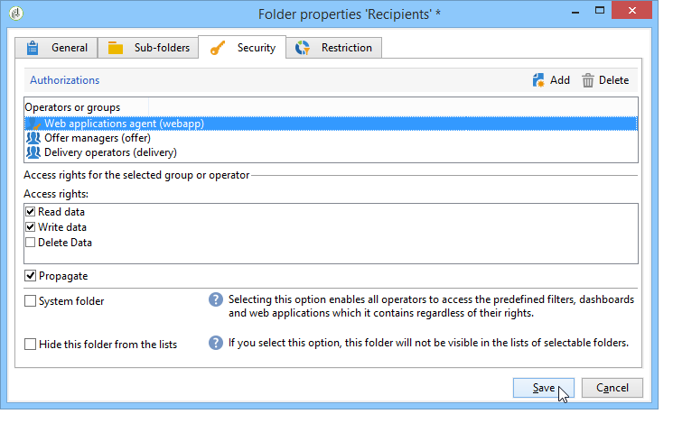

# 建立及管理操作者 {#operators}

## 開始使用Campaign運算子  {#about-operators}

運算子是具有登入及執行動作權限的Adobe Campaign使用者。

預設情況下，運算子儲存在&#x200B;**[!UICONTROL Administration > Access management > Operators]**&#x200B;節點中。

可以手動建立運算子，或在現有LDAP目錄上映射運算子。

[本頁](#creating-an-operator)中描述了建立運算子的完整過程。

如需Adobe Campaign和LDAP整合的詳細資訊，請參閱[本頁面](../../installation/using/connecting-through-ldap.md)。

>[!IMPORTANT]
>
>運算子必須連結至安全區域才能登入執行個體。 有關Adobe Campaign中安全區域的詳細資訊，請參閱[本頁](../../installation/using/security-zones.md)。

使用者也可以使用其Adobe ID直接連線至Adobe Campaign。 如需關於此項目的詳細資訊，請參閱此[頁面](../../integrations/using/about-adobe-id.md)。

## 建立運算子 {#creating-an-operator}

若要建立新運算子並授予權限，請遵循下列步驟：

1. 按一下運算子清單上方的&#x200B;**[!UICONTROL New]**&#x200B;按鈕，然後輸入新運算子的詳細資訊。

   

1. 指定用戶的&#x200B;**[!UICONTROL Identification parameters]**:其登錄名、密碼和名稱。 運算子將使用登入和密碼來登入Adobe Campaign。 用戶登錄後，他們可以通過&#x200B;**[!UICONTROL Tools > Change password]**&#x200B;菜單更改其密碼。 運算子的電子郵件至關重要，因為它可讓運算子接收通知，例如在處理核準時。

   本節也可讓您將運算子連結至組織實體。 有關詳細資訊，請參閱[此頁](../../campaign/using/about-distributed-marketing.md)。

1. 在&#x200B;**[!UICONTROL Operator access rights]**&#x200B;區段中選取授予運算子的權限。

   要為運算子分配權限，請按一下權限清單上方的&#x200B;**[!UICONTROL Add]**&#x200B;按鈕，然後從可用組清單中選擇一組運算子：

   

   您也可以選取一或多個已命名的權限（請參閱[已命名的權限](#named-rights)）。 要執行此操作，請按一下&#x200B;**[!UICONTROL Folder]**&#x200B;欄位右側的箭頭，然後選擇&#x200B;**[!UICONTROL Named rights]**:

   

   選擇要分配的組和/或已命名的權限，然後按一下&#x200B;**[!UICONTROL OK]**&#x200B;進行驗證。

1. 按一下&#x200B;**[!UICONTROL Ok]**&#x200B;以建立運算子：會將設定檔新增至現有運算子清單。

   

>[!NOTE]
>
>您可以建立新的運算子資料夾，以根據您的需求組織運算子。 要執行此操作，請按一下右鍵運算子資料夾並選擇&#x200B;**[!UICONTROL Add an 'Operators' folder]**。

建立運算子的設定檔後，您就可以新增或更新其資訊。 要執行此操作，請按一下&#x200B;**[!UICONTROL Edit]**&#x200B;標籤。

>[!NOTE]
>
>**[!UICONTROL Session timeout]**&#x200B;欄位可讓您調整FDA工作階段逾時前的延遲。 有關詳細資訊，請參閱[關於同盟資料存取](../../installation/using/about-fda.md)。

## 定義運算子的時區 {#time-zone-of-the-operator}

在&#x200B;**[!UICONTROL General]**&#x200B;索引標籤中，您可以選取運算子的時區。 依預設，運算子會在伺服器時區中運作。 不過，您可以使用下拉式清單選取其他時區。

[本頁](../../installation/using/time-zone-management.md)說明了時區的配置。

>[!NOTE]
>
>不同時區內的協作需要以UTC儲存日期。 在下列情況下，日期會在適當的時區中轉換：當日期顯示在使用者時區時、匯入和匯出檔案時、排程電子郵件傳送時、排程工作流程中的活動時（排程器、等待、時間限制等）
>
>Adobe Campaign檔案的相關章節列出了與這些背景有關的限制和建議。

此外， **[!UICONTROL Regional settings]**&#x200B;下拉式清單可讓您選取顯示日期和數字的格式。

## 新增權限 {#access-rights-options}

使用&#x200B;**[!UICONTROL Access rights]**&#x200B;標籤更新連結到運算子的組和命名權限。

**[!UICONTROL Edit the access parameters...]**&#x200B;連結可讓您存取下列選項：

* **[!UICONTROL Disable account]**&#x200B;選項可讓您停用運算子的帳戶：他將不再訪問Adobe Campaign。

   >[!NOTE]
   >
   >即使其帳戶已停用，運算子仍可從Campaign接收警報或通知。 若要停止傳送Campaign通知給此運算子，Adobe建議您從其設定檔中移除電子郵件地址。

* **[!UICONTROL Forbid access from the rich client]**&#x200B;選項可讓您將Adobe Campaign的使用限制為[Web存取](../../platform/using/adobe-campaign-workspace.md#console-and-web-access)或透過API:無法再存取Adobe Campaign用戶端主控台。
* 可以將安全區連結到操作員。 如需詳細資訊，請參閱[此頁面](../../installation/using/security-zones.md)。
* 您也可以使用適當的連結來定義受信任的IP遮罩。

   如果運算子的IP位址在此清單中，該運算子便能直接連線至Adobe Campaign，而不需輸入密碼。

   您也可以指定一組IP位址，這些位址將獲授權不使用密碼即可連線，如下列範例：

   

   >[!NOTE]
   >
   >若要確保平台存取安全，您必須謹慎使用此選項。

* **[!UICONTROL Restrict to information found in sub-folders of:]**&#x200B;選項可讓您限制歸因於資料夾運算子的權限。 用戶只能看到此選項中指定的節點的子資料夾：

   

   >[!IMPORTANT]
   >
   >這是非常嚴格的限制，必須小心使用。 以此類權限登錄的運算子只能查看指定資料夾的內容，並且無法通過資源管理器訪問樹的任何其他節點。 不過，視他可存取的功能而定(例如：工作流程)，他可以顯示通常儲存在他看不到的節點中的資料。

### 檢查設定 {#check-settings}

**[!UICONTROL Audit]**&#x200B;標籤可讓您檢視與運算子相關的資訊。 系統會根據運算子干預區域中定義的設定，自動將各種標籤新增至。

您可以存取：

* 連結到運算子的資料夾權限清單。

   

   >[!NOTE]
   >
   >有關詳細資訊，請參閱[資料夾訪問管理](#folder-access-management)。

* 操作員批准日誌。

   

* 他們所訂閱的論壇清單。
* 日曆中的事件。
* 分配給它們的任務清單。

## 預設運算子 {#default-operators}

Adobe Campaign使用技術運算子，預設會設定設定檔：管理員（「管理員」）、帳單（「帳單」）、監控、Web應用程式代理(「webapp」)等 其中有些取決於平台上安裝的應用程式和選項：例如，「central」和「local」運算子只有在安裝了「Distributed Marketing」選項時才會顯示。

>[!IMPORTANT]
>
>當平台傳回資訊訊息時，預設會通知這些技術營運商。 我們強烈建議為使用者提供聯絡電子郵件。
>
>為確保Web應用程式正常運作，我們也建議不要為「webapp」運算子定義特定的區域設定。

依預設，「webapp」技術運算子具有命名的「管理」權限，這可能會導致安全風險。 若要解決此問題，建議您移除此權限。 操作步驟：

1. 從&#x200B;**[!UICONTROL Administration > Access management > Named rights]**&#x200B;節點中，按一下&#x200B;**[!UICONTROL New]**&#x200B;建立右鍵，並將其命名為WEBAPP。

   

   在[命名權限](#named-rights)部分中詳細說明命名權限。

1. 從&#x200B;**[!UICONTROL Administration > Access management > Operators]**&#x200B;節點中，選擇Web應用程式代理運算子(「webapp」)。

   選擇&#x200B;**[!UICONTROL Edit]**&#x200B;頁簽，然後選擇&#x200B;**[!UICONTROL Access rights]**&#x200B;頁簽，並從清單中刪除名為右的ADMINISTRATION。

   

   按一下&#x200B;**[!UICONTROL Add]**&#x200B;並選取您剛建立的WEBAPP，然後儲存您的變更。

   

1. 為與此運算子相關的資料夾（主要是「收件者」資料夾）指派「webapp」運算子讀取和寫入資料存取權限。

   

   在[資料夾訪問管理](#folder-access-management)部分中詳細說明了修改樹資料夾的權限。

>[!NOTE]
>
>如需安全性准則的詳細資訊，請參閱[Adobe Campaign安全性設定檢查清單](https://helpx.adobe.com/tw/campaign/kb/acc-security.html)。
