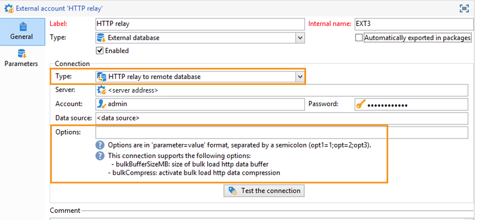

# 其他選項 {#additional-options}


<!--

## HTTP relay to a remote instance {#http-relay-to-a-remote-instance}

You can access external databases configured in remote instances using the HTTP protocol.

>[!NOTE]
>
>Not all SQL data types are supported by this feature. Blob data types are not supported at all. It is possible that other data types may not work depending on the targeted database (Timestamp on Microsoft SQL Server, for example). Please contact Adobe support for more information.

This simplifies transferring and synchronizing data between two instances. It also enables you to sidestep any tunneling between an instance and a remote database as well as the installation of the client layers to access this database. The destination instance can be a hosted instance.

>[!CAUTION]
>
>This option is only for facilitating data replication flows (ETL).   
>
>For example, it allows a cloud-hosted instance to have direct access to the data in an "on-premise" hosted database. However, it is not intended to allow targeting to be carried on an "on-premise" hosted database directly from the cloud.

To do this, you must configure the external accounts of the two instances so that the local instance can communicate with the remote instance using the HTTP protocol:

* Local instance: select the new **[!UICONTROL HTTP relay to a remote database]** connection type.

  In case of bulk load data transfer, also specify the buffer size. Select the compression option if you want to reduce the size of the transferred data.

  The **[!UICONTROL Data source]** must be defined with the following syntax: "nms:extAccount : `<internal_name_of_the_external_account>`"

  

  >[!NOTE]
  >
  >We recommend that you use an HTTPS connection.

* Remote instance: in the FDA external account of the database accessed via the HTTP relay, check the Target of an **[!UICONTROL 'HTTP relay to a remote database' account option]**.

  

The following example shows the new possible operating mode:


>[!CAUTION]
>
>The default database of the remote instance must be accessed via an external account as well.

This operating method avoids that the cleanup workflow of each instance deletes the work tables of the databases that use the instance as relay.

Thus, in the previous example, the cleanup workflow of the remote instance will not perform any action on the red FDA database as it is used by the local instance.

-->

## 直接建立臨時結構 {#directly-creating-temporary-schemas}

如果您想要管理對FDA外部資料庫的數次存取，新選項可讓您在設定外部帳戶時直接建立使用中的架構。

>[!NOTE]
>
>此選項僅適用於PostgreSQL。


## 使用外部資料最佳化電子郵件個人化 {#optimizing-email-personalization-with-external-data}

從build 8740開始，此選 **[!UICONTROL Prepare the personalization data with a workflow]** 項現在可在傳送屬 **[!UICONTROL Analysis]** 性的標籤中取用。

在傳送分析期間，此選項會自動建立並執行將所有連結至目標的資料儲存在暫存表格中的工作流程，包括FDA中連結之表格的資料。

勾選此選項，可大幅提升執行個人化的效能。

<!--

## Cloud Messaging - FDA synchronization {#cloud-messaging---fda-synchronization}

When the Cloud Messaging server and the Marketing server have not been synchronized for a long period, the volume of missing broadlogs on the Marketing server can be significant. To optimize broadlog synchronization via the FDA, the **NmsMidSourcing_LogsPeriodHour** option has been added. This allows a maximum period (expressed in hours) to be specified as to limit the number of broadlogs recovered every time the synchronization workflow is executed.

The option is to be added in the console, in the **[!UICONTROL Administration > Options]** node.

>[!CAUTION]
>
>This option must **only** be used for synchronizing a significant volume of broadlogs via the FDA.

>[!NOTE]
>
>The option is only taken into account if a last recovery date exists (**NmsMidSourcing_LastBroadLog_&#42;** option).

## Message Center - Read access on the XtkFolder table {#message-center---read-access-on-the-xtkfolder-table}

From build 8141 and above, manual action is necessary if Message Center uses the FDA as an archiving mode.

You need to grant read access on the XtKFolder table to the user linked with the external FDA account.

For a PostgreSQL database for example, the command is as follows:

```
GRANT SELECT ON XtkFolder TO DBUSER;
```

This user must have read access to the following tables:

* NmsBroadLogRtEvent
* NmsBroadLogBatchEvent
* NmsTrackingLogRtEvent
* NmsTrackingLogBatchEvent
* NmsRtEvent
* NmsBatchEvent
* NmsBroadLogMsg
* NmsTrackingUrl
* NmsDelivery
* NmsWebTrackingLog

>[!NOTE]
>
>This modification deletes the "Permission denied for relation xtkfolder" error message.

If the working schema selected in the external FDA account is not the out-of-the-box Neolane account, then this modification to the access rights is not necessary.

-->

