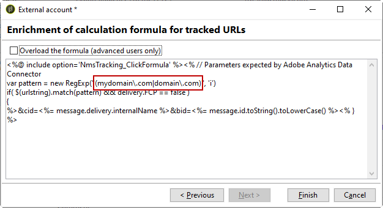

# Adobe Analytics 連接器{#adobe-analytics-connector}

## 關於 Adobe Analytics 連接器整合 {#about-analytics-connector-integration}

Adobe Analytics 連接器可讓 Adobe Campaign 和 Adobe Analytics 透過 **[!UICONTROL Web Analytics connectors]** 套件互動。 它會以關於行銷活動後使用者行為的區段形式將資料轉送至Adobe Campaign。 相反地，它會將Adobe Campaign所傳遞行銷活動的指標和屬性傳送至Adobe Analytics。

>[!CAUTION]
>
>* Adobe Analytics 連接器與異動訊息 (訊息中心) 不相容。
>
>* 開始之前，請確定已在 Campaign 中實施 Adobe Identity Management 系統 (IMS)。 [在本頁中深入瞭解](../../integrations/using/about-adobe-id.md)。

Adobe Campaign 使用 Adobe Analytics 連接器可測量網際網路對象 (Web Analytics)。 有了這些整合，Adobe Campaign 便能復原行銷活動後一或多個網站的訪客行為資料，並 (在分析後) 使用視圖執行再次行銷活動，以便將其轉換為購買者。 反之，Adobe Campaign 的網頁分析工具可將指標和行銷活動屬性轉送至其平台。

每個工具的動作欄位如下：

* 網站分析的角色：

   1. 會標籤透過Adobe Campaign啟動的行銷活動，
   1. 以區段的形式，儲存收件者在按一下行銷活動後所瀏覽的網站上的行為。 區段與放棄的產品 (已檢視但未新增至購物車或已購買)、購買物或購物車放棄有關。

* Adobe Campaign 的角色：

   1. 將指標和行銷活動屬性傳送至連接器，連接器再將它們轉送至網頁分析工具，
   1. 恢復和分析區段，
   1. 觸發再次行銷活動。

## 設定整合 {#setting-up-the-integration}

>[!IMPORTANT]
>
> 針對混合部署和內部部署實作，請務必遵循此[頁面](../../platform/using/adobe-analytics-provisioning.md)中詳述的佈建步驟。

若要設定資料連接器，您必須連線至 Adobe Campaign 執行個體並執行下列操作：

1. [設定轉換變數和成功事件](#configure-conversion-success)
1. [在 Adobe Campaign Classic 中設定您的外部帳戶](#external-account-classic)

<!--
### Create your Report suite in Adobe Analytics {#report-suite-analytics}

To set up the Adobe Analytics/Adobe Campaign Classic integration, you must connect to your [!DNL Adobe Analytics] instance and perform the following operations:

1. From [!DNL Adobe Analytics], select the **[!UICONTROL Admin tab]** then click **[!UICONTROL All admin]**.

   

1. Click **[!UICONTROL Report suites]**.

   

1. From the **[!UICONTROL Report suite manager]** page, click **[!UICONTROL Create new]** then **[!UICONTROL Report suite]**.

   For the detailed procedure on **[!UICONTROL Report suite]** creation, refer to this [section](https://experienceleague.adobe.com/docs/analytics/admin/manage-report-suites/new-report-suite/t-create-a-report-suite.html#prerequisites).

   

1. Select a template. 

1. Configure your new report suite with the following information:

   * **[!UICONTROL Report Suite ID]**
   * **[!UICONTROL Site Title]**
   * **[!UICONTROL Time Zone]**
   * **[!UICONTROL Go Live Date]**
   * **[!UICONTROL Estimated Page Views Per Day]**

   

1. When configured, click **[!UICONTROL Create report suite]**.
-->

### 設定轉換變數和成功事件 {#configure-conversion-success}

您需要依照以下方式對您的 **[!UICONTROL Conversion variables]** 和 **[!UICONTROL Success events]** 進行設定:

1. 選取您要連結至 Adobe Campaign 的&#x200B;**[!UICONTROL Report suite]**。

1. 從&#x200B;**[!UICONTROL Edit settings]**&#x200B;按鈕中選取&#x200B;**[!UICONTROL Conversion]** >  **[!UICONTROL Conversion variables]**。

   

1. 按一下 **[!UICONTROL Add new]** 建立測量促銷活動影響所需的識別碼，即內部促銷活動名稱(cid)和iNmsBroadlog (bid)表格ID。

   若要瞭解如何編輯&#x200B;**[!UICONTROL Conversion variables]**，請參閱本[節](https://experienceleague.adobe.com/docs/analytics/admin/admin-tools/conversion-variables/t-conversion-variables-admin.html#admin-tools)。

   

1. 完成時，按一下&#x200B;**[!UICONTROL Save]**。

1. 然後，要建立&#x200B;**[!UICONTROL Success events]**，請從&#x200B;**[!UICONTROL Edit settings]**&#x200B;按鈕中選擇&#x200B;**[!UICONTROL Conversion]** > **[!UICONTROL Success events]**。

   

1. 按一下&#x200B;**[!UICONTROL Add new]**&#x200B;以設定以下&#x200B;**[!UICONTROL Success events]**：

   * **[!UICONTROL Clicked]**
   * **[!UICONTROL Opened]**
   * **[!UICONTROL Person clicks]**
   * **[!UICONTROL Processed]**
   * **[!UICONTROL Scheduled]**
   * **[!UICONTROL Sent]**
   * **[!UICONTROL Total bounces]**
   * **[!UICONTROL Unique Clicks]**
   * **[!UICONTROL Unique Opens]**
   * **[!UICONTROL Unsubscribed]**

   若要瞭解如何設定&#x200B;**[!UICONTROL Success events]**，請參閱本[節](https://experienceleague.adobe.com/docs/analytics/admin/admin-tools/success-events/t-success-events.html#admin-tools).

   >[!NOTE]
   >
   > 僅支援數值類型的&#x200B;**[!UICONTROL Success events]**。

   

1. 完成時，按一下&#x200B;**[!UICONTROL Save]**。

設定&#x200B;**[!UICONTROL Conversion variables]**&#x200B;和&#x200B;**[!UICONTROL Success events]**&#x200B;後，請確定變數包含在為 Analytics 連接器建立的&#x200B;**[!UICONTROL Product Profile]**&#x200B;中。 如需詳細資訊，請參閱[建立 Adobe Analytics 產品設定檔](../../platform/using/adobe-analytics-provisioning.md#analytics-product-profile)。

然後，您需要在 Adobe Campaign Classic 中設定&#x200B;**[!UICONTROL External accounts]**。

### 在 Adobe Campaign Classic 中設定您的外部帳戶 {#external-account-classic}

>[!IMPORTANT]
>
> 為了讓此整合發揮作用，您需要在 Adobe Campaign 中安裝&#x200B;**[!UICONTROL Web Analytics connectors]**&#x200B;套件。
>
>如需套件安裝的詳細資訊，請參閱本[頁面](../../installation/using/installing-campaign-standard-packages.md)。

您現在需要在 Adobe Campaign 中設定 **[!UICONTROL Web Analytics]** 外部帳戶，以啟用兩個解決方案之間的同步。

請注意，如果在設定外部帳戶時未顯示 **[!UICONTROL Report suite]**、**[!UICONTROL Conversion variables]** 或 **[!UICONTROL Success events]**&#x200B;之一，這表示您在與使用者相關聯的 **[!UICONTROL Product profile]** 中缺少此新建立元件的權限。

如需詳細資訊，請參閱 [Adobe Analytics 的產品設定檔](https://experienceleague.adobe.com/docs/analytics/admin/admin-console/permissions/product-profile.html#product-profile-admins)頁面。

1. 前往 Adobe Campaign 樹的 **[!UICONTROL Administration]** > **[!UICONTROL Platform]** > **[!UICONTROL External accounts]** 資料夾，然後按一下 **[!UICONTROL New]**。

   

1. 使用下拉式清單，從 **[!UICONTROL Integration]** 下拉式清單中選取 **[!UICONTROL Web Analytics]** 類型和 **[!UICONTROL Adobe Analytics]**。

   

1. 按一下 **[!UICONTROL Integration]** 下拉式清單旁的 **[!UICONTROL Configure]** 。

1. 從 **[!UICONTROL Configure Analytics integration]** 視窗，將外部帳戶與報告套裝對應，並提供下列資訊：

   * **[!UICONTROL E-Mail]**
   * **[!UICONTROL IMS Org]**
   * **[!UICONTROL Analytics Company]**
   * **[!UICONTROL Report Suite]**

1. 從 **[!UICONTROL eVars]** 類別中，對應在 [!DNL Adobe Analytics] 中設定的兩個 **[!UICONTROL Conversion variables]**。

   

1. 從 **[!UICONTROL Events]** 類別中，對應 [!DNL Adobe Analytics] 中設定的 10 個&#x200B;**[!UICONTROL Success events]**。

1. 完成時，按一下 **[!UICONTROL Submit]**。Adobe Campaign 會在對應的 Analytics **[!UICONTROL Report Suite]**&#x200B;中建立 **[!UICONTROL Data source]**、**[!UICONTROL Calculated metrics]**、**[!UICONTROL Remarketing segments]** 和 **[!UICONTROL Classifications]**。

   在 [!DNL Adobe Analytics] 和 Adobe Campaign 之間同步完成後，您可以關閉視窗。

1. 您可以從 **[!UICONTROL Configure Analytics integration]** 視窗的 **[!UICONTROL Data Settings]** 標籤檢視設定。

   使用 **[!UICONTROL Sync]** 按鈕， [!DNL Adobe Campaign] 將同步在 [!DNL Adobe Analytics] 中完成的名稱變更。 如果在 [!DNL Adobe Analytics] 中刪除元件，則將在 [!DNL Adobe Campaign] 中刪除該元件，或顯示為 **未找到**&#x200B;訊息。

   

1. 如有需要，您可以從 **[!UICONTROL Update Segments]** 標籤新增或移除區段。

1. 在 **[!UICONTROL External account]** 中，按一下 **[!UICONTROL Enrich the formula...]** 連結以變更 URL 計算公式，以指定網站分析工具整合資訊 (行銷活動 ID) 和必須追蹤其活動的網站網域。

   

1. 指定網站的網域名稱。

   

1. 按一下 **[!UICONTROL Next]** 並確保已儲存域名。

   

1. 如有必要，您可以多載計算公式。 要執行此操作，請核取方塊並直接在視窗中編輯公式。

   >[!IMPORTANT]
   >
   >此設定模式為專家使用者保留：此公式中的任何錯誤都可能導致傳送停止。

1. **[!UICONTROL Advanced]**&#x200B;標籤可讓您設定或修改更多技術設定。

   * **[!UICONTROL Lifespan]**：可讓您 (以天為單位) 指定延遲，之後技術工作流程便可在 Adobe Campaign 中復原 Web 事件。預設值：180天。
   * **[!UICONTROL Persistence]**：可讓您定義所有Web事件（例如購買）可歸因於再次行銷活動的期間，預設值：7天。

>[!NOTE]
>
>如果您使用數個對象測量工具，可在建立外部帳戶時，於&#x200B;**[!UICONTROL Partners]**&#x200B;下拉式清單中選取&#x200B;**[!UICONTROL Other]**。 您只能在傳送屬性中參考一個外部帳戶：因此，您需要借由新增 Adobe 預期的參數以及所有其他測量工具，調整追蹤 URL 的公式。

### 網站分析流程的技術工作流程 {#technical-workflows-of-web-analytics-processes}

Adobe Campaign 和 Adobe Analytics 之間的資料交換由四個技術工作流程處理，以作為背景工作執行。

它們可在 Adobe Campaign 樹中的 **[!UICONTROL Administration]** > **[!UICONTROL Production]** > **[!UICONTROL Technical workflows]** > **[!UICONTROL Web analytics process]** 資料夾下使用。

* **[!UICONTROL Recovering of web events]**：每小時一次，此工作流程會下載關於指定網站上使用者行為的區段，並將其納入 Adobe Campaign 資料庫中，然後開始再次行銷工作流程。
* **[!UICONTROL Event purge]**：此工作流程可讓您根據欄位中設定的期間，從資料庫刪除所有 **[!UICONTROL Lifespan]** 事件。如需詳細資訊，請參閱[在 Adobe Campaign Classic 中設定外部帳戶](#external-account-classic)。
* **[!UICONTROL Identification of converted contacts]**：再次行銷活動後購買的訪客目錄。此工作流程收集的資料可在&#x200B;**[!UICONTROL Re-marketing efficiency]**&#x200B;報搞中存取，請參閱本[頁面](#creating-a-re-marketing-campaign)。
* **[!UICONTROL Sending of indicators and campaign attributes]**：可讓您使用Adobe Analytics Connector，透過Adobe Campaign將行銷活動指標傳送至Adobe Experience Cloud。 此工作流程每天凌晨 4:00 會觸發，且可能需要 24 小時才會將資料傳送至 Analytics。

   請注意，不應重新啟動此工作流程，否則會重新傳送所有可能扭曲 Analytics 結果的先前資料。

   相關指標包括：

   * **[!UICONTROL Messages to deliver]** (@toDeliver)
   * **[!UICONTROL Processed]** (@processed)
   * **[!UICONTROL Success]** (@success)
   * **[!UICONTROL Total count of opens]** (@totalRecipientOpen)
   * **[!UICONTROL Recipients who have opened]** (@recipientOpen)
   * **[!UICONTROL Total number of recipients who clicked]** (@totalRecipientClick)
   * **[!UICONTROL People who clicked]** (@personClick)
   * **[!UICONTROL Number of distinct clicks]** (@recipientClick)
   * **[!UICONTROL Opt-Out]** (@optOut)
   * **[!UICONTROL Errors]** (@error)

   >[!NOTE]
   >
   >傳送的資料是根據上次快照的差值，可能導致量度資料中的負值。

   傳送的屬性如下：

   * **[!UICONTROL Internal name]** (@internalName)
   * **[!UICONTROL Label]** (@label)
   * **[!UICONTROL Label]** (operation/@label): 僅在安裝了 **** Campaign 套件時
   * **[!UICONTROL Nature]** (operation/@nature): 僅在安裝了 **** Campaign 套件時
   * **[!UICONTROL Tag 1]** (webAnalytics/@tag1)
   * **[!UICONTROL Tag 2]** (webAnalytics/@tag2)
   * **[!UICONTROL Tag 3]** (webAnalytics/@tag3)
   * **[!UICONTROL Contact date]** (scheduling/@contactDate)

## 在 Adobe Campaign 中追蹤傳遞 {#tracking-deliveries-in-adobe-campaign}

為了讓 Adobe Experience Cloud 在 Adobe Campaign 傳送後能夠追蹤網站上的活動，您必須在傳送屬性中參考相符的連接器。 若要這麼做，請套用下列步驟：

1. 開啟要追蹤之行銷活動的傳送。

   

1. 開啟傳送屬性。
1. 前往&#x200B;**[!UICONTROL Web Analytics]**&#x200B;標籤，並選取先前建立的外部帳戶。 請參閱[在 Adobe Campaign Classic 中設定外部帳戶](#external-account-classic)。

   

1. 您現在可以傳送傳遞內容，並在 Adobe Analytics 中存取報告。

## 建立再行銷活動 {#creating-a-re-marketing-campaign}

若要準備再次行銷活動，只需建立要用於再次行銷類型行銷活動的傳送範本。 然後設定再次行銷活動，並將其連結至區段。 每個區段必須有不同的再次行銷活動。

當 Adobe Campaign 完成分析初始行銷活動鎖定目標之人員的行為的區段後，就會自動開始再次行銷活動。 如果放棄購買或檢視產品而未進行購買，則會傳送傳遞內容給相關收件者，以便讓其在結束網站瀏覽時進行購買。

Adobe Campaign 提供個人化傳送範本，供您自行使用或建立資料庫，以準備行銷活動。

1. 從&#x200B;**[!UICONTROL Explorer]**，前往 Adobe Campaign 樹的&#x200B;**[!UICONTROL Resources]** > **[!UICONTROL Templates]** > **[!UICONTROL Delivery templates]**&#x200B;資料夾。

1. 複製 Adobe Campaign 提供的&#x200B;**[!UICONTROL Email delivery (re-marketing)]**&#x200B;範本或再次行銷範本範例。

   

1. 個人化範本以符合您的需求並加以儲存。

1. 建立新行銷活動，並從下拉式清單中選取&#x200B;**[!UICONTROL Re-marketing campaign]**&#x200B;範本。

   

1. 按一下&#x200B;**[!UICONTROL Configure...]**&#x200B;連結，以指定連結至行銷活動的區段和傳送範本。

1. 選取先前設定的外部帳戶。

   

1. 選取相關區段。

   

1. 選取要用於此再次行銷活動的傳送範本，然後按一下&#x200B;**[!UICONTROL Finish]**&#x200B;以關閉視窗。

   

1. 按一下&#x200B;**[!UICONTROL OK]**&#x200B;以關閉行銷活動視窗。

**[!UICONTROL Re-marketing efficiency]**&#x200B;報告可透過全域報告頁面存取。它可讓您檢視與 Adobe Campaign 再次行銷活動後購物車放棄次數相關的轉換聯絡人數 (亦即已購買商品)。 轉換率是每週、每月或自 Adobe Campaign 與網站分析工具開始同步後計算。

