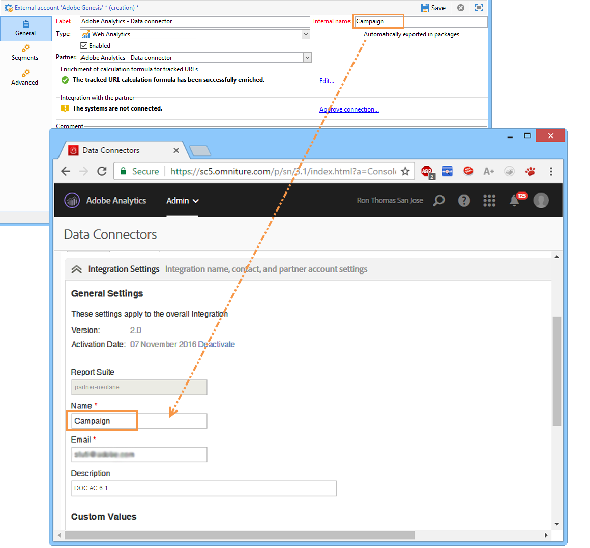
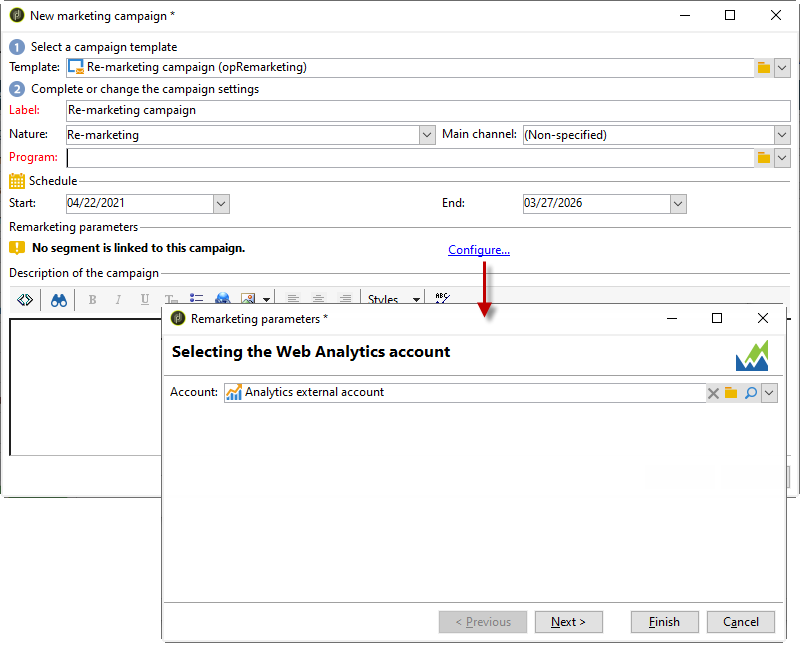

# Adobe Analytics 資料連接器{#adobe-analytics-data-connector-legacy}

>[!IMPORTANT]
>
>Adobe Analytics Data Connector現已淘汰。 已棄用的功能仍可使用，但將不會進一步增強或支援。 了解更多[資訊，請參閱本頁](../../rn/using/deprecated-features.md)。

## 關於Data Connector整合 {#about-data-connector-integration}

>[!IMPORTANT]
>
>Adobe Analytics Data Connector與交易式訊息（訊息中心）不相容。

Data Connector(先前稱為Adobe Genesis)可讓Adobe Campaign和Adobe Analytics透過&#x200B;**Web Analytics連接器**&#x200B;套件互動。 它會以關於電子郵件促銷活動後使用者行為的區段形式，將資料轉送至Adobe Campaign。 相反地，它會將Adobe Campaign傳送之電子郵件促銷活動的指標和屬性傳送至Adobe Analytics - Data connector。

Adobe Campaign可使用Data Connector來測量網際網路受眾(Web Analytics)。 有了這些整合，Adobe Campaign便能復原行銷活動後一或多個網站的訪客行為資料，並（分析後）執行再行銷活動，以便將其轉換為購買者。 反之，Adobe Campaign的網頁分析工具可將指標和行銷活動屬性轉送至其平台。

如需實作Adobe Analytics與Adobe Campaign整合的詳細資訊，請參閱本[檔案](https://helpx.adobe.com/marketing-cloud/how-to/analytics-ac.html)。

每個工具的動作欄位如下：

* 網站分析的角色：

   1. 會標籤透過Adobe Campaign啟動的電子郵件行銷活動，
   1. 以區段的形式，儲存收件者在按一下促銷活動電子郵件後所瀏覽的網站上的行為。 區段與放棄的產品（已檢視但未新增至購物車或已購買）、購買或購物車放棄有關。

* Adobe Campaign的角色：

   1. 會將指標和促銷活動屬性傳送至連接器，連接器再將它們轉送至網頁分析工具，
   1. 恢復和分析區段，
   1. 觸發再行銷活動。

## 設定整合 {#setting-up-the-integration}

若要設定Data connector，您必須連線至Adobe Campaign執行個體並執行下列操作：

* [步驟1:在Analytics中設定整合](#step-1--configure-integration-in-analytics)
* [步驟2:在Campaign中建立外部帳戶](#step-2--create-the-external-account-in-campaign)
* [步驟3:同步Adobe Campaign和Adobe Analytics](#step-3--synchronize-adobe-campaign-and-adobe-analytics)

### 步驟1:在Analytics中設定整合 {#step-1--configure-integration-in-analytics}

下列步驟使用精靈詳細說明Data Connector的設定。

1. 使用Adobe ID或Enterprise ID登入Adobe Experience Cloud。

   

1. 從Experience Cloud解決方案清單中，選擇&#x200B;**[!UICONTROL Analytics]**。

   

1. 從&#x200B;**[!UICONTROL Admin]**&#x200B;頁簽中，選擇&#x200B;**[!UICONTROL Data Connectors]**。

   您必須具備下列Analytics工具權限才能存取&#x200B;**[!UICONTROL Data Connectors]**&#x200B;功能表。 如需詳細資訊，請參閱此[page](https://experienceleague.adobe.com/docs/analytics/admin/admin-console/permissions/analytics-tools.html)
   * 整合（建立）
   * 整合（更新）
   * 整合（刪除）

   

1. 從合作夥伴清單中，選擇&#x200B;**[!UICONTROL Adobe Campaign Classic]**。

   

1. 在&#x200B;**[!UICONTROL Add integration]**&#x200B;對話方塊中，按一下&#x200B;**[!UICONTROL Activate]**。
1. 檢查&#x200B;**[!UICONTROL I accept these terms and conditions]**&#x200B;並選取連結至此整合的&#x200B;**[!UICONTROL Report suite]**，然後輸入連接器標籤。

   完成後，按一下&#x200B;**[!UICONTROL Create and configure this integration]**。

   

1. 輸入代表連接器接收通知的電子郵件地址，然後複製&#x200B;**[!UICONTROL Account ID]**，如外部Adobe Campaign帳戶中所示(如需詳細資訊，請參閱[步驟2:在Campaign](#step-2--create-the-external-account-in-campaign)中建立外部帳戶)。

   

1. 指定測量電子郵件促銷活動影響所需的識別碼，例如內部促銷活動名稱(cid)和iNmsBroadlog（競標）表格ID。 您也應指定要收集之事件的指標。
請確定您的**[!UICONTROL Events]**&#x200B;為數值類型，否則它們不會顯示在下拉式功能表中。

   

1. 如有必要，請指定個人化區段。

   

1. 在&#x200B;**[!UICONTROL Data collection]**&#x200B;中，選擇用於恢復資料的方法，在此例中是步驟6中指定的&#x200B;**[!UICONTROL cid]**&#x200B;和&#x200B;**[!UICONTROL bid]**&#x200B;標識符。

   

1. 選取要在控制面板中顯示的資訊。

   

1. 檢查頁面中的設定，其總結前述步驟。

   

1. 按一下&#x200B;**[!UICONTROL Activate Now]**&#x200B;以核准配置並啟動連接器。

   

   現在已設定資料連接器。

### 步驟2:在Campaign中建立外部帳戶 {#step-2--create-the-external-account-in-campaign}

將Adobe Campaign整合至Analytics平台是使用連接器執行。 要同步應用程式，請應用以下進程：

1. 在Adobe Campaign中安裝&#x200B;**Web Analytics連接器**&#x200B;套件。
1. 前往Adobe Campaign樹的&#x200B;**[!UICONTROL Administration > Platform > External accounts]**&#x200B;資料夾。
1. 按一下右鍵外部帳戶清單，然後在下拉菜單中選擇&#x200B;**[!UICONTROL New]**（或按一下外部帳戶清單上方的&#x200B;**[!UICONTROL New]**&#x200B;按鈕）。
1. 使用下拉式清單來選取&#x200B;**[!UICONTROL Web Analytics]**&#x200B;類型。
1. 選取連接器的提供者，即&#x200B;**[!UICONTROL Adobe Analytics - Data Connector]**。

   

1. 按一下&#x200B;**[!UICONTROL Enrich the formula...]**&#x200B;連結可變更URL計算公式，以指定網站分析工具整合資訊（促銷活動ID）和必須追蹤其活動的網站網域。
1. 指定網站的網域名稱。

   

1. 按一下&#x200B;**[!UICONTROL Next]**&#x200B;並確保已保存域名。

   

1. 如有必要，您必須使計算公式過載。 要執行此操作，請核取方塊並直接在視窗中編輯公式。

   

   >[!IMPORTANT]
   >
   >此配置模式為專家用戶保留：此公式中的任何錯誤都可能導致電子郵件傳送停止。

1. **[!UICONTROL Advanced]**&#x200B;標籤可讓您設定或修改更多技術設定。

   * **[!UICONTROL Lifespan]**:可讓您指定延遲（以天為單位），之後技術工作流程便可在Adobe Campaign中復原Web事件。預設值：180天。
   * **[!UICONTROL Persistence]**:可讓您將所有Web事件（例如購買）歸因於再行銷促銷活動的期間，預設值：7天。

>[!NOTE]
>
>如果您使用數個對象測量工具，可在建立外部帳戶時，於&#x200B;**[!UICONTROL Partners]**&#x200B;下拉式清單中選取&#x200B;**[!UICONTROL Other]**。 您只能在傳送屬性中參考一個外部帳戶：因此，您需要借由新增Adobe預期的參數以及所有其他測量工具來調整追蹤URL的公式。

### 步驟3:同步Adobe Campaign和Adobe Analytics {#step-3--synchronize-adobe-campaign-and-adobe-analytics}

建立外部帳戶後，您需要同步兩個應用程式。

1. 前往您先前建立的外部帳戶。
1. 視需要變更帳戶&#x200B;**[!UICONTROL Label]**。
1. 變更&#x200B;**[!UICONTROL Internal name]**，使其與設定Data Connector時選取的&#x200B;**[!UICONTROL Name]**&#x200B;相符。

   

1. 按一下&#x200B;**[!UICONTROL Approve connection]**&#x200B;連結。

   

   請確定&#x200B;**[!UICONTROL Internal name]**&#x200B;符合Data Connector設定精靈中指定的&#x200B;**[!UICONTROL Name]**。

1. 在Data Connector配置嚮導中輸入&#x200B;**[!UICONTROL Account ID]**。

   

1. 依照Data Connector精靈指南的步驟操作，然後返回Adobe Campaign中的外部帳戶。
1. 按一下&#x200B;**[!UICONTROL Next]**，以便在Adobe Campaign和Adobe Analytics - Data connector之間進行資料交換。

   同步完成後，會顯示區段清單。

   

當Adobe Campaign與Adobe Analytics之間的資料同步生效時，Adobe Campaign會復原Data Connector精靈中定義的三個預設區段，並可在Adobe Campaign外部帳戶的&#x200B;**[!UICONTROL Segments]**&#x200B;標籤中存取。

如果已在Data Connector精靈中設定其他區段，您可以將它們新增至Adobe Campaign。 要執行此操作，請按一下&#x200B;**[!UICONTROL Update segment list]**&#x200B;連結，並遵循外部帳戶精靈中概述的步驟。 執行操作後，新區段會顯示在清單中。

### 網頁分析程式的技術工作流程 {#technical-workflows-of-web-analytics-processes}

Adobe Campaign與Adobe Analytics之間的資料交換 — Data Connector由四個作為背景工作執行的技術工作流程處理。

它們可在Adobe Campaign樹的&#x200B;**[!UICONTROL Administration > Production > Technical workflows > Web analytics process]**&#x200B;資料夾下。

* **[!UICONTROL Recovering of web events]**:每小時一次，此工作流程會下載關於指定網站上使用者行為的區段，並將其納入Adobe Campaign資料庫中，然後開始再行銷工作流程。
* **[!UICONTROL Event purge]**:此工作流程可讓您根據欄位中設定的期間，從資料庫刪除所有 **[!UICONTROL Lifespan]** 事件。有關詳細資訊，請參閱[步驟2:在Campaign](#step-2--create-the-external-account-in-campaign)中建立外部帳戶。
* **[!UICONTROL Identification of converted contacts]**:再行銷活動後購買的訪客目錄。此工作流程收集的資料可在&#x200B;**[!UICONTROL Re-marketing efficiency]**&#x200B;報表中存取，請參閱此[page](#creating-a-re-marketing-campaign)。
* **[!UICONTROL Sending of indicators and campaign attributes]**:可讓您使用Adobe Analytics - Data connector，透過Adobe Campaign將電子郵件促銷活動指標傳送至Adobe Experience Cloud。此工作流程每天凌晨4:00會觸發，且可能需要24小時才會將資料傳送至Analytics。

   請注意，此工作流程不應重新啟動，否則會重新傳送所有可能扭曲Analytics結果的先前資料。

   相關指標包括：

   * **[!UICONTROL Messages to deliver]** (@toDeliver)
   * **[!UICONTROL Processed]** (@processed)
   * **[!UICONTROL Success]** (@success)
   * **[!UICONTROL Total count of opens]** (@totalRecipientOpen)
   * **[!UICONTROL Recipients who have opened]** (@recipientOpen)
   * **[!UICONTROL Total number of recipients who clicked]** (@totalRecipientClick)
   * **[!UICONTROL People who clicked]** (@personClick)
   * **[!UICONTROL Number of distinct clicks]** (@recipientClick)
   * **[!UICONTROL Opt-Out]** (@optOut)
   * **[!UICONTROL Errors]** (@error)

   >[!NOTE]
   >
   >傳送的資料是根據上次快照的差值，可能導致量度資料中的負值。

   傳送的屬性如下：

   * **[!UICONTROL Internal name]** (@internalName)
   * **[!UICONTROL Label]** (@label)
   * **[!UICONTROL Label]** (操作/@label):只有在安裝 **** 了Campaign套件時
   * **[!UICONTROL Nature]** (操作/@nature):只有在安裝 **** 了Campaign套件時
   * **[!UICONTROL Tag 1]** (webAnalytics/@tag1)
   * **[!UICONTROL Tag 2]** (webAnalytics/@tag2)
   * **[!UICONTROL Tag 3]** (webAnalytics/@tag3)
   * **[!UICONTROL Contact date]** (排程/@contactDate)

## 在Adobe Campaign中追蹤傳遞 {#tracking-deliveries-in-adobe-campaign}

為了讓Adobe Experience Cloud在Adobe Campaign傳送後能夠追蹤網站上的活動，您必須在傳送屬性中參考相符的連接器。 若要這麼做，請套用下列步驟：

1. 開啟要追蹤之促銷活動的傳送。

   

1. 開啟傳送屬性。
1. 前往&#x200B;**[!UICONTROL Web Analytics]**&#x200B;標籤，並選取先前建立的外部帳戶。 請參閱[步驟2:在Campaign](#step-2--create-the-external-account-in-campaign)中建立外部帳戶。

   

1. 您現在可以傳送傳遞內容，並在Adobe Analytics中存取報表。

## 建立再行銷行銷活動 {#creating-a-re-marketing-campaign}

若要準備再行銷行銷活動，只需建立要用於再行銷類型行銷活動的傳遞範本。 然後設定再行銷促銷活動，並將其連結至區段。 每個區段必須有不同的再行銷促銷活動。

當Adobe Campaign完成分析初始促銷活動鎖定目標之人員的行為的區段後，就會自動開始再行銷促銷活動。 如果放棄購買或檢視產品而未進行購買，則會傳送傳遞給相關收件者，以便其網站瀏覽結束購買。

Adobe Campaign提供個人化傳遞範本，供您自行使用或建立資料庫，以準備行銷活動。

1. 從&#x200B;**[!UICONTROL Explorer]**，前往Adobe Campaign樹的&#x200B;**[!UICONTROL Resources > Templates > Delivery templates]**&#x200B;資料夾。
1. 複製Adobe Campaign提供的&#x200B;**[!UICONTROL Email delivery (re-marketing)]**&#x200B;範本或再行銷範本範例。
1. 個人化範本以符合您的需求並加以儲存。

   

1. 建立新促銷活動，並從下拉式清單中選取&#x200B;**[!UICONTROL Re-marketing campaign]**&#x200B;範本。

   

1. 按一下&#x200B;**[!UICONTROL Configure...]**&#x200B;連結，以指定連結至促銷活動的區段和傳送範本。
1. 選取先前設定的外部帳戶。

   

1. 選取相關區段。

   

1. 選取要用於此再行銷促銷活動的傳送範本，然後按一下&#x200B;**[!UICONTROL Finish]**&#x200B;以關閉視窗。

   

1. 按一下&#x200B;**[!UICONTROL OK]**&#x200B;以關閉促銷活動視窗。

**[!UICONTROL Re-marketing efficiency]**&#x200B;報表可透過全域報表頁面存取。 它可讓您檢視與Adobe Campaign再行銷活動後購物車放棄次數相關的轉換連絡人數（亦即已購買商品）。 轉換率是每週、每月或自Adobe Campaign與網頁分析工具開始同步後計算。

