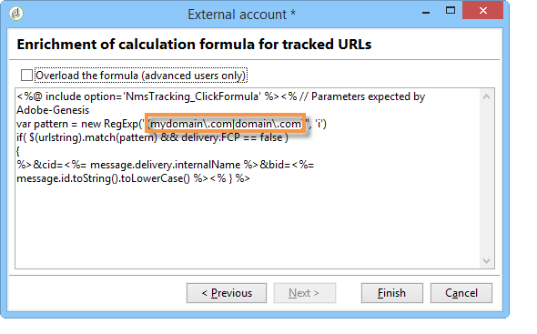

# Adobe Analytics 資料連接器{#adobe-analytics-data-connector}

## 關於資料連接器整合{#about-data-connector-integration}

>[!IMPORTANT]
>
>Adobe Analytics資料連接器與事務性消息傳遞（消息中心）不相容。

資料連接器(先前稱為Adobe Genesis)可讓Adobe Campaign和Adobe Analytics透過&#x200B;**Web Analytics連接器**&#x200B;套件進行互動。 它會以區段形式將資料轉送至Adobe Campaign，內容涉及電子郵件促銷活動後的使用者行為。 相反地，它會將Adobe Campaign傳送的電子郵件促銷活動的指標和屬性傳送至Adobe Analytics-資料連接器。

使用資料連接器，Adobe Campaign有一種測量網際網路觀眾(Web Analytics)的方式。 有了這些整合，Adobe Campaign可以復原行銷促銷活動後一或多個網站的訪客行為資料，並（分析後）執行再行銷促銷活動，以便將其轉換為購買者。 相反地，網頁分析工具讓Adobe Campaign能夠將指標和促銷活動屬性轉送至其平台。

有關Adobe Analytics與Adobe Campaign一體化的執行情況的更多資訊，請參閱本[檔案](https://helpx.adobe.com/marketing-cloud/how-to/analytics-ac.html)。

每個工具的操作欄位如下：

* 網頁分析的角色：

   1. 標誌著與Adobe Campaign一起發起的電子郵件宣傳，
   1. 以區段的形式儲存收件者在點按促銷活動電子郵件後所瀏覽之網站上的行為。 區段涉及放棄的產品（已檢視但未新增至購物車或已購買）、購買或購物車放棄。

* Adobe Campaign的作用：

   1. 將指標和促銷活動屬性傳送至連接器，接著再將它們轉送至網頁分析工具，
   1. 恢復和分析細分，
   1. 觸發重新行銷促銷活動。

## 設定整合{#setting-up-the-integration}

要設定「資料」連接器，必須連接到Adobe Campaign實例並執行以下操作：

* [步驟1:在Analytics中設定整合](#step-1--configure-integration-in-analytics)
* [步驟2:在Campaign中建立外部帳戶](#step-2--create-the-external-account-in-campaign)
* [步驟3:同步Adobe Campaign和Adobe Analytics](#step-3--synchronize-adobe-campaign-and-adobe-analytics)

### 步驟1:在Analytics中設定整合{#step-1--configure-integration-in-analytics}

以下步驟詳細說明使用嚮導的資料連接器的配置。

1. 使用Adobe ID或Enterprise ID登入Adobe Experience Cloud。

   

1. 從Experience Cloud解決方案清單中，選擇&#x200B;**[!UICONTROL Analytics]**。

   

1. 從&#x200B;**[!UICONTROL Admin]**&#x200B;標籤中，選擇&#x200B;**[!UICONTROL Data Connectors]**。

   您必須具備下列Analytics工具權限才能存取&#x200B;**[!UICONTROL Data Connectors]**&#x200B;功能表。 如需詳細資訊，請參閱此[頁面](https://docs.adobe.com/content/help/en/analytics/admin/admin-console/permissions/analytics-tools.html)
   * 整合（建立）
   * 整合（更新）
   * 整合（刪除）

   

1. 從合作夥伴清單中，選擇&#x200B;**[!UICONTROL Adobe Campaign Classic]**。

   

1. 在&#x200B;**[!UICONTROL Add integration]**&#x200B;對話框中，按一下&#x200B;**[!UICONTROL Activate]**。
1. 選中&#x200B;**[!UICONTROL I accept these terms and conditions]**&#x200B;並選擇連結到此整合的&#x200B;**[!UICONTROL Report suite]** ，然後輸入連接器標籤。

   完成後，按一下&#x200B;**[!UICONTROL Create and configure this integration]**。

   

1. 輸入代表連接器接收通知的電子郵件地址，然後複製&#x200B;**[!UICONTROL Account ID]**，如外部Adobe Campaign帳戶中所示(有關詳情，請參閱[步驟2:在Campaign](#step-2--create-the-external-account-in-campaign)中建立外部帳戶)。

   

1. 指定測量電子郵件促銷活動影響所需的識別碼，例如內部促銷活動名稱(cid)和iNmsBroadlog（競標）表格ID。 您也應指定要收集之事件的指標。
請確定您的**[!UICONTROL Events]**&#x200B;為「數值」類型，否則它們不會出現在下拉式選單中。

   

1. 如有必要，請指定個人化區段。

   

1. 在&#x200B;**[!UICONTROL Data collection]**&#x200B;中，選擇恢復資料的方法，在此例中，選擇步驟6中指定的&#x200B;**[!UICONTROL cid]**&#x200B;和&#x200B;**[!UICONTROL bid]**&#x200B;標識符。

   

1. 選取要顯示在控制面板中的資訊。

   

1. 在總結前述步驟的頁面中檢查配置。

   

1. 按一下&#x200B;**[!UICONTROL Activate Now]**&#x200B;批准配置並激活連接器。

   

   「資料」連接器現在已設定。

### 步驟2:在促銷活動{#step-2--create-the-external-account-in-campaign}中建立外部帳戶

將Adobe Campaign整合至Analytics平台時，會使用連接器。 若要同步應用程式，請套用下列程式：

1. 在Adobe Campaign安裝&#x200B;**Web Analytics connectors**&#x200B;套件。
1. 轉到Adobe Campaign樹的&#x200B;**[!UICONTROL Administration > Platform > External accounts]**&#x200B;資料夾。
1. 按一下右鍵外部帳戶清單，然後在下拉菜單中選擇&#x200B;**[!UICONTROL New]**（或按一下外部帳戶清單上方的&#x200B;**[!UICONTROL New]**&#x200B;按鈕）。
1. 使用下拉式清單來選擇&#x200B;**[!UICONTROL Web Analytics]**&#x200B;類型。
1. 選擇連接器的提供器，即&#x200B;**[!UICONTROL Adobe Analytics - Data Connector]**。

   

1. 按一下&#x200B;**[!UICONTROL Enrich the formula...]**&#x200B;連結以變更URL計算公式，以指定網站分析工具整合資訊（促銷活動ID）和必須追蹤其活動之網站的網域。
1. 指定網站的網域名稱。

   

1. 按一下&#x200B;**[!UICONTROL Next]**&#x200B;並確保域名已保存。

   

1. 如有必要，您必須使計算公式超載。 要執行此操作，請選中該框並直接在窗口中編輯公式。

   

   >[!IMPORTANT]
   >
   >此配置模式保留給專家用戶：此公式中的任何錯誤都可能導致電子郵件傳送停止。

1. **[!UICONTROL Advanced]**&#x200B;標籤可讓您設定或修改更多技術設定。

   * **[!UICONTROL Lifespan]**:可讓您指定延遲（以天數_為單位），之後，技術工作流程會在Adobe Campaign恢復Web事件。預設值：180天。
   * **[!UICONTROL Persistence]**:可讓您將所有Web事件（例如購買）歸因於重新行銷促銷活動的期間，預設值：7天。

>[!NOTE]
>
>如果您使用數種觀眾測量工具，則可在建立外部帳戶時，在&#x200B;**[!UICONTROL Partners]**&#x200B;下拉式清單中選取&#x200B;**[!UICONTROL Other]**。 您只能在傳送屬性中參考一個外部帳戶：因此，您必須新增Adobe和所有其他測量工具所預期的參數，以調整追蹤URL的公式。

### 步驟3:同步Adobe Campaign和Adobe Analytics{#step-3--synchronize-adobe-campaign-and-adobe-analytics}

建立外部帳戶後，您需要同步兩個應用程式。

1. 前往您先前建立的外部帳戶。
1. 視需要變更帳戶&#x200B;**[!UICONTROL Label]**。
1. 更改&#x200B;**[!UICONTROL Internal name]**，使其與配置資料連接器時選擇的&#x200B;**[!UICONTROL Name]**&#x200B;匹配。

   

1. 按一下&#x200B;**[!UICONTROL Approve connection]**&#x200B;連結。

   

   確保&#x200B;**[!UICONTROL Internal name]**&#x200B;與「資料連接器配置」嚮導中指定的&#x200B;**[!UICONTROL Name]**&#x200B;匹配。

1. 在資料連接器配置嚮導中輸入&#x200B;**[!UICONTROL Account ID]**。

   

1. 依照「資料連接器」精靈指南，依照步驟進行，然後返回Adobe Campaign的外部帳戶。
1. 按一下&#x200B;**[!UICONTROL Next]** ，以便在Adobe Campaign和Adobe Analytics-資料連接器之間進行資料交換。

   同步完成後，將顯示段清單。

   

當Adobe Campaign與Adobe Analytics-資料連接器之間的資料同步生效時，Adobe Campaign將恢復資料連接器嚮導中定義的三個預設段，並可在Adobe Campaign外部帳戶的&#x200B;**[!UICONTROL Segments]**&#x200B;頁籤中訪問。

如果已在「資料連接器」精靈中設定其他區段，您可將其新增至Adobe Campaign。 若要這麼做，請按一下&#x200B;**[!UICONTROL Update segment list]**&#x200B;連結，然後依照外部帳戶精靈中所述的步驟進行。 執行操作後，新區段就會顯示在清單中。

### 網頁分析程式的技術工作流程{#technical-workflows-of-web-analytics-processes}

Adobe Campaign與Adobe Analytics之間的資料交換——資料連接器由四個作為後台任務運行的技術工作流處理。

它們位於Adobe Campaign樹的&#x200B;**[!UICONTROL Administration > Production > Technical workflows > Web analytics process]**&#x200B;資料夾下。

* **[!UICONTROL Recovering of web events]**:每小時一次，此工作流程會下載特定網站上使用者行為的區段，並將其納入Adobe Campaign資料庫，然後啟動重新行銷工作流程。
* **[!UICONTROL Event purge]**:此工作流允許您根據欄位中配置的時段，從資料庫中刪除所有 **[!UICONTROL Lifespan]** 事件。有關詳細資訊，請參閱[步驟2:在Campaign](#step-2--create-the-external-account-in-campaign)中建立外部帳戶。
* **[!UICONTROL Identification of converted contacts]**:重新行銷促銷活動後進行購買的訪客的目錄。此工作流程收集的資料可在&#x200B;**[!UICONTROL Re-marketing efficiency]**&#x200B;報表中存取，請參閱此[頁面](#creating-a-re-marketing-campaign)。
* **[!UICONTROL Sending of indicators and campaign attributes]**:可讓您使用「Adobe Analytics-資料」連接器，透過Adobe Campaign傳送電子郵件促銷活動指標至Adobe Experience Cloud。此工作流程每天凌晨4點觸發，資料傳送至Analytics可能需要24小時。

   請注意，此工作流程不應重新啟動，否則將重新傳送所有可能扭曲Analytics結果的先前資料。

   相關指標包括：

   * **[!UICONTROL Messages to deliver]** (@toDeliver)
   * **[!UICONTROL Processed]** (@processed)
   * **[!UICONTROL Success]** (@success)
   * **[!UICONTROL Total count of opens]** (@totalRecipientOpen)
   * **[!UICONTROL Recipients who have opened]** (@recipientOpen)
   * **[!UICONTROL Total number of recipients who clicked]** (@totalRecipientClick)
   * **[!UICONTROL People who clicked]** (@personClick)
   * **[!UICONTROL Number of distinct clicks]** (@recipientClick)
   * **[!UICONTROL Opt-Out]** (@optOut)
   * **[!UICONTROL Errors]** (@error)

   >[!NOTE]
   >
   >傳送的資料是根據最後一個快照的增量，可能會導致量度資料中的負值。

   發送的屬性如下：

   * **[!UICONTROL Internal name]** (@internalName)
   * **[!UICONTROL Label]** (@label)
   * **[!UICONTROL Label]** (operation/@label):只有在安裝 **** Campaign套件時
   * **[!UICONTROL Nature]** (operation/@nature):只有在安裝 **** Campaign套件時
   * **[!UICONTROL Tag 1]** (webAnalytics/@tag1)
   * **[!UICONTROL Tag 2]** (webAnalytics/@tag2)
   * **[!UICONTROL Tag 3]** (webAnalytics/@tag3)
   * **[!UICONTROL Contact date]** (scheduling/@contactDate)

## 在Adobe Campaign追蹤交貨{#tracking-deliveries-in-adobe-campaign}

為了讓Adobe Experience Cloud能夠在Adobe Campaign發送交貨後跟蹤站點上的活動，您需要在交貨屬性中引用匹配連接器。 若要這麼做，請套用下列步驟：

1. 開啟要追蹤之促銷活動的傳送。

   

1. 開啟傳送屬性。
1. 前往&#x200B;**[!UICONTROL Web Analytics]**&#x200B;標籤，並選取先前建立的外部帳戶。 請參閱[步驟2:在Campaign](#step-2--create-the-external-account-in-campaign)中建立外部帳戶。

   

1. 您現在可以在Adobe Analytics傳送並存取報表。

## 建立重新行銷促銷活動{#creating-a-re-marketing-campaign}

若要準備再行銷促銷活動，只需建立要用於再行銷類型促銷活動的傳送範本。 然後設定您的再行銷促銷活動，並將其連結至區段。 每個區段必須有不同的再行銷促銷活動。

在Adobe Campaign完成回收區段後，重新行銷促銷活動會自動啟動，以分析初始促銷活動所定位之人員的行為。 如果購物車放棄或檢視產品而未購買，則會傳送遞送給相關收件者，讓其網站瀏覽結束購買。

Adobe Campaign提供個人化的傳送範本，您可使用這些範本或將其建立資料庫，以準備宣傳活動。

1. 從&#x200B;**[!UICONTROL Explorer]**&#x200B;移至Adobe Campaign樹的&#x200B;**[!UICONTROL Resources > Templates > Delivery templates]**&#x200B;資料夾。
1. 複製&#x200B;**[!UICONTROL Email delivery (re-marketing)]**&#x200B;範本或Adobe Campaign提供的再行銷範本範例。
1. 個人化範本以符合您的需求並加以儲存。

   

1. 建立新促銷活動，並從下拉式清單中選取&#x200B;**[!UICONTROL Re-marketing campaign]**&#x200B;範本。

   

1. 按一下&#x200B;**[!UICONTROL Configure...]**&#x200B;連結，指定連結至促銷活動的區段和傳送範本。
1. 選擇先前配置的外部帳戶。

   

1. 選取相關區段。

   

1. 選取要用於此重新行銷促銷活動的傳送範本，然後按一下&#x200B;**[!UICONTROL Finish]**&#x200B;以關閉視窗。

   

1. 按一下&#x200B;**[!UICONTROL OK]**&#x200B;以關閉促銷活動視窗。

**[!UICONTROL Re-marketing efficiency]**&#x200B;報表可透過全域報表頁面存取。 它可讓您檢視在Adobe Campaign再行銷活動後放棄購物車的次數，與轉換的連絡人數（亦即已購買商品）有關。 轉換率是每週、每月或自Adobe Campaign和網頁分析工具開始同步起計算。

