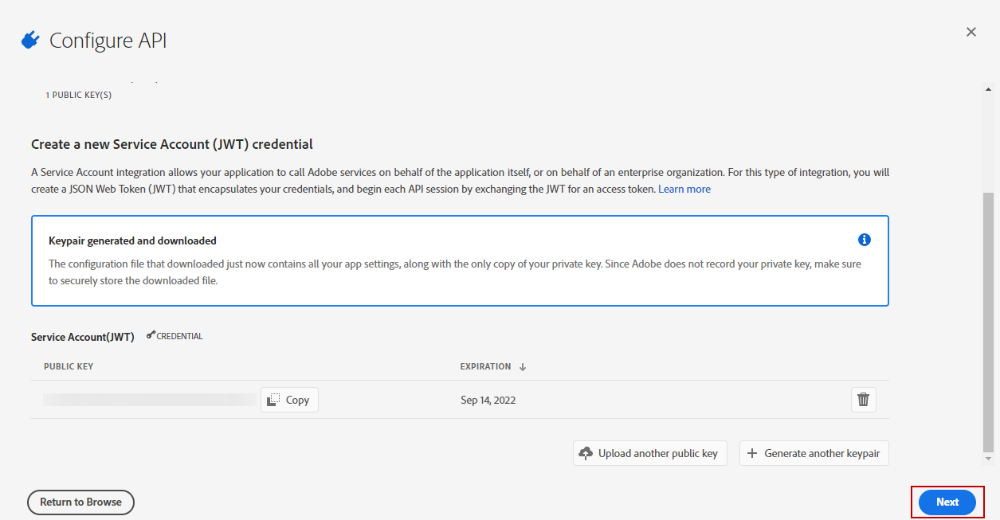

# Adobe Analytics 連接器佈建 {#adobe-analytics-connector-provisioning}

>[!CAUTION]
>
> 這些步驟應該只能由混合及內部部署實作來執行。
>
>針對託管和促銷活動Managed Services實作，請聯絡 [Adobe客戶服務](https://helpx.adobe.com/tw/enterprise/admin-guide.html/enterprise/using/support-for-experience-cloud.ug.html) 團隊。

Adobe Campaign Classic與Adobe Analytics驗證之間的整合支援AdobeIdentity Management服務(IMS)：

* 如果您管理已移轉的外部帳戶，您必須實作Adobe IMS並透過Adobe ID連線至Adobe Campaign。

  請注意，透過Adobe ID IMS登入的使用者必須是 **資料聯結器** Adobe Analytics帳戶並擁有以下專案的許可權： **產品設定檔** 已提及 [以下](#analytics-product-profile).

問題是資料聯結器的擁有者與登入Campaign並嘗試與Analytics整合的使用者不是使用者。

* 如果您正在實作新的聯結器，實作Adobe IMS為選用。 如果沒有Adobe ID使用者，Adobe Campaign將使用技術使用者來與Adobe Analytics同步。

為了讓此整合發揮作用，您必須建立Adobe Analytics產品設定檔，此設定檔將專門用於Analytics聯結器。 之後，您將需要建立Adobe I/O專案。

>[!AVAILABILITY]
>
> Adobe已棄用服務帳戶(JWT)認證，Campaign與Adobe解決方案和應用程式的整合現在必須依賴OAuth伺服器對伺服器認證。 </br>
>
> * 如果您已實作與Campaign的傳入整合，您必須移轉您的技術帳戶，如中所述 [本檔案](https://developer.adobe.com/developer-console/docs/guides/authentication/ServerToServerAuthentication/migration/#_blank). 現有的服務帳戶(JWT)憑證將持續運作到2025年1月27日。 此外，從2024年6月3日開始，已無法在開發人員控制檯中建立新的服務帳戶(JWT)憑證。 在此日期之後，無法建立新的服務帳戶(JWT)憑證或將其新增到專案。 </br>
>
> * 如果您已實作輸出整合(例如Campaign-Analytics整合或Experience Cloud Triggers整合)，則在2025年1月27日前都能正常運作。 不過，在該日期之前，您必須將您的Campaign環境升級至v7.4.1，並將您的技術帳戶移轉至oAuth。 自2024年6月3日起，已經無法在開發人員控制檯中建立新的服務帳戶(JWT)憑證，因此您無法在此日期之後依賴JWT建立新的傳出整合

## 建立Adobe Analytics產品設定檔 {#analytics-product-profile}

產品設定檔可決定使用者對不同Analytics元件的存取層級。

如果您已有Analytics產品設定檔，您仍應建立專用於Analytics聯結器的新Adobe Analytics產品設定檔。 這將確保您的產品設定檔已設定為此整合的正確許可權。

如需產品設定檔的詳細資訊，請參閱 [Admin Console檔案](https://helpx.adobe.com/mt/enterprise/admin-guide.html).

1. 從 [Admin console](https://adminconsole.adobe.com/)，選取您的Adobe Analytics **[!UICONTROL Product]**.

   

1. 按一下&#x200B;**[!UICONTROL New Profile]**。

   

1. 新增 **[!UICONTROL Product profile name]**，我們建議使用以下語法： `reserved_campaign_classic_<Company Name>`. 然後，按一下 **[!UICONTROL Next]**.

   這個 **[!UICONTROL Product profile]** 應僅用於Analytics聯結器，以防止設定錯誤錯誤。

1. 開啟您新建立的 **[!UICONTROL Product profile]** 並選取 **[!UICONTROL Permissions]** 標籤。

   

1. 設定不同的功能，按一下 **[!UICONTROL Edit]** 並選取要指派給您的使用者的許可權 **[!UICONTROL Product profile]** 按一下加號(+)圖示。

   有關如何管理許可權的詳細資訊，請參閱 [Admin Console檔案](https://helpx.adobe.com/mt/enterprise/using/manage-permissions-and-roles.html).

1. 對於 **[!UICONTROL Report Suites]** 功能，新增 **[!UICONTROL Report Suites]** 您稍後需要使用。

   如果您沒有任何報表套裝，可依下列步驟建立 [這些步驟](../../platform/using/gs-aa.md).

   

1. 對於 **[!UICONTROL Metrics]** 功能，新增 **[!UICONTROL Metrics]** 您稍後將需要設定。

   如有需要，您可以開啟「自動包含」選項，這會將每個許可權專案新增至包含的清單中，並自動新增許可權專案。

   

1. 對於 **[!UICONTROL Dimensions]** 功能，新增 **[!UICONTROL Dimensions]** 未來設定所需。

   確保所選的Dimension符合要在外部帳戶中設定的事件，並與Adobe Analytics中對應的eVar編號一致。

1. 對於 **[!UICONTROL Report Suite Tools]** 功能，新增以下許可權：

   * **[!UICONTROL Report suite Mgmt]**
   * **[!UICONTROL Conversion variables]**
   * **[!UICONTROL Success events]**
   * **[!UICONTROL Custom data Warehouse report]**
   * **[!UICONTROL Data sources manager]**
   * **[!UICONTROL Classifications]**

1. 對於 **[!UICONTROL Analytics Tools]** 功能，新增以下許可權：

   * **[!UICONTROL Code Manager - Web services]**
   * **[!UICONTROL Logs - Web services]**
   * **[!UICONTROL Web services]**
   * **[!UICONTROL Web service access]**
   * **[!UICONTROL Calculated metric creation]**
   * **[!UICONTROL Segment creation]**

您的產品設定檔現已設定完成。 然後，您需要建立Adobe I/O專案。

## 建立Adobe I/O專案 {#create-adobe-io}

1. 存取Adobe I/O並以下列身分登入 **系統管理員** ，屬於您的組織。

   有關管理員角色的詳細資訊，請參閱此 [頁面](https://helpx.adobe.com/enterprise/using/admin-roles.html).

1. 按一下&#x200B;**[!UICONTROL Create a new project]**。

   

1. 按一下 **[!UICONTROL Add to Project]** 並選取 **[!UICONTROL API]**.

   

1. 選取 [!DNL Adobe Analytics] 並按一下 **[!UICONTROL Next]**。

   

1. 選擇 **[!UICONTROL Service Account (JWT)]** 作為驗證型別，然後按一下 **[!UICONTROL Next]**.

   

1. 選取 **[!UICONTROL Option 1: Generate a Key-Pair]** 選項並按一下 **[!UICONTROL Generate a Key-Pair]**.

   之後會自動下載config.zip檔案。

   

1. 按一下&#x200B;**[!UICONTROL Next]**。

   

1. 選取 **[!UICONTROL Product profile]** 在此詳述的先前步驟中建立的 [區段](#analytics-product-profile).

1. 然後，按一下 **[!UICONTROL Save Configured API]**.

   

1. 在您的專案中，選取 [!DNL Adobe Analytics] 並將下列資訊複製到 **[!UICONTROL Service Account (JWT)]**：

   * **[!UICONTROL Client ID]**
   * **[!UICONTROL Client Secret]**
   * **[!UICONTROL Technical account ID]**
   * **[!UICONTROL Organization ID]**

   

1. 使用在步驟6中產生的私密金鑰。

   如果您已使用這些憑證設定觸發器，則此聯結器設定的私密金鑰必須相同。

1. 使用下列命令編碼私密金鑰： `base64 ./private.key > private.key.base64`. 這會將base64內容儲存至新檔案 `private.key.base64`.

   >[!NOTE]
   >
   >複製/貼上私密金鑰時，有時會自動新增額外的行。 在編碼您的私密金鑰之前，請記得移除它。

1. 從檔案複製內容 `private.key.base64`.

1. 透過SSH登入已安裝Adobe Campaign執行個體的每個容器，並透過以下命令在Adobe Campaign中新增Project認證： `neolane` 使用者。 這將會插入 **[!UICONTROL Technical Account]** 執行個體組態檔中的認證。

   ```
   nlserver config -instance:<instance name> -setimsjwtauth:Organization_Id/Client_Id/Technical_Account_ID/<Client_Secret>/<Base64_encoded_Private_Key>
   ```

您現在可以開始使用Analytics聯結器並追蹤客戶行為。
