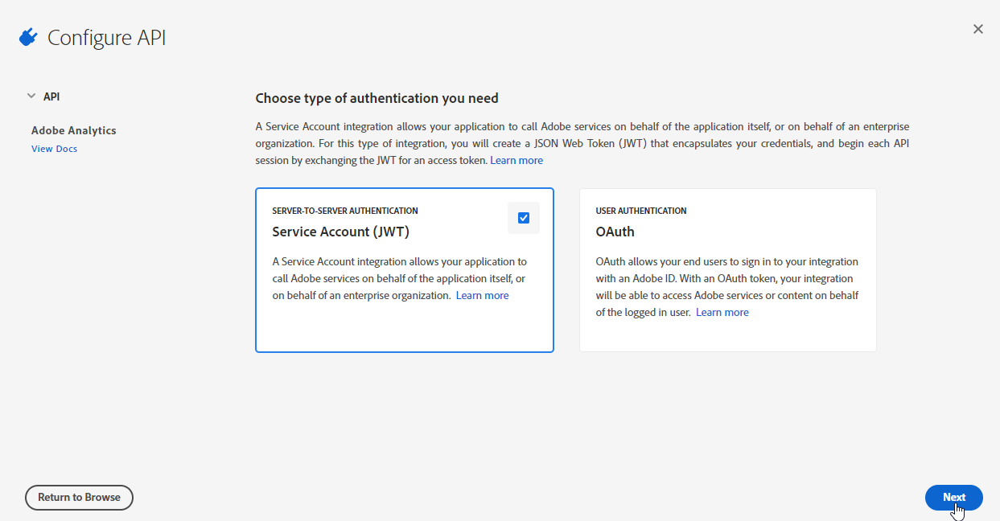
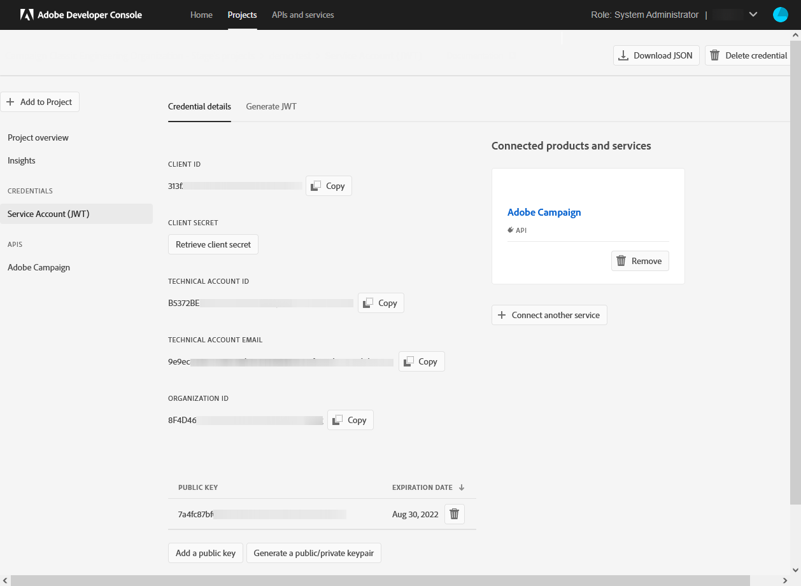

# Adobe Analytics 連接器佈建 {#adobe-analytics-connector-provisioning}


>[!IMPORTANT]
>
> 這些步驟只應通過混合和本地實現來執行。
>
>對於托管實施，請聯繫 [Adobe客戶關懷](https://helpx.adobe.com/tw/enterprise/admin-guide.html/enterprise/using/support-for-experience-cloud.ug.html) 團隊。

Adobe Campaign Classic和Adobe Analytics認證的整合支援AdobeIdentity Management服務(IMS):

* 如果要管理已遷移的外部帳戶，則必須實施Adobe IMS並通過Adobe ID連接到Adobe Campaign。 通過Adobe IDIMS登錄的用戶應是 **資料連接器** 在Adobe Analytics的帳戶，並擁有 **產品配置檔案** 下文所述。

* 如果要實施新連接器，則實施Adobe IMS是可選的。 沒有Adobe ID用戶，Adobe Campaign將使用技術用戶與Adobe Analytics同步。

要使此整合工作，您必須建立Adobe Analytics產品配置檔案，該配置檔案將專用於分析連接器。 然後，您需要建立一個Adobe I/O項目。

## 建立Adobe Analytics產品配置檔案 {#analytics-product-profile}

產品配置檔案確定用戶對不同分析元件的訪問級別。

如果您已經擁有分析產品配置檔案，則仍應建立專門用於分析連接器的新Adobe Analytics產品配置檔案。 這將確保您的產品配置檔案設定為具有正確的此整合權限。

有關產品配置檔案的詳細資訊，請參閱 [管理控制台文檔](https://helpx.adobe.com/mt/enterprise/admin-guide.html)。

1. 從 [管理控制台](https://adminconsole.adobe.com/)，選擇Adobe Analytics **[!UICONTROL Product]**。

   

1. 按一下&#x200B;**[!UICONTROL New Profile]**。

   

1. 添加 **[!UICONTROL Product profile name]**，建議使用以下語法： `reserved_campaign_classic_<Company Name>`。 然後，按一下 **[!UICONTROL Next]**。

   此 **[!UICONTROL Product profile]** 應專門用於Analytics Connector以防止錯誤配置。

1. 開啟新建立的 **[!UICONTROL Product profile]** 的 **[!UICONTROL Permissions]** 頁籤。

   

1. 配置不同的功能，按一下 **[!UICONTROL Edit]** 並選擇要分配給您的權限 **[!UICONTROL Product profile]** 按鈕。

   有關如何管理權限的詳細資訊，請參閱 [管理控制台文檔](https://helpx.adobe.com/mt/enterprise/using/manage-permissions-and-roles.html)。

1. 對於 **[!UICONTROL Report Suites]** 權能，添加 **[!UICONTROL Report Suites]** 你以後得用。

   如果您沒有任何報表套件，可以在以下位置建立 [這些步驟](../../platform/using/adobe-analytics-connector.md#report-suite-analytics)。

   

1. 對於 **[!UICONTROL Metrics]** 權能，添加 **[!UICONTROL Metrics]** 以後需要配置。

   如果需要，可以開啟「自動包括」選項，該選項會將每個權限項添加到包含的清單中，並自動添加新權限項。

   

1. 對於 **[!UICONTROL Dimensions]** 權能，添加 **[!UICONTROL Dimensions]** 以後需要配置。

1. 對於 **[!UICONTROL Report Suite Tools]** 權能，添加以下權限：

   * **[!UICONTROL Report suite Mgmt]**
   * **[!UICONTROL Conversion variables]**
   * **[!UICONTROL Success events]**
   * **[!UICONTROL Custom data Warehouse report]**
   * **[!UICONTROL Data sources manager]**
   * **[!UICONTROL Classifications]**

1. 對於 **[!UICONTROL Analytics Tools]** 權能，添加以下權限：

   * **[!UICONTROL Code Manager - Web services]**
   * **[!UICONTROL Logs - Web services]**
   * **[!UICONTROL Web services]**
   * **[!UICONTROL Web service access]**
   * **[!UICONTROL Calculated metric creation]**
   * **[!UICONTROL Segment creation]**

您的產品配置檔案現已配置。 然後，您需要建立Adobe I/O項目。

## 建立Adobe I/O項目 {#create-adobe-io}

1. 訪問Adobe I/O並登錄為 **系統管理員** 您的組織。

   有關管理員角色的詳細資訊，請參閱 [頁](https://helpx.adobe.com/enterprise/using/admin-roles.html)。

1. 按一下&#x200B;**[!UICONTROL Create a new project]**。

   

1. 按一下 **[!UICONTROL Add to Project]** 選擇 **[!UICONTROL API]**。

   

1. 選取 [!DNL Adobe Analytics] 並按一下 **[!UICONTROL Next]**。

   

1. 選擇 **[!UICONTROL Service Account (JWT)]** 作為驗證類型，按一下 **[!UICONTROL Next]**。

   

1. 選擇 **[!UICONTROL Option 1: Generate a Key-Pair]** 選項 **[!UICONTROL Generate a Key-Pair]**。

   然後將自動下載config.zip檔案。

   

1. 按一下&#x200B;**[!UICONTROL Next]**。

   

1. 選擇 **[!UICONTROL Product profile]** 建立的 [節](#analytics-product-profile)。

1. 然後，按一下 **[!UICONTROL Save Configured API]**。

   

1. 從項目中，選擇 [!DNL Adobe Analytics] 並複製下列資訊 **[!UICONTROL Service Account (JWT)]**:

   * **[!UICONTROL Client ID]**
   * **[!UICONTROL Client Secret]**
   * **[!UICONTROL Technical account ID]**
   * **[!UICONTROL Organization ID]**

   

1. 使用步驟6中生成的私鑰。

   如果已使用這些憑據設定觸發器，則此連接器配置的私鑰必須相同。

1. 使用以下命令對私鑰進行編碼： `base64 ./private.key > private.key.base64`。 這將將base64內容保存到新檔案 `private.key.base64`。

   >[!NOTE]
   >
   >複製/貼上私鑰時，有時可以自動添加額外的行。 記住在對私鑰進行編碼之前將其刪除。

1. 從檔案複製內容 `private.key.base64`。

1. 通過SSH登錄到安裝Adobe Campaign實例的每個容器，並通過以下命令在Adobe Campaign添加項目憑據 `neolane` 。 這將插入 **[!UICONTROL Technical Account]** 實例配置檔案中的憑據。

   ```
   nlserver config -instance:<instance name> -setimsjwtauth:Organization_Id/Client_Id/Technical_Account_ID/<Client_Secret>/<Base64_encoded_Private_Key>
   ```

現在，您可以開始使用分析連接器並跟蹤客戶行為。
