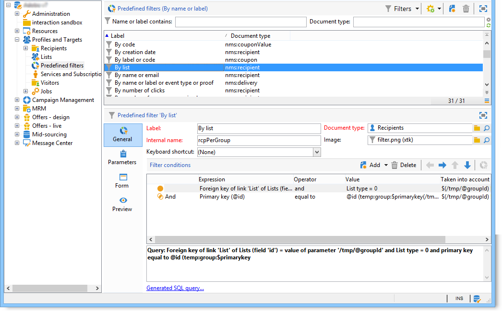

# 使用Adobe Campaign explorer {#using-adobe-campaign-explorer}

可透過工具列圖示存取 Adobe Campaign 探索器。使用工具列圖示，您可以存取 Adobe Campaign、所有 Adobe Campaign 功能、設定畫面以及部分平台元素的更詳細視圖。

**[!UICONTROL Explorer]** 工作區分成三個區域：

**1 - 樹狀結構清單**：您可以個人化樹狀結構的內容 (新增、移動或刪除節點)。此程序僅適用於資深使用者。有關詳細資訊，請參閱[此部分](#about-navigation-hierarchy)。)

**2 - 清單**：您可以篩選清單、執行搜尋、新增資訊或排序資料。[瞭解更多](adobe-campaign-ui-lists.md)。

**3 - 詳情**：您可以顯示所選元素的詳細資訊。透過右上角的圖示，您可以全螢幕顯示這項資訊。

## 資料夾和導航樹{#about-navigation-hierarchy}

導航樹的工作方式與檔案瀏覽器（如Windows資源管理器）類似。 資料夾可能包含子資料夾。 選取節點會顯示與該節點對應的檢視。

顯示的視圖是與架構關聯的清單，以及用於編輯所選行的輸入表單。

要將新資料夾添加到樹中，請在要插入資料夾的分支中按一下右鍵該資料夾，然後選擇&#x200B;**[!UICONTROL Add new folder]** 。 在快捷菜單中，選擇要建立的檔案類型。

在本小節](../../configuration/using/configuration.md)中了解如何設定Campaign導覽樹[。

了解如何在本小節](access-management-folders.md)中設定資料夾[的權限。

## 資料夾設定最佳實務

* **使用內建資料夾**

   使用內建資料夾可讓未參與專案的人員更輕鬆地使用、維護和疑難排解應用程式。 您不應為收件者、清單、傳送等建立自訂資料夾結構，而應使用標準資料夾，例如管理、設定檔與目標、促銷活動管理。

* **建立子資料夾**

   將技術工作流程放置在標準資料夾下：管理/生產/技術工作流程，並根據工作流程類型建立子目錄。

* **設定命名慣例**

   例如，您可以按字母順序為工作流程命名，讓工作流程按照執行順序顯示。

   例如：

   * A1 — 匯入收件者，從10:00開始；
   * A2 — 匯入票證，從11:00開始。

* **建立範本供使用者開始使用**

   建立傳遞範本、工作流程範本、使用者專用的行銷活動範本。 此結構可節省時間，並確保為每個使用者使用正確的傳送對應和類型。

## 螢幕解析度 {#screen-resolution}

為了獲得最佳導覽和可用性，Adobe 建議最少使用像素 1600x900 的螢幕解析度。

>[!CAUTION]
>
>Adobe Campaign支援1600x900像素以下的解析度。

在 **[!UICONTROL Explorer]** 工作區中，如果出現部分 **[!UICONTROL Details]** 區域被截斷，請透過區域頂端的箭頭加以展開或按一下 **[!UICONTROL Enlarge]** 按鈕。

## 瀏覽及自訂清單 {#browsing-lists}

了解如何瀏覽、管理和自訂此小節](adobe-campaign-ui-lists.md)中的清單[。
