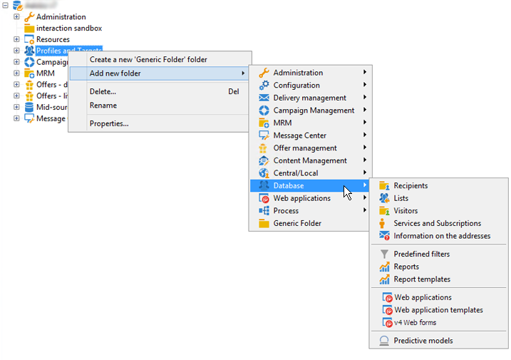

# 使用Adobe Campaign資源管理器{#using-adobe-campaign-explorer}

可透過工具列圖示存取 Adobe Campaign 探索器。使用工具列圖示，您可以存取 Adobe Campaign、所有 Adobe Campaign 功能、設定畫面以及部分平台元素的更詳細視圖。

**[!UICONTROL Explorer]** 工作區分成三個區域：

**1 - 樹狀結構清單**：您可以個人化樹狀結構的內容 (新增、移動或刪除節點)。此程序僅適用於資深使用者。有關詳細資訊，請參閱[本節](#about-navigation-hierarchy)。)

**2 - 清單**：您可以篩選清單、執行搜尋、新增資訊或排序資料。[進一步瞭解](adobe-campaign-ui-lists.md)。

**3 - 詳情**：您可以顯示所選元素的詳細資訊。透過右上角的圖示，您可以全螢幕顯示這項資訊。

## 資料夾和導航樹{#about-navigation-hierarchy}

導覽樹狀結構的運作方式類似檔案瀏覽器（例如Windows檔案總管）。 資料夾可能包含子資料夾。 選擇節點時，將顯示與該節點對應的視圖。

顯示的視圖是與方案相關聯的清單和用於編輯選定行的輸入表單。

要向樹中添加新資料夾，請按一下右鍵要插入資料夾的分支中的資料夾，然後選擇&#x200B;**[!UICONTROL Add new folder]**。 在快捷菜單中，選擇要建立的檔案類型。

瞭解如何在本節](../../configuration/using/configuration.md)中設定促銷活動導覽樹狀結構[。

瞭解如何在本節](access-management-folders.md)中設定資料夾[的權限。

## 資料夾配置最佳實踐

* **使用內建資料夾**

   使用內建資料夾，讓不參與專案的人員更容易使用、維護和疑難排解應用程式。 您不應為收件者、清單、傳送等建立自訂資料夾結構，而應使用標準資料夾，例如「管理」、「描述檔與目標」、「促銷活動管理」。

* **建立子資料夾**

   將技術工作流程放在標準資料夾下：管理／生產／技術工作流程，並依工作流程類型建立子目錄。

* **設定命名規則**

   例如，您可以按字母順序為工作流命名，以便它們按照執行順序顯示。

   例如：

   * A1 —— 匯入收件者，從10:00開始；
   * A2 —— 導入票證，從11:00開始。

* **建立範本，讓使用者從**

   建立傳送範本、工作流程範本、使用者專屬的促銷活動範本。 此結構可節省時間，並確保每個使用者都使用正確的傳送對應和類型。

## 螢幕解析度 {#screen-resolution}

為了獲得最佳導覽和可用性，Adobe 建議最少使用像素 1600x900 的螢幕解析度。

>[!CAUTION]
>
>Adobe Campaign支援1600x900像素以下的解析度。

在 **[!UICONTROL Explorer]** 工作區中，如果出現部分 **[!UICONTROL Details]** 區域被截斷，請透過區域頂端的箭頭加以展開或按一下 **[!UICONTROL Enlarge]** 按鈕。

## 瀏覽及自訂清單 {#browsing-lists}

瞭解如何瀏覽、管理和自訂本節[中的清單。](adobe-campaign-ui-lists.md)
