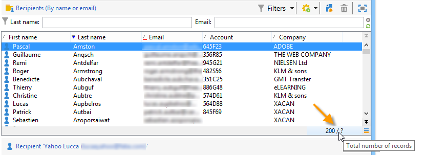
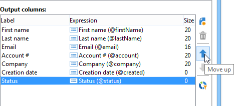
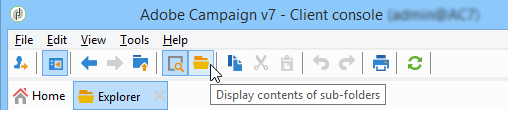

# 管理和自訂清單{#manage-and-customize-lists}

您可以使用Explorer存取Campaign資料庫中的記錄清單。 您可以篩選這些清單、執行搜尋、新增資訊、篩選及排序資料。

## 計算記錄 {#counting-records}

依預設，Adobe Campaign會載入清單的前200筆記錄。 這表示顯示不一定會顯示您所檢視之表格的所有記錄。 您可以統計清單中的記錄計數，並載入更多記錄。

在清單畫面的右下方， **[!UICONTROL counter]** 顯示已載入的記錄數以及資料庫中的記錄總數（套用任何篩選器後）：

若為「**？**&quot; （而不是數字）出現，按一下計數器即可開始計算。

### 載入更多記錄 {#loading-more-records}

若要載入（因此顯示）其他記錄（預設為200行），請按一下 **[!UICONTROL Continue loading]**.

若要載入所有記錄，請在清單上按一下滑鼠右鍵，然後選取 **[!UICONTROL Load all]**.

>[!CAUTION]
>
>載入全部清單的時間可能會很長，具體取決於記錄數目。

### 變更預設的記錄數目 {#change-default-number-of-records}

若要變更載入的預設記錄數，請按一下 **[!UICONTROL Configure list]** 在清單的右下角。

在清單組態視窗中，按一下 **[!UICONTROL Advanced parameters]** （左下方）並變更要擷取的行數。

## 設定清單 {#configuring-lists}

### 新增欄 {#add-columns}

有兩個方法可在清單中加入欄。

您可以從記錄的詳細資訊快速將欄新增到清單中。 操作步驟：

1. 從詳細資料畫面中，以滑鼠右鍵按一下 要在欄中顯示的欄位。
1. 選取 **[!UICONTROL Add in the list]**。

   該欄會新增至現有欄的右邊。

新增欄的另一個方法（例如，如果您想要顯示未在詳細資訊熒幕顯示的資料）是使用清單組態視窗。 操作步驟：

1. 按一下 **[!UICONTROL Configure list]** 在清單右下方。

   

1. 在清單設定視窗中，連按兩下要新增至 **[!UICONTROL Available fields]** 清單以將它新增到 **[!UICONTROL Output columns]**.

   

   >[!NOTE]
   >
   >依預設，不會顯示進階欄位。 若要顯示它們，請按一下可用欄位清單右下方的 **Display advanced fields**。
   >
   >標籤會按表格顯示且以字母順序排列。
   >
   >使用 **搜尋** 在可用欄位中執行搜尋的欄位。 如需詳細資訊，請參閱 [本節](#sorting-a-list).
   >
   >欄位由特定圖示識別：SQL欄位、連結表格、計算欄位等。 對於每個選取的欄位，說明都會顯示在可用欄位清單下。 [了解更多](#configuring-lists)。
   >
   >您也可以排序及篩選資料。 請參閱[本節](../../platform/using/filtering-options.md)。

1. 對要顯示的每一個欄重複此步驟。
1. 使用箭頭來修改 **顯示順序**. 最高的欄將顯示在記錄清單的左邊。

   

1. 如有需要，您可以按一下 **[!UICONTROL Distribution of values]** 以檢視目前資料夾中所選欄位的值重新分割。

   

1. 按一下 **[!UICONTROL OK]** 以確認設定並顯示結果。

### 新建欄 {#create-a-new-column}

您可以建立新欄以在清單中顯示其他欄位。 操作步驟：

1. 按一下 **[!UICONTROL Configure the list]** 位於清單下方和右側。
1. 按一下 **[!UICONTROL Add]** 以在清單中顯示新欄位。

### 移除欄 {#remove-a-column}

您可以使用遮罩記錄清單中的一或多欄 **[!UICONTROL Configure list]** 位於清單下方和右側。

在清單組態視窗中，選取要遮罩的欄 **[!UICONTROL Output columns]** 區域，然後按一下「刪除」按鈕。

對要遮罩的每一欄重複此動作。 按一下 **[!UICONTROL OK]** 以確認設定並顯示結果。

### 調整欄寬 {#adjust-column-width}

當清單處於作用中狀態（即至少選取了一行）時，您可以使用F9調整欄的寬度，以便所有欄都可以顯示在熒幕上。

### 在子資料夾中顯示資料 {#display-sub-folders-records}

清單可顯示：

* 只包含在所選資料夾中的記錄，
* 或是所選取的資料夾及其子資料夾中的記錄。

若要從一個顯示模式切換到另一個顯示模式，請按一下 **[!UICONTROL Display sub-levels]** （在工具列中）。

## 儲存清單設定 {#saving-a-list-configuration}

清單組態是在工作站層級在本機定義。 清除本機快取時，會停用本機設定。

依預設，定義的顯示引數會套用至具有對應資料夾型別的所有清單。 因此，當您修改一個資料夾中收件者清單顯示方式時，這個設定將套用至所有其他收件者資料夾。

但是，可以儲存多個要套用至相同型別之不同資料夾的設定。 該設定會隨包含資料的資料夾屬性一起儲存，並可重新套用。

例如，對於傳遞資料夾，可以設定下列顯示：

若要儲存此清單設定，使其可重複使用，請遵循下列步驟：

1. 以滑鼠右鍵按一下包含顯示資料的資料夾。
1. 選取 **[!UICONTROL Properties]**。
1. 按一下 **[!UICONTROL Advanced settings]** 然後在 **[!UICONTROL Configuration]** 欄位。

   

1. 按一下 **[!UICONTROL OK]** 然後按一下 **[!UICONTROL Save]**.

然後將此設定套用至另一個 **Delivery** 資料夾：

按一下 **[!UICONTROL Save]** 在資料夾屬性視窗中。 此清單顯示會修改以符合指明的設定：

## 匯出清單 {#exporting-a-list}

若要從清單匯出資料，您必須使用匯出精靈。 若要存取，請從清單中選取要匯出的元素，按一下滑鼠右鍵並選取 **[!UICONTROL Export...]**.

有關匯入和匯出功能的使用說明，請參閱 [一般匯入和匯出](../../platform/using/about-generic-imports-exports.md).

>[!CAUTION]
>
>不可使用 [複製/貼上] 功能匯出清單中的元素。

## 排序清單 {#sorting-a-list}

清單可能包含大量資料。 您可以排序這些資料，或套用簡單或進階篩選器。 排序可讓您以遞增或遞減順序顯示資料。 透過篩選，您可以定義和合併準則以僅顯示所選資料。

按一下欄標題可套用遞增或遞減排序，或取消資料排序。 在欄標籤前，使用中的排序狀態和排序順序會以藍色箭頭表示。 欄標籤前面的紅色虛線表示排序套用至從資料庫編制索引的資料。 此排序方法用於最佳化排序工作。

您也可以設定排序或組合排序條件。 要執行此操作，請遵循下列步驟：

1. **[!UICONTROL Configure list]** 在清單右下方。

   

1. 在清單組態視窗中，按一下 **[!UICONTROL Sorting]** 標籤。
1. 選取要排序的欄位以及排序方向 (遞增或遞減)。

   

1. 排序優先順序由排序欄的順序定義。 若要變更優先順序，請使用適當的圖示來變更欄的順序。

   

   排序優先順序不會影響清單中欄的顯示情況。

1. 按一下 **[!UICONTROL Ok]** 以確認此設定並在清單中顯示結果。

### 搜尋元素 {#running-a-search}

您可以使用在編輯器中搜尋可用欄位 **[!UICONTROL Search]** 欄位位於欄位清單上方的欄位。 按下 **輸入** 在鍵盤上或瀏覽清單。 符合搜尋文字的欄位將以粗體呈現。

>[!NOTE]
>
>您可以建立篩選器，以僅顯示清單中的部分資料。 [了解更多](../../platform/using/creating-filters.md)。
