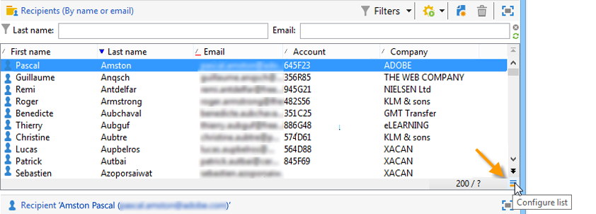

# 管理和自訂清單{#manage-and-customize-lists}

您可以使用瀏覽器存取Campaign資料庫中的記錄清單。 您可以篩選這些清單、執行搜尋、新增資訊、篩選及排序資料。

## 計數記錄{#counting-records}

根據預設，Adobe Campaign 會載入清單中的前 200 條記錄。這意味著將不一定顯示您正在檢視之表格中的所有記錄。您可以統計清單中的記錄計數，並載入更多記錄。

在清單畫面右下角，**[!UICONTROL counter]** 會顯示已載入的記錄數，以及資料庫中的記錄總數 (套用任何篩選器之後)：

如果右側出現「**?**」而非數字，請按一下計數器執行計算。

### 載入更多記錄{#loading-more-records}

若要載入 (並顯示) 更多記錄 (預設為 200 條)，請按一下 **[!UICONTROL Continue loading]**。

若要載入所有記錄，請以滑鼠右鍵按一下清單，然後選取 **[!UICONTROL Load all]**。

>[!CAUTION]
>
>載入全部清單的時間可能會很長，具體取決於記錄數目。

### 變更預設的記錄數目 {#change-default-number-of-records}

若要變更載入的預設記錄數目，請按一下清單右下角的 **[!UICONTROL Configure list]**。

在清單配置窗口中，按一下&#x200B;**[!UICONTROL Advanced parameters]**（左下）並更改要檢索的行數。

## 配置清單{#configuring-lists}

### 新增欄 {#add-columns}

有兩個方法可在清單中加入欄。

您可以從記錄的詳細資料中快速新增欄至清單。 操作步驟：

1. 從詳細資料畫面中，以滑鼠右鍵按一下 要在欄中顯示的欄位。
1. 選取 **[!UICONTROL Add in the list]**。

   該欄會新增至現有欄的右邊。

新增欄的另一個方法，例如，如果您想要顯示詳細資料畫面上未顯示的資料，則可使用清單設定視窗。操作步驟：

1. 按一下清單右下方的 **[!UICONTROL Configure list]**。

   

1. 在清單設定視窗的 **[!UICONTROL Available fields]** 清單中按兩下要新增的欄位，以便將它新增至 **[!UICONTROL Output columns]**。

   

   >[!NOTE]
   >
   >預設情況下，不會顯示進階欄位。若要顯示它們，請按一下可用欄位清單右下方的 **Display advanced fields**。
   >
   >標籤會按表格顯示且以字母順序排列。
   >
   >使用 **Search** 欄位在可用欄位中執行搜尋。有關詳細資訊，請參閱[本節](#sorting-a-list)。
   >
   >欄位採用特定圖示加以標識：SQL 欄位、連結的資料表、計算欄位等。可用欄位的清單下將顯示所選取的每個欄位的說明。[進一步瞭解](#configuring-lists)。
   >
   >您也可以排序和篩選資料。請參閱[本節](../../platform/using/filtering-options.md)。

1. 對要顯示的每一個欄重複此步驟。
1. 使用箭頭修改 **顯示順序**。最高的欄將顯示在記錄清單的左邊。

   

1. 如果需要，可以按一下 **[!UICONTROL Distribution of values]**，以檢視目前資料夾中所選取欄位的重新分割值。

   

1. 按一下 **[!UICONTROL OK]** 確認設定並顯示結果。

### 新建欄 {#create-a-new-column}

您可以建立新的欄來顯示清單中的其他欄位。操作步驟：

1. 按一下清單右下方的&#x200B;**[!UICONTROL Configure the list]**。
1. 按一下 **[!UICONTROL Add]**，以在清單中顯示新欄位。

### 移除欄 {#remove-a-column}

您可以使用位於清單右下方的 **[!UICONTROL Configure list]** 遮蔽一列或數列欄。

在清單設定視窗中，從 **[!UICONTROL Output columns]** 區域中選取要遮蔽的欄，然後按一下刪除按鈕。

對要遮蔽的每一欄重複此步驟。按一下 **[!UICONTROL OK]** 確認設定並顯示結果。

### 調整欄寬 {#adjust-column-width}

當清單作用中時，例如：選取了至少一行時，您可以使用 F9 來調整欄的寬度以便在螢幕上顯示所有欄。

### 在子資料夾中顯示資料{#display-sub-folders-records}

清單可顯示：

* 只包含在所選資料夾中的記錄，
* 或是所選取的資料夾及其子資料夾中的記錄。

若要從一個顯示模式切換至另一個顯示模式，請按一下工具列中的 **[!UICONTROL Display sub-levels]**。

## 保存清單配置{#saving-a-list-configuration}

清單設定是在工作站層級本機定義。清除本機快取時，會停用本機設定。

根據預設，所定義的顯示參數會套用至使用相匹配資料夾類型的所有清單。因此，當您修改一個資料夾中收件者清單顯示方式時，這個設定將套用至所有其他收件者資料夾。

但您可儲存多個設定，以套用至相同類型的不同資料夾。該設定會隨包含資料的資料夾屬性一起儲存，並可重新套用。

例如，對於傳遞資料夾，可以設定下列顯示：

若要儲存此清單設定，使其可重複使用，請遵循下列步驟：

1. 以滑鼠右鍵按一下包含顯示資料的資料夾。
1. 選取 **[!UICONTROL Properties]**。
1. 按一下&#x200B;**[!UICONTROL Advanced settings]**，然後在&#x200B;**[!UICONTROL Configuration]**&#x200B;欄位中指定名稱。

   

1. 按一下&#x200B;**[!UICONTROL OK]** ，然後按一下&#x200B;**[!UICONTROL Save]**。

然後將此設定套用至另一個 **Delivery** 資料夾：

按一下資料夾屬性視窗中的 **[!UICONTROL Save]**。此清單顯示會修改以符合指明的設定：

## 匯出清單{#exporting-a-list}

若要匯出清單資料，您必須使用匯出精靈。若要使用此精靈，請從清單選取要匯出的元素，以滑鼠右鍵按一下後選取 **[!UICONTROL Export...]**。

[Generic imports and exports](../../platform/using/about-generic-imports-exports.md)中說明了導入和導出功能的使用。

>[!CAUTION]
>
>不可使用 [複製/貼上] 功能匯出清單中的元素。

## 排序清單{#sorting-a-list}

清單中可包含大量資料。您可以對這些資料進行排序或套用簡單、進階篩選器。透過排序，您設定以遞增或遞減順序顯示資料。透過篩選，您可以定義和合併準則以僅顯示所選資料。

按一下欄標題，套用遞增或遞減排序，或是取消資料排序。作用中的排序狀態和排序順序會在欄標籤前方以藍色箭頭表示。欄位標籤前方的紅色破折號表示該排序已套用至資料庫中索引的資料。此排序方法用於最佳化排序工作。

您也可以設定排序或合併排序準則。要執行此操作，請遵循下列步驟：

1. **[!UICONTROL Configure list]** 在清單右側。

   

1. 在清單設定視窗中，按一下 **[!UICONTROL Sorting]** 索引標籤。
1. 選取要排序的欄位以及排序方向 (遞增或遞減)。

   

1. 排序優先順序透過排序欄的順序定義。若要變更優先順序，請使用適當的圖示來變更欄的順序。

   

   排序優先順序不會影響清單中欄的顯示情況。

1. 按一下 **[!UICONTROL Ok]** 確認此設定，並在清單中呈現結果。

### 搜索元素{#running-a-search}

您可使用欄位清單上方的 **[!UICONTROL Search]** 欄位執行編輯器中可用欄位的搜尋。按下鍵盤上的 **Enter**，或瀏覽清單。符合搜尋文字的欄位將以粗體呈現。

>[!NOTE]
>
>您可以建立篩選器，只顯示清單中的部分資料。[進一步瞭解](../../platform/using/creating-filters.md)。
