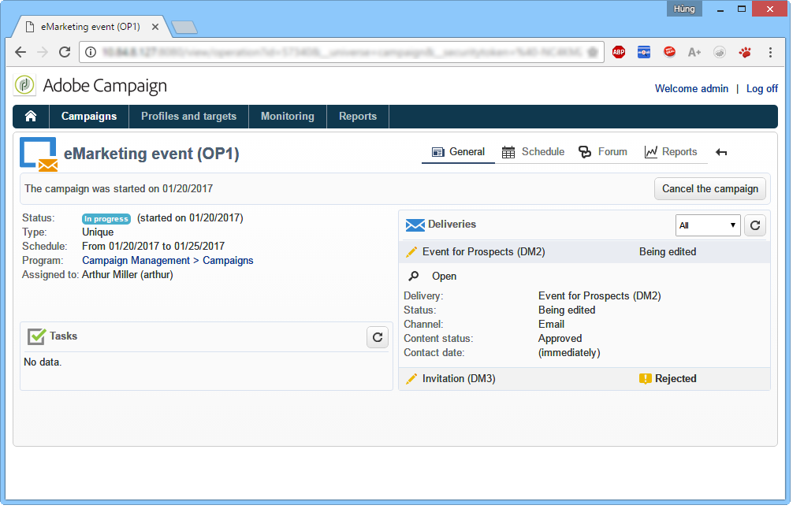
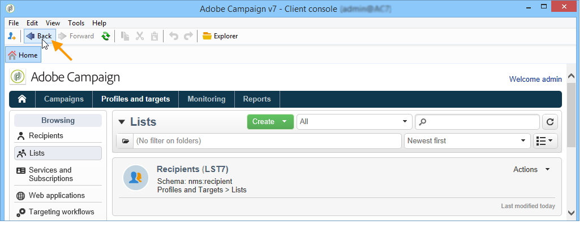

# Adobe Campaign 工作區{#adobe-campaign-workspace}

## 探索Adobe Campaign介面 {#about-adobe-campaign-interface}

連線資料庫之後，您就可以存取 Adobe Campaign 首頁了，Adobe Campaign 首頁是一個儀表板，其中包含了可用於存取功能的連結和捷徑，顯示的連結和捷徑具體取決於安裝以及一般平台設定。

在首頁的中央，您可以透過連結存取 Campaign 線上文件入口網站、論壇及支援網站。

[ 在影片中探索行銷活動工作區](#video)

>[!NOTE]
>
>您的實例上可用的 Adobe Campaign 功能取決於安裝的模組和附加元件。部分功能可能無法使用，具體取決於您的許可及特定設定。
>
>安裝任何模組或附加元件之前，您需要檢查您的授權合約，或聯絡您的Adobe帳戶主管。

### 主控台和網路存取 {#console-and-web-access}

Adobe Campaign 平台可透過主控台或網際網路瀏覽器進行存取。若要查看相容的瀏覽器，請前往 [相容性矩陣](../../rn/using/compatibility-matrix.md#Browsers).

Web訪問介面與控制台介麵類似。 在瀏覽器中，您可以使用與主控台相同的導覽和顯示功能，但您只能對行銷活動執行精簡的動作集。 例如，您可以檢視和取消促銷活動，但無法修改促銷活動。 對於指定的運算子，促銷活動會在主控台中顯示下列選項：

而使用網路存取時，選項主要會啟用檢視：

深入了解 [使用web介面](../../campaign/using/accessing-marketing-campaigns.md#using-the-web-interface-).

### 語言 {#languages}

安裝Adobe Campaign Classic執行個體時會選取語言。

您可以選擇五種不同語言：

* 英文 (英國)
* 英文 (美國)
* 法文
* 德文
* 日文

您為Adobe Campaign Classic例項選擇的語言可能會影響日期和時間格式。 如需詳細資訊，請參閱本[區段](../../platform/using/adobe-campaign-workspace.md#date-and-time)。

如需如何建立例項的詳細資訊，請參閱 [頁面](../../installation/using/creating-an-instance-and-logging-on.md).

>[!CAUTION]
>
>建立執行個體後無法變更語言。

## 基本的導覽功能 {#navigation-basics}

### 瀏覽頁面 {#browsing-pages}

平台功能各式各樣，可歸類為幾大核心功能，您可使用介面上方的連結來存取這些功能。

哪些核心功能可用取決於您所安裝的套件、附加元件以及您的存取權。

每項核心功能都包含一套基於任務相關需求及使用情境的功能。例如，使用 **[!UICONTROL Profiles and targets]** 連結，您可以找到收件者清單、訂閱服務、現有的目標工作流程，以及建立這些元素的捷徑。

清單可透過 **[!UICONTROL Lists]** 連結(位於 **[!UICONTROL Profiles and Targets]** 介面。

### 使用索引標籤 {#using-tabs}

* 當您按一下核心功能或連結時，相關頁面會取代當前頁面。若要返回到上一頁，請按一下工具列上的 **[!UICONTROL Back]** 按鈕。若要返回到首頁，請按一下 **[!UICONTROL Home]** 按鈕。

   

* 按一下顯示畫面 (例如網路應用程式、方案、傳遞、報告等) 的選單和捷徑時，將在另一個索引標籤中顯示相關頁面。這樣，您可使用索引標籤，從一個頁面切換到另一頁面。

   

### 建立元素 {#creating-an-element}

使用每個核心功能區段，您可以瀏覽可用的元素。若要瀏覽可用元素，請使用 **[!UICONTROL Browsing]** 區段中的捷徑。使用 **[!UICONTROL Other choices]** 連結，您可存取其他所有頁面，不受環境影響。

您可以建立新元素（傳送、Web應用程式、工作流程等） 使用 **[!UICONTROL Create]** 區段。 使用清單上方的 **[!UICONTROL Create]** 按鈕，將新元素新增至清單中。

例如，在傳遞頁面上，使用 **[!UICONTROL Create]** 按鈕來建立新的傳遞。

## 格式和單位 {#formats-and-units}

### 日期和時間 {#date-and-time}

您的 Adobe Campaign Classic 實例的語言將會影響日期和時間格式。

您無法在之後變更安裝 Campaign 時選取的語言。您可以選取：英文 (US)、英文 (EN)、法文、德文或日文。如需詳細資訊，請參閱[此頁面](../../installation/using/creating-an-instance-and-logging-on.md)。

英文 (US) 和英文 (EN) 的主要差異如下：

<table> 
 <thead> 
  <tr> 
   <th> 格式  </th> 
   <th> 英文 (美國)  </th> 
   <th> 英文 (EN)  </th> 
  </tr> 
 </thead> 
 <tbody> 
  <tr> 
   <td> 日期  </td> 
   <td> 週開始於星期日  </td> 
   <td> 週開始於星期一  </td> 
  </tr> 
  <tr> 
   <td> 簡短日期  </td> 
   <td> 
%2M/%2D/%4Y

<strong>範例：09/25/2018</strong>
 </td> 
   <td> 
%2D/%2M/%4Y

<strong>範例：25/09/2018</strong>
 </td> 
  </tr> 
  <tr> 
   <td> 帶時間的簡短日期  </td> 
   <td> 
%2M/%2D/%4Y %I:%2N:%2S %P

<strong>例如：09/25/2018 10:47:25 PM</strong>
 </td> 
   <td> 
%2D/%2M/%4Y %2H:%2N:%2S

<strong>例如：25/09/2018 22:47:25</strong>
 </td> 
  </tr> 
 </tbody> 
</table>

### 在列舉中新增值 {#add-values-in-an-enumeration}

使用下拉式清單中的輸入欄位，您可以輸入列舉值，可存儲該值，作為下拉式清單中的選項提供。例如，在收件者用戶檔案之 **[!UICONTROL City]** 索引標籤的 **[!UICONTROL General]** 欄位中，您可以輸入 London。當您按下 Enter 以確認此值時，將顯示一條訊息，詢問您是否要儲存此值以用於欄位相關的列舉。

如果按一下 **[!UICONTROL Yes]**，就可以在相關欄位 (在此案例中為：**[!UICONTROL London]**) 的下拉式方塊中提供這個值。

>[!NOTE]
>
>管理員可透過 **[!UICONTROL Administration > Platform > Enumerations]** 區域管理列舉 (也稱為「分項清單」)。有關詳細資訊，請參閱 [管理分項清單](../../platform/using/managing-enumerations.md).

### 預設單位 {#default-units}

在表示時間期間 (例如，傳遞資源的有效期限、任務的核准期限等) 的欄位中，可以採用下列&#x200B;**單位** 列示值：

* **[!UICONTROL s]** 幾秒，
* **[!UICONTROL mn]** 幾分鐘，
* **[!UICONTROL h]** 數小時，
* **[!UICONTROL d]** 幾天。

## 教學課程影片 {#video}

此影片會介紹Campaign Classic工作區。

>[!VIDEO](https://video.tv.adobe.com/v/35130?quality=12)

提供其他Campaign Classic作法影片 [此處](https://experienceleague.adobe.com/docs/campaign-classic-learn/tutorials/overview.html?lang=zh-Hant).
