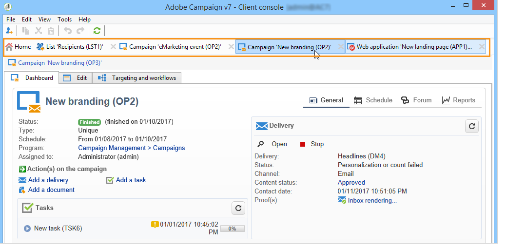

# Adobe Campaign 工作區 {#adobe-campaign-workspace}

## 探索Adobe Campaign介面 {#about-adobe-campaign-interface}

連線至資料庫後，即可存取Adobe Campaign首頁。 此頁面是您的儀表板：由連結和捷徑組成，可讓您存取功能（視您的安裝和一般平台組態而定）。

從首頁的中央區段，您可以使用連結來存取Campaign檔案入口網站、社群和Adobe客戶服務網站。

在影片[中探索](#video)行銷活動工作區

>[!NOTE]
>
>您執行個體上可用的Adobe Campaign功能取決於安裝的模組和附加元件。 部分功能可能無法使用，具體取決於您的許可及特定設定。
>
>在安裝任何模組或附加元件之前，您需要檢查您的授權合約或聯絡您的Adobe客戶主管。

### 主控台和網路存取 {#console-and-web-access}

可透過主控台或網際網路瀏覽器存取Adobe Campaign平台。 檢視[相容性矩陣](../../rn/using/compatibility-matrix.md#Browsers)中的相容瀏覽器。

網頁存取介面與主控台介面類似。 在瀏覽器中，您可以使用與主控台相同的導覽和顯示功能，但您只能在行銷活動上執行一組精簡的動作。 例如，您可以檢視和取消行銷活動，但無法修改行銷活動。 對於指定的運運算元，行銷活動將在主控台中顯示以下選項：

而使用Web存取時，選項主要是可讓您檢視：

在[Campaign v8檔案](https://experienceleague.adobe.com/docs/campaign/automation/campaign-orchestration/marketing-campaign-create.html?lang=zh-Hant#use-the-web-interface-){target=_blank}中進一步瞭解如何使用網頁介面。

### 語言 {#languages}

安裝Adobe Campaign Classic執行個體時，會選取語言。

您可以選擇下列語言：

* 英文 (英國)
* 英文 (美國)
* 法文
* 德文
* 日文

您為Adobe Campaign Classic執行個體選擇的語言可能會影響日期和時間格式。 如需詳細資訊，請參閱[Campaign v8 （主控台）檔案](https://experienceleague.adobe.com/en/docs/campaign/campaign-v8/new/campaign-ui){target=_blank}。

有關如何建立執行個體的詳細資訊，請參閱此[頁面](../../installation/using/creating-an-instance-and-logging-on.md)。

>[!CAUTION]
>
>建立執行個體後無法變更語言。

## 基本的導覽功能 {#navigation-basics}

### 瀏覽頁面 {#browsing-pages}

平台功能各式各樣，可歸類為幾大核心功能，您可使用介面上方的連結來存取這些功能。

哪些核心功能可用取決於您所安裝的套件、附加元件以及您的存取權。

每個功能根據任務相關需求和使用上下文包含一組功能。 例如，**[!UICONTROL Profiles and targets]**&#x200B;連結可讓您存取收件者清單、訂閱服務、現有的鎖定目標工作流程，以及建立這些元素的捷徑。

清單可透過&#x200B;**[!UICONTROL Lists]**&#x200B;介面左側區段中的&#x200B;**[!UICONTROL Profiles and Targets]**&#x200B;連結取得。

### 使用索引標籤 {#using-tabs}

* 當您按一下核心功能或連結時，相關頁面會取代目前頁面。 若要返回上一頁，請按一下工具列上的&#x200B;**[!UICONTROL Back]**&#x200B;按鈕。 若要返回首頁，請按一下&#x200B;**[!UICONTROL Home]**&#x200B;按鈕。

  

* 若是功能表或顯示畫面的捷徑（例如網頁應用程式、方案、傳送、報告等），則相符的頁面會顯示在另一個索引標籤中。 這樣，您可使用索引標籤，從一個頁面切換到另一頁面。

  

### 建立新元素 {#creating-an-element}

每個核心功能區段都可讓您瀏覽可用的元素。 若要這麼做，請使用&#x200B;**[!UICONTROL Browsing]**&#x200B;區段中的捷徑。 **[!UICONTROL Other choices]**&#x200B;連結可讓您存取所有其他頁面，無論環境為何。

您可以使用畫面左側&#x200B;**[!UICONTROL Create]**&#x200B;區段中的捷徑來建立新元素（傳遞、Web應用程式、工作流程等）。 使用清單上方的&#x200B;**[!UICONTROL Create]**&#x200B;按鈕，將新元素新增至清單。

例如，在傳遞頁面上，使用 **[!UICONTROL Create]** 按鈕來建立新的傳遞。

## 使用Adobe Campaign Explorer {#using-adobe-campaign-explorer}

Adobe Campaign檔案總管可透過工具列圖示存取。 使用工具列圖示，您可以存取 Adobe Campaign、所有 Adobe Campaign 功能、設定畫面以及部分平台元素的更詳細視圖。

若要深入瞭解Adobe Campaign Explorer，請參閱&#x200B;**Campaign v8 （主控台）檔案**&#x200B;中的下列頁面：

* [Campaign使用者介面概觀](https://experienceleague.adobe.com/en/docs/campaign/campaign-v8/new/campaign-ui){target=_blank}

* [Campaign UI設定](https://experienceleague.adobe.com/en/docs/campaign/campaign-v8/config/configuration/ui-settings){target=_blank}

* [管理檔案總管中的資料夾和檢視](https://experienceleague.adobe.com/zh-hant/docs/campaign/campaign-v8/config/configuration/folders-and-views){target=_blank}。

## 篩選資料 {#filters}

資料篩選是將資料集縮小至符合特定條件的那些記錄的程式。 然後可將此子集用於目標動作（例如更新或建立對象）或分析。

瀏覽Campaign時，資料會顯示在清單中。 您可以套用內建篩選器快速存取定義的子集，例如隔離地址、未鎖定目標的收件者或特定年齡範圍或建立日期內的記錄。 此外，您可以建立自訂篩選器、儲存以供日後使用，以及與其他Campaign使用者共用。

在&#x200B;**Campaign v8 （主控台）檔案**&#x200B;中瞭解如何[存取、設計和共用篩選器](https://experienceleague.adobe.com/en/docs/campaign/campaign-v8/audience/create-filters){target=_blank}。

## 使用清單 {#manage-and-customize-lists}

在Campaign使用者端主控台中，資料會顯示在清單中。 您可以根據自己的需求調整這些清單。 例如，您可以新增欄、篩選資料、計算記錄、儲存和共用您的設定。

在&#x200B;**Campaign v8 （主控台）檔案**&#x200B;中瞭解如何[管理和自訂清單](https://experienceleague.adobe.com/en/docs/campaign/campaign-v8/config/configuration/ui-settings#customize-lists){target=_blank}。

## 管理列舉{#managing-enumerations}

分項清單（也稱為分項清單）是預先定義的值清單，可用於填寫某些欄位。 列舉有助於標準化欄位值，使資料輸入更一致並簡化查詢。

定義後，值會顯示在下拉式清單中。 您可以直接選取值，或使用預測性輸入來輸入值，這會建議並完成相符專案。 某些欄位包含預先定義的分項清單，如果需要，可以建立其他分項清單。

在&#x200B;**Adobe Campaign v8 （主控台）檔案**&#x200B;中進一步瞭解如何[使用分項清單](https://experienceleague.adobe.com/en/docs/campaign/campaign-v8/config/settings/enumerations){target=_blank}。

## 教學課程影片 {#video}

本影片說明Campaign Classic工作區。

>[!VIDEO](https://video.tv.adobe.com/v/35130?quality=12)
