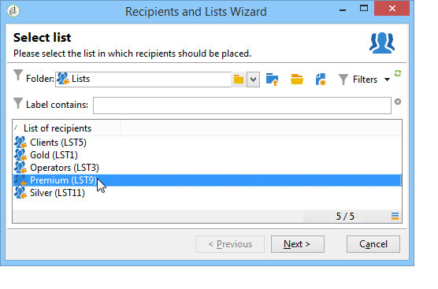
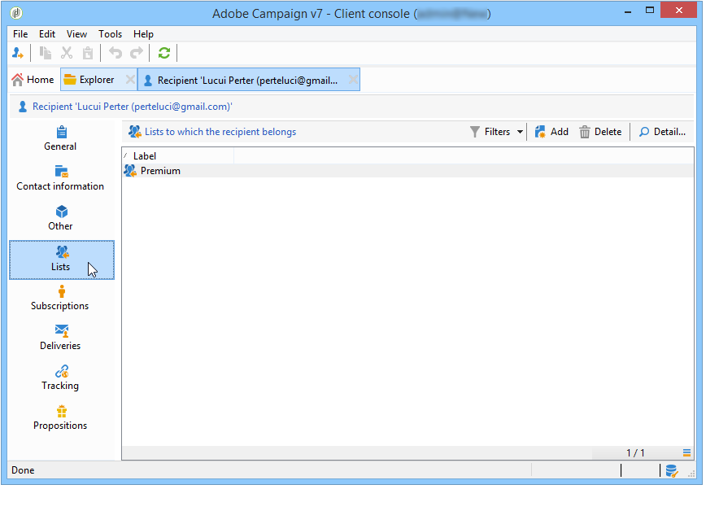
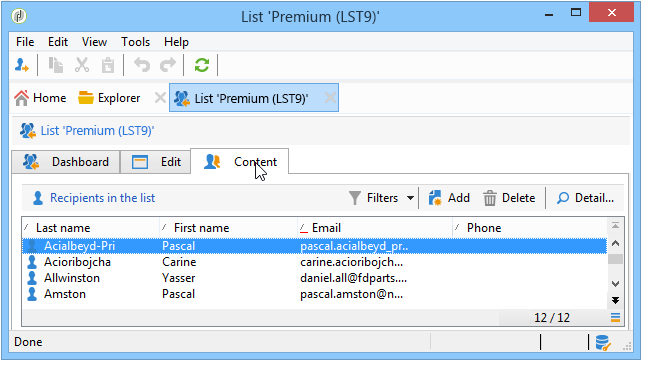

# 建立及管理清單{#creating-and-managing-lists}

## 什麼是清單？ {#about-lists-in-adobe-campaign}

清單 (list) 是一組靜態的用戶檔案，在傳遞作業期間可用於提供目標，或在匯入作業或工作流程執行期間可對其進行更新。例如，透過查詢而從資料庫中摘取出的母體可形成一個清單。

清單是透過&#x200B;**[!UICONTROL Profiles and targets]**&#x200B;索引標籤中的&#x200B;**[!UICONTROL Lists]**&#x200B;連結建立和管理。

Adobe Campaign 提供兩種類型的清單：

* **[!UICONTROL Group]** 類型：類 **[!UICONTROL Group]** 型清單屬於根據特 **** 定條件選取的人員的靜態清單。此清單就像是一組用戶檔案的快照。請注意，用戶檔案新增至資料庫中時，不會對群組清單進行自動更新。

   有關如何建立&#x200B;**[!UICONTROL Group]**&#x200B;類型清單的詳細資訊，請參閱此[page](#creating-a-profile-list-from-a-group)。

* **[!UICONTROL List]** 類型：類型 **[!UICONTROL List]** 清單可讓您使用工作流程來建立和管理清單。這些是資料匯入所產生的特定清單，可透過專用的&#x200B;**[!UICONTROL List update]**&#x200B;工作流程活動更新。

   與&#x200B;**[!UICONTROL Group]**&#x200B;類型清單不同，此類型清單可以使用&#x200B;**[!UICONTROL Scheduler]**&#x200B;活動自動更新。 請注意，有關如何建立&#x200B;**[!UICONTROL List]**&#x200B;類型清單的範例，請參閱[此頁面](../../workflow/using/list-update.md)。

 [在影片中探索此功能](#create-list-video)

## 從群組建立設定檔清單 {#creating-a-profile-list-from-a-group}

**[!UICONTROL Group]** 透過連結建立的 **[!UICONTROL Profiles and targets]** 類型清單必須以預設的Adobe Campaign設定檔表格(nms:recipient)為基礎。

>[!NOTE]
>
>若要建立包含其他資料類型的清單，您必須執行工作流程。例如，透過在訪客資料表上查詢並更新清單，您可以建立訪客清單。如需此工作流程的詳細資訊，請參閱[本小節](../../workflow/using/about-workflows.md)。

要建立新的&#x200B;**[!UICONTROL Group]**&#x200B;類型清單，請應用以下步驟：

1. 按一下&#x200B;**[!UICONTROL Create]**&#x200B;按鈕並選擇&#x200B;**[!UICONTROL New list]**。

   

1. 在清單建立視窗的 **[!UICONTROL Edit]** 索引標籤中輸入資訊。

   * 在 **[!UICONTROL Label]** 欄位中輸入清單名稱，並視需要變更內部名稱。
   * 新增此清單的描述。
   * 您可以指定到期日：達到此日期時，清單會被清除並自動刪除。

      

1. 在 **[!UICONTROL Content]** 索引標籤中，按一下 **[!UICONTROL Add]** 以選取屬於清單的用戶檔案。

   

1. 按一下 **[!UICONTROL Save]** 儲存清單。然後，清單便會新增至清單概要中。

您可以按一下 **[!UICONTROL Create]** 直接從「Add profiles」視窗建立新用戶檔案。該用戶檔案將新增至資料庫。

如同其他清單，您也可以調整用戶檔案清單的設定。請參閱[本節](../../platform/using/adobe-campaign-workspace.md#configuring-lists)。

## 將資料連結至清單 {#linking-data-to-a-list}

>[!NOTE]
>
>只能使用&#x200B;**[!UICONTROL Group]**&#x200B;類型清單將資料連結到清單。

可以將一組用戶檔案的用戶檔案篩選並連結至清單。然後傳遞作業便可傳送到此清單，以鎖定用戶檔案。若要創建用戶檔案群組：

1. 選取用戶檔案並按一下滑鼠右鍵。
1. 選取 **[!UICONTROL Actions > Associate selection with a list...]**。

   

1. 選取想要的清單，或使用 **[!UICONTROL Create]** 按鈕建立新的清單，然後按 **[!UICONTROL Next]**。

   

1. 按一下 **[!UICONTROL Start]** 按鈕。

   

**[!UICONTROL Recreate the list]**&#x200B;選項會從清單中刪除先前的內容。 此模式已經最優化，因為不需查詢確認用戶檔案是否已連結至清單。

如果取消選中&#x200B;**[!UICONTROL No trace of this job is saved in the database]**&#x200B;選項，則可以選擇（或建立）將儲存連結到此進程的資訊的執行資料夾。

使用視窗的上方區域可監視執行情況。使用 **[!UICONTROL Stop]** 按鈕可停止程序。已處理的連絡人將連結至清單。

您可以透過此操作相關的用戶檔案上的 **[!UICONTROL Lists]** 索引標籤來監視流程：

您也可以經由 Adobe Campaign 首頁來編輯清單：按一下 **[!UICONTROL Profiles and Targets > Lists]** 功能表，然後選取相關的清單。**[!UICONTROL Content]** 索引標籤顯示了連結至此清單的用戶檔案。

## 從清單中移除設定檔 {#removing-a-profile-from-a-list}

若要從清單中移除用戶檔案，您可以：

* 編輯清單，在 **[!UICONTROL Content]** 索引標籤中選取用戶檔案，然後按一下 **[!UICONTROL Delete]** 圖示。

   

* 編輯用戶檔案，按一下 **[!UICONTROL List]** 索引標籤，然後按一下 **[!UICONTROL Delete]** 圖示。

   

## 刪除設定檔清單 {#deleting-a-list-of-profiles}

您可以刪除 Adobe Campaign 樹狀結構清單的群組清單中的一或多個清單。若要執行此操作，請透過 Adobe Campaign 首頁中的 **[!UICONTROL Advanced > Explorer]** 連結編輯樹狀結構清單。選取相關的群組，然後按一下滑鼠右鍵。選取 **[!UICONTROL Delete]**。此時將顯示警告訊息，要求您確認是否刪除。

>[!NOTE]
>
>刪除清單時，清單上的用戶檔案不受影響，但是將更新用戶檔案中的資料。

## 教學課程影片 {#create-list-video}

### 如何建立收件者清單

此清單 (list) 是一組靜態的收件者名單，在傳遞作業期間可用於提供目標，或在匯入作業或工作流程執行期間可對其進行更新。收件者清單也可以稱為受眾。

了解如何從檔案總管設定收件者清單，以建立對象。

>[!VIDEO](https://video.tv.adobe.com/v/25602/quality=12)

### 如何使用工作流程建立收件者清單 {#create-list-in-a-wf-video}

了解如何建立工作流程以鎖定收件者，以及如何在使用電子郵件定位中的清單之前讓工作流程重複執行。

>[!VIDEO](https://video.tv.adobe.com/v/25603?quality=12)

其他Campaign Classic操作說明影片可在[此處](https://experienceleague.adobe.com/docs/campaign-classic-learn/tutorials/overview.html?lang=zh-Hant)取得。
